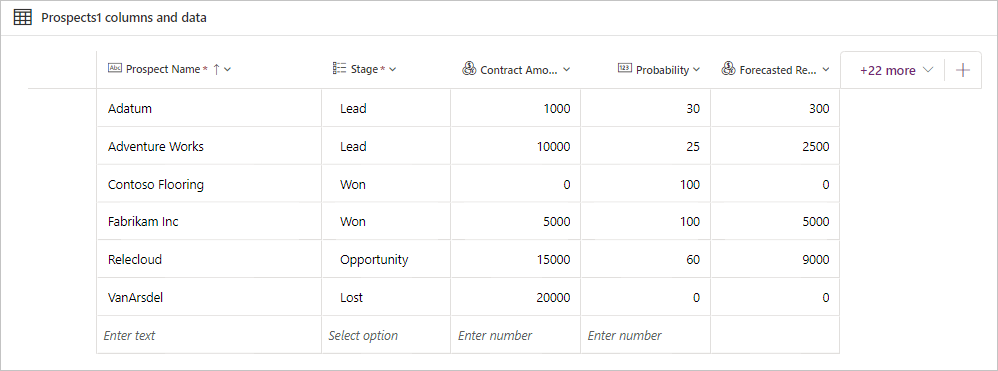

## Scenario

The current sales process for your company is manual and updates are only provided
each Friday. You want to simplify this process, minimize the opportunity for mistakes, and
improve visibility. So you've decided you want to create a new app to track sales
leads and automatically calculate the forecasted revenue. You want Dataverse to store the list of potential customers.

## Use Microsoft Dataverse to store data

In this exercise, you'll use Dataverse to store the list of potential
customers for your app.

### Create a custom table

1. Go to the [Power Apps maker portal](https://make.powerapps.com/) and sign in (if necessary).

1. On the menu, expand **Dataverse** and select **tables**.

1. Select **New table**.

1. Under **Properties** enter the **Display name**: *Prospects*

1. Select **Primary column** and enter the **Display name**: *Prospect Name*

1. Select **Save**.

1. After a few moments, the *Tables > Prospects* screen will appear. Select **+** to add a new column in the *Prospects columns and data* section.

    > [!div class="mx-imgBorder"]
    > [](../media/prospects-table-main-screen.png#lightbox)

1. In the *New column* pane, enter the following information:

    - **Display name**: *Stage*
    - **Data Type**: Select *Choice* (and select *Choice* from the popup)
    - **Required**: Select *Business required*

    > [!div class="mx-imgBorder"]
    > 

1. Under **Sync this choice with**, select **New choice**. The *New choice* pane will appear. Enter the following information and select **Save**.

    - **Display name**: *Prospect Stage*
    - Add the following choices under **Label**, selecting **New choice** between entries until your table looks like the screenshot below.  When completed select **Save**:

        - **Lead** (under *Value* enter **1** . Subsequent entries will automatically number.)
        - **Opportunity**
        - **Won**
        - **Lost**

    > [!div class="mx-imgBorder"]
    > 

1. Once you've saved your *New choice*, select the dropdown under **Sync this choice with** and find/select **Prospect Stage**.

    > [!div class="mx-imgBorder"]
    > 

1. Under **Default choice** select *Lead*

1. Select **Save**.

1. Select **+** in the *Prospects columns and data* pane to add a new column.

1. Enter the following information in the *New column* pane and then select **Save**.

    - **Display name**: *Contract Amount*
    - **Data Type**: *Currency*

1. Select **+** again to add a new column with the following information and then select **Save**.

    - **Display name**: *Probability*
    - **Data Type**: *Whole Number* (Select *Number* and then *Whole number* from the popup)

1. Next, we're going to add a column with a behavior. This one is a little more complex. Add a column with the following information. You'll notice something different after you select **Save**. (If your popup is blocked, ensure that you enable popups.)

    - **Display name**: *Forecasted Revenue*
    - **Data Type**: *Currency*
    - **Behavior**: *Calculated*

1. A calculated field popup window will appear with the *Set Forecasted Revenue* where you can edit the behavior our *Forecasted Revenue* column. Add an *Action* by selecting the **+ Add Action** button.

1. Enter the following formula next to the equals sign, but don't copy and paste. Note: your column names won't be exactly the same as the example below since the **crXXX_** will be specific numbers and letters that define your environment. The formula entry will auto-suggest options as you start to type the column names. Check the screenshot below to see what your formula should look like in the Action pane.

    ```crXXX_contractamount * (crXXX_probability / 100)```

    > [!div class="mx-imgBorder"]
    > 

1. If it looks good, select the circled checkmark to save your changes. (You may need to scroll right to see the circled checkmark.)

1. Select **SAVE AND CLOSE** at the top of the window and the window disappears to reveal your Prospects Tables screen again.

### Add a business rule

1. In the table designer, find the *Customizations* pane on the far right and select **Business rules**.

1. Select **+ New business rule** at the top of the screen; a new browser tab will open.

    > [!div class="mx-imgBorder"]
    > [](../media/new-business-rule.png#lightbox)

1. Select the **Condition New Condition** inside of your design pane. The condition *Properties* pane will show on the right hand side of the screen.

1. In the *Properties* pane under *Rules*, look at your **Field**, ensure that **Contract Amount** is selected.

1. For the **Operator**, change the value from **Equals** to **Contains data**.

1. Select **Apply**.

1. Now select the **Components** tab.

1. Click and hold **Set Business Required** and drag to the plus symbol to the right of the purple checkbox in the design pane.

    > [!div class="mx-imgBorder"]
    > [](../media/drag-set-business-required.png#lightbox)

1. With *Set Business Required New Action* selected/highlighted, look at the *Properties* pane and under **Field**, select **Probability**.

1. For the **Status**, choose **Business Required**.

1. Select **Apply**.

    > [!div class="mx-imgBorder"]
    > [](../media/set-business-required.png#lightbox)

1. In the top left of the screen, select the chevron dropdown just to the right of **Prospects New business rule** and in the **Business rule name** type **Make Probability Required**.

1. Select **Save** in top-right corner of screen.

1. Select **Activate** to (also top-right of screen) activate the rule.

1. A popup window appears for *Process Activate Confirmation*. Select **Activate** in the popup to confirm activation.

1. Close the browser tab.

1. Notice your new business rule has been added to the Business rules screen. Select **Prospects** to return to your table editing screen.

    > [!div class="mx-imgBorder"]
    > 

### Import data from an Excel file

You'll use the Excel spreadsheet named "Prospects" for this
exercise. Open this [link](https://github.com/MicrosoftDocs/mslearn-developer-tools-power-platform/raw/master/power-apps/Prospects.zip) and select the **Download** button to save the file.

1. Open the "Prospects" file. Notice the **Stage** column is empty. You'll need to enter these values manually. Enter the values in the **Stage** column as below:

    - **Contoso Flooring**: Won
    - **Fabrikam Inc**: Won
    - **Adventure Works**: Lead
    - **VanArsdel**: Lost
    - **Adatum**: Lead
    - **Relecloud**: Opportunity

1. Save your file locally as an Excel Workbook. Then close the spreadsheet.

1. Return to your **Prospects** table.

1. Select the **Import** button at the top of the screen and select **Import data from Excel**.

   > [!NOTE]
   > If you receive an error when selecting the **Import data from Excel** option, then your Power Apps license does not allow for importing Excel data.

1. In the **Import data** pane that pops up, select **Upload** under the *File* entry field, locate the *Prospects* Excel workbook, and select **Open**.

1. Wait a few moments as the file uploads. Next, you'll see an error notification under the column *Mapping Status* saying "Mapping errors exist".

1. Select **Map columns**.  Map the following **Prospect columns** to the associated **Source values**:

    - **Contract Amount**: *ContractAmount*
    - **Prospect Name**: *Name*
    - **Probability**: *Probability*
    - **Stage Value**: *Stage*

1. Select **Save Changes** at the top right of the screen. If successful, you'll see a success notification under *Mapping status* saying "Mapping was successful".

1. Select **Import** at the top right of the screen. You'll have to wait while your data is being imported. If successful, you'll see a notification saying "Import completed successfully." Close the window by selecting **x** at the top right of the window.

1. The imported data doesn't appear right away, so go ahead and refresh your browser screen.

1. Ensure that the data has been successfully imported. Your columns and data should look similar to this:

    > [!div class="mx-imgBorder"]
    > [](../media/final-columns.png#lightbox)

Congratulations! You've created a custom table with a business rule and imported from an Excel data source. Now you have an automated way to store your potential customers.
