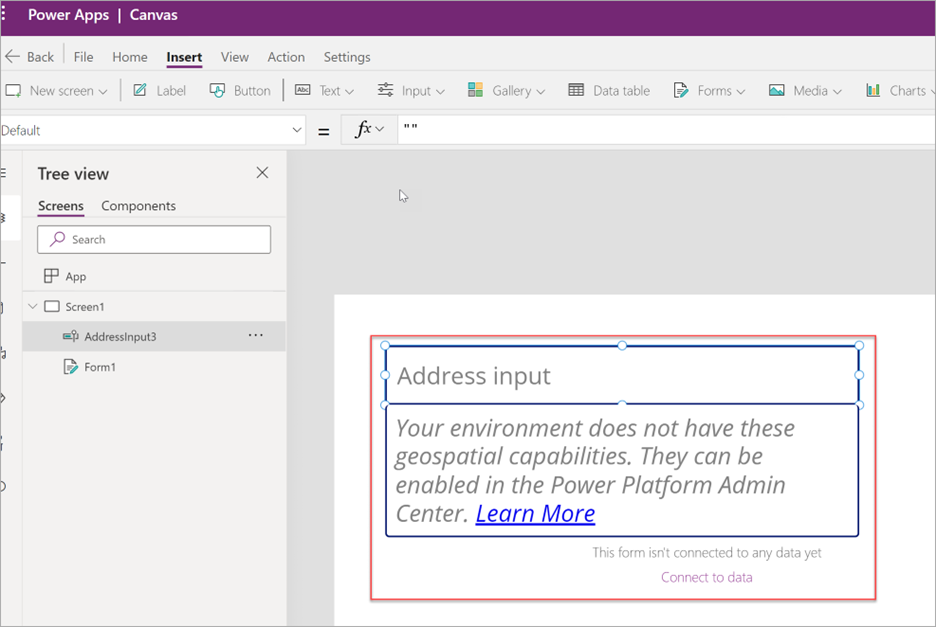
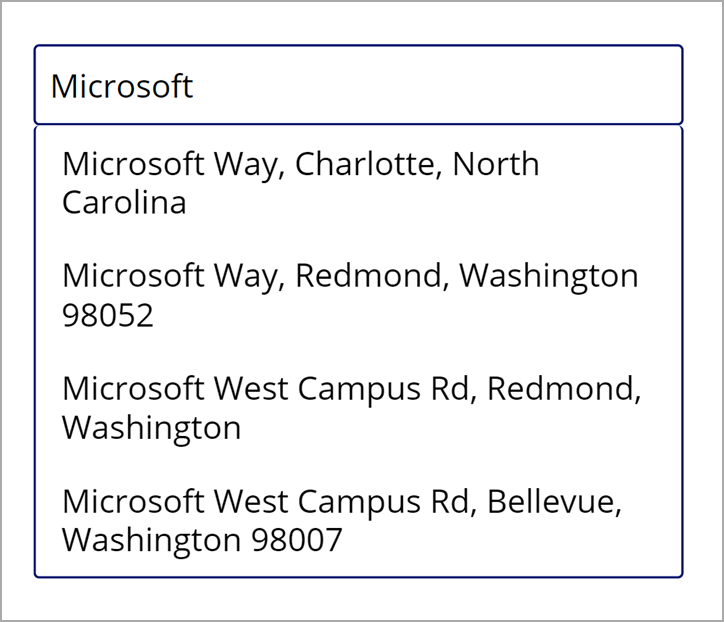
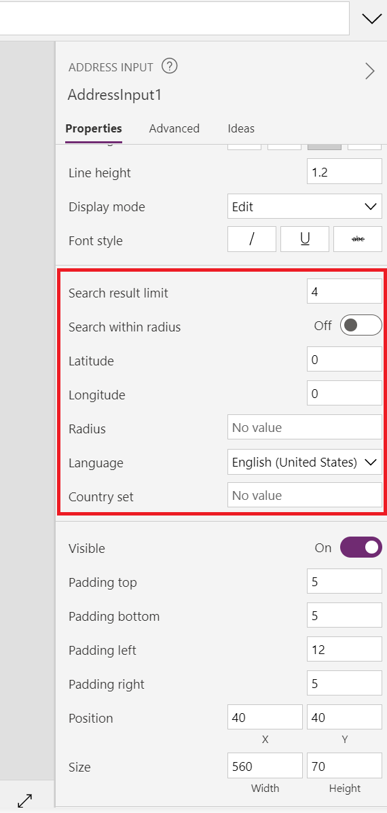

Adding maps and address input controls is a powerful way to add integrated visuals for routes, locations, and directions. In this unit, you'll learn about all the components required to include these controls in your Power Apps app.

## Prerequisite: Enable Geospatial Services

Before you can use a map in your Power Apps app, you must enable geospatial services in Power Apps. You can determine if geospatial services are already enabled for your environment when you add a control that requires geospatial configuration. When you attempt to add this type of control, Power Apps displays a message similar to the following.

> [!div class="mx-imgBorder"]
> 

Geospatial capabilities need to be enabled only once, but administrative privileges are needed in the Power Apps environment to enable them.

For more information on enabling geospatial services, see the article [Add geospatial controls to your canvas apps](/power-apps/maker/canvas-apps/geospatial-overview/?azure-portal=true).

## Address input

When you search for an address on a map by entering information into a regular text field in a canvas app, be sure to enter a complete address with few mistakes to find the proper address. Address input relies heavily on the user to have all the information required. Incorrect or impartial information can leave the user with no results.

To address this, you can use the address input control within a Power Apps app to help search for addresses by suggesting possible results based on locations found within certain search radiuses.

> [!div class="mx-imgBorder"]
> 

When you search for the fields, the search results can be restricted to certain areas. You can specify the latitude and longitude of a specific point as a property, such as a current location, specify a specific radius in meters around that point to search for a location, and limit the number of suggested results that are returned. The number of search results can be limited through the **Search result limit** field.

> [!div class="mx-imgBorder"]
> 

When the user selects an address, the Address field provides access to several output properties that can interact with other controls in the Power Apps app, such as the interactive map control. This control provides the following output properties.

> [!div class="mx-imgBorder"]
> 

The following screenshot displays the raw output values for an example from the address input using a text field. These fields can be used elsewhere in your application, such as finding distances, validating existing data, and finding a point on a map to name a few.

> [!div class="mx-imgBorder"]
> 

For more information, see the article [Use the address input control to easily enter addresses](/power-apps/maker/canvas-apps/geospatial-component-input-address/?azure-portal=true).
