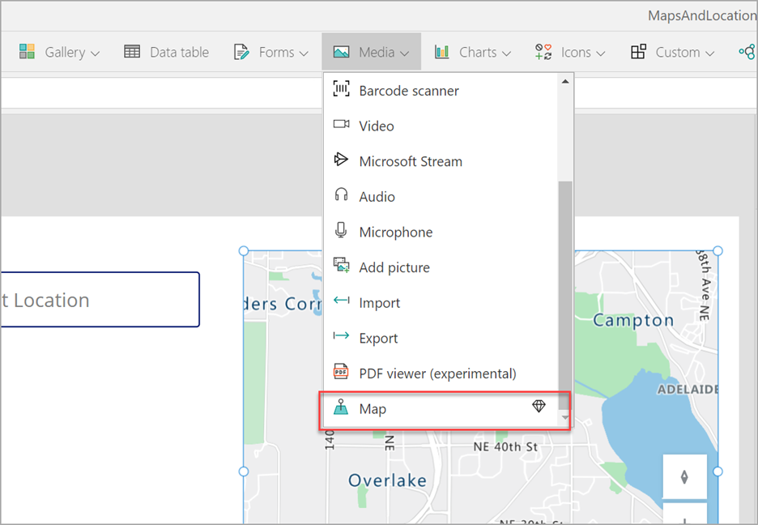
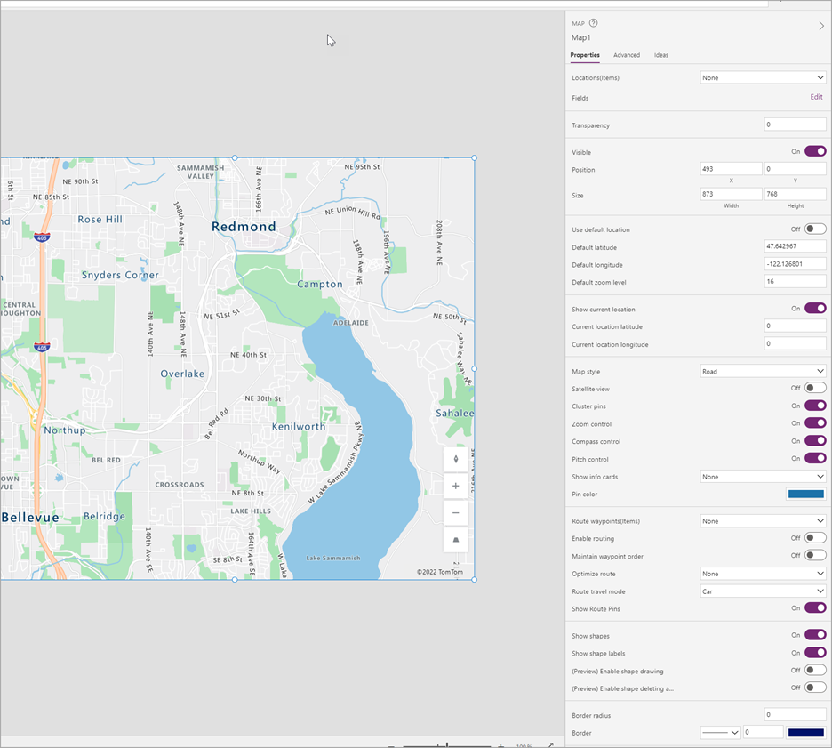
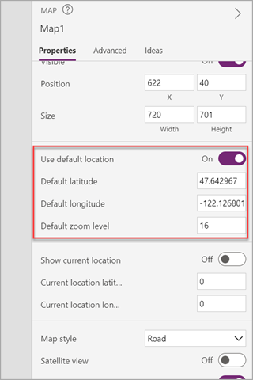
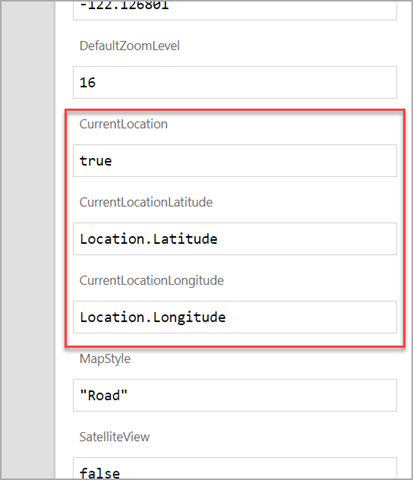
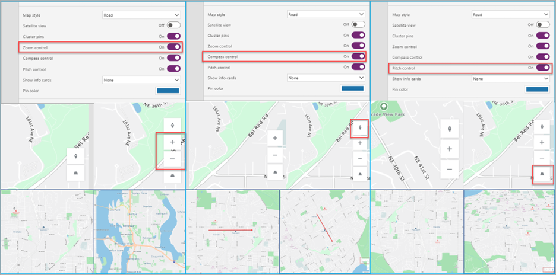
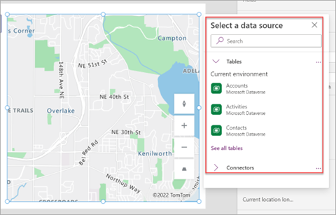
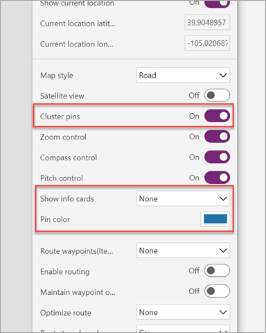
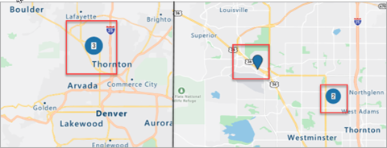

You can use the following two methods to add maps to your Power Apps canvas apps. Both methods have their strengths and weaknesses.

-   Interactive map control (premium)

-   Static Map APIs

The map control is a premium control that takes full advantage of the native geospatial capabilities within Power Apps. It contains many properties to allow users to zoom, tilt, navigate, rotate, and interact with a map in an all-in-one experience. No complex formulas or manually created controls need to be added to a Power Apps app to achieve this functionality.

> [!div class="mx-imgBorder"]
> 

The static map API approach uses an image control and several formulas and controls to interact with the image control. This approach takes more effort to build but doesn't require any other user licensing like the map control discussed earlier. Map controls, such as zooming and navigation require the use of separately added controls and advanced formulas that consume map web services to interact with the map image. The static map API won't be covered in this Learn module, but you may find many tutorials and documentation that instructs users on how to do build these. It isn't the same process as the interactive map controls and much more intensive and technical as a process.

After including the map control to the canvas app, users have access to many properties they can interact with either through the properties menu or through Power Fx. You'll learn about several of these fields in the lesson and how they can be configured by the user.

The following screenshot is an example map control added to a canvas app by using the configurable options.

> [!div class="mx-imgBorder"]
> 

When you enable the **Use default location** feature, you can automatically have the map start at a certain location when it first loads, which provides a consistent user experience. When enabled, the map will always render at the location specified in the default latitude and longitude fields with the default zoom level.

> [!div class="mx-imgBorder"]
> 

The map can automatically show the Power Apps user's current location on the interactive map when you set the **CurrentLocation** field to **true** and use the **Location.Latitude** and **Location.Longitude** in the respective **CurrentLocationLatitude** and **CurrentLocationLongitude** properties.

> [!div class="mx-imgBorder"]
> 

Depending on the application's requirements, or where it will be used, the map control can display the picture in different views. For instance, a satellite view can be used to see the actual buildings and roads as they actually appear either with or without street and building information applied. Or, the map can show a digitally rendered version in dark or light modes with three different types of roads. Some views may be better for navigation while others might be more optimal for accessibility or research purposes. 

> [!div class="mx-imgBorder"]
> 

The map control also has embedded controls such as a zoom, directional compass, and a pitch control that can be enabled so users of the canvas app can view the location in different perspectives.

> [!div class="mx-imgBorder"]
> 

Data sources can be assigned to the maps, which will allow pins on the map to be inserted. This feature can be used for business use cases such as delivery locations, customer locations, and more.

For more information on this feature, see the documentation [Use a data source to insert pins](/power-apps/maker/canvas-apps/geospatial-map-excel/?azure-portal=true).

When you select icons for the different pins in a datasource, you can select from any of the Azure pins. Refer to [List of image templates](/azure/azure-maps/how-to-use-image-templates-web-sdk?azure-portal=true#list-of-image-templates) to review all the available image templates.

> [!div class="mx-imgBorder"]
> 

For pins that are placed on a map, the user can view associated information for that pin to provide canvas-specific information either by pointing to the pins or selecting them, depending on the configuration in the **Show info cards** and the fields that are selected to show to the user. The color of the pins can either be set for the entire control in the properties or from the data source individually by each pin.

> [!div class="mx-imgBorder"]
> 

If multiple pins are located closely together, the **Cluster pins** configuration can be used to group all the pins together until users adjust their zoom to have a better view of those pins.

> [!div class="mx-imgBorder"]
> 

For more information on pins, see the documentation [Add informational cards to pins on a map](/power-apps/maker/canvas-apps/geospatial-map-infocards/?azure-portal=true).
