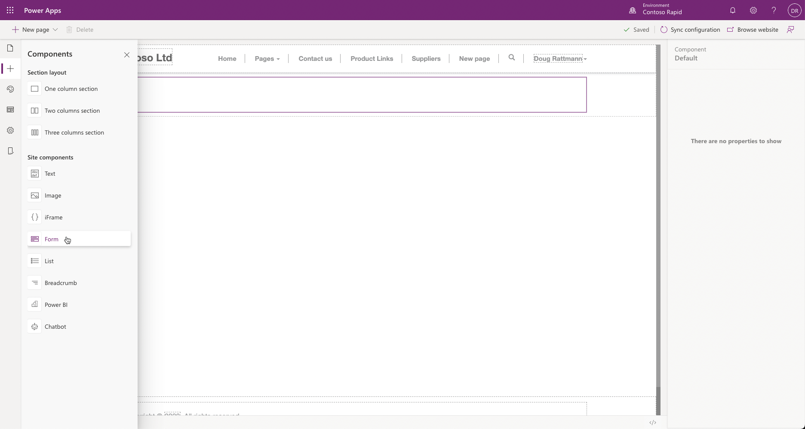
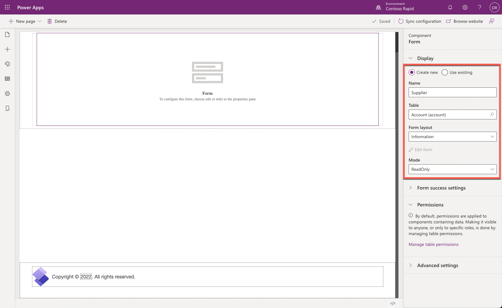
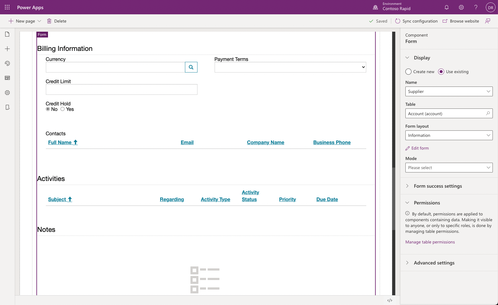
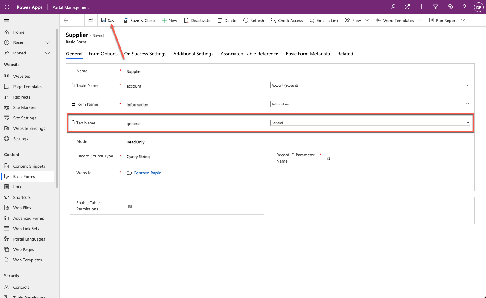
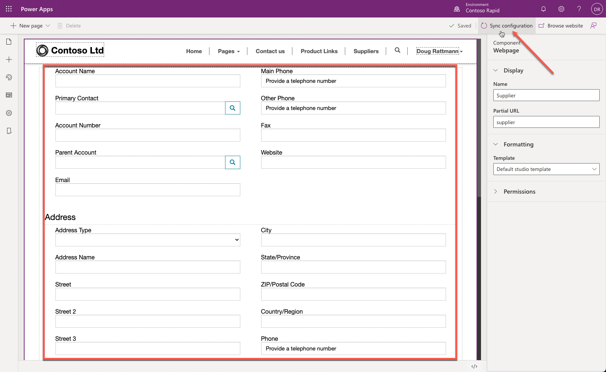
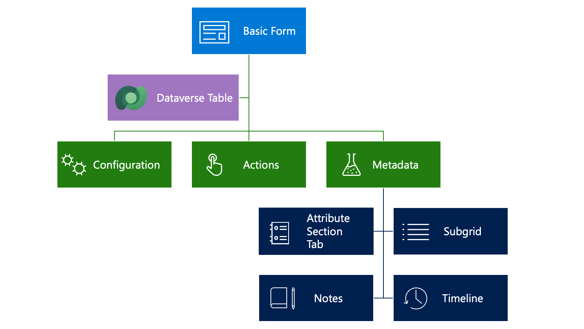
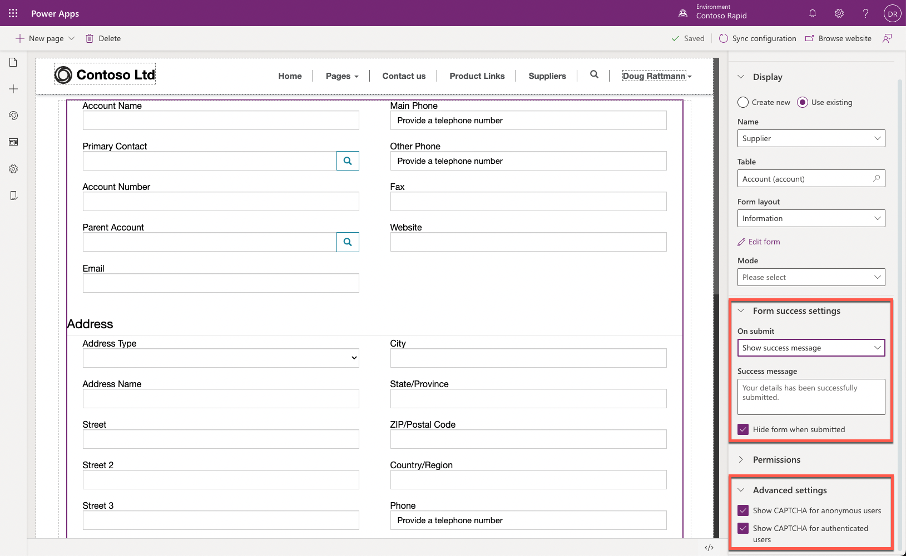
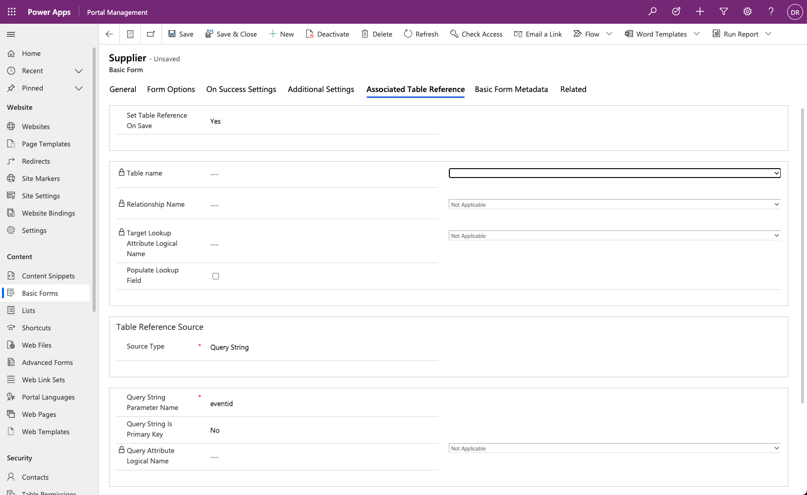
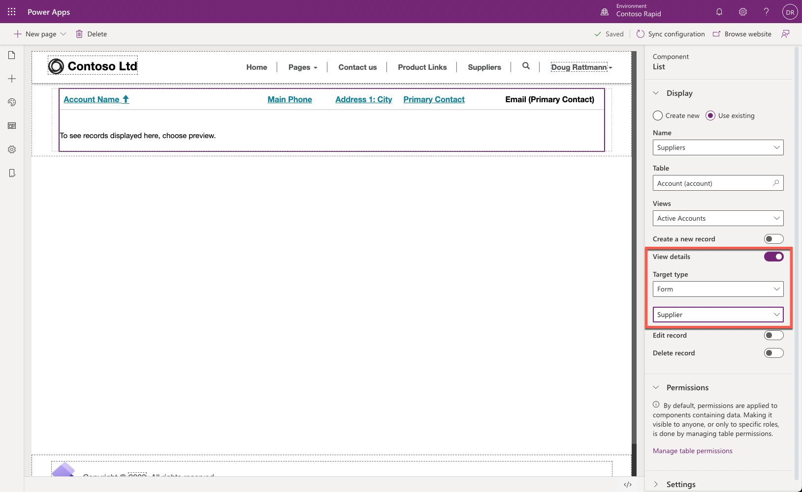
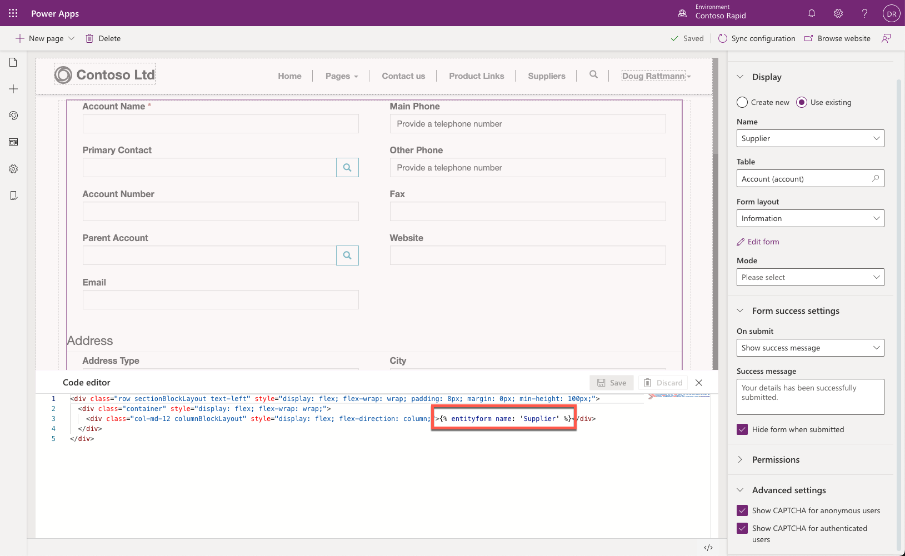

You can add a basic form to a webpage by using Power Apps portals Studio from the components menu.

## Create basic form

Portals Studio provides a modern maker experience for creating and configuring basic forms. To create a basic form in the Power Apps portal Studio, use the following procedure:

1. Sign in to [Power Apps](https://make.powerapps.com/?azure-portal=true).

1. Select a target environment by using the environment selector in the upper-right corner.

1. On the left menu, select **Apps**.

1. From the **Apps** list, locate the portal app (the app Type will be Portal).

1. Select the ellipsis (...) and then select **Edit**. The portals Studio will launch.

1. From the command bar, select **+ New Page > Blank** template.

1. On the page canvas, select column content.

1. On the toolbelt, select **Components (+)**, then select **Form**.

   

1. Enter the following in the properties panel:

   - Select **Create new**.

   - Enter **Supplier** as **Name**.

   - Select **Account (account)** as **Table**.

   - Select **Information** as **Form layout**.

   - Select **ReadOnly** as **Mode**.

   

As the page auto-saves and refreshes, the form layout will be displayed directly on the portals Studio page canvas.



> [!NOTE]
> Scroll the form displayed on page canvas. Verify that all tabs from the Dataverse form are included.

## Configure basic form

Portals Studio has an interface for creating forms. However, not all available settings can be configured in portals Studio. A number of additional configuration options are available for basic forms in the Portal Management app. To access a basic form in the Portal Management app:

1. Sign in to [Power Apps](https://make.powerapps.com/?azure-portal=true).

1. Select a target environment by using the environment selector in the upper-right corner.

1. On the left menu, select **Apps**.

1. From the **Apps** list, locate the **Portal Management** app (the app Type will be Model-driven).

1. Select the app name to open it.

1. In the left navigation, select **Basic Forms**.

1. Open the form that was created previously in portals Studio.

### Simplify form layout

 Select **General** as **Tab name**.

1. Select **Save**.

   > [!div class="mx-imgBorder"]
   > [](../media/entity-form-meta-data.png#lightbox)

1. Switch to Power Apps portals Studio tab or window.

1. Select **Sync configuration**.

1. The form layout now includes only the columns from the **General** Dataverse form tab.

   

Forms can include actions for the user to interact with the Dataverse row. Detailed configurations for each form element are available by using additional **Basic Form Metadata** rows.

> [!div class="mx-imgBorder"]
> [](../media/entity-form-overview.png#lightbox)

## Configuration

The following sections describe different ways that you can configure basic forms in **Portal Management** app.

### Form options

Most of the form options support customization of the Cascading Style Sheets (CSS) elements to change the visual appearance. You can specify text elements such as labels, messages, and tooltips in multiple languages. For example, the default message after the form submission is "Saved," but you can customize the message for each of the enabled portal languages.

Other form options include:

- Enable CAPTCHA to prevent spamming on forms that are open to anonymous users.

- Control validation behavior, for example, whether to mark all columns as required regardless of the form setting.

See the [Form options](/power-apps/maker/portals/configure/entity-forms?azure-portal=true#form-options) documentation for a complete list of available options.

### On success settings

Behaviors on successful form submission options are to display a message or redirect to another page or URL. Displaying a message is common for "contact us" and similar forms where submissions are anonymous and repeatable. Redirect is used in scenarios where a portal user, typically authenticated, has been dealing with a list of rows and views or has been editing some of them.

Configure the success message on the **Additional Settings** tab.

> [!TIP]
> Use **Advanced settings** section in the form properties panel in portals Studio to select CAPTCHA behavior and **Form success settings** section to control **On submit** settings.



### Additional settings

Additional settings in the **Portal Management** app define more aspects of form behavior, including styling, translation of UI elements, and so on.

#### Actions

Because each basic form deals with an individual table row, several actions are available for you to use to run against this row, for example **Update**, **Delete**, **Deactivate**, and so on. Configure these actions that are displayed at runtime as command buttons by selecting **Additional Settings > Action Button Configuration**. All commands include options to rename the buttons and change their placement on the form.

> [!TIP]
> Some of the settings and configuration options are hidden. Use the **Advanced settings** check box to display all available options for the form and individual actions. For example, to change the default success message, add the **Submit** action and select **Advanced settings**.

Other actions that you can configure include:

- **Associate Current Portal User on Insert** - Use these options to keep track of which of the portal contacts created or updated the row. This feature creates a portal equivalent of `Created By` and `Modified By` columns in Microsoft Dataverse. You can also set parental relationships where applicable. For example, if a new account row is created, you might want to automatically set the current contact as a primary contact.

- **Add Attach File** - Several options are available for you to add a file upload control to your form. Configuration is flexible and supports multiple files, storage options, MIME type, and size restrictions (for example, you can restrict uploads to images up to 2 MB in size).

- **Geolocation** - You can configure a basic form to display a map control that either displays an existing location as a pin on a map or that allows the user to specify a location. For more information, see [Add Geolocation](/power-apps/maker/portals/configure/add-geolocation/?azure-portal=true).

The form's map control requires additional configuration to tell it what the various location columns are, to assign values to them, or to retrieve values from them. For more information, see [Geolocation configuration for basic forms](/power-apps/maker/portals/configure/entity-forms?azure-portal=true#geolocation-configuration-for-entity-forms).

> [!div class="mx-imgBorder"]
> [](../media/entity-form-geolocation.png#lightbox)

### Associated Table Reference

Associated Table reference provides a way to associate the current row that is being created or updated with another target row. This feature is useful if you have multiple steps with multiple table types and want to relate the resulting rows or if the page is passed through a query string of a row ID that you want to associate.

For example, you might have an event page that displays information about an upcoming webinar. You want to include a registration button that redirects visitors to the registration page where the registration form is displayed. You can pass the event identifier in a query string, and when the registration form is submitted, you'll be able to automatically link the registration information to the event.



## Basic form metadata

**Basic form metadata** rows allow you to control the appearance and behavior of individual form elements, including:

- The appearance of columns, sections, and tabs. For individual columns, define default values, validation behavior, and other aspects. See [Configure basic form metadata](/power-apps/maker/portals/configure/configure-basic-form-metadata/?azure-portal=true).

- Subgrids configuration allows you to define actions for related rows, similar to list actions. See [Configure Basic form subgrids](/power-apps/maker/portals/configure/configure-basic-form-subgrid/?azure-portal=true).

- Behavior of notes and timeline sections, and whether new rows can be added. This feature is commonly used to allow portal users to enter comments about the row, for example, a case in progress.

For more information about basic forms in **Portal Management** app, see [Work with basic forms](/power-apps/maker/portals/configure/entity-forms/?azure-portal=true).

## Add a basic form to your portal

A basic form defines the required behavior but does not contain information about how and where on the site the form should render. The two ways to render a basic form in a portal are:

- Explicitly specify the basic form as a target for a list action like **Create**, **Update**, or **Edit**. In this case, the form renders in a modal pop-up window. Certain limitations apply when the form is rendered in a pop-up window. For example, creating related rows from subgrids is not available.

  

- Similar to a list, you can add a basic form component to a webpage in the portals Studio. This action places a Liquid tag on the webpage copy to render the basic form.

```twig

```

> [!div class="mx-imgBorder"]
> [](../media/entity-form-liquid-tag.png#lightbox)
