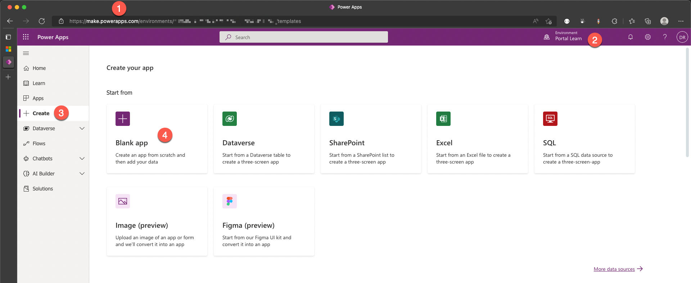
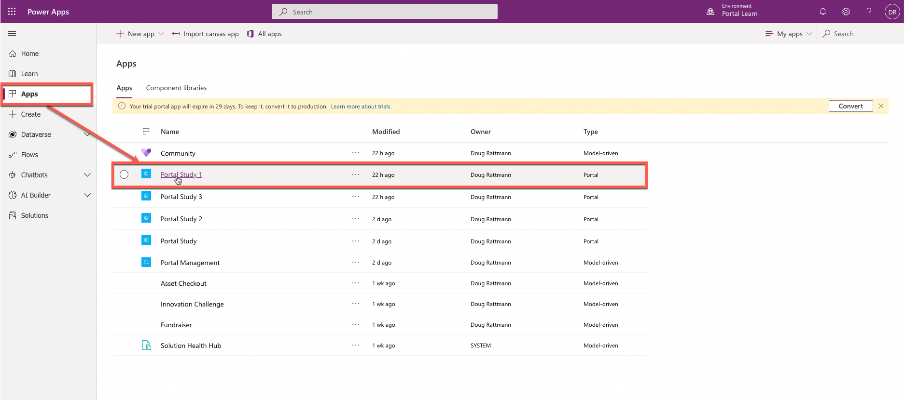
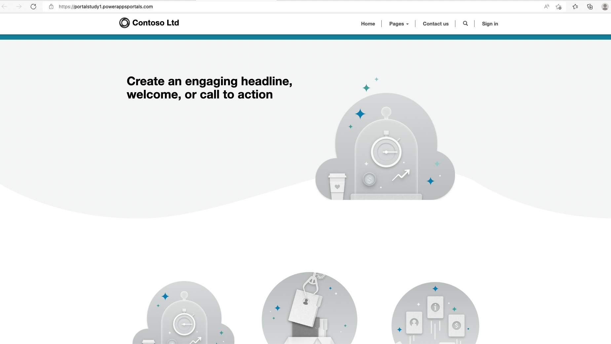
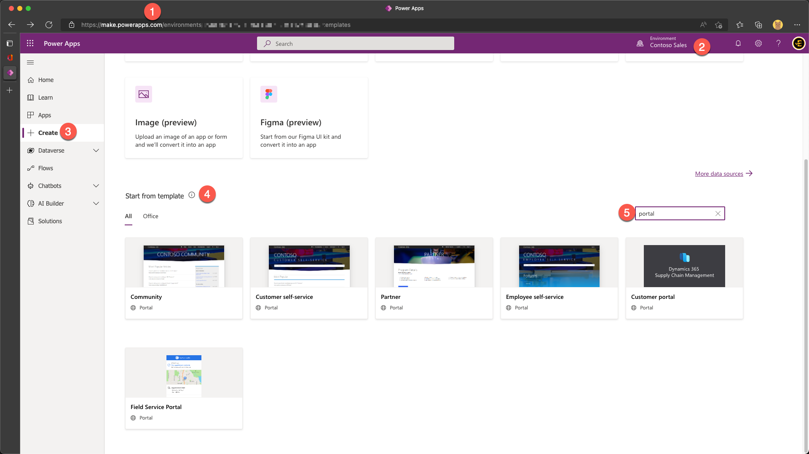
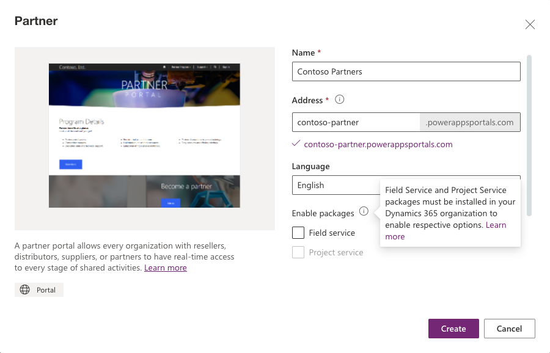
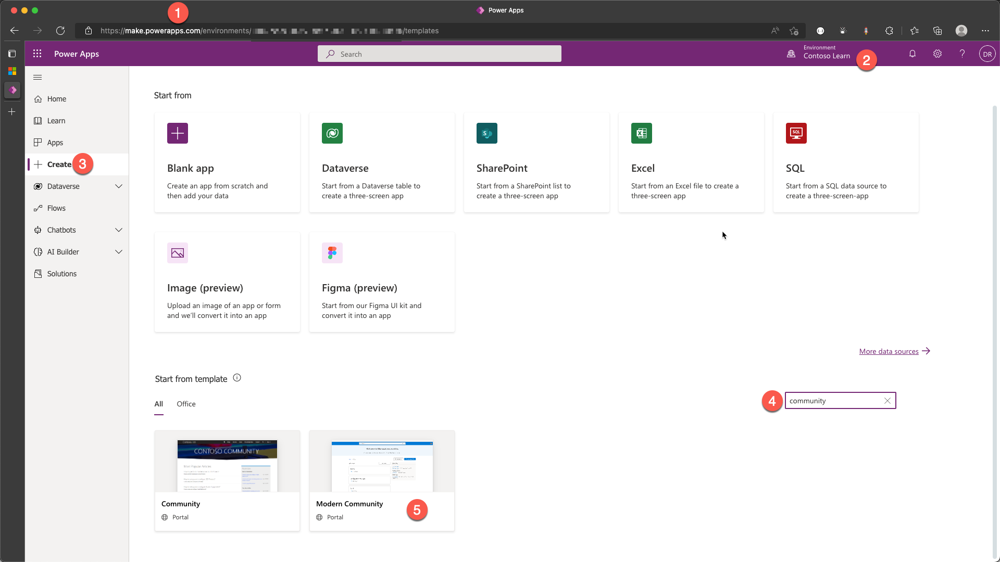

Power Apps portal isn't automatically provisioned when a new Dataverse environment is created. You'll need to provision a Power Apps portal and determine the name, default URL, language, and template.

> [!IMPORTANT]
> To provision a portal, you must be assigned to the System Administrator role of the Dataverse environment that is selected for the portal.

## Portal templates

Portal templates are preconfigured portal solutions that are available to accelerate deployment. Power Apps portals are customizable, but a portal template will provide a preconfigured environment that is immediately suitable for specific scenarios.

If you select an environment that contains Microsoft Dataverse, you can create a blank website portal. The blank website portal comes with the sample data to help you get started quickly.

If you select an environment that contains customer engagement apps (Dynamics 365 Sales, Dynamics 365 Customer Service, Dynamics 365 Field Service, Dynamics 365 Marketing, or Dynamics 365 Project Service Automation), you can also create the following portals:

- Community
- Customer self-service
- Employee self-service
- Partner
- Field Service
- Supply Chain Management Customer

If your environment has Dynamics 365 Customer Service Community app installed, you'll be able to use Modern Community portal template.  

## Portal features

Each of the starter portals includes a particular set of features that are designed to accelerate solution development that targets the selected audience.

| **Portal template**   | **Audience**                   | **Workload**                                                 |
| :-------------------- | :----------------------------- | :----------------------------------------------------------- |
| Community             | Partner, Customer              | Choose this template to provision a portal that is focused on an online community. This portal will contain features such as forums, ideas, blogs, and case management. |
| Customer self-service | Partner, Customer              | This template provides the ability for portal users to search knowledge articles, submit cases, and participate in discussion forums to resolve issues. |
| Employee self-service | Employee                       | This portal allows employees to access a centralized knowledge article and to also submit cases. |
| Partner               | Partner, Customer, Field Agent | Choose this template to build a portal where external partners can manage and collaborate on accounts and opportunities. Add-ons are available for Dynamics 365 Field Service or Dynamics 365 Project Service. |
| Field Service         | Customer                       | This portal enables self-service scheduling capabilities for your customers. Requires Dynamics 365 Field Service. |
| Customer portal       | Enterprise B2B                 | The Dynamics 365 Supply Chain Management Customer portal is a template that provides portal access to Dynamics 365 Supply Chain Management data by using dual-write Microsoft Dataverse tables. |
| Modern Community      | Customer, Community            | This solution helps your organization invite customer suggestions and crowd source portfolios of outside-in ideas. End users can share new ideas with organizations and collaborate on a social scale. |
| Blank website         | Other                          | The blank website template is meant for unique line-of-business scenarios where the other templates aren't a good fit. The portal can be configured and customized to address various requirements. |

> [!NOTE]
>The starter portal selection defines a specific set of features. If a portal is provisioned within a Dataverse environment with Dynamics 365 apps installed, specific features from the other starter portals can be added later, as required.

## Provision a portal

To provision a Power Apps portal you need a Dataverse environment. Multiple portals can be provisioned in the same environment, subject to the capacity limits. See [Create additional portals in an environment](/power-apps/maker/portals/create-additional-portals) for more information.

> [!NOTE]
> A portal is always created as a trial that can later be converted to a production portal.

### Blank website portal

To provision a blank website portal:

1. Sign in to [Power Apps](https://make.powerapps.com/?azure-portal=true).

1. Select a target environment by using the environment selector in the upper-right corner.

1. On the left menu, select **+ Create**.

1. In **Create your app** section, select **Blank app**.
   

1. Select **Create** from the **Blank website** option.
   

1. Provide a name, a unique address (URL), and select a language.
   

   > [!TIP]
   >To create a portal in a different language, you must first [enable the language in the environment](/power-platform/admin/enable-languages#enable-the-language) so that it becomes available in the language drop-down list.

1. Select **Create** to start the portal provisioning process.

   After portal provisioning has completed, the portal will appear in the list as an app of type Portal.

1. Select **Apps** in the left menu then select the app of type Portal to open the portal website.
   

1. The blank portal with sample data will open in a new tab.
   

Detailed step-by-step instructions to provision a portal are available at [Provision a portal](/power-apps/maker/portals/create-portal?azure-portal=true).

### Dynamics 365 portals

If you have Dynamics 365 customer engagement apps deployed in your Dataverse environment, additional portal templates, such as Customer self-service, will be available. To provision a portal in an environment with Dynamics 365 customer engagement apps: 

1. Sign in to [Power Apps](https://make.powerapps.com/?azure-portal=true).

1. Select a target environment by using the environment selector in the upper-right corner.

1. On the left menu, select **+ Create**.

1. Scroll down to **Start from template** section.

1. In the search box on the right-side of the screen, enter "Portal".
   

1. Select the required portal template.

1. Provide a name, a unique address (URL), and select a language.

1. If Partner portal template is selected, you can additionally include Field Service or Project Service add-ons. These options are enabled if you have Dynamics 365 Field Service or Dynamics 365 Project Service Automation installed, respectively.
   

1. Select **Create** to start the portal provisioning process.

   After portal provisioning has completed, the portal will appear in the list as an app of type Portal.

> [!VIDEO https://www.microsoft.com/videoplayer/embed/RE4yoJw]

### Modern Community portal

To provision a Modern Community portal, you must have Dynamics 365 Customer Service Community app installed. If you don't have this app installed, see [Get started with Community](/dynamics365/customer-service/community-get-started/?azure-portal=true) for installation instructions.

To provision a Modern Community portal:

1. Sign in to [Power Apps](https://make.powerapps.com/?azure-portal=true).

1. Select a target environment by using the environment selector in the upper-right corner.

1. Scroll down to **Start from template** section.

1. In the search box on the right-side of the screen, enter "Modern".

1. Select the **Modern Community** portal template.
   

1. Provide a name, a unique address (URL), and select a language.

1. Select **Website name** from the list of available websites.
   

1. Select **Create** to start the portal provisioning process.

   After portal provisioning has completed, the portal will appear in the list as an app of type Portal.