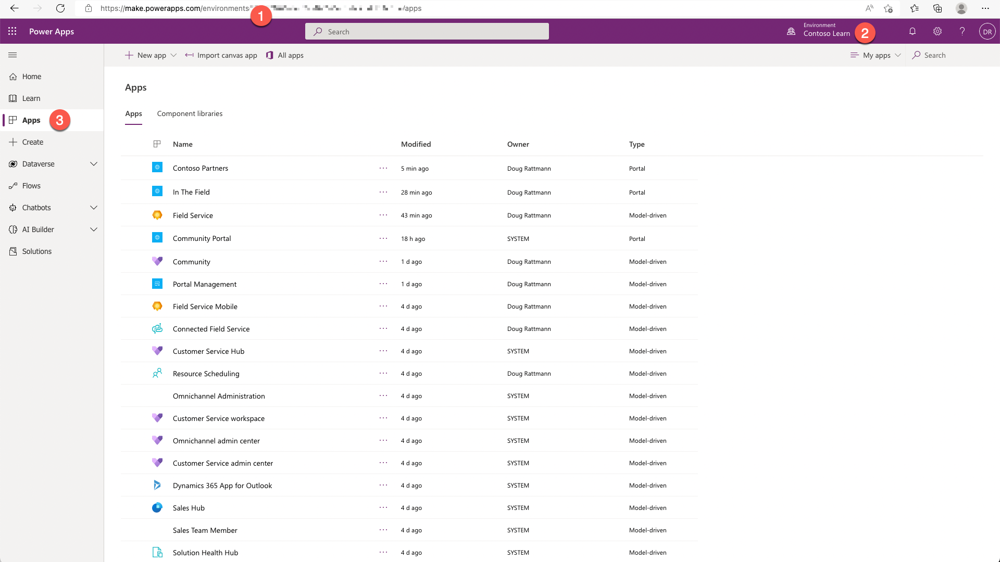
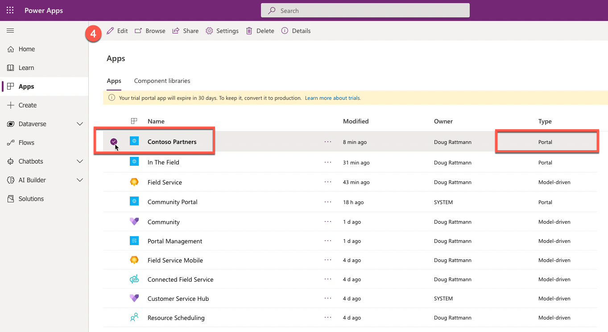
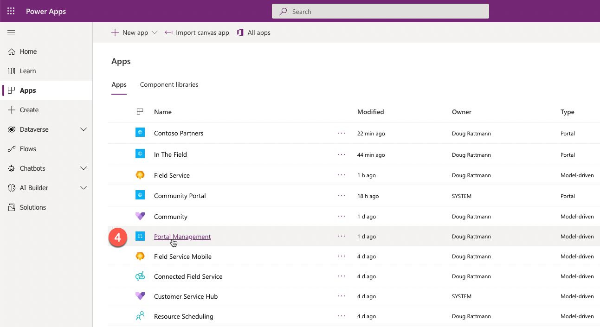
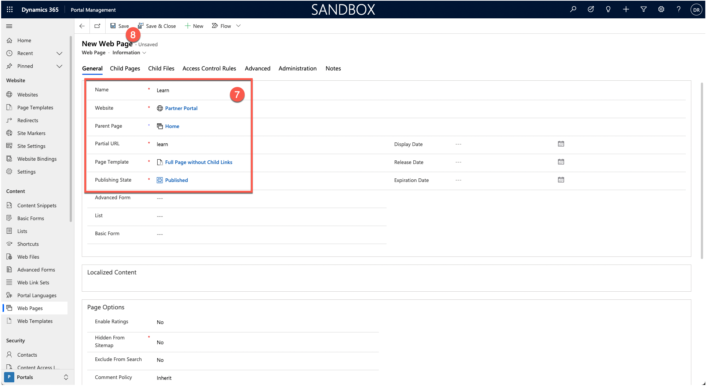
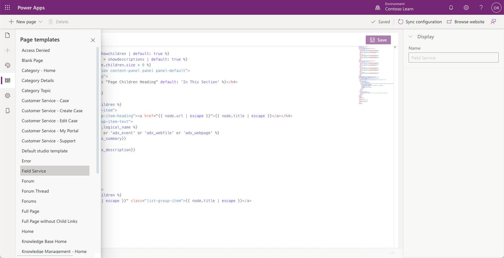
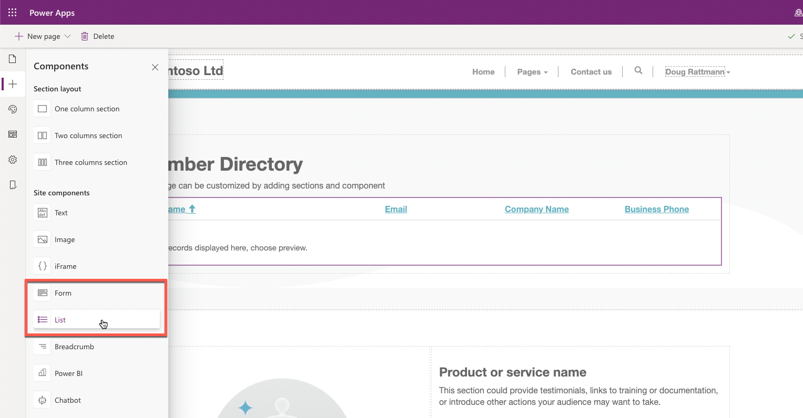
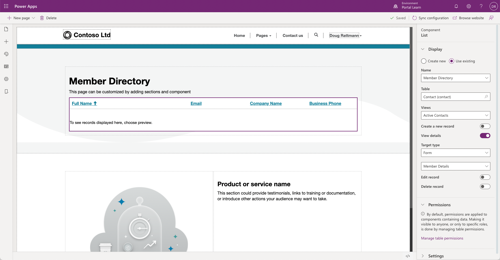

Power Apps portals store all information in Microsoft Dataverse. Portal tables define site structure, layout, content, and functionality.

The two most common questions about portals are:

- How do I manage portal content?
- How do I surface and interact with business data in the portal?

Power Apps portals have several core components that enable these scenarios. 

## Webpages

Most of a portal's content is represented by webpages. A webpage represents a particular URL in a portal's website and is one of the core tables of the portal's content management system. Through parent and child relationships to other webpages, this table forms the hierarchy of a website, that is, its site map.

Webpages also form the basis for including other, specialized table types in the portal site map: web files, shortcuts, forums, ideas, and blogs. Each of these records has a relationship with a parent page, which defines the URL and where the entries are located on the portal site map. 

Webpages can be added and edited by using the Portal Studio or directly in Dataverse by using the Portal Management app. 

> [!IMPORTANT]
> The user creating and editing pages must be a licensed Power Apps user with the appropriate Dataverse security privileges.

### Create a webpage using Portal Studio

1. Sign in to [Power Apps](https://make.powerapps.com/?azure-portal=true).

1. Select a target environment by using the environment selector in the upper-right corner.

1. On the left menu, select **Apps**.

   

1. Select the portal app then select **Edit**.

   

1. Select **New Page** on the Command bar.

1. Select a layout.

   > [!NOTE]
   > Available **Fixed layouts** may vary as they are defined by the portal template used to provision the portal.

1. Enter details on the **Properties** pane.

1. The page will be saved automatically.

   

### Create a webpage using Portal Management app

1. Sign in to [Power Apps](https://make.powerapps.com/?azure-portal=true).

1. Select a target environment by using the environment selector in the upper-right corner.

1. On the left menu, select **Apps**.

   

1. Select **Portal Management** app. That will open Portal Management app in a new tab.

   

1. In the Content section, select **Web Pages**.

1. Select **New**.

   

1. Enter the page details.

1. Select **Save**.

   

> [!VIDEO https://www.microsoft.com/videoplayer/embed/RE4yrkV]

Each webpage is composed of at least two portal metadata records: a *root* webpage record, which contains the main attributes of the webpage record, and a *content* webpage record that holds the language-specific content of the webpage. One *content* webpage exists for each provisioned portal language.

## Page templates

A webpage record doesn't define how the page looks when it's rendered on the portal. Instead, it's linked to the **Page template** record that defines the layout and the behavior.

The two types of templates that can be used in Power Apps portals are:

- **Rewrite** - These templates use specialized server-side processing to specific behavior that is required by some of the components such as polls, forums, and so on. These templates are also used to handle special pages such as an error page, site map, search, and others. You can't create new or edit existing Rewrite templates.

- **Web** - The linked layout template defines how the content of the page is rendered for output. These templates can be edited as required.

### Web template 

Web templates use the liquid templating language to define how the content is processed and rendered. Templates are flexible. A template can reuse other templates for parts of the content. A template can also be based on another template, extending the base functionality. 

Web templates can be used to define an entire webpage, a part of a page, or common elements such as the site header and footer. This approach creates a consistent appearance throughout the portal and helps make it easy to modify the appearance.

Existing web templates can be edited in the Portals Studio.

## Web files

Web files provide access to inline or downloadable content. Though similar to webpages with similar properties, web files don't use templates. Instead, when the file is requested, the attached content is delivered.

The content can be stored as a **Note** with an attachment or in Microsoft Azure Blob storage. Using Azure storage requires more configuration, but it's more cost-efficient if the organization deals with numerous documents.

Web files are used to deliver content such as documents (for example, an annual report). They're also used to store essential site content like Cascading Style Sheets (CSS) and JavaScript files.

Images that are displayed on portal webpages can also be stored as web files.

## Content snippets

Content snippets are reusable fragments of editable content that can be placed within a web template. Using snippets creates consistent appearance for the site, simplifies translation of multi-lingual context, and allows targeted edits of parts of a page without affecting the overall content.

Content snippets can include plain text, HTML layout, or template processing instructions, which help enable dynamic content. 

Snippets content can be updated by using Portal Studio. 

Full details of the Dataverse content snippet row can be edited using the Portal Management app.

## Lists and Forms

The strength of Power Apps portals is the ability to interact with information and data that is stored in Dataverse.

Lists and Forms use model-driven Power Apps views and form definitions to create dynamic and interactive portal pages that work with Dataverse. 

When a webpage is edited in Portal Studio, lists and forms can be added to the page content as site components. 

Inserted list or form will be used to render the page layout by using data from Dataverse based on system or custom tables. The list and form definitions can include interactivity, for example, provide read-write access to Dataverse table rows.

### Lists

Lists define how the list of Dataverse records is displayed on portal pages. They're defined by one or more model-driven Power Apps views and include functionality like filtering and sorting.

Lists can also have actions associated with them to enable Create/Edit/Read abilities and to trigger classic workflows. Display formats include traditional grid lists, calendar, or map and spreadsheet download.

### Forms

Forms add the ability for portal pages to interact with Dataverse records by using model-driven Power Apps form definitions as a layout template. 

Examples of the types of capabilities that are enabled by **Forms** include:

- Informational pages about employees, products, or any other Dataverse table.

- Data capture from either anonymous or authenticated users, for example, using a **Contact us** page to record leads in Dynamics 365 Sales or using a survey page to collect product feedback from customers. 

- Support pages that provide read-write access to the customers' cases. 

- Profile self-management capabilities for customers.

- An alternative user interface for employees that provides required functionality without the need to deploy canvas-based Power Apps.

- Any other scenario where data from Dataverse needs to accessed, displayed, captured, and processed by using the portal.

There are two types of forms supported in Power Apps portals, **Basic Forms** and **Advanced Forms**.

**Basic Forms** are used to generate a layout, capture the data, provide read-only access or full editing capabilities for a Dataverse table row.

**Advanced Forms** can be created using Portal Management app. They extend Basic Forms by:

- Allows data collection or update process to be broken up over multiple steps.

- Provides interactive conditions to direct a user down different paths of data updates.

- Session tracking allows a user to pick up where they left off when following a data update process.