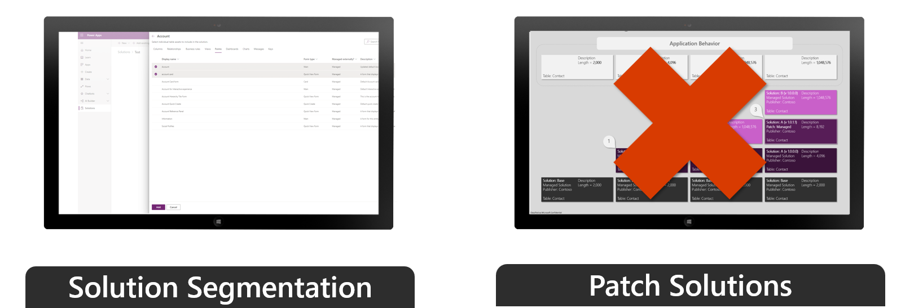

With segmentation, you can export solutions with selected table assets, such as columns, forms, and views. Segmentation also enables granular development.

Make sure that you avoid selecting the **Add All Assets** option. Choosing the **Add All Assets** option often leads to dependency issues and defeats the purpose of segmentation.

> [!div class="mx-imgBorder"]
> 

A patch solution contains only the changes for a parent-managed solution, such as adding or editing components and assets.

More items that you should keep in mind concerning patches include:

-   Use patches when making small updates (similar to a hotfix).

-   When patches are imported, they're layered on top of the parent solution. You can't delete components with a patch.

-   Using patches isn't recommended. For more information, see [Create solution patches](/powerapps/maker/common-data-service/solution-patches/?azure-portal=true).

## Managed solution updates and upgrades

Using solution updates allows you to take advantage of an optimized import process. The following video provides an example of a solution upgrade.

> [!VIDEO https://www.microsoft.com/videoplayer/embed/RE56A3W]
