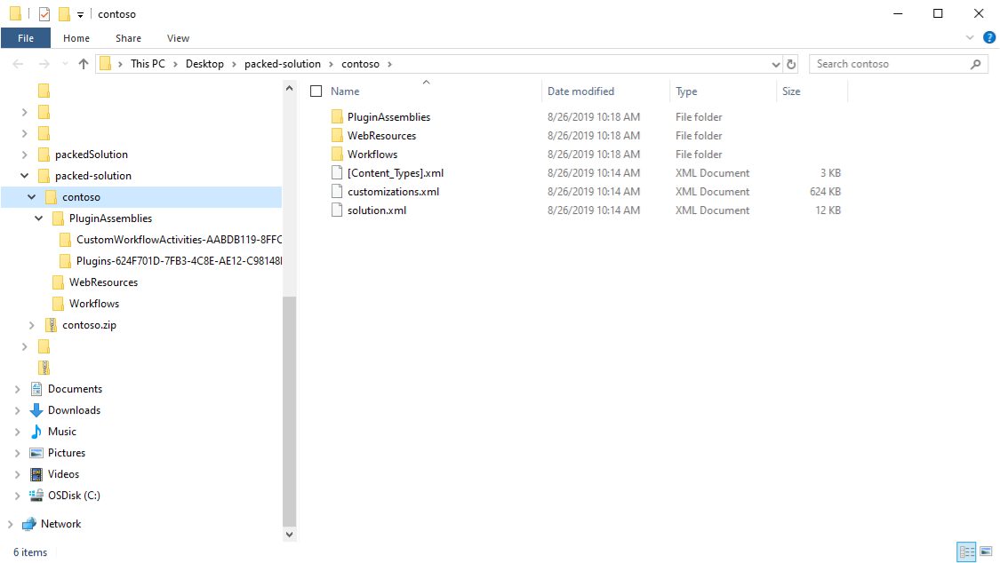
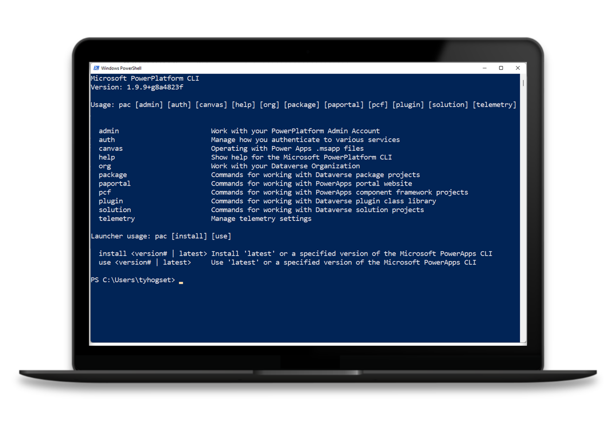
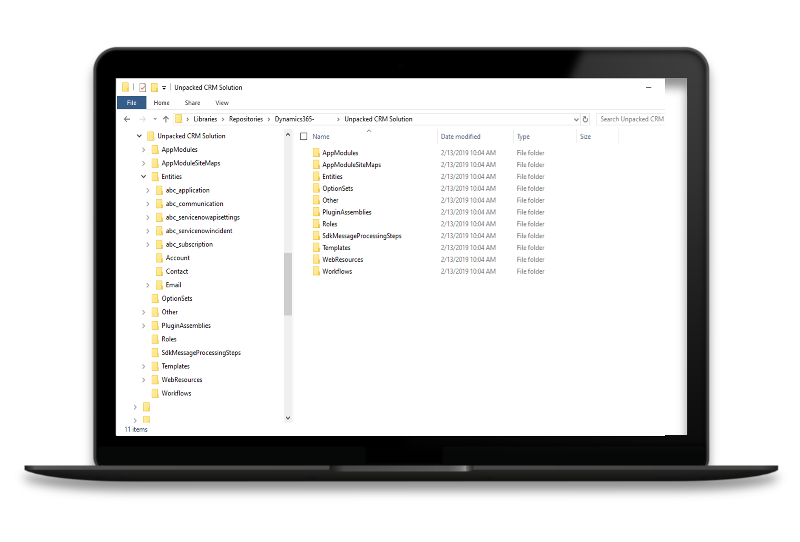

When exported from an environment, solutions are in the form of a zip file. In the zipped format, the schema definition is contained in one massive file labeled **customizations.xml**.

> [!div class="mx-imgBorder"]
> 

## Microsoft Power Platform CLI

Microsoft Power Platform CLI is a simple, one-stop developer CLI that empowers developers and independent software vendors (ISVs) to perform various operations in Microsoft Power Platform that are related to environment life cycle, authentication, and work with Microsoft Dataverse environments, solution packages, portals, code components, and an extra collection of application lifecycle management (ALM) related tasks for Microsoft Power Platform.

It's compatible with Linux, Mac, and Windows, and you can install it through automation, making it ideal for DevOps processes.

> [!div class="mx-imgBorder"]
> 

## Solution unpack command

Solution unpack reversibly decomposes a solution .zip file by dividing it into a logical folder structure. Resulting output can be more readily maintained by a source control system.

> [!div class="mx-imgBorder"]
> 
