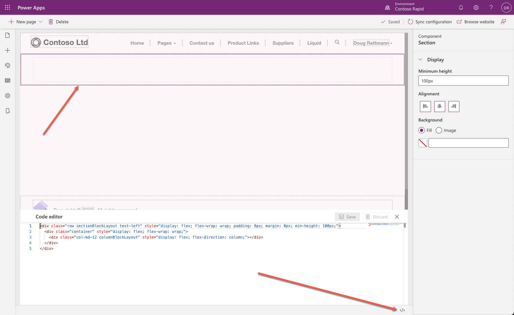
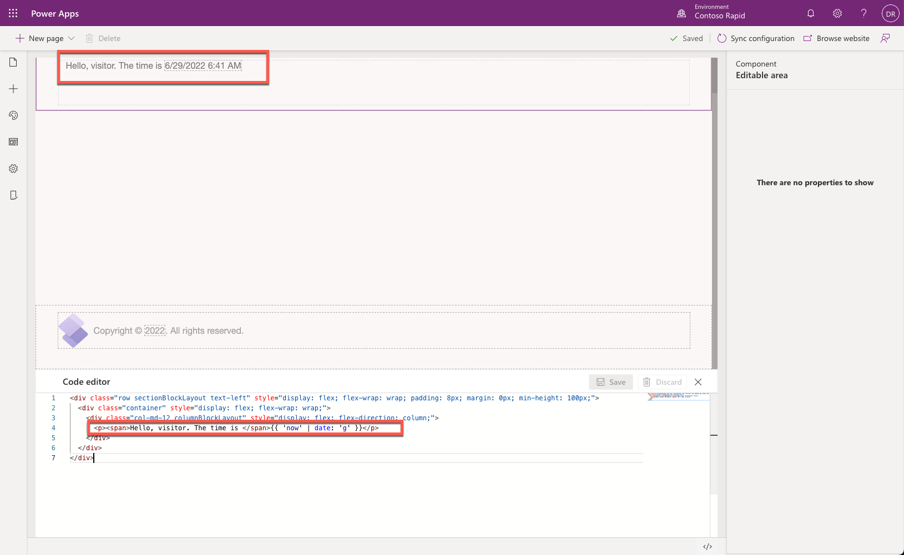

Microsoft Power Apps portals generates output based on Microsoft Dataverse data. The fundamental question in this architecture is: How can I take *this* data and insert it into *that* output?

The data in this question would commonly refer to Dataverse data, and the output is usually HTML or plain text.

Because Power Apps portals uses a Software as a Service (SaaS) model, access to the server code is not provided. Portal makers need to edit their own templates, which is where Liquid template language comes in.

Liquid is an [open-source template language](http://dotliquidmarkup.org/?azure-portal=true) that is integrated natively into Power Apps portals. It acts as a bridge between Dataverse data and the HTML or text output that is sent to the browser. Liquid can be used to add dynamic content to pages and to create a variety of custom templates. Additionally, Liquid provides access only to the data and operations that are explicitly allowed by the portal security settings.

### Add Liquid code to portal webpages

Liquid code can be used anywhere in the portals where HTML or text content can be entered, including web templates, webpages, and content snippets.

1. Open Power Apps portals Studio and then follow these steps:

   1. Sign in to [Power Apps](https://make.powerapps.com/?azure-portal=true).

   1. Select a target environment by using the environment selector in the upper-right corner.

   1. On the left menu, select **Apps**.

   1. From the **Apps** list, select the portal app (the app Type will be Portal).

   1. Select the **Edit** menu.

1. Select **+ New page > Blank**.

1. Enter the following webpage properties:

   - **Name** - Liquid

   - **Partial URL** - liquid

1. Select the content on the canvas and then select the Source Code Editor icon (**</>**) on the status bar to start the code editor.

   

1. In the Code Editor, locate the following line:

   ```html
   <div class="col-md-12 columnBlockLayout" style="display: flex; flex-direction: column;"></div>
   ```

1. Insert the following text as the `<div>` tag content :

   ```html
   <p>Hello, visitor. The time is {{ 'now' | date: 'g' }}</p>
   ```

1. Select **Save**. Note: The editor might automatically add `<span>` elements to separate the Liquid code.

The content will now display the current time.

   > [!div class="mx-imgBorder"]
   > [](../media/liquid-start.png#lightbox)
