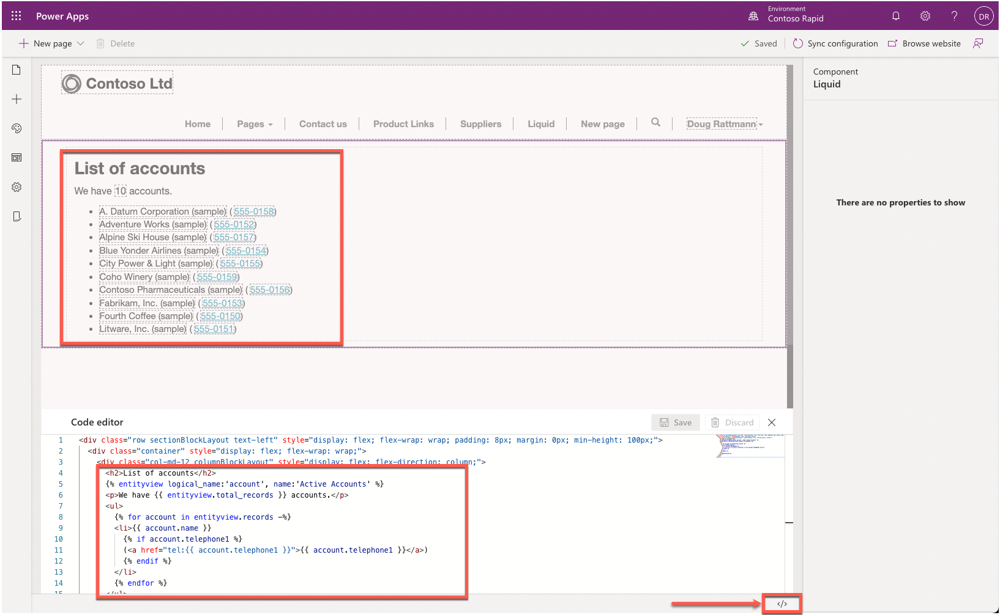
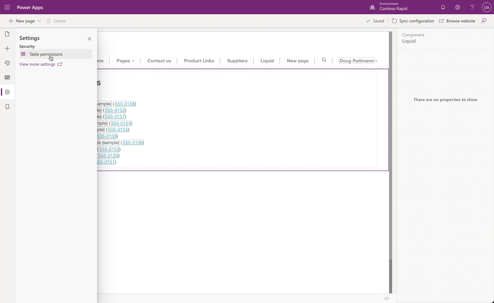
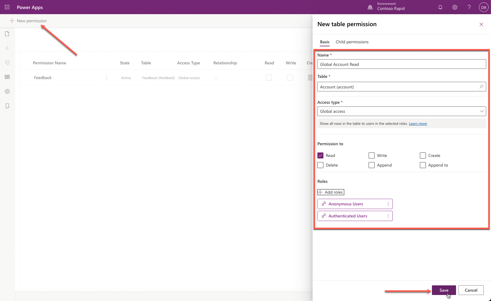
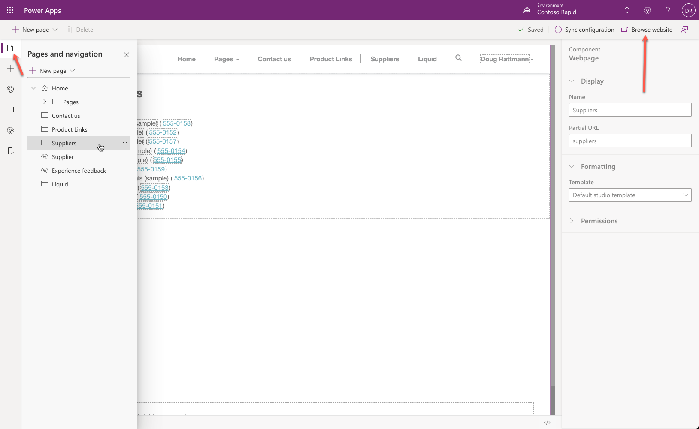
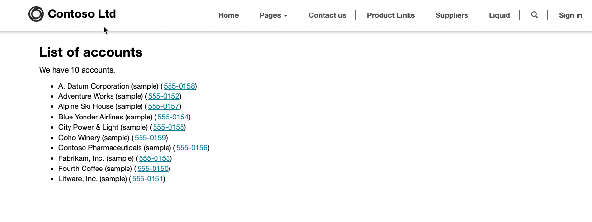

The purpose of this hands-on lab is to access Microsoft Dataverse data by using Liquid.

The exercises work best when you have sample data to work with. Depending on the environment that you are working with, you might want to install some sample data to assist with the exercises. Microsoft Power Platform does provide the ability to add sample data as needed. If the environment that you are working in doesn't have sample data installed, follow the steps in the [Add or remove sample data](/power-platform/admin/add-remove-sample-data/?azure-portal=true) documentation to install the sample data into your environment.

## Learning objectives

At the end of these exercises, you'll be able to:

- Enter Liquid code as part of the page content.
- Access Dataverse data using Liquid.
- Add conditional statements to display only available data.

## Prerequisites

For this exercise, you need to have the following parameters set up in your environment:

- A Power Apps portal that is provisioned. If you do not have a Power Apps portal available, follow the [Create Portal](/power-apps/maker/portals/create-portal/?azure-portal=true) instructions to create one.

- Access to the Power Apps maker portal.

## High-level steps

In this exercise, you will display selected Dataverse records by adding some HTML and Liquid code to the webpage copy section by using the Power Apps portals Studio code editor.

- Open your portal in Power Apps portals Studio.

- Add a Suppliers webpage.

- Add HTML and Liquid code that lists all active accounts.

- Preview the results in portals Studio and in a browser.

- Add read table permissions for the account table and verify results in a browser.

## Detailed steps

### Launch portals Studio

Follow these steps to launch portals Studio:

1. Sign in to [Power Apps](https://make.powerapps.com/?azure-portal=true).

1. Select a target environment by using the environment selector in the upper-right corner.

1. On the left menu, select **Apps**.

1. From the **Apps** list, select the portal app (the app Type will be Portal).

1. Select the **Edit** menu.

### Create Suppliers webpage

To create the **Suppliers** webpage, follow these steps:

1. Select **+ New page > Blank**.

1. Enter the following webpage properties:

   - **Name** - Suppliers

   - **Partial URL** - suppliers

### Edit source code

To edit the source code to list all active accounts, follow these steps:

1. Select the page content on the canvas.

1. Select the **Source Code Editor** (**</>**) icon.

1. In the Code Editor, locate the following line:

   ```html
   <div class="col-md-12 columnBlockLayout" style="display: flex; flex-direction: column;"></div>
   ```

1. Insert the following text as the `<div>` tag content :

    ```php
    <h2>List of accounts</h2>
    
    <p>We have {{ entityview.total_records }} accounts.</p>
    <ul>
      
      <li>{{ account.name }}
        
        (<a href="tel:{{ account.telephone1 }}">{{ account.telephone1 }}</a>)
        
      </li>
      
    </ul>
    
    ```

1. Select **Save**.

   You should see the list of current accounts on the canvas, including hyperlinked telephone numbers where they are present.

   > [!div class="mx-imgBorder"]
   > [](../media/liquid-exercise.png#lightbox)

1. Select the **Browse website** button. The displayed webpage should only contain the text, "We have 0 accounts."

    > [!NOTE]
    > This result is expected because, at runtime, the portal will deny access to table records unless table permission record exists to allow access to the data.

### Add table permissions

To display the list of account records when browsing a page, we need to add table permissions.

> [!WARNING]
> In this exercise, we add global read permissions on the account table for all visitors. This is not a typical security configuration, and it is used for demonstration purposes only.

To add table permissions, follow these steps:

1. On the toolbar, select **Settings**, then select **Table permissions**.

   

1. Select **+ New permission**, then enter the following information on the properties panel:

   - **Name**: Global Account Read.

   - **Table**: select **Account (account)**.

   - **Access type**: select **Global access**.

   - **Permissions to**: check **Read** checkbox.

1. Add roles:

   - Select **Add roles**

   - Select **Anonymous Users**

   - Select **Authenticated Users**

   - Select **X** icon to close the role selection panel.

   

1. Select the **Pages** icon on the toolbelt, select the **Suppliers** page.

1. Select **Browse website**.

   

1. A list of the accounts will be displayed.

   
