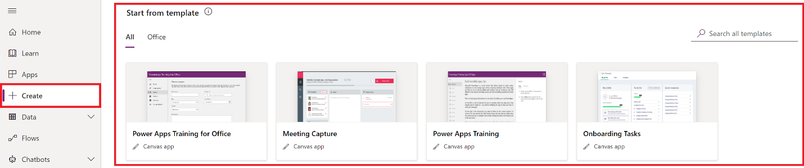

> [!VIDEO https://www.microsoft.com/videoplayer/embed/]

To get started, you can automatically generate an app from one of these sources, among others:

-   [A sample app](/power-apps/maker/canvas-apps/open-and-run-a-sample-app/?azure-portal=true)

-   [A template](/power-apps/maker/canvas-apps/get-started-test-drive/?azure-portal=true)

-   [Dataverse](/power-apps/maker/canvas-apps/data-platform-create-app/?azure-portal=true)

-   [SharePoint](/power-apps/maker/canvas-apps/app-from-sharepoint/?azure-portal=true)

-   [Excel](/power-apps/maker/canvas-apps/get-started-create-from-data/?azure-portal=true)

Sign in to [Power Apps](https://make.powerapps.com/?azure-portal=true), select **Create** from the left-pane, and under **Start from template**, choose a sample app from the list of sample apps such as **Meeting Capture** or **Onboarding Tasks**.

> [!div class="mx-imgBorder"]
> 

After you generate an app automatically, customize its default appearance and behavior based on your users' workflows. For example, change which types of data appear, how they're sorted, or even whether users specify a number by typing it or adjusting a slider. Add and customize [screens](/power-apps/maker/canvas-apps/add-screen-context-variables/?azure-portal=true), [galleries](/power-apps/maker/canvas-apps/customize-layout-sharepoint/?azure-portal=true), [forms](/power-apps/maker/canvas-apps/customize-forms-sharepoint/?azure-portal=true), and other controls.

After you've gained some experience generating an app automatically and customizing it, you can create an app from scratch based on [Dataverse](/power-apps/maker/canvas-apps/data-platform-create-app-scratch/?azure-portal=true), [Excel](/power-apps/maker/canvas-apps/get-started-create-from-blank/?azure-portal=true), or another data source. By working from the ground up, you gain flexibility in app design, flow, and controls, and you can incorporate a larger variety of data sources.

## Recommended Content

[Create a canvas app in Power Apps](/learn/paths/create-powerapps/?azure-portal=true)

[Power Apps canvas apps documentation](/power-apps/maker/canvas-apps/?azure-portal=true)

## Build a basic Canvas App

Build a canvas app to manage data that's stored in Dataverse in relation to the Service Department, using standard tables (which are built in like **Contact**) and custom tables (which your organization creates like **Dive Gear** and **Service Request**).

Remember that when you build an app from Dataverse, you don't need to create a connection from Power Apps, as you do with data sources such as SharePoint, Dynamics 365, or Salesforce. You need only to specify the tables that you want to show or manage in the app.

The objective of this app will be for salespeople and technicians to check gear in to be serviced or repaired. You can follow the procedure detailed in [this article](/power-apps/maker/canvas-apps/data-platform-create-app-scratch/?azure-portal=true) in order to create your app.
