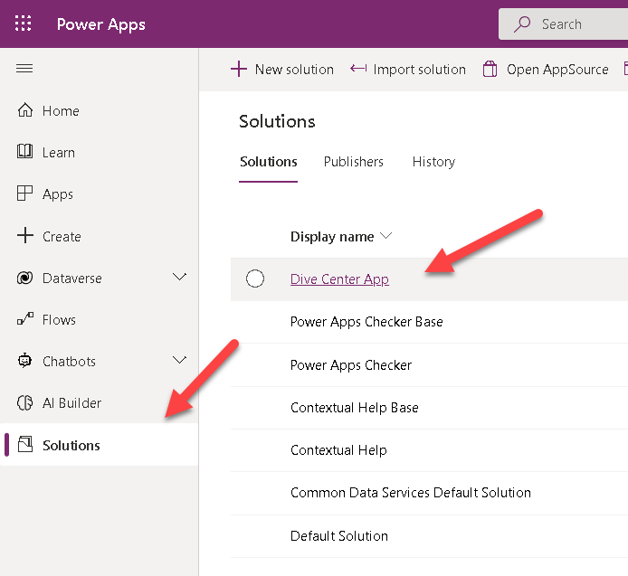
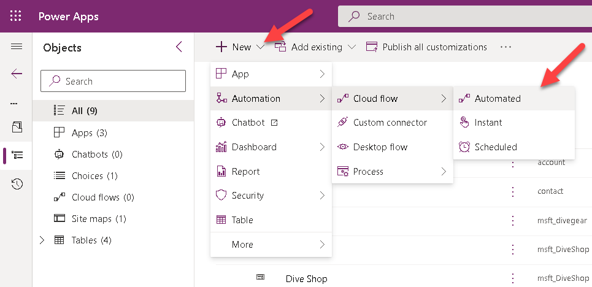
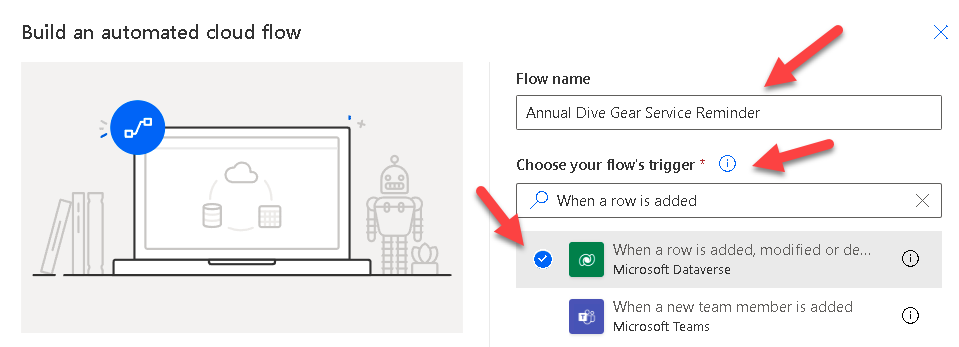
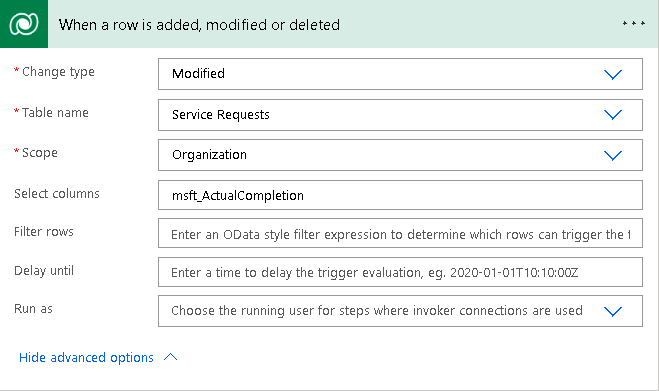
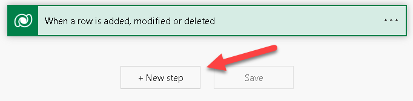
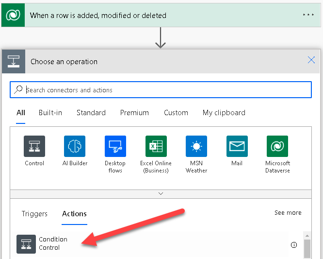
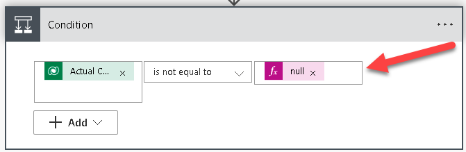
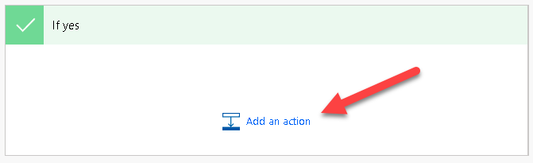
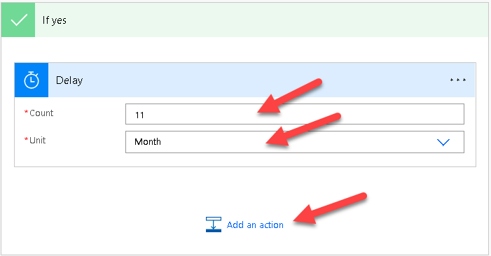

For this exercise, we'll create a Power Automate Flow that will start automatically when a user adds a date into the **Actual Completion** column of the **Service Request** records in Dataverse. When a date has been added our flow will fire up and **wait for 11 months** before **sending a reminder** to the customer to bring the gear back in order to be serviced again.

1.  Sign in to [Power Apps](https://make.powerapps.com/?azure-portal=true).

1.  On the left pane, select **Solutions**, then open the **Dive Center App** Solution we created earlier in this module.

	> [!div class="mx-imgBorder"]
	> 

1.  Select the **New** button and select **Automation > Cloud flow > Automated**.

	> [!div class="mx-imgBorder"]
	> 

1.  Enter **Annual Dive Gear Service Reminder** as the Flow name and search for and select the **When a row is added, modified, or deleted** trigger, and select on **Create**.

	> [!div class="mx-imgBorder"]
	> 

1.  Enter details as shown on the image below.

	> [!div class="mx-imgBorder"]
	> 

1.  Add a step by selecting the **+ New Step** button.

	> [!div class="mx-imgBorder"]
	> 

1.  Select **Condition** as your new step.

	> [!div class="mx-imgBorder"]
	> 

1.  Select the **Actual Completion Date** column and ensure it **does not equal null**.

	> [!div class="mx-imgBorder"]
	> 

1.  Under **If Yes** select **Add an action**.

	> [!div class="mx-imgBorder"]
	> 

1. Search for and select **Delay**, populate the new action as shown below, then select **Add an action**.

	> [!div class="mx-imgBorder"]
	> 

1. From here you can complete the flow to send an email reminder or perhaps an SMS message reminder for the customers to call the show and schedule their next service.

## Business rules

You can create business rules and recommendations to apply logic and validations without writing code or creating plug-ins. Business rules provide a simple interface to implement and maintain fast-changing and commonly used rules.

For example we could configure a business rule to set the Serial Number as a required field when capturing some types of dive gear but others that don't typically get a serial number  such as masks, fins, and exposure suits would have an optional serial number field.

Define *business rules* for a table that apply to all the table forms and at the server level. Business rules defined for a table apply to both *canvas apps* and *model-driven apps* if the table is used in the app.

More information: [Create a business rule for a table](/power-apps/maker/data-platform/data-platform-create-business-rule/?azure-portal=true)

### Workflows

Sometimes we require automation to be instantaneous, even before an action takes place, like, for example,  check for a condition before a record is deleted or assigned to another user. A good example in our case would be to check if service has been paid for before releasing gear back to the customer.

We need to be careful when it comes to working with real time workflows. For example, it's possible to create logic in a real-time workflow that initiates an infinite loop, which consumes server resources and affects performance. The typical situation where an infinite loop might occur is when you have a real-time workflow configured to start when a column is updated and then updates that column in the logic of the workflow. The update action triggers the same real-time workflow that updates the record and triggers the real-time workflow again and again.

The workflows you create include logic to detect and stop infinite loops. If a real-time workflow process is run more than some times on a specific record in a short period of time, the process fails with the following error: **This workflow job was canceled because the workflow that started it included an infinite loop. Correct the workflow logic and try again**. The limit of times is 16.

There are more [best practices](/power-apps/maker/data-platform/best-practices-workflow-processes/?azure-portal=true) that you need to be aware off when it comes to working with real time workflows such as working with child workflows, and keeping records of workflows that failed to be used when troubleshooting.

More information: [Microsoft Dataverse real-time workflows](/power-apps/maker/data-platform/overview-realtime-workflows/?azure-portal=true)

## Recommended Content

[Defining the business value of solving the problem](/power-apps/guidance/planning/defining-business-value/?azure-portal=true)

[Measuring success against the business value](/power-apps/guidance/planning/measuring-success/?azure-portal=true)