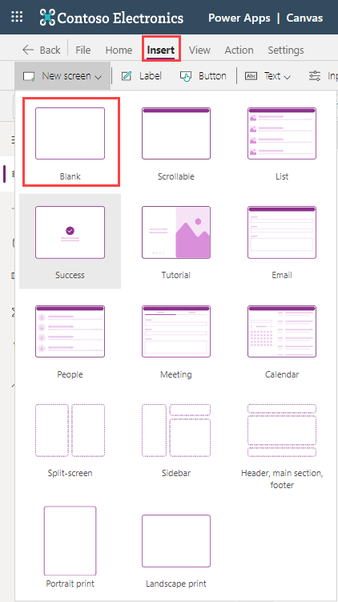

The purpose of this tutorial is to provide a more detailed example using the **Back** and **Navigate** functions with multiple controls in a common real-world scenario. In many of the apps that you
develop, certain screens may have multiple controls allowing users to
navigate to different screens depending on the control they select. In
the following example, you'll create a three screen app to
demonstrate the **Navigate** and **Back** functionality.

1. Go to the [Power Apps Studio](https://make.powerapps.com/?azure-portal=true).

1. Select **Blank app** from the Home screen **Start from** window, and in the **Create** popup pane select **Create** under the **Blank canvas app** option.

1. A window called **Canvas app from blank** will open in your browser, enter a name for your app, ensure that you have **Tablet layout** selected as the format (default setting). Then select **Create**.

1. In the new blank app, you can **Skip** the "Welcome to Power Apps Studio" popup. Then select the **Insert** tab at the top, select the **New screen** dropdown, and choose *Blank*.

    

1. This will create a new blank screen in your app. Repeat once more to have three screens total.

1. On Screen1, insert a **Button** control and change the **Text** property to "Next".

1. Likewise, go to Screen2, add a **Button** control and change the **Text** to "Next".

1. Add another **Button** to Screen2 and change the **Text** to "Back".

1. Now go to Screen3, add a **Button** control and change the **Text** property to "Back".

1. Back at Screen1, select the "Next" button and set the **OnSelect** property to **Navigate(Screen2,ScreenTransition.Fade)**. Once you enter this logic, Power Apps will abbreviate this property to **Navigate(Screen2,Fade)**, but when you select the formula in the fX box, it will return to the unabbreviated formula.

    

1. On Screen2, set the **OnSelect** property for the Next button to **Navigate(Screen3,ScreenTransition.Cover)**.
1. Set the **OnSelect** property for the Back button to **Back().**

    

1. On Screen3, set the **OnSelect** property for the Back button to **Back()**.

    

1. To test this, select Screen1, and put the app in **Preview** or **Play** mode and navigate through the app as a user would.

As you select each button, notice the subtle visual transitions of each
ScreenTransition. Remember, the Navigate function can include a
ScreenTransition, but it isn't required. If you write your Navigate function like this: **Navigate(Screen2)**, Power Apps would navigate to the screen without any transition.
