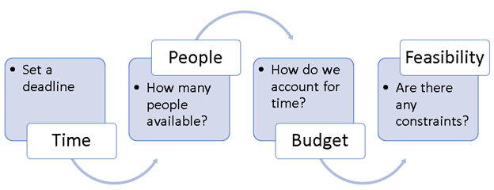

Having a project plan ensures that you have the correct resources (time, people, and funds) and that you follow a consistent approach to ensure an excellent level of quality for the apps that you make.

Having a clear objective for what you and your project team are trying to achieve is important so that your project team members share the same goals. Writing down your goals is a good way to clarify what you want the app to achieve. It also ensures that you don't lose focus on what you need to create and what features to prioritize. For more information, see [Prioritizing features and requests](/power-apps/guidance/planning/prioritizing-features/?azure-portal=true).

If you have ambitious goals, you might want to consider how to break down the project into incremental releases. A later section in this module discusses the incremental release methodology.

## Define the project scope

Make sure that you scope the project so that you know how much you'll try to achieve from the project. Keep a clear roadmap for what you define as complete and what's outside the scope of the project (and, possibly, what you want to have done in the next version). Your scope directly affects and determines which features to include and not to include when making the app.

To define the project scope, you should consider the following constraints.

> [!div class="mx-imgBorder"]
> 

- **Time** - Set a deadline for when you want to accomplish the project objectives. With smaller projects, this deadline might be a few weeks, whereas larger projects might take several months.

- **People** - Determine the number of people who are available for the project.

- **Budget** - If you need to account for time that's spent by you and your coworkers, or if you need to hire experts, you'll need to establish a budget.

- **Feasibility** - You might find that you're constrained by available expertise by lack of access to the data that you need or by the amount of change that your organization has a propensity for.

You should also consider what functional pieces you can deliver in usable chunks. It won't be helpful to anyone if your app only delivers halfway on several features; plan to deliver each component in a working form, end to end. Even if your app doesn't have every feature that you want yet, deliver something that people can use. Your project plan should specify what you'll deliver in each phase.

## Recommended content

For more information, see the following articles:

- [Prioritizing feature requests](/power-apps/guidance/planning/prioritizing-features/?azure-portal=true)

- [Identifying project team members](/power-apps/guidance/planning/identifying-project-members/?azure-portal=true)

- [Listing the project tasks and owners](/power-apps/guidance/planning/project-tasks-owners/?azure-portal=true)

- [Defining the project schedule](/power-apps/guidance/planning/defining-project-schedule/?azure-portal=true)

- [Identifying the risks](/power-apps/guidance/planning/identifying-risks/?azure-portal=true)

- [Gaining support and sponsorship from management](/power-apps/guidance/planning/gaining-support/?azure-portal=true)

## Example: Dive shop service department solution

In the following example, you'll help the dive shop service department develop a solution by going through the project plan, completing two releases, establishing more goals for release 1 of the solution, defining project scope, and then identifying the risks.

### Project plan

When you looked at the overall business goals for your solution, you decided to divide them into releases so that you could deliver value incrementally.

### Release 1

**Release 1** of your solution has the following goals:

- Immediately on solution availability, 100 percent of service requests will be created by using the digital system.

- Within two weeks of solution availability, the service team should be completing an average of 16 service orders each day.

### Release 2

**Release 2** of your solution has the following goals:

- Every customer should be able to register their products within your system.

- By the end of the year, department managers can access a weekly service report that's up to date for all service orders in the system.

- Customers will receive reminders to service their gear. These reminders are sent annually, 30 days before the anniversary of the prior service order completion on the gear.

### More goals for release 1 of the solution

Other goals that you have for **Release 1** of the solution include:

- User training should be minimal, and ease of use is paramount.

- The shop's general manager should be able to use service data to create marketing campaigns and sales promotions that target service customers.

## Project scope

While looking at your business process, you notice that it's divided into four main tasks:

1. Create a service order.

2. Approve the service order (to be completed in house or outsourced to a vendor).

3. Complete the service order.

4. Communicate with customers and schedule pickup.

## Identify the risks

You've created the following table for your expense report project.

| **Risk** | **Risk level** | **Plan to reduce risk** |
|----------|----------------|-------------------------|
| You can't confidently move old service order data into the system because the paper trail is incomplete. | Significant | Review invoice data to confirm service order completions. |
| External user access to entering data could lead to incorrect gear being associated with a customer and missed service and sales opportunities | Significant | Engage the sales team to help customers enter the correct information into the system at the time of purchase or service check-in. |
