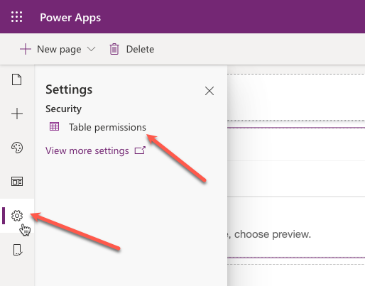
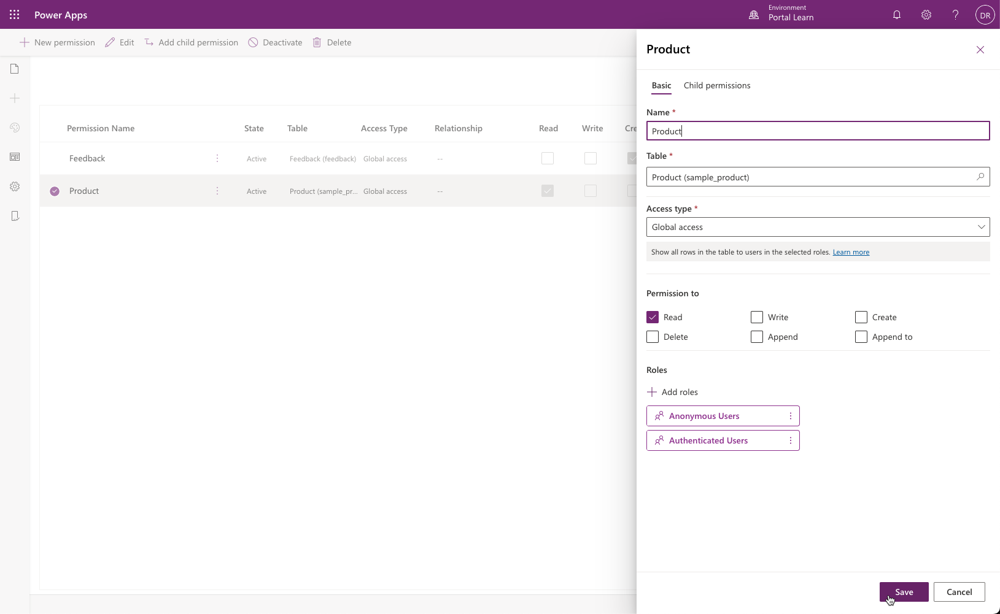
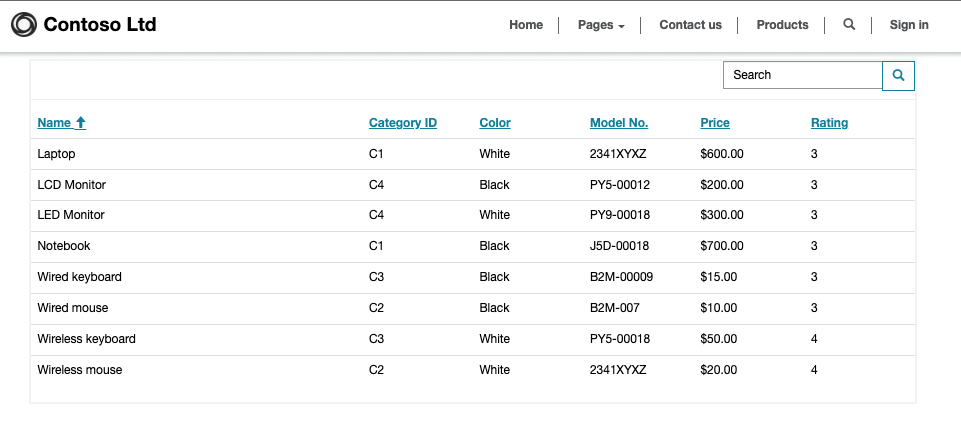
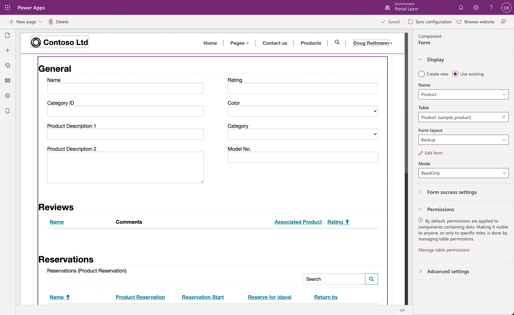

The purpose of this exercise is to provide you with hands-on experience in adding a list and a form to a Power Apps portal.

## Learning objectives

At the end of these exercises, you'll be able to:

- Add a list component to a portal page.
- Add a form component to a portal page.
- Configure the list component to drill down and view details of the row.

### Prerequisites

The following prerequisites are necessary for completing these exercises:

- Access to the Power Apps maker portal.
- Ideally, you'll have the default sample Microsoft Dataverse apps and data, but you can use other Dataverse tables.
- You'll need to have provisioned a Power Apps portal to complete the exercise. If you don't have a provisioned portal, go to [Create Portal](/power-apps/maker/portals/create-portal/?azure-portal=true) to create one.

> [!TIP]
> The exercises work best when you have sample data to work with. When you provision a Dataverse environment, you have the opportunity to add sample apps and data.  Review the [Create Environment](/power-platform/admin/create-environment.md?azure-portal=true#create-an-environment-with-a-database) steps to provision a Dataverse environment with sample apps and data.

## Scenario

Your organization has provisioned a Power Apps portal and wants to display a list of available products on a public webpage. The requirement is also to allow visitors to drill down and view other details.

## High-level steps

To finish the exercise, complete the following tasks:

- Create table permissions to allow read access to the Dataverse table.
- Create a webpage and add a list component that is linked to the Dataverse table.
- Create a child webpage with a basic form component to display details for the Dataverse table.
- Modify the list component to allow visitors to drill down and view the detail row on the form page.

### Create table permission row

Access to any Dataverse table is controlled by table permissions. To allow read-only access to the Products table:

1. Sign in to the [Power Apps maker portal](https://make.powerapps.com/?azure-portal=true).  

1. Locate your portal app, select the ellipsis (**...**), and then select **Edit** to open portals Studio.

1. Select **Settings** icon then select **Table permissions**.

   

1. Select **+ New permission** and fill in the following information:

   - **Name** - Product
   - **Table** - Product (sample_product)
   - **Access type** - Global
   - **Permission to** - Read

1. Select **Add roles** and add Anonymous Users and Authenticated Users.

1. Select **Save**.

   

1. Sample product form may contain a subgrid with product reviews. To avoid receiving "access denied" message for product reviews subgrid, repeat steps 4-6 and create Global Read table permission row for Review table. 

### Create a webpage for the list

To create a webpage containing the **Lists** component:

1. From the command bar, select **+ New page**, then select **Blank**.
1. In the Properties pane, fill in the following information:

	- **Name** - Products
	- **Partial URL** - products
	
1. Click in the canvas area to save the webpage.

### Add and configure a list component

To add and configure a list component, follow these steps:

1. On the canvas, select the **column** component, and then from the toolbelt, select **Components**.

1. In the **Portal components** section, select the **List** component.

1. In the Properties pane, enter the following values for the **List** component:

	- **Name** - Product List
	- **Table** - Product (sample_product) *or choose another table from your own app*
	- **Views** - Active Products

1. Select **Browse** from the command bar and ensure that you can see a list of product data rows from Dataverse.

### Create a webpage for the table form

Your next task is to create a webpage to contain the **Table Forms** component to view row details. This webpage will be a child page of the **Products** page.

1. From the toolbelt, select **Pages** and locate the **Products** page that you created previously.

1. Select the ellipsis (**...**) and then select **Add a subpage**.

1. In the Properties pane, fill in the following information:

	- **Name** - Product
	- **Partial URL** - product
	
1. Click in the canvas area to save the webpage.

### Add and configure a form component

To add and configure a form component, follow these steps:

1. On the canvas, select the column component, and then from the toolbelt, select **Components**.

1. In the **Portal components** section, select the **Form** component.

1. In the Properties pane, enter the following values for the **Form component**:

	- **Name** - Product
	- **Table** - Product (sample_product) *or choose another table from your own app*
	- **Form Layout** - Information or Backup (you can select **Edit** to modify your form or create your own form specifically for the portal)
	- **Mode** - ReadOnly

1. Click in the canvas area to save the webpage.

   

### Modify the list to navigate to the form component

Your last task is to modify the list page to navigate to the form component:

1. From the toolbelt, select **Pages** and locate the **Products** page that contains the list component.

1. Select the list component on the canvas.

1. In the Properties pane, activate the **View Details** option.

1. Fill in the following information: 

	- **Target Type** - Form
	- **Form** - Product

1. Click in the canvas area to save the webpage.

1. Select **Browse** from the command bar and ensure that you can see a list of product rows from Dataverse and then select a product to view details.

    > [!div class="mx-imgBorder"]
    > 