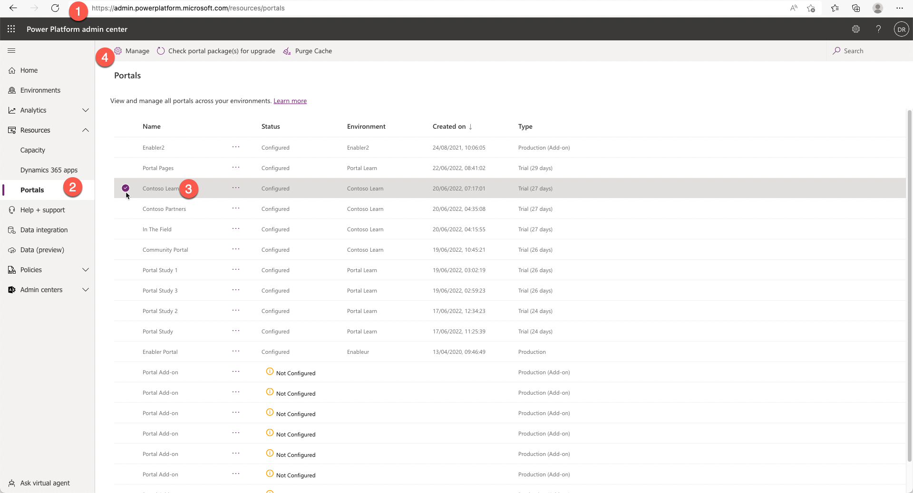
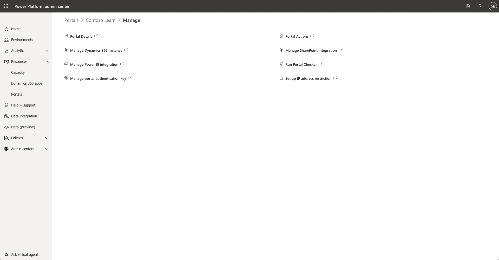
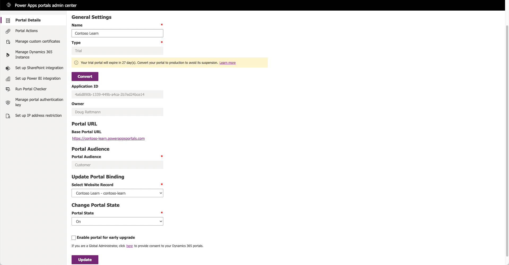
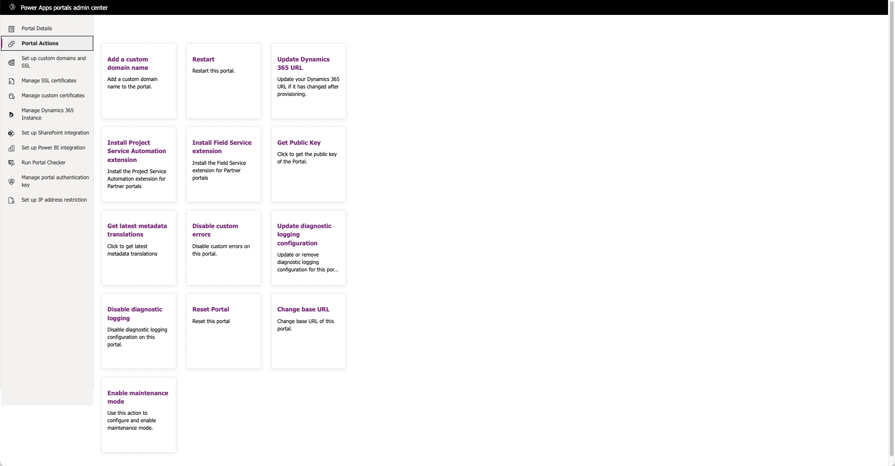

The Microsoft Power Apps portals admin center provides a series of functions for administration of a Power Apps portal.

To access the Power Apps portals admin center:

1. Sign in to the [Microsoft Power Platform admin center](https://admin.powerplatform.microsoft.com/?azure-portal=true).

1. In the left pane, expand **Resources** and then select **Portals**.

1. Select the target portal.

1. Select **Manage** at the top of the page. 

> [!div class="mx-imgBorder"]
> 

That will open a page with Power Apps portals admin shortcuts.

## Portal details

If you need to see more details about the provisioned portal, such as portal type, application ID, owner of the portal, and so on, you can select **Portal Details**. The user who has created the portal is the owner of the portal.

> [!div class="mx-imgBorder"]
> 

The **Portal Details** area allows makers to alter some key attributes of a Power Apps portal:

- Change or update the portal name. This option isn't visible to external portal visitors, but it helps identify the portal in the Portal Management app, Power Platform admin center, and Power Apps maker environment.

- All portals are provisioned as 30 days trials and a message is displayed in the admin center. An administrator can convert a trial portal to a production portal.

   > [!NOTE]
   > Some features, such as custom URLs, are not available for portals in **Trial** mode.

- The portal binding can be changed so that the portal web application will read a different set of metadata records (website record) from Microsoft Dataverse.

- The portal state can be turned off (or on). Portal visitors will receive an error when visiting the portal URL.

- The portal can be configured to allow early upgrades so that it receives updates from Microsoft earlier than regularly scheduled updates.

  > [!WARNING]
  > If a portal has been enabled for early upgrade, it might receive updates that have not gone through the full testing cycle. In rare instances, early upgrade could affect certain functionality of the portal.

## Portal actions

The **Portal Actions** section of the portals admin center allows an administrator to configure specific portal settings or perform actions against a configured portal. For more information, see [Power Apps portals admin center](/power-apps/maker/portals/admin/admin-overview/?azure-portal=true).

> [!div class="mx-imgBorder"]
> 

| Action | Details |
| ------ | ------- |
| Add a custom domain name | This action will go through the process to configure a vanity URL for the Power Apps portal such as `https://www.contoso.com` instead of the subdomain `https://contoso.powerappsportals.com`. This option is only available for production portals. |
| Restart | Restarting the portal will restart the portal web application, clearing the cache or potentially stuck processes. This action is the equivalent of restarting a web server and it might take a few minutes until the portal is available again. |
| Update Dynamics 365 URL | If the Dataverse (or Dynamics 365) environment URL has been modified, this action will realign the portal web application to point to this updated URL. |
| Install Project Service Automation extension | This process will load the solutions and metadata to extend the Partner portal with Project service extensions. This action will only be successful on portals that have been provisioned by using the Partner template and if the connected Dynamics 365 environment has the Project Service Automation solution installed. |
| Install Field Service extension | This process will load the solutions and metadata to extend the Partner portal with Field Service extensions. This action will only be successful on portals that have been provisioned by using the Partner portal template and if the connected Dynamics 365 environment has the Field Service solution installed. |
| Get Public Key | A portal public key is used by the pro developers when implementing external APIs to extend the portal. The key is required to validate security context of the requests coming from the portal client-side script. |
| Get latest metadata translations | For multilingual portals, it's important to have the latest translated labels. This action will prompt an admin to update the portal solutions if updates are available. That will update the various portal template labels in the provisioned portal languages. |
| Disable custom errors | While you're troubleshooting issues on a portal, disabling the custom errors will show more details about a particular issue instead of a generic user-friendly error message. |
| Enable diagnostic logging | This action will allow an administrator to specify a Microsoft Azure Blob Storage connection string and a retention period where portal logs will be stored.  If issues occur with a portal, these logs can be examined to determine the root cause of a particular issue. |
| Reset Portal | This action will delete all hosted resources that are associated with the portal. When the reset operation has finished, your portal URL will no longer be accessible, and you can provision the portal again. The reset won't reinstall the portal solutions or delete the portal metadata. Later you can provision another portal using the sale metadata. |
| Change base URL | This action will allow an administrator to change the base URL (`something.powerappsportals.com`). The URL will need to be unique, and portal visitors will no longer be able to access the portal by using the old URL. If you have a custom URL, you'll also need to update the CNAME records in your DNS settings. |
| Enable maintenance mode | In instances where an administrator needs to change a portal or update Dataverse, the portal can be put into maintenance mode where visitors will instead see a message that the portal is in maintenance mode or they'll be redirected to a custom page. |

## Set up custom domains and SSL

The **Set up custom domains and SSL** feature will show any existing host name and associated SSL Bindings for custom URLs that are configured for the portal.

> [!div class="mx-imgBorder"]
> 

## Manage SSL certificates

The **Manage SSL certificates** section will show a listing of all uploaded SSL certificates and when they'll expire. You can upload more certificates in this section, as required.

## Manage custom certificates

When portal functionality is extended with a client-side script calling custom API, SSL certificates for the custom API domains can be uploaded in this section.

## Manage Dynamics 365 Instance

The **Manage Dynamics 365 Instance** section allows you to deploy portal solutions and metadata on another Dataverse or Dynamics 365 environment and point the current portal to that environment. Changing the Dynamics 365 instance won't delete the portal configuration or solution from the existing environment, or copy your portal configuration from the existing environment. It will deploy the default portal configuration on the new environment.

> [!IMPORTANT]
> When changing the Dynamics 365 instance for your portal, ensure that the new environment is from the same region as the current environment. Changing the environment for Power Apps portals across regions isn't supported.

## Set up SharePoint integration

The **Set up SharePoint integration** section provides you with the ability to activate the SharePoint integration so that SharePoint document libraries that are integrated with Dataverse and Dynamics 365 can be shown on a form.

## Set up Power BI integration

The **Set up Power BI integration** section allows administrators to enable the Power BI visualization and Power BI Embedded service on portal pages.

## Run Portal Checker

Portal Checker is a self-service diagnostic tool that can be used by portal administrators to identify common issues in their portals. Portal Checker helps to identify issues with a portal by looking at various configuration parameters and providing suggestions on how to fix them.

> [!div class="mx-imgBorder"]
> 

The Portal Checker feature examines various configuration aspects of the portal and displays warning details and recommended steps to improve portal functionality and performance.

## Manage portal authentication key

When a portal is created, a new authentication key is generated with the public key uploaded to Azure Active Directory application. Portals uses this authentication key to connect to the Dataverse environment. You must renew the key every two years to ensure that your portal can connect to Dataverse environment.

## Set up IP address restriction

An administrator might want to restrict access to a portal to only a development/testing team or to specific geographic areas. The administrator can specify a list of specific IP4 or IP6 addresses or ranges from which the portal can be assessed. By default, if no IP addresses are specified, the portal will be accessible from anywhere. For more information, see [Restrict portal access by IP address](/power-apps/maker/portals/admin/ip-address-restrict/?azure-portal=true).
