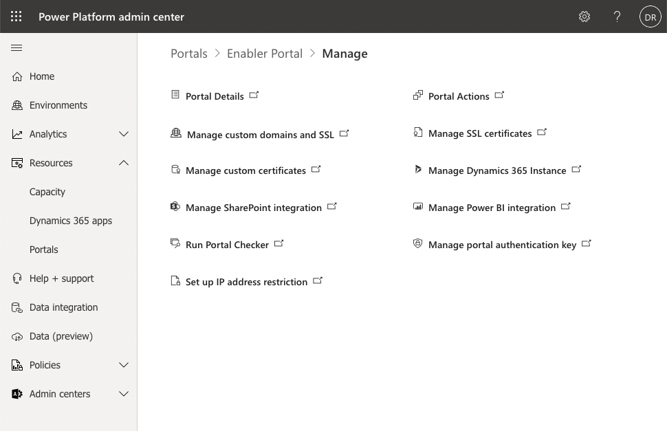
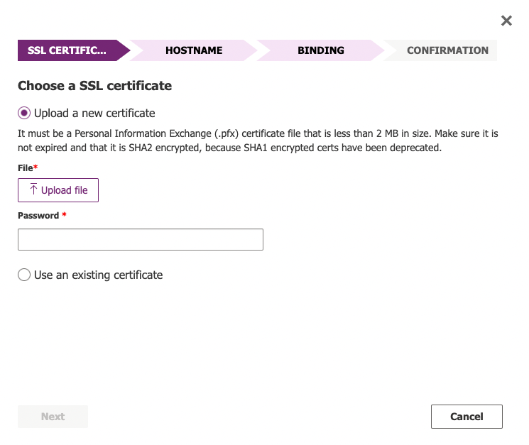
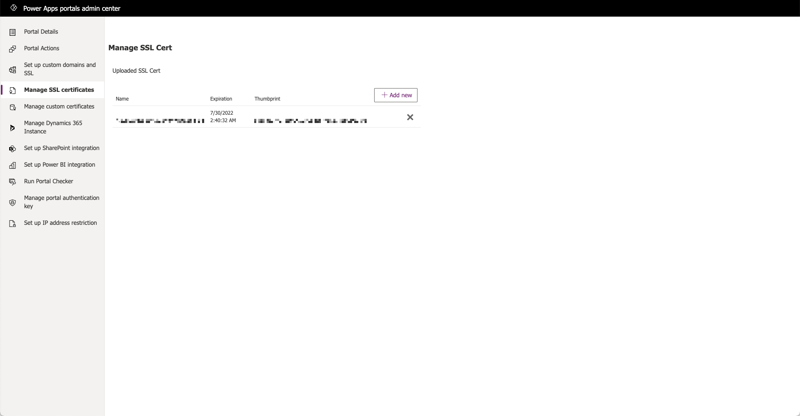
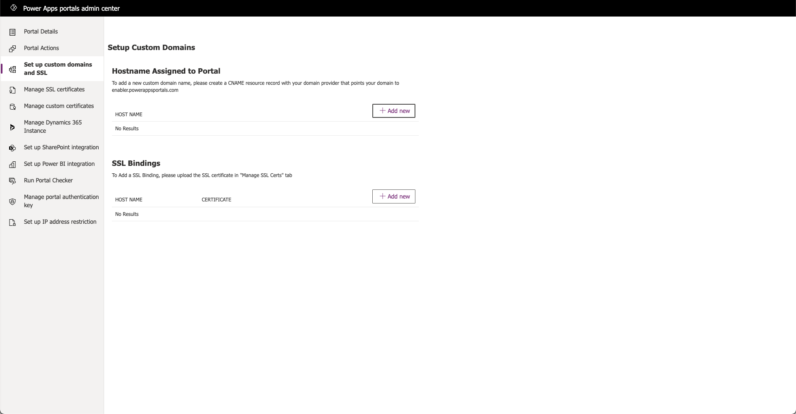
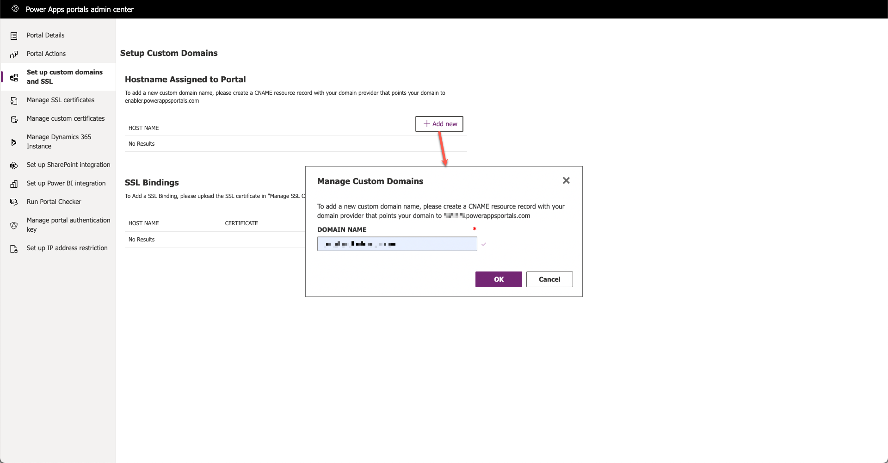
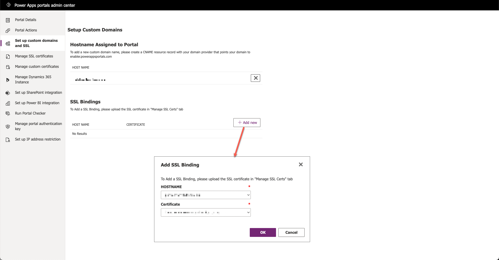

When a portal is provisioned, it will have a portal URL that is a subdomain of `powerappsportals.com`, for example, `contoso.powerappsportals.com`. A common task for a portal administrator is to configure a custom URL for a Power Apps portal to reflect the domain naming conventions of an organization such as `https://www.contoso.com`.  

> [!NOTE]
> You can have only one custom URL for each portal.

The following sections describe how to add a custom URL to a Power Apps portal.

## Prerequisites

* The organization needs to have a valid SSL certificate for the domain. The SSL certificate must be in PFX format, signed by a trusted certificate authority, and meet many other security requirements (see [Add SSL certificates](/power-apps/maker/portals/admin/manage-ssl-certificates?azure-portal=true#ssl-certificate-requirements) for the full requirements list).
* The domain name needs to have a CNAME record set up in DNS pointing to the `contoso.powerappsportals.com` domain that was configured during the portal provisioning process.
* The portal must be in **Production** mode (that is, not **Trial** or **Suspended**) when you're adding a custom domain.

To configure a custom domain name first open Power Apps portals admin shortcuts page.

1. Sign in to the [Microsoft Power Platform admin center](https://admin.powerplatform.microsoft.com/?azure-portal=true).

1. In the left pane, expand **Resources** and then select **Portals**.

1. Select the target portal.

1. Select **Manage** at the top of the page.

1. That will open Power Apps portals admin shortcuts page.

## Custom domain name wizard

To configure a custom domain name using a wizard.

1. On the Power Apps portals admin shortcuts page, select **Portal Actions**. That will open Power Apps portals admin center with the **Portal Actions** page selected.

1. Select **Add a Custom Domain Name**. A wizard opens to walk you through the steps required to define custom domain.

## Manual installation

Certificates and custom domain name can be set up and maintained independently.

### Manage SSL certificates

1. On the Power Apps portals admin shortcuts page, select **Manage SSL certificates** shortcut. That will open Power Apps portals admin center with the **Manage SSL certificates** page selected.

1. Select **Add new** to upload new certificate. 

You can use this page to upload a renewed certificate before the existing one expires. That allows for the certificate to be switched over without any portal downtime.

### Set up custom domain name and SSL

1. On the Power Apps portals admin shortcuts page, select **Set up custom domain name and SSL**. That will open Power Apps portals admin center with **Set up custom domain name and SSL** page selected.

	

1. Select **Add new** in the **HOST NAME** section to add new custom domain name.

1. Enter the domain name and press TAB. Domain name will be validated.

1. Select OK to add custom domain.

    

1. Select **Add new** in the **SSL Bindings** section.

1. Select **HOSTNAME** then select **Certificate**.

1. Press OK to create new binding.

    

Visitors should now be able to browse to the portal by using the custom domain name.

> [!NOTE]
> If you want to change your existing custom domain name, upload a new SSL certificate and follow the preceding steps.

> [!VIDEO https://www.microsoft.com/videoplayer/embed/RE4AwWW]

For more information, see [Add a custom domain](/power-apps/maker/portals/admin/add-custom-domain/?azure-portal=true).
