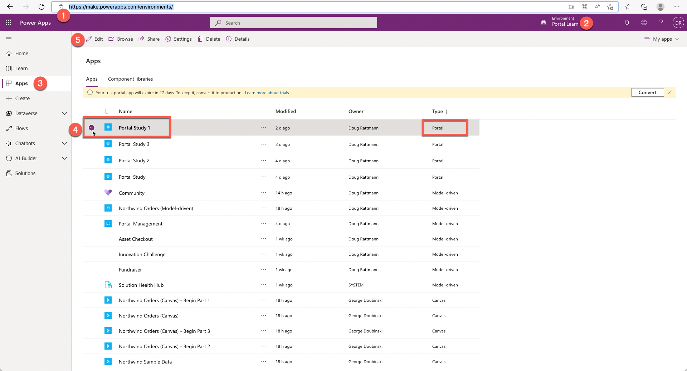
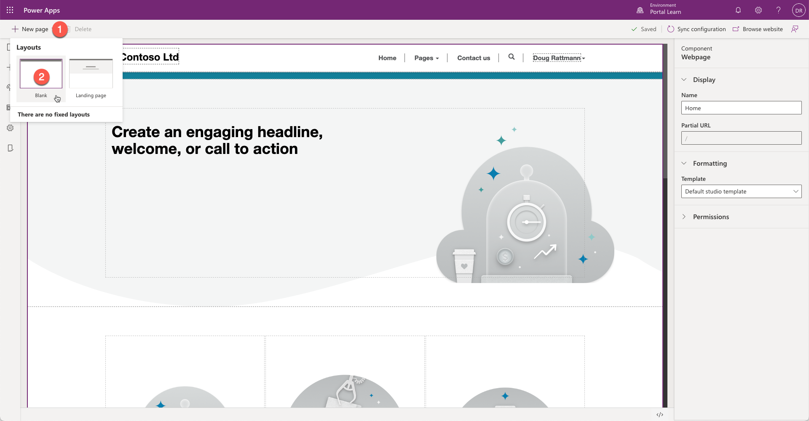
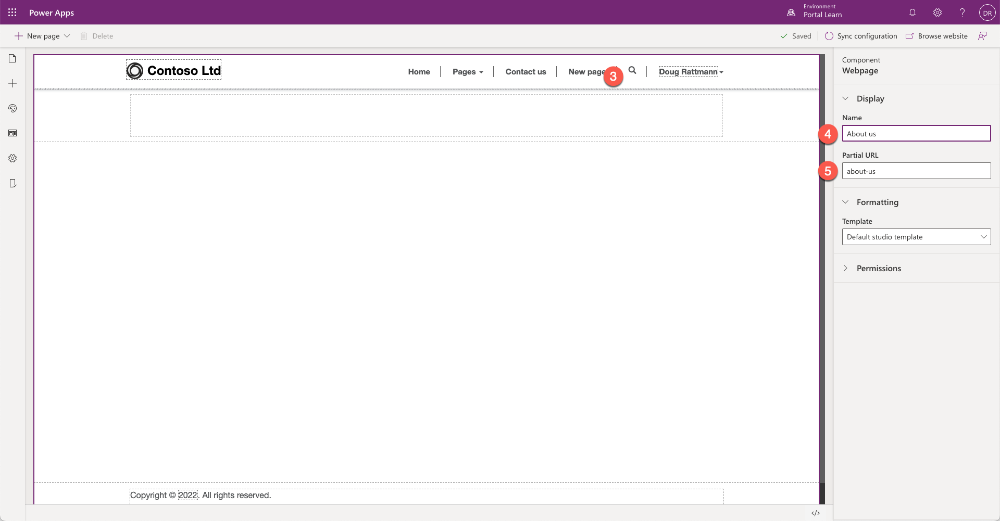
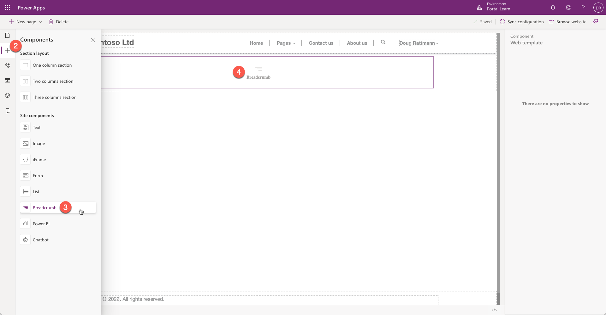
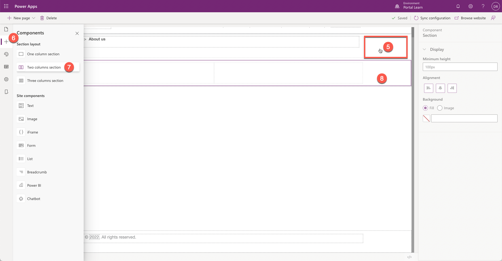
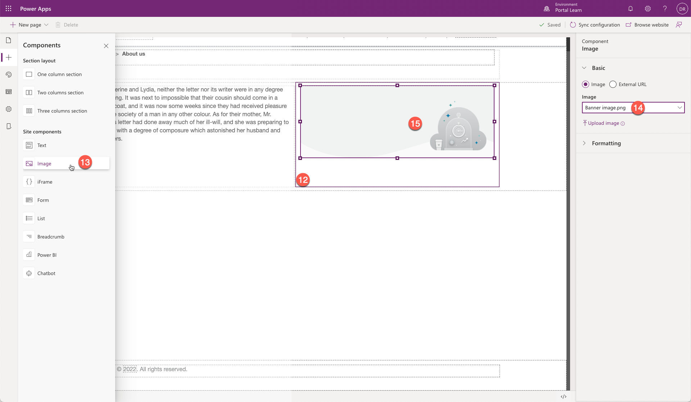

The purpose of this exercise is to create a webpage by using the Power Apps portals Studio.

At the end of these exercises, you'll be able to:

- Open the portals Studio to edit your portal.
- Create a new webpage by using existing page templates.
- Add content to your webpage.

For this exercise, you'll need to have the following parameters set in your environment:

- A provisioned Power Apps portal. If you don't have a Power Apps portal available, follow the [Create Portal](/power-apps/maker/portals/create-portal/?azure-portal=true) instructions to create one.
- Access to the Power Apps maker portal.

## Scenario

Creating and editing a portal webpage is a simple process and allows you to quickly build a Power Apps portal application. In this exercise, you need to complete the following tasks:

- Open your portal in Power Apps portals Studio.

- Create a new webpage.

- Add breadcrumbs.

- Add a component with two sections. 

- Configure one section to display text. 

- Configure another section to display an existing portal image.

### Launch portals Studio

To launch portals Studio, follow these steps:

1. Sign in to [Power Apps](https://make.powerapps.com/?azure-portal=true).

1. Select a target environment by using the environment selector in the upper-right corner.

1. On the left menu, select **Apps**.

1.  Select your portal app (Type = Portal).

1. Select **Edit**, which will launch the portals Studio.

### Create a new webpage

To create a new webpage, follow these steps:

1. From the command bar, select **New page**.

1. Select **Blank** layout, which will use default studio template.

   

1. A new webpage will appear with the name *New page*. The navigation menu will now include *New page* item.

1. In the properties pane, enter **About us** as the new name, press the **Tab** key, and the webpage will AutoSave.

1. In the properties pane, enter **about-us** as the new partial URL, press the **Tab** key, the webpage will AutoSave, and the navigation menu item will say *About us*.

   

### Add static content

To add static content, follow these steps:

1. On the canvas, select the blank column in the first section.

    

1. On the toolbelt, select **Components** (plus icon).

1. In the **Site components** area, select **Breadcrumb**.

1. The column content will now display **Breadcrumbs** component.

   

   > [!NOTE]
   > As you navigate around, and the page content refreshes, the breadcrumb component will change to display live content and will now say **<u>Home</u> > About us**.
 
1. Select the first section by clicking outside the column content.

1. On the toolbelt, select **Components** (plus icon).

1. Select **Two columns section**.

1. A new two-column section will be added to the webpage canvas.

   

1. On the canvas, select the left column section.

1. On the toolbelt, select **Components** and then select **Text** from the **Site components** section.

1. On the canvas, select the text component and add some text to it.

   

1. On the canvas, select the right column section.

1. On the tool belt, select **Components** and then select **Image** from the **Site components** section.

1. On the properties pane, from the drop-down list, select any image available.

1. The image will appear on the webpage canvas.

   

### View the webpage

To view your new webpage, from the command bar, select **Browse website**. 

You should now see your new webpage on the portal. A link to your webpage is also on the main menu.

> [!div class="mx-imgBorder"]
> 