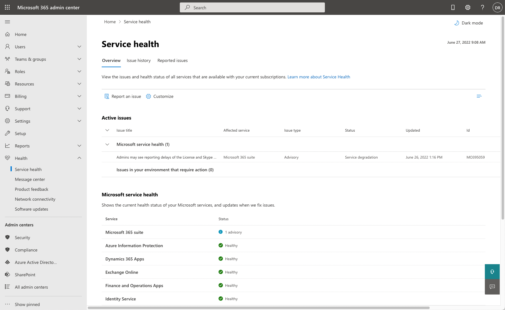

A Microsoft Power Apps portal is an external-facing application that is often open to an external audience. It's critical that the portal is accessible and operational because it reflects the image of an organization.

## Roles

A user doesn't have to be a Global Administrator to perform administrative tasks. Different administrative tasks in Power Apps portals can be performed by members of different roles. The admin and security roles required to do these tasks vary depending on the impact area.

Most of the tasks can be performed by the Portal Owner or a user with the System Customizer role. Some tasks might require the user to be a member of admin roles in [Microsoft 365](/microsoft-365/admin/add-users/about-admin-roles?preserve-view=true&view=o365-worldwide&azure-portal=true), and others might need a membership to security roles in the [Microsoft Power Platform environment](/power-platform/admin/database-security/?azure-portal=true) or other permissions in Azure Active Directory.

For more information about the security requirements for Power Apps portals management and administration, see [Roles required for portal administration](/power-apps/maker/portals/admin/portal-admin-roles/?azure-portal=true).

## Portal site issues

If a portal is inaccessible, an administrator can investigate numerous possibilities:

- Whether the portal has been enabled or not
- If other Microsoft Dataverse apps are accessible
- Issues that might have occurred with the infrastructure services that portals depend on such as Microsoft Azure Active Directory (Azure AD) or Azure App Service
- If advisories exist in the [Service health - Microsoft 365 admin center](https://admin.microsoft.com/adminportal/home?#/servicehealth).

> [!div class="mx-imgBorder"]
> 

An administrator should also investigate whether some of the portal metadata has been recently modified, such as the website or website binding rows, which also might affect portal functionality.

Running the **Portal Checker** might also identify potential issues with the site.

## Portal page and functionality issues

Occasionally, a portal administrator might be faced with having to resolve errors with specific portal pages or functions.

Power Apps portals have several tools that will allow an administrator to quickly identify and resolve issues without needing to contact Microsoft support.

### Disable custom errors

A typical error might begin when a portal visitor reports an issue when visiting a portal page. Often, the error message is brief and doesn't describe the underlying issue.

In the Power Apps Portals admin center, the **Disable custom errors** action will replace the notification with detailed error information on the portal page that could provide additional information for an administrator to troubleshoot the issue.

> [!div class="mx-imgBorder"]
> 

> [!NOTE]
> Disabling custom errors should be a temporary setting because the detailed error message might convey an increased negative experience for portal visitors. We recommend that you only disable custom errors when you are in the development phase and enable custom errors after you go live.

Another option is to personalize the error message by adding a content snippet called **Portal Generic Error** that contains an appropriate message for portal users. For more information, see [Display a custom error message](/power-apps/maker/portals/admin/view-portal-error-log?azure-portal=true#display-a-custom-error-message).

### Diagnostic logging

Along with visual errors on portal pages, potential underlying issues could occur that aren't as obvious to isolate and troubleshoot. Power Apps portals can be configured to log diagnostic information. The diagnostic logs will be stored in Azure Blob storage in a container named **telemetry-logs**. The administrator can configure the retention period of how long to keep the logs.

> [!div class="mx-imgBorder"]
> 

The logs can provide information on patterns, duration, and frequency of specific portal errors to help resolving potential errors and issues. For more information, see [Access portal error logs](/power-apps/maker/portals/admin/view-portal-error-log?azure-portal=true#access-portal-error-logs). 

## Additional troubleshooting steps

Because the portal might extend certain functionality of a model-driven app, one technique to eliminate potential portal errors is to attempt the same operation in the model-driven app. For example, if an error is generated when a record is added through the portal, try adding or updating the same data record that a portal user is attempting to create or update on a portal. After the error has been resolved in the model-driven app, it's often resolved on the portal.

Creating the `Site/EnableCustomPluginError` site setting and then setting the value to **True** will display the contents of the plug-in error on a portal page rather than the generic error message.

For more information, see [View portal error logs](/power-apps/maker/portals/admin/view-portal-error-log/?azure-portal=true).
