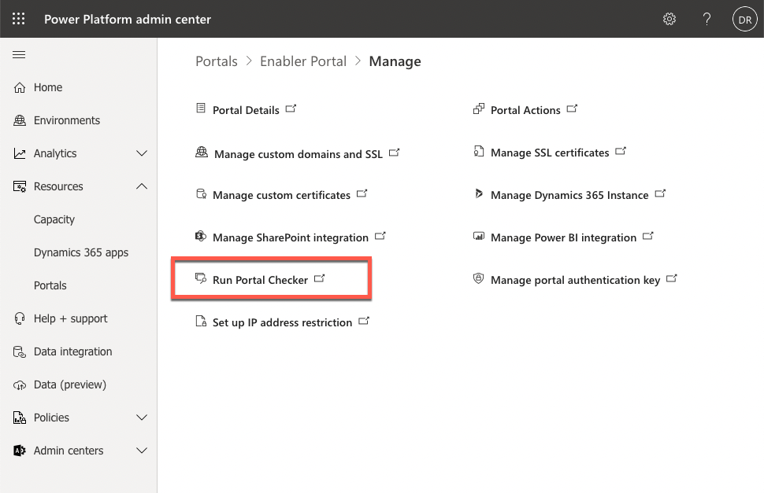
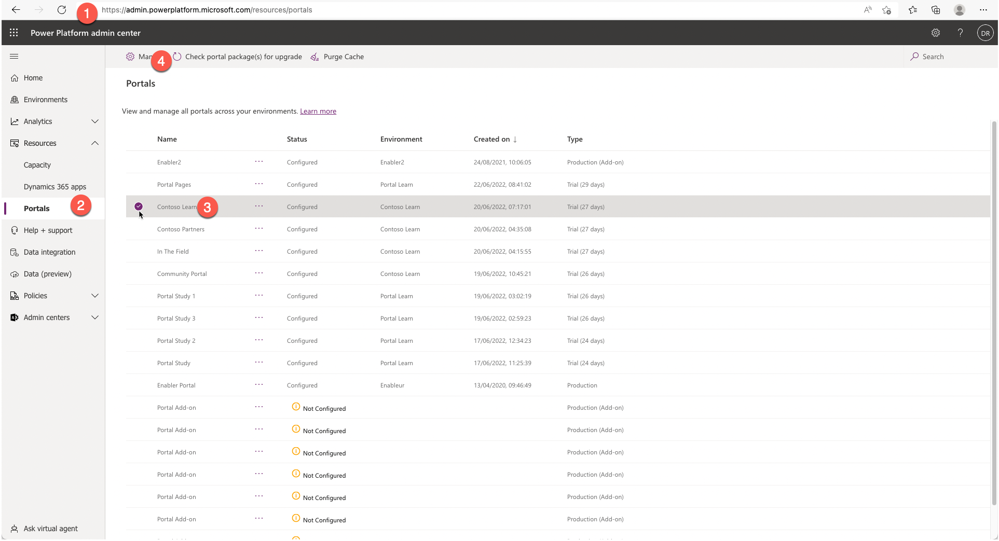
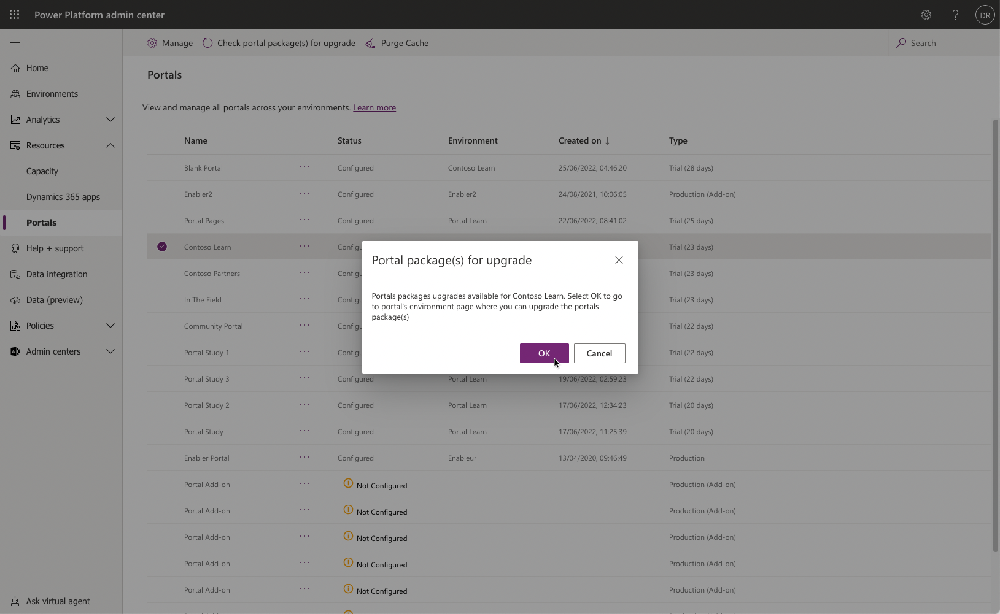
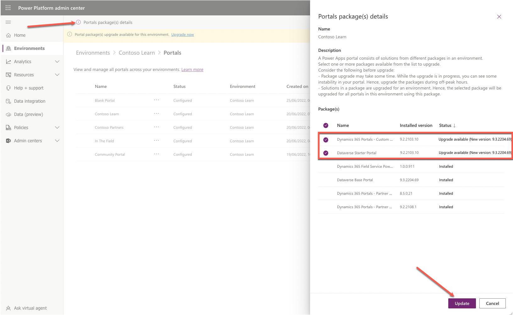

An administrator's role goes beyond ensuring that a Power Apps portal is running correctly yet also configured to run efficiently and quickly. Numerous tools are available to help administrators check the settings and status of a Power Apps portal and provide users with clear messaging if the portal is undergoing maintenance.

## Portal Checker

The **Portal Checker** feature is available in the Power Apps Portals admin center and will run diagnostic checks to protect and advise against common issues that might be encountered when operating a portal.

To run the Portal Checker, follow these steps:

1. Sign in to the [Microsoft Power Platform admin center](https://admin.powerplatform.microsoft.com/?azure-portal=true).
1. In the left pane, expand **Resources** and then select **Portals**.
1. Select the target portal.
1. Select **Manage** at the top of the page. 
1. Select **Run Portal Checker** link on the Power Platform portals admin shortcuts page.
   
1. On the Power Apps Portals admin center, select **Run Portal Checker** button. After a few minutes, you should see a list of diagnostic results.
   > [!div class="mx-imgBorder"]
   > 

The result will also provide mitigation steps or links to help you understand the impact of the issue.

For more information, see [Portal Checker](/power-apps/maker/portals/admin/portal-checker/?azure-portal=true).

## Enable maintenance mode

As an administrator, you might have occasions when you don't want portal users to visit or sign in to the Power Apps portal. The reason could be because you might be migrating or updating a series of portal webpages and functionality or uploading a large dataset that you don't want to be available on the portal until the load process is complete.

While you can change the portal state to **Off**, selecting this option would present the portal visitors with a message that the portal can't be found, leaving the visitors wondering what has happened.

> [!div class="mx-imgBorder"]
> 

Within the Portals admin center actions are the option to enable the **Portal Maintenance** mode. Selecting this mode will provide the portal visitors with a more informational page indicating that the portal is temporarily unavailable.

> [!div class="mx-imgBorder"]
> 

The maintenance mode page can also be replaced with a custom HTML page that is hosted elsewhere and publicly accessible. For more information, see [Enable maintenance mode](/power-apps/maker/portals/admin/enable-maintenance-mode?azure-portal=true#enable-maintenance-mode).

## Portal upgrades

A benefit of software as a service (SaaS) applications is that many of the software components are updated automatically and regularly. Several Power Apps portals components, such as the Azure app services and the various tools, are updated automatically.  

An administrator can also opt to receive early updates in the Power Apps portals admin center.

> [!CAUTION]
> You should opt for early updates in development or testing portals only, which will ensure that your production portal remains operational in the unlikely event that an early update might cause issues with your portal application.

While underlying infrastructure is maintained automatically, portal solutions aren't automatically updated. An administrator might be advised of the available solution updates from the Microsoft 365 message center.

A Power Apps portal consists of solutions from different packages in an environment. You can use the Power Platform admin center to view the details and update the installed packages.

> [!IMPORTANT]
> Solutions in a package are upgraded for an environment. Hence, the selected package will be upgraded for all portals in the environment using the package.

To check and update portal package(s) in an environment:

1. Sign in to the [Microsoft Power Platform admin center](https://admin.powerplatform.microsoft.com/?azure-portal=true).

1. In the left pane, expand **Resources** and then select **Portals**.

1. Select the target portal.

1. Select **Check portal package(s) for upgrade** at the top of the page.

   >  [!div class="mx-imgBorder"]
   >  

1. If upgrades are available, you'll be prompted to navigate to the upgrade page. Select **OK** to open the environment portal page.

   > [!div class="mx-imgBorder"]
   > 

1. On the environment portals page select **Portals package(s) details**.

1. Select packages with the updates available and then select **Update**.

   > [!div class="mx-imgBorder"]
   > 

> [!IMPORTANT]
> Updating packages might take some time. It's recommended to update the portal solutions during an appropriate maintenance window to avoid any possible performance degradation and portal instability.
