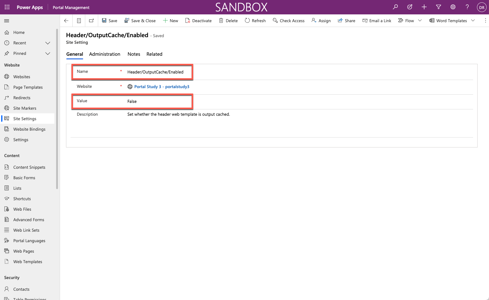
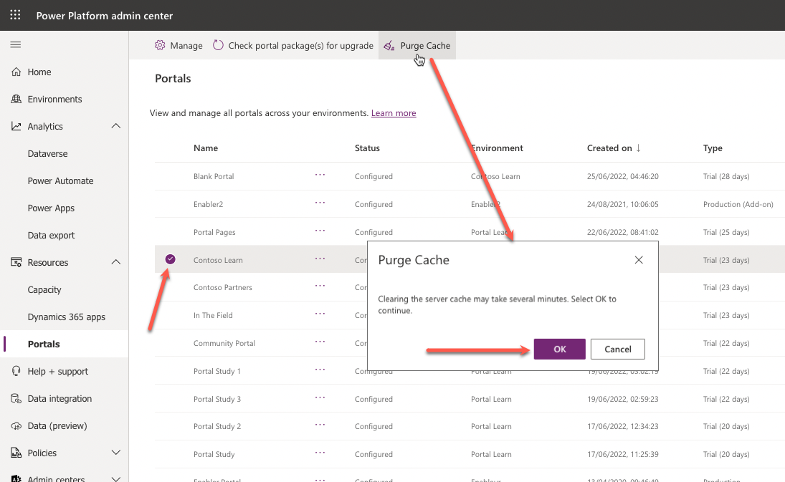
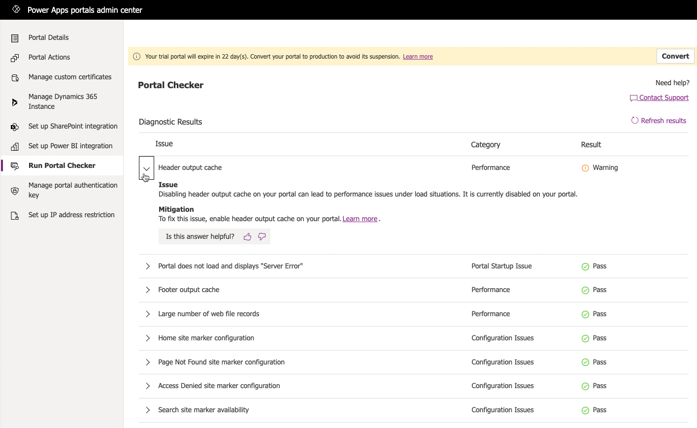
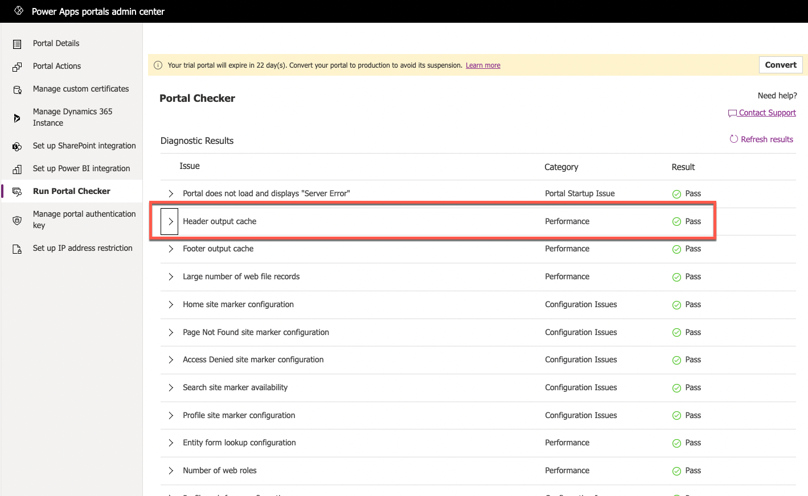

The purpose of this hands-on lab is to see how the Portal Checker can identify potential portal issues.

## Learning objectives

At the end of these exercises, you'll be able to:

- Run the Portal Checker.
- Respond to the mitigation advice.
- Rerun the Portal Checker to confirm that the issue has been addressed.

**Estimated time to complete this exercise**: 10 to 15 minutes

### Prerequisites

For this exercise, you need to have the following setup in your environment:

- A Power Apps portal that is provisioned. If you don't have a Power Apps portal available, follow the [Create Portal](/power-apps/maker/portals/create-portal/?azure-portal=true) instructions to create one.
- Access to the Power Apps maker portal.
- Access to Power Apps Portals admin center.

## High-level steps

In this exercise, you'll make a few changes to the settings in your portal metadata. Next, you'll run the Portal Checker tool from the Power Apps portals admin center and then evaluate the results. After you've addressed the issue, you'll rerun the Portal Checker to ensure that the issue has been resolved.

The high-level steps are as follows:

1. Locate the `Header/OutputCache/Enabled` site setting and update the value to **False**.

1. Purge the portal cache.

1. Run the Portal Checker.

1. Note the warning message for the header output cache.

1. Locate the `Header/OutputCache/Enabled` site setting and update the value to **True**.

1. Purge the portal cache.

1. Run the Portal Checker.

1. Note the warning for Header Output cache has been cleared.

## Detailed instructions

### Disable header output cache

1. Sign in to the [Power Apps maker portal](https://make.powerapps.com/?azure-portal=true).

1. Make sure that the correct environment is selected in the environment selector in the upper-right corner.

1. From the **Apps** list, select the **Portal Management** app to open the app in a new window.

1. Select **Site Settings**.

1. Locate the `Header/OutputCache/Enabled` site setting.

   > [!TIP]
   > Use search functionality and look for **header** to quickly locate the row.

1. Update the value to **False**, and then select **Save**.

   

1. Leave the **Portal Management** app open.

### Clear portal cache

1. In a new window or tab sign-in to the [Microsoft Power Platform admin center](https://admin.powerplatform.microsoft.com/?azure-portal=true).

1. In the left pane, expand **Resources** and then select **Portals**.

1. Select the target portal.

1. Select **Purge Cache** on the command bar.

1. Select **OK** when prompted.

   

1. Wait for the operation to complete.

### Run Portal Checker

1. Select **Manage** on the command bar then select **Run Portal Checker** shortcut.

1. The Power Apps portals admin center will open with **Run Portal Checker** option preselected.

1. On the screen, select the **Run Portal Checker** button.

1. The header output cache has a warning. Expand the message to get more details.

  > [!div class="mx-imgBorder"]
  > 

### Enable header output cache

1. Return to the **Portal Management** app.

1. Update the `Header/OutputCache/Enabled` site setting to **True**, and then select **Save**.

### Check the issue resolution

1. Repeat the steps above to clear the portal cache.

1. Repeat the steps above to run **Portal Checker**.

1. Verify that the header output cache issue has been resolved.

> [!div class="mx-imgBorder"]
> 
