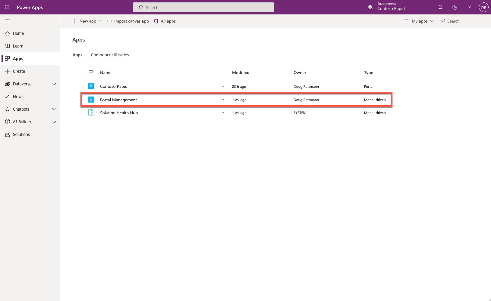
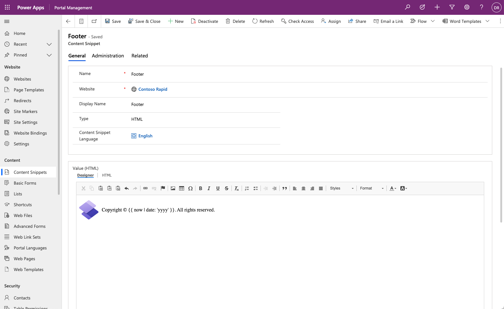

The Microsoft Power Apps portals Studio provides a maker with a tool to update static content and also add pages, components, and themes to a Power Apps portal. However, many aspects of a portal project cannot be added or edited by using the Power Apps portals Studio alone.

When the first Power Apps portal is provisioned in a Microsoft Dataverse environment, one of the assets installed is the Portal Management model-driven app.

> [!div class="mx-imgBorder"]
> 

## Launch the Portal Management app

You will have access to the Portal Management app after you have a portal provisioned in your Dataverse or Dynamics 365 environment. To access the Portal Management app:

1. Sign in to [Power Apps](https://make.powerapps.com/?azure-portal=true).

1. Select a target environment that has a portal provisioned by using the environment selector in the upper-right corner.

1. On the left menu, select **Apps**.

1. From the **Apps** list, locate the **Portal Management** app (the app Type will be Model-driven).

1. Select the app name to open it.

This process will launch the Portal Management app and will allow makers to access all metadata and data that define the portal content and behavior.

## App overview

The Portal Management app allows makers to perform advanced configuration actions on the portal by providing direct access to the portal metadata rows that define the appearance, language, security, and functionality of a portal.

The Portal Management app consists of standard model-driven views and forms in which to add and update metadata. Some of the forms will have specialized controls, such as HTML editors, to allow deeper customization of portal content.

> [!div class="mx-imgBorder"]
> 

The Portal Management app contains the following areas:

- **Website** - Control various operational aspects of the portal, such as site and portal settings, page templates, temporary and permanent redirects within the site, and others.

- **Content** - Access static content that appears on the portal, navigation, and rows that control portal access to Dataverse data.

- **Security** - Define security assets such as web roles and table permissions.

- **Ads** - Create text or image-based ads and have them run in multiple placements throughout your site.

- **Polls** - Ask your audience about specific topics, collect and aggregate their responses, and see immediate feedback from their vote.

- **Administration** - Access miscellaneous portal features like integration with traffic analyzers and search engines.

For more information about how to use the Portal Management app, see [Configure portals using Portal Management app](/power-apps/maker/portals/configure/configure-portal/?azure-portal=true).
