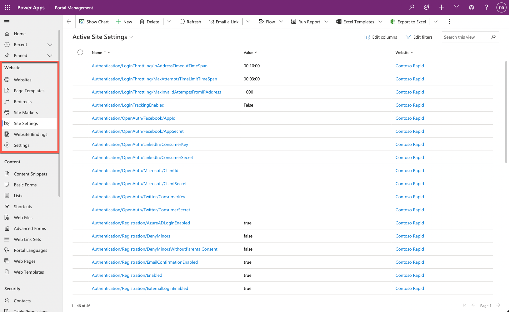
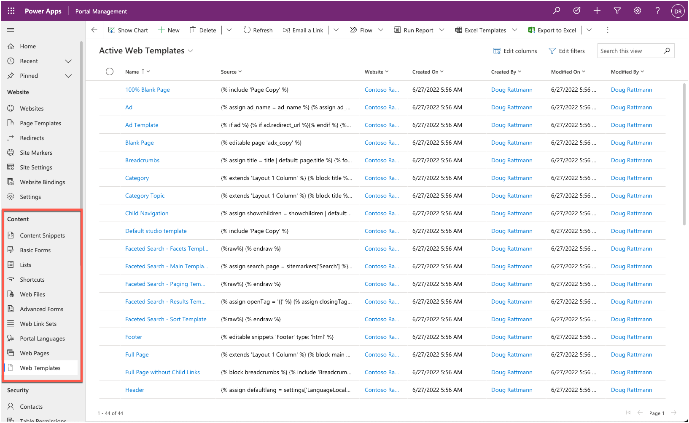
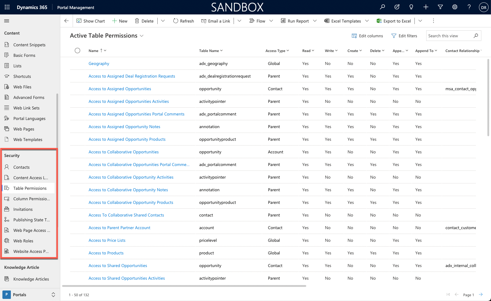

Makers need to understand portal metadata and where it's used to effectively configure a Power Apps portal. While some of the portal configuration and metadata can be created and edited directly on the Power Apps portals Studio or by using other tools, rows in many of the portal metadata tables can only be added or modified by using the Portal Management app.

The following section explains the purpose of the different portal metadata tables.

## Website

The **Website** portal metadata section defines properties that control the behavior of the portals that are provisioned on the particular Microsoft Dataverse environment.

> [!div class="mx-imgBorder"]
> 

| Metadata | Purpose |
| --- | --- |
| Websites | Each provisioned portal will have one website row that is the main parent table for all website portal metadata. The website row will define the default header and footer templates and the languages. We do not recommend that you create a website and related rows manually. Instead, let the system create the metadata through the provisioning or import process. |
| Page Templates | A page template is a row that will be used by a webpage row to point to a fixed page template on the portal host application or to a web template row. After a page template row has been created, it will appear as an option on the Power Apps portals Studio when you are creating new webpages. |
| Redirects | A redirect row is meant to be either a temporary or a permanent redirect for a specific URL. Redirects can be used to create a simple URL that redirects to a page deeper in the site or for a legacy URL to automatically redirect to a new page on the site. These redirect URLs are managed separately from the page content so that they do not have to fit directly in the web hierarchy. |
| Site Markers | A site marker is a pointer to a specific webpage row. The site marker can be referenced in a Liquid tag on a content snippet, web template, or in webpage content. This feature allows makers to avoid having to hard code-specific URLs on portal pages or content. |
| Site Settings | Site settings define specific behaviors of portal functionality and features. Site settings are value pairs that can enable or disable particular items such as authentication settings, searching, and caching. |
| Website Bindings | Website bindings link the particular website to the Azure portal web application. Manual maintenance of Website bindings is not required as these are automatically managed when a new portal is provisioned or when you change portal settings in Power Apps Portal admin center. |
| Settings | Similar to Site settings, the Settings table contains value pairs that are common to all portals that are provisioned for the particular environment as opposed to a specific portal. |

## Content

The **Content** section contains the tables that define what and how static and dynamic information is displayed on a Power Apps portal. While some of the content can be added by using the Power Apps portals Studio, certain aspects can only be added or modified by updating the data directly with the Portal Management app.

> [!div class="mx-imgBorder"]
> 

| Metadata | Purpose |
| --- | --- |
| Content Snippets | Content snippets are typically short, reusable content items that can appear on various parts of a portal. An example of a content snippet would be the footer content that would be displayed on most portal webpages. A content snippet can contain text, Liquid code, HTML, and CSS. Typically, a content snippet row would be replicated for each provisioned portal language. |
| Basic Forms | Basic forms use model-driven form definitions to display forms in the portal and enable access to Dataverse rows for portal visitors. A basic form can be configured to display read-only, edit, or create forms. |
| Lists | Lists use model-driven view definitions to display lists of Dataverse rows. A list can be configured to allow navigation to a selected row or to run workflows. A maker can also enable advanced search and filter capabilities. |
| Shortcuts | A shortcut row allows a portal maker to make a direct link on a webpage to another webpage, web file, or even an external URL, regardless of the hierarchy or site map of the portal. By default, the shortcut link will appear as a link on the parent webpage along with the list of other child pages. |
| Web Files | A web file row provides a metadata row where a file can be attached as a note. The web file row will define the name and partial URL. Web files are used for the images, CSS, and JavaScript files and to store downloadable content. |
| Advanced Forms | Advanced forms are components similar to basic forms, but instead of a single row/form, advanced forms create a sequence of steps that can be used to build a portal-based business process flow. Advanced forms can currently only be configured by using the Portal Management app. |
| Web Link Sets | A web link set defines the website menu that can appear in the header of a webpage or as a submenu within a webpage. The Web Link Set row contains a collection of Web Link rows that can point to a portal page or external URLs. |
| Portal Languages | List of all languages that are supported by Power Apps portals out-of-the-box. Portal makers can also expand the list and add language variants, like French (Canadian) or English (Australian), to cater to international audiences. Any of these rows can be associated with the website row to enable selected languages for portal visitors. |
| Web Pages | The webpage row is the core of the website. It defines the actual displayed content, both static and through other components like  lists and basic forms. A webpage can be created and edited by using Power Apps portals Studio and the Portal Management app. |
| Web Templates | The Web Template row contains the Liquid, HTML, CSS, or JavaScript code that makes up the layout and foundation of how a webpage is rendered. When a portal is provisioned, it includes a set of predefined web templates, which would allow a maker to create a basic portal without needing to understand the code. A maker can create their own web templates or modify existing web templates to satisfy specific requirements and implement custom features of their portal apps. |

## Security

The security capabilities of Power Apps portals are similar to Dataverse role-based security. The main concept is that a portal user is represented by a contact row and can authenticate and sign in to a portal. The portal user can be assigned to one or more web roles, which can be used to control access to static portal content and Dataverse table rows.

> [!div class="mx-imgBorder"]
> 

| Metadata | Purpose |
| --- | --- |
| Contacts | The contact table is the actual Dataverse contact table. All authenticated portal visitors, including internal staff members, must have a corresponding contact row regardless of the authentication method. |
| Table Permissions | Table permissions define the scope and the privileges for specific Dataverse rows. Each table permission row can be associated with a web role, granting configured data access to portal visitors. |
| Column Permissions                | Table permissions are used to secure individual Dataverse table rows. Column permissions extend security to individual table columns. Column permissions are currently only applicable for [portal Web API](/power-apps/maker/portals/web-api-overview/?azure-portal=true) features. |
| Invitations                       | An invitation for an existing Dataverse contact to join the portal can be created and sent to the contact by using Microsoft Power Automate. After it has been accepted, the invitation will determine the contact's access and permissions for the portal. |
| Publishing State Transition Rules | External users can be given the ability to create and update portal content; however, further rules might be in place to allow for an approval process before the content is viewable by everyone. The Publishing State Transition Rule rows define who can publish or unpublish content on the portal. |
| Web Page Access Control Rules     | Web Page Access Control Rules link a specific webpage to a web role, which is linked to portal users. This feature controls what webpages a portal user can access. |
| Web Roles                         | One or many web role rows can be assigned to a portal user (contact). The web role can be linked to table permissions, column permissions, and Web Page Access Control Rules to control access to content and Dataverse rows and columns. |
| Website Access Permissions | Website access permissions define which high-level editing and content preview permissions specific web roles have for the portal. |

Some of the starter portal templates may install additional portal metadata settings for specific features of the portal app, for example, knowledge articles for the Customer self-service portal.
