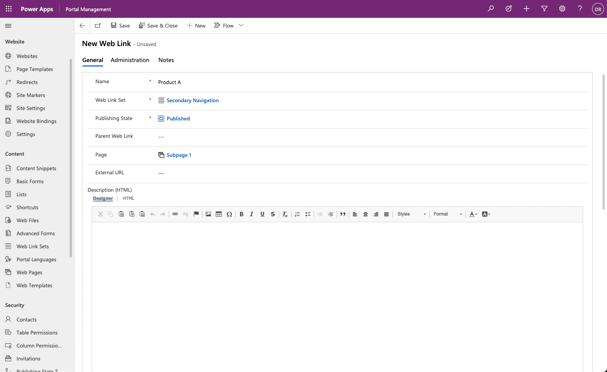
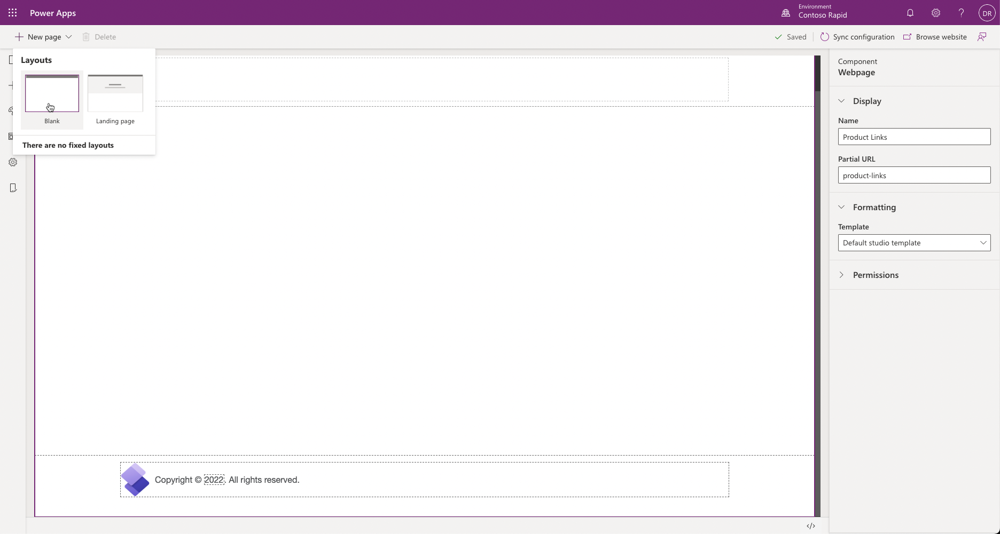
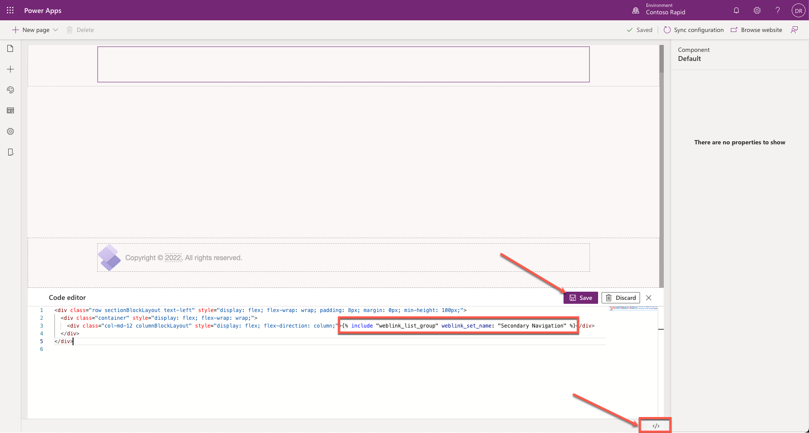
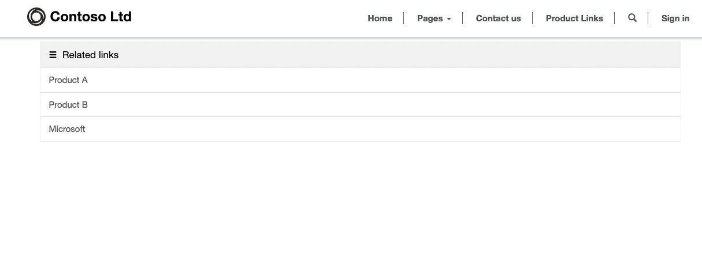

The purpose of this hands-on lab is to configure a webpage layout and add a side menu navigation to other portal pages and external links.

## Learning objectives

At the end of these exercises, you will be able to:

- Identify and modify secondary portal navigation.

- Use the Portal Management app to add new web links to an existing Web Link Set.

- Create a webpage with an embedded navigation menu by using Power Apps portals Studio.

### Prerequisites

For this exercise, you will need to have the following elements in your environment:

- A Power Apps portal that is provisioned. If you do not have a Power Apps portal available, follow the [Create Portal](/power-apps/maker/portals/create-portal/?azure-portal=true) instructions to create one.

- Access to the Power Apps maker portal.

## Scenario

Your organization has provisioned and configured a Power Apps portal. You want to start modifying the portal navigation to provide quick access to frequently used information.

To be able to modify portal navigation to suit organizational requirements, you need to complete the following tasks:

- Use the Portal Management app to modify the existing **Secondary Navigation** web link set to include existing webpages and an external link.

- Create a new page by using portals Studio.

- Add a two-column component to the new page.

- Modify the page source code to reference the secondary navigation.

### Update the web link set

To update the web link set, follow these steps:

1. Sign in to [Power Apps](https://make.powerapps.com/?azure-portal=true).

1. Select a target environment by using the environment selector in the upper-right corner.

1. On the left menu, select **Apps**.

1. From the **Apps** list, locate the **Portal Management** app (the app Type will be Model-driven).

1. Select the app name to open it.

1. Locate the **Web Link Sets** rows.

1. Select and open the **Web Link Sets** row named **Secondary Navigation**.

   

1. Select the **Links** tab.

1. Select the **New Web Link** button.

1. Enter the following information:

    - **Name:** Product A

    - **Web Link Set:** Secondary Navigation (which should already be selected)

    - **Publishing State:** Published

    - **Page:** Subpage 1

    > [!NOTE]
    > This exercise assumes that the Blank website template was used to provision the portal. If a different template was used, your portal might not have the **Subpage 1** page included. You can select any page of your choice to create the link.

1. Select **Save & Close**.

   

1. Select the **New Web Link** button again.

1. Enter the following information:

   - **Name:** Product B

   - **Web Link Set:** Secondary Navigation (which should already be selected)

   - **Publishing State:** Published

   - **Page:** Subpage 2

1. Select **Save & Close**.

1. Select the **New Web Link** button again.

1. Enter the following information:

   - **Name:** Microsoft

   - **Web Link Set:** Secondary Navigation (which should already be selected)

   - **Publishing State:** Published

   - **External URL:** `https://www.microsoft.com`

1. Select **Save & Close**.

### Launch portals Studio

To launch Power Apps portals Studio, follow these steps:

1. Sign in to [Power Apps](https://make.powerapps.com/?azure-portal=true).

1. Select a target environment by using the environment selector in the upper-right corner.

1. On the left menu, select **Apps**.

1. From the **Apps** list, locate your portal app (Type = Portal).

1. Select the ellipsis (**...**) and then select **Edit**, which will launch the portals Studio.

### Create the webpage

To create the webpage, follow these steps:

1. From the command bar, select **New Page > Blank** template.

1. In the properties pane, add the following values:

   - **Name:** Product Links

   - **Partial URL:** product-links

  

### Add a column component and add navigation

To add a column component and add navigation, follow these steps:

1. On the canvas, select the page content.

1. In the lower-right corner, select the source code editor **</>**.

1. In the Code Editor, locate the following line:

   ```html
   <div class="col-md-12 columnBlockLayout" style="display: flex; flex-direction: column;"></div>
   ```

1. Add the `` Liquid tag to the line so that it appears like the following example:

   ```html
   <div class="col-md-12 columnBlockLayout" style="display: flex; flex-direction: column;"></div>
   ```

1. Select **Save** to close the source code editor.

   

1. Select **Browse website**. You should be able to see a page with links to both portal pages and an external URL.

   

> [!NOTE]
> Many portal page components, such as lists and forms, are represented by Liquid tags. In this exercise, the *include* tag references the **Web Template** called *Weblink List Group*, which describes how the secondary navigation should be rendered. For more information, see [Work with Liquid templates](/power-apps/maker/portals/liquid/liquid-overview/?azure-portal=true)
