You'll start by creating your data model in Microsoft Dataverse. This includes creating your tables and columns for the data users will be interacting with in your app.

## Task: Set locale to US English

To begin, you'll set the Locale of Teams to US English to make it convenient for the rest of the labs.

1.  In your browser, navigate to [Teams](https://teams.microsoft.com/) and sign in with the account you're using for the labs.

1.  In the top right-hand corner, select the **...** then open **Settings**.

	> [!div class="mx-imgBorder"]
	> 

1.  In the General settings tab, set both Language settings shown below to US (English) then close the pop-out window.

	> [!div class="mx-imgBorder"]
	> [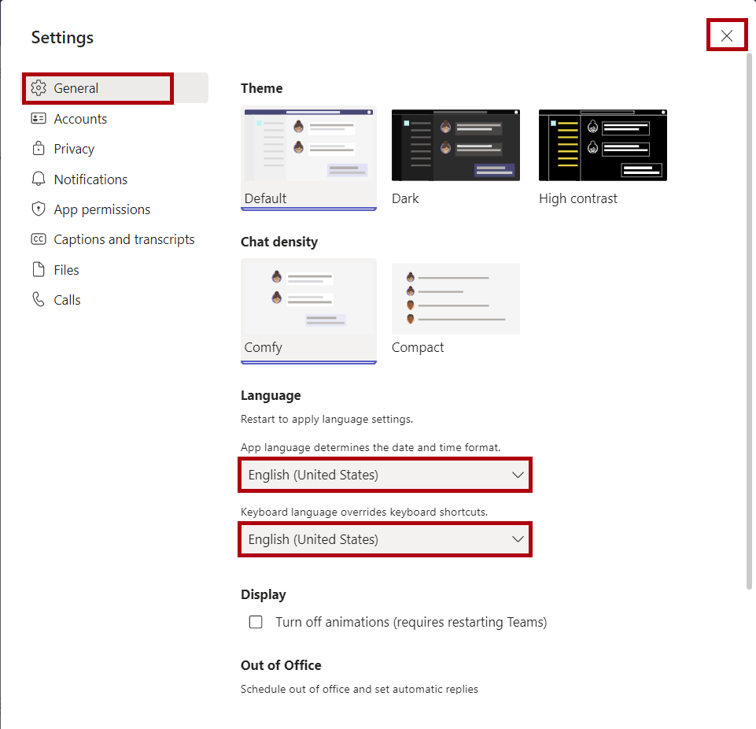](../media/general-settings.png#lightbox)

1.  If you made a change to the language setting in the previous step, you'll need to restart Teams to apply the setting. Close your Teams browser. Launch the browser again and navigate to [Teams](https://teams.microsoft.com/). Sign in with the account you're using for the labs.

## Task: Create a new Team 

1.  Select **Join or create a team**, located on the bottom left of the screen. You may need to select the **Teams** option from the left navigation menu to see this option.

	> [!div class="mx-imgBorder"]
	> [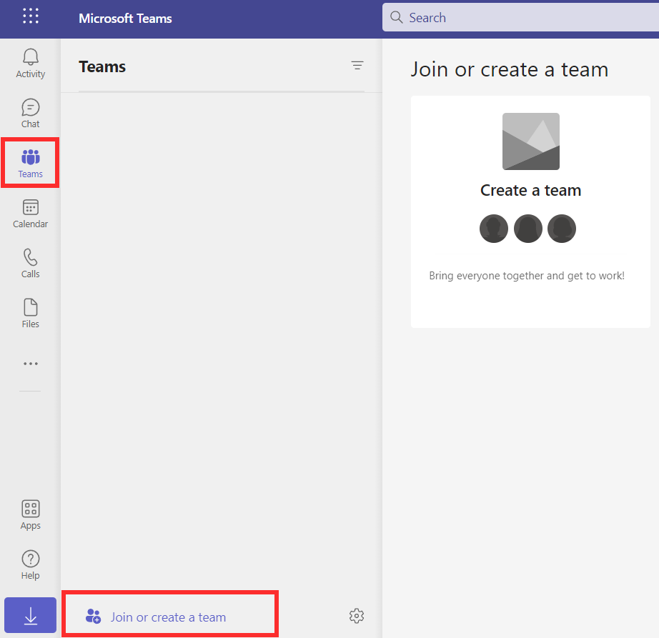](../media/new-team.png#lightbox)

1.  Select **Create a team**, then select **From scratch**.

	> [!div class="mx-imgBorder"]
	> [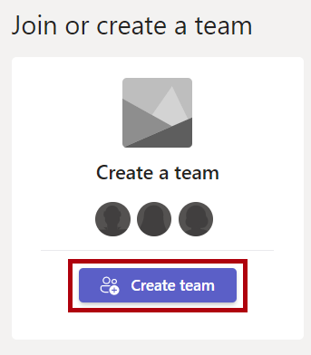](../media/teams-creation.png#lightbox)

	> [!div class="mx-imgBorder"]
	> [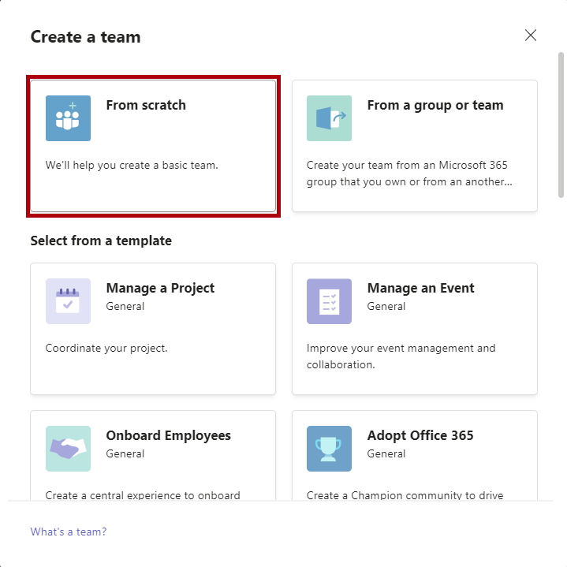](../media/scratch.png#lightbox)

1.  Set the team as **Public**.

	> [!div class="mx-imgBorder"]
	> [![Screenshot of creating Public team from scratch.]](../media/public.png)](../media/public.png#lightbox)

1.  Give your Team a unique name, such as **Office - \<your name\>**. Then, select **Create**.

	> [!IMPORTANT]
	> Give your team a unique name as other users in your tenant will be creating a Team too. This is to help you identify your team.

	> [!div class="mx-imgBorder"]
	> [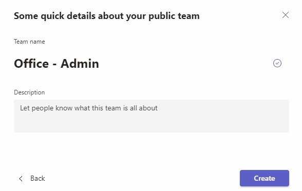](../media/add-app.png#lightbox)

1.  You can **skip** adding members into the team.

## Task: Discover and add the Power Apps app to Teams

In this task, you'll pin the Power Apps app to your Teams toolbar for easier access.

1.  Select the **Apps** icon on the left toolbar, and then search for Power Apps.

	> [!div class="mx-imgBorder"]
	> [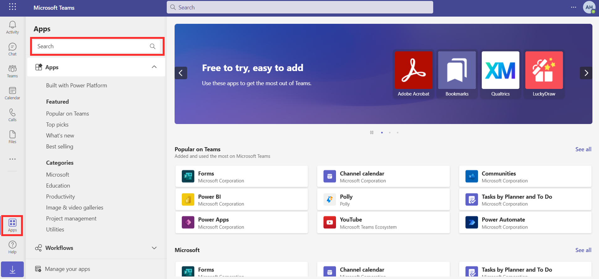](../media/search.png#lightbox)

1.  Select the **Power Apps** app when you find it in the search results.

	> [!div class="mx-imgBorder"]
	> [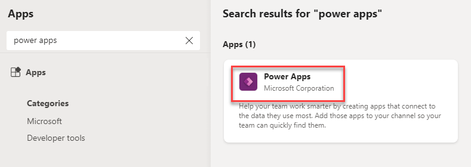](../media/power-apps.png#lightbox)

1.  You'll see a pop-up with information about the Power Apps app for Microsoft Teams. Select the **Add** button.

	> [!div class="mx-imgBorder"]
	> [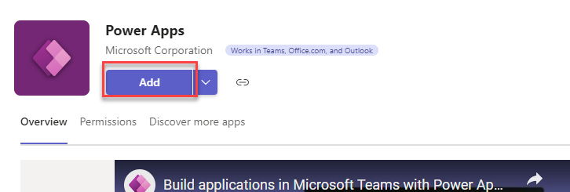](../media/add.png#lightbox)

1.  You'll now see the Power Apps app in the left-hand navigation bar. Right select that icon and select **Pin**. This pins the app to the navigation bar, making it easier to return to it when you need to.

	> [!div class="mx-imgBorder"]
	> [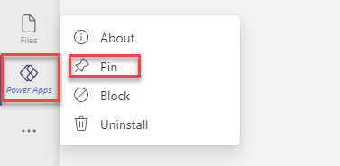](../media/pin.png#lightbox)

## Task: Create a new app

One way to get started creating your data model in Dataverse is to begin by creating a new Power App. By starting this way, your app will automatically have a template for easily viewing, editing, deleting and submitting new data.

1.  In the Teams left pane select Power Apps, select **Start now**.

    *If the screen appears blank, wait a few minutes then refresh the page.*

	> [!div class="mx-imgBorder"]
	> [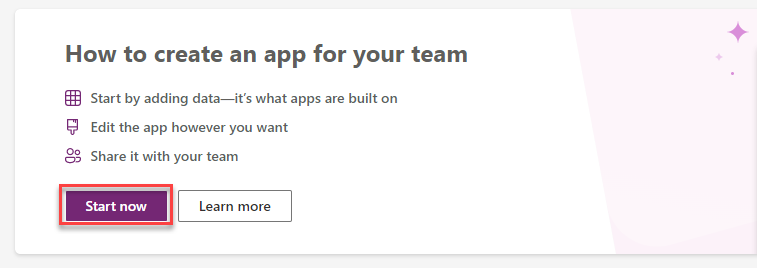](../media/start-now.png#lightbox)

1. In the **Select a team for this app** dialog, select the team that you created earlier in Task 1, then select **Create**.

    *It may take a few minutes for the app be prepared. You'll get a notification in Teams once complete.*

	> [!div class="mx-imgBorder"]
	> [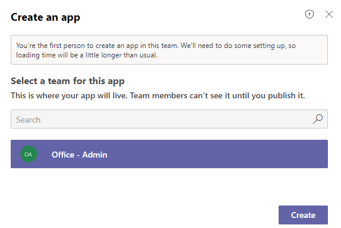](../media/select-team.png#lightbox)

1. Once the app is ready, you'll be taken to the editing canvas for the app. Enter the name of the app as **Swag Request App**, then select **Save.**

	> [!div class="mx-imgBorder"]
	> [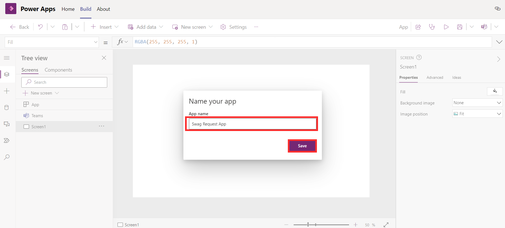](../media/name-app.png#lightbox)

	**Note: If your app has been "Saving" for longer than 5 minutes, there may have been a problem in its creation**. To try again, refresh the page.

	> [!div class="mx-imgBorder"]
	> [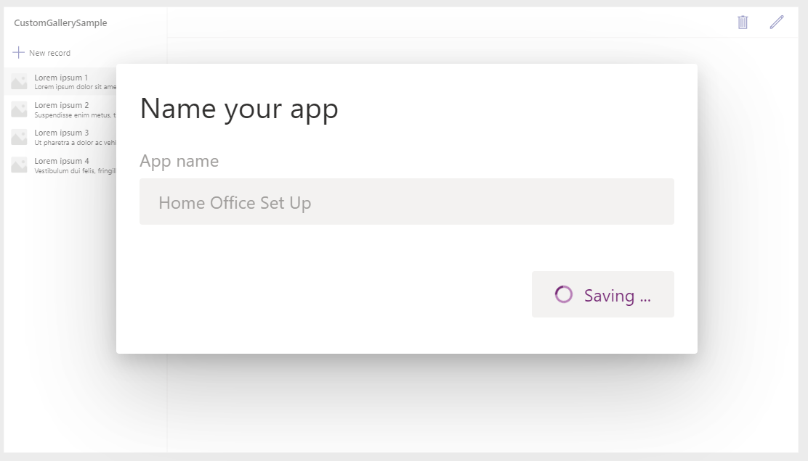](../media/save-name.png#lightbox)

	After you refresh the page, you should be able to see it listed under your Recent apps. Select **See more**.

	> [!div class="mx-imgBorder"]
	> [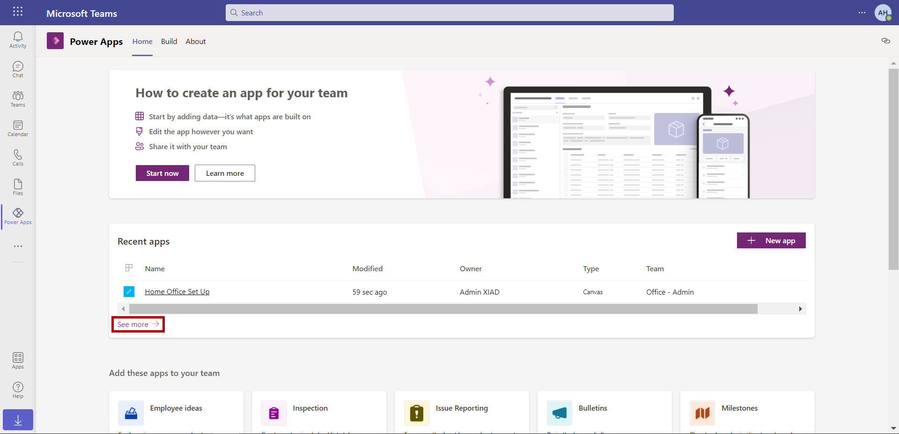](../media/see-more.png#lightbox)

1. Then, select **See all**. Delete the app you attempted to make. Retry creating the app by selecting **New> Canvas app> Tablet form factor**.
	
	> [!div class="mx-imgBorder"]
	> [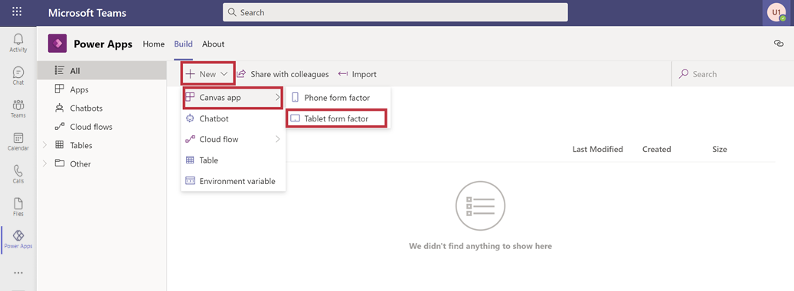](../media/tablet-form-factor.png#lightbox)

## Task: Create tables in Dataverse for Teams

1.  From the menu on the left of your app canvas, select the Data (cylinder) icon and **Create new table.**

	> [!div class="mx-imgBorder"]
	> [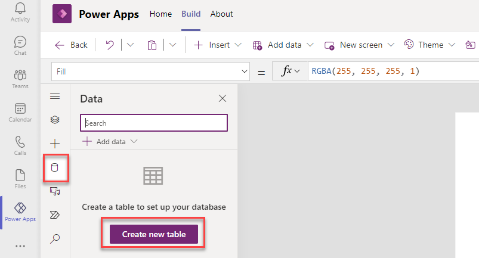](../media/create-new-table.png#lightbox)

1.  Name the table **Request**, then select **Create**.

	> [!div class="mx-imgBorder"]
	> [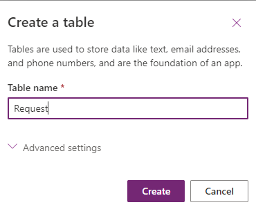](../media/table-name.png#lightbox)

1.  You'll now create the columns for your table and assign a data type to each. In the Requests table, select **+ New column**.

	> [!div class="mx-imgBorder"]
	> [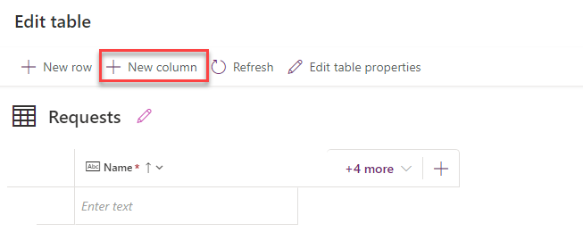](../media/new-column.png#lightbox)

1.  Enter **Request Number** for Display name, select **Auto number** for Data type, and select **Save**.

	> [!div class="mx-imgBorder"]
	> [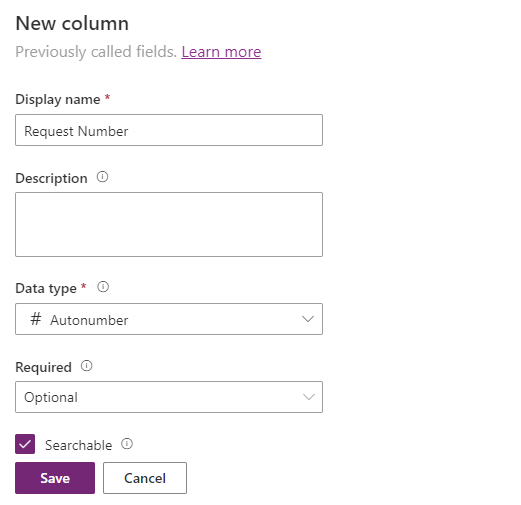](../media/column-properties.png#lightbox)

1.  Following the same process, add another column named **Comment** with the data type **Text**.

	> [!div class="mx-imgBorder"]
	> [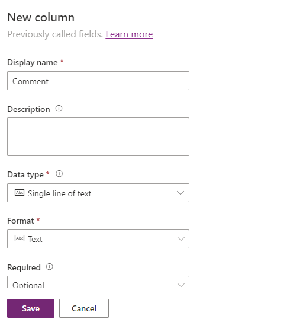](../media/comment.png#lightbox)

1.  Add another column, enter **Approval Status** for Display name, select **Choice** for Data type, and select **No** for Sync with global choice.

	> [!div class="mx-imgBorder"]
	> [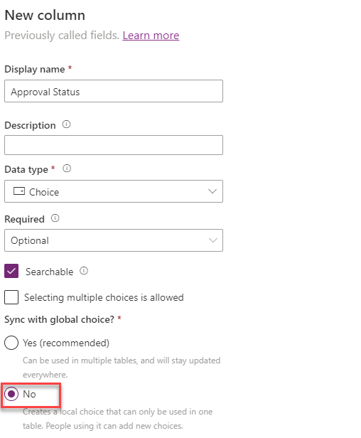](../media/choice.png#lightbox)

1.  Enter **Approved** for first choice and select **+ New choice**.

	> [!div class="mx-imgBorder"]
	> 

1.  Enter **Rejected** for the second choice.

1. Select the color pick icon next to the choice, so that the color for Approved is light green, and the color for Rejected is light red. Then, select **Save**.

	> [!div class="mx-imgBorder"]
	> [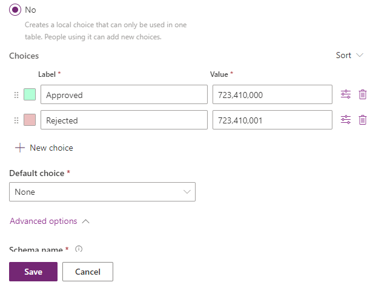](../media/choices.png#lightbox)

	If you need to edit a column, you can select the column heading, then **Edit column**.

1. Your table should now appear as shown below. Select **Close** to close the table

	> [!div class="mx-imgBorder"]
	> [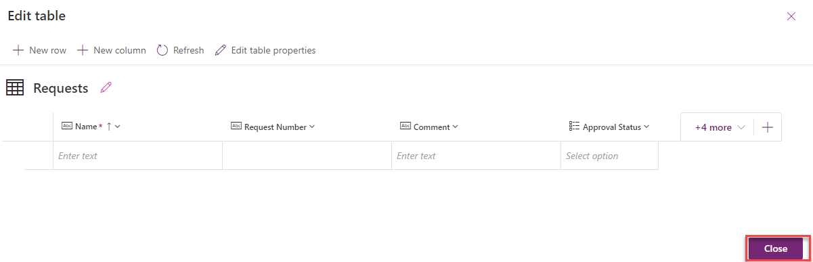](../media/close-table.png#lightbox)

1. Back on the editing canvas of your app, select **With data** and select the **Requests** table. You should notice that there's a form on your app containing fields you created in the Request table.

	> [!div class="mx-imgBorder"]
	> 

1. You'll create another table to store Asset Category information. Select **Add data** from the ribbon and **+ Create new table**.

	> [!div class="mx-imgBorder"]
	> [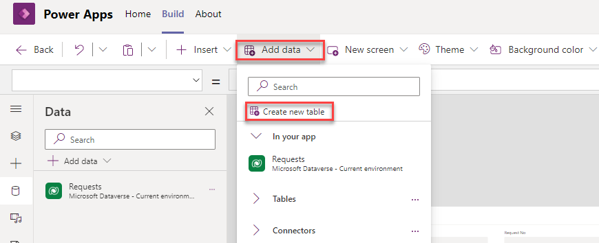](../media/add-data-create-new-table.png#lightbox)

1. Name the table **Asset Category** then select **Create.**

	> [!div class="mx-imgBorder"]
	> [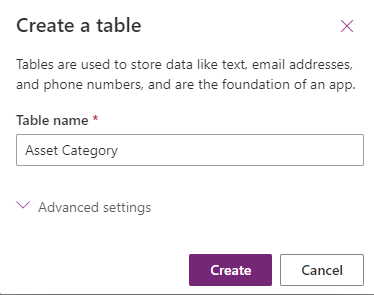](../media/create-table-name.png#lightbox)

1. In the **Asset Category** table, enter the following data into a row each in the **Name** column. After typing in each row, press Enter or Tab (you may need to tab a second time to get to the next row) on your keyboard to create a new row.	

	- Apparel
		
	- Accessory

1. Your table should appear as shown below, then select **Close**.

	> [!div class="mx-imgBorder"]
	> [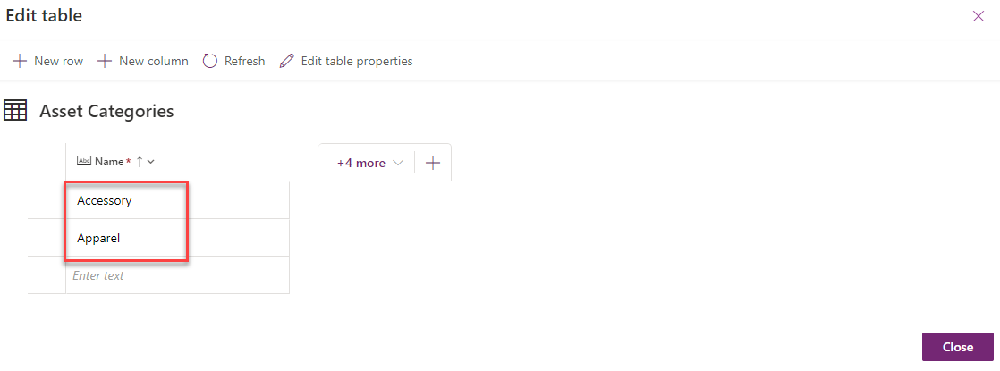](../media/accessory-apparel.png#lightbox)

1. Select **Add data** and select **Create new table** again.

1. Enter **Asset** for name and select **Create**.

1. In the Asset table, select on the Name **header** and select **Edit column**.

	> [!div class="mx-imgBorder"]
	> [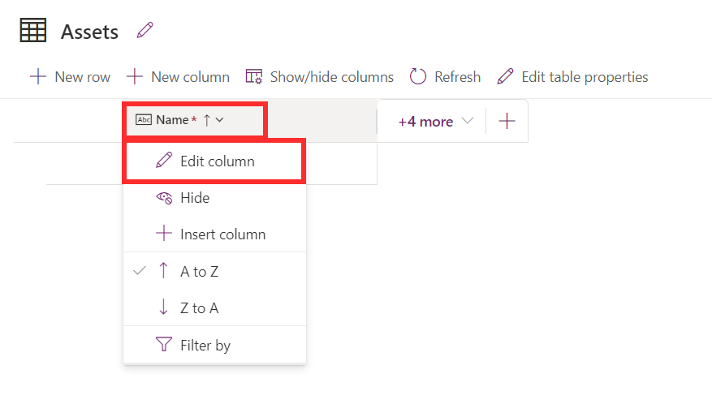](../media/edit-column.png#lightbox)

1. Enter **Asset Name** for Display name and select **Save**.

1. Add **+ New column**.

1. Enter **Category** for Display name, select **Lookup** for Date type, select **Asset Category** for Related table, and select **Save**.
    
	> [!NOTE]
	> It can take a few seconds for the new lookup column to appear on the screen. Pause and wait for that to happen.

	> [!div class="mx-imgBorder"]
	> [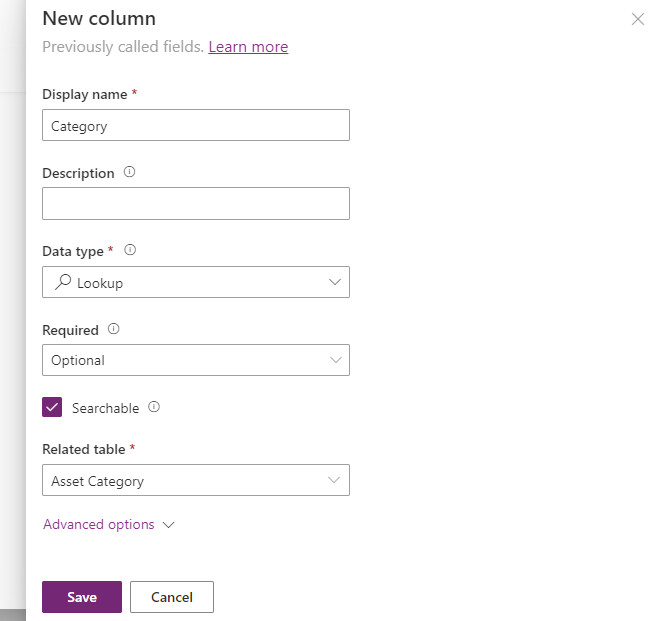](../media/category.png#lightbox)

1. Select + New column.

1. Enter **Price** for Display name, select **Currency** for Data type, and expand the **Advanced options** section.

	> [!div class="mx-imgBorder"]
	> [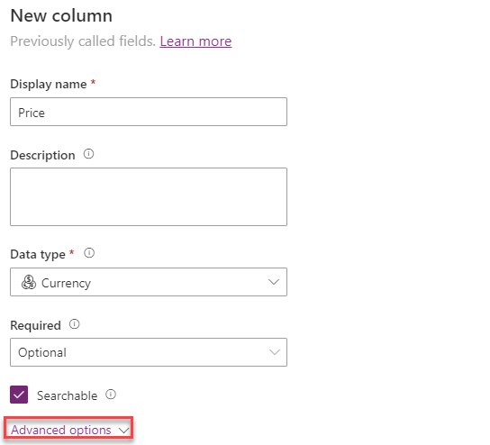](../media/advanced-options.png#lightbox)

1. Enter **0** for Minimum value and select **Save**.

	> [!div class="mx-imgBorder"]
	> [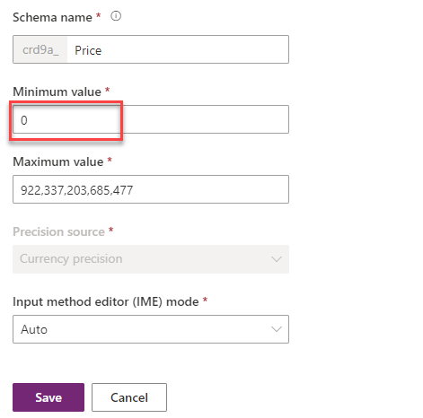](../media/minimum-value.png#lightbox)

1. Select **+ New column** again.

1. Enter **Image** for Display name, select **Text** for Format, and expand the **Advanced options** section.

	> [!div class="mx-imgBorder"]
	> [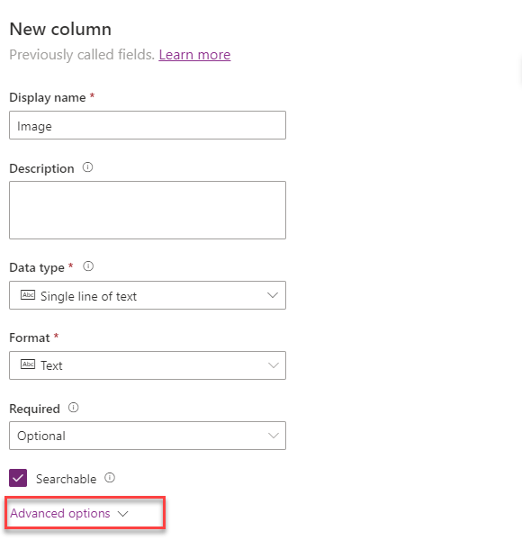](../media/column-advanced-options.png#lightbox)

1. Enter **200** for Maximum character count and select **Save**.

	> [!div class="mx-imgBorder"]
	> [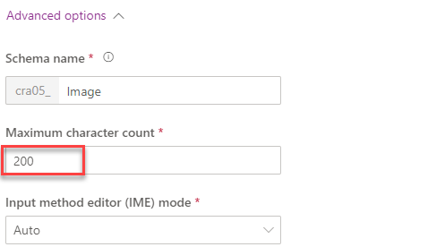](../media/maximum-character-count.png#lightbox)

1. Your Asset table should appear as below. Select **Close**.

	> [!div class="mx-imgBorder"]
	> [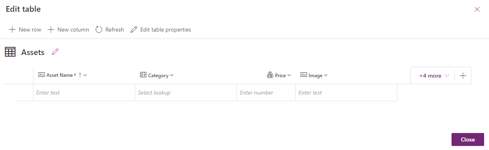](../media/asset-table.png#lightbox)

1. You'll now add lookup fields into the **Requests** table. Select the **...** **More actions** button of the **Request** table and select **Edit table**.

	> [!div class="mx-imgBorder"]
	> [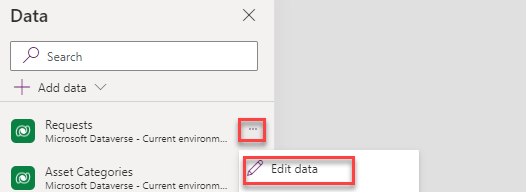](../media/edit-data.png#lightbox)

1. Select **+ New column**.

1. Enter **Asset Category** for Display name, select **Lookup** for Date type, select **Asset Category** for Related table, and select **Save**.

	> [!div class="mx-imgBorder"]
	> [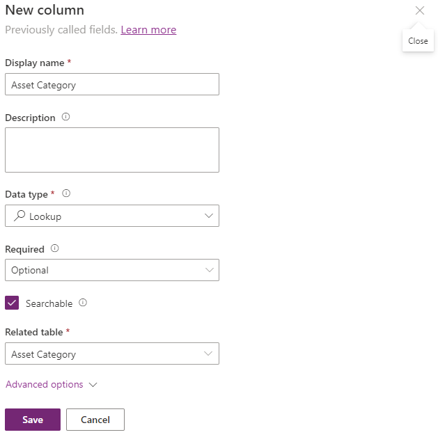](../media/asset-category-properties.png#lightbox)

1. Select **+ New column** again.

1. Enter **Asset** for Display name, select **Lookup** for Data type, select **Asset** for Related table, and select **Save**.

1. Select and drag the 2 columns you've created, to reposition them after the **Name** column. Select **Close**. You may need to zoom out of your screen if the columns you created aren't visible.

	> [!div class="mx-imgBorder"]
	> [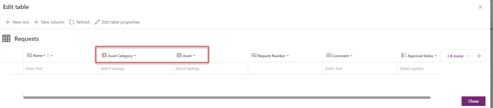](../media/move-columns.png#lightbox)