Now that the data model has been created in Dataverse, you can customize the app that employees will use to submit their swag asset requests. Customizing the app in this exercise will involve editing the fields that are available on the asset request submission form and changing formatting, such as colors and font.

## Task: Edit the app form 

Your first task is to edit the app form by following these steps:

1.  Select the save icon to save your app.

	> [!div class="mx-imgBorder"]
	> [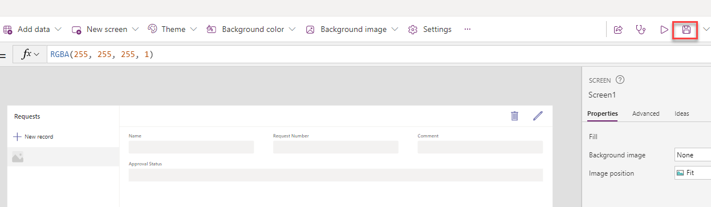](../media/save.png#lightbox)

1.  From your app canvas, select the **Tree view** icon on the left side of the screen. Within the **Tree view**, underneath **RightContainer1**, select **EditForm1** and then select **Edit fields**.

	> [!div class="mx-imgBorder"]
	> [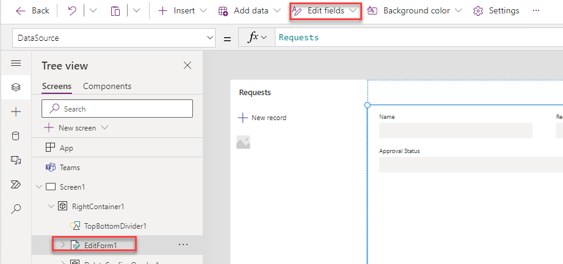](../media/edit-fields.png#lightbox)

1.  Select **+ Add field** and then select to add the **Asset** and **Asset Category** fields.

	> [!div class="mx-imgBorder"]
	> [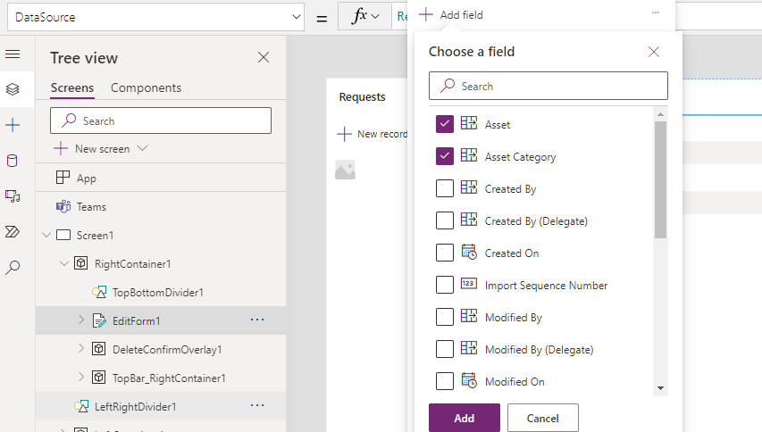](../media/add-field.png#lightbox)

1. Select the **Edit fields** button located in the **Properties** pane.

	> [!div class="mx-imgBorder"]
	> [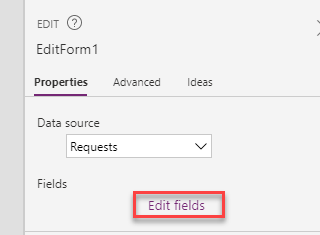](../media/properties-edit-fields.png#lightbox)

1. Select and drag each field from the area to rearrange the order. The order should appear as shown in the following image. If you're missing any fields, you can add them.

	> [!div class="mx-imgBorder"]
	> [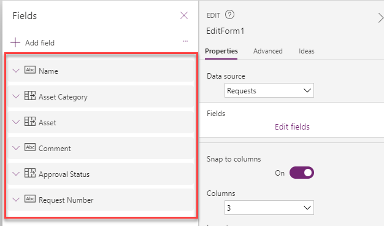](../media/field-order.png#lightbox)

1. Select the **Approval status** field to expand it. Set the **Control type** to **View option set single-select**. Then, you can close the **Fields** menu.

	> [!div class="mx-imgBorder"]
	> [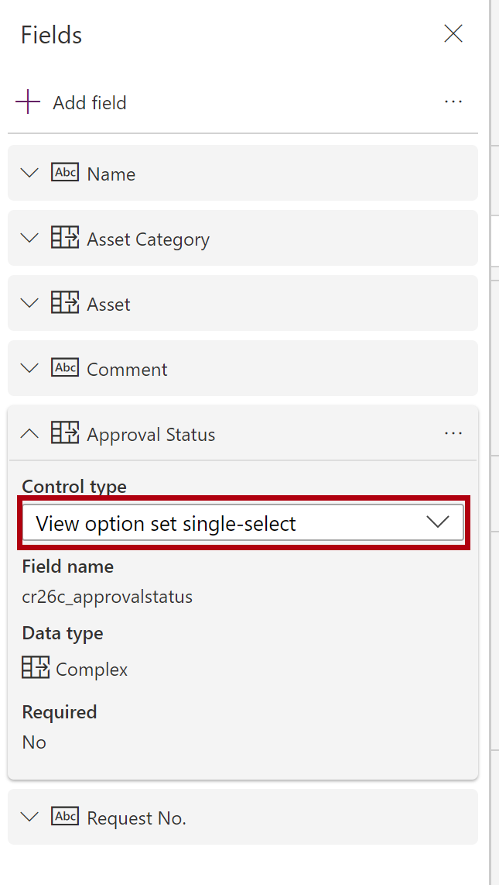](../media/control-type.png#lightbox)

1. With **EditForm1** selected, change the **Columns** value to **1**, as shown in the following image.

	> [!div class="mx-imgBorder"]
	> [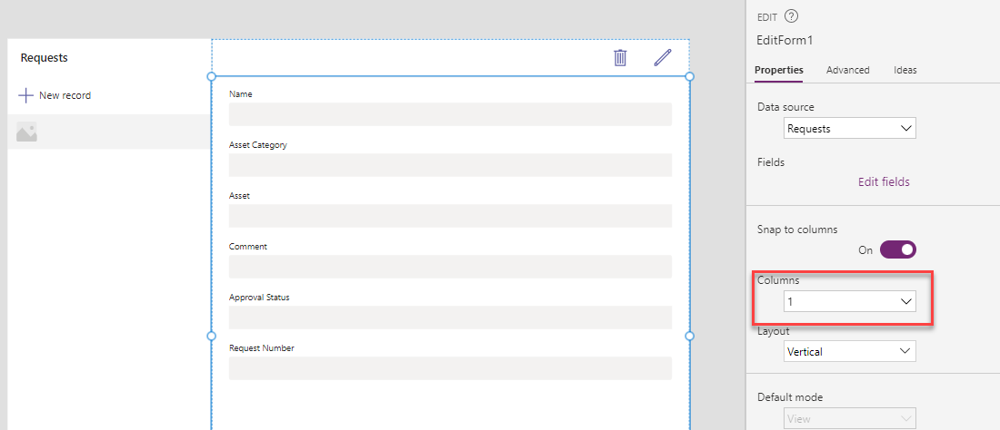](../media/column-value.png#lightbox)

1. **Save** your app.

## Task: Import data

To import data, follow these steps:

1.  With your app saved, select the **Build** tab.

	> [!div class="mx-imgBorder"]
	> [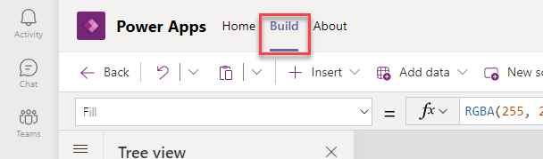](../media/build.png#lightbox)

1.  Select the Asset table.

	> [!div class="mx-imgBorder"]
	> [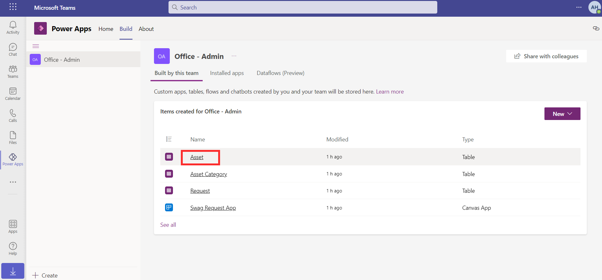](../media/asset.png#lightbox)

1.  Select **Import > Import Data**.

	> [!div class="mx-imgBorder"]
	> [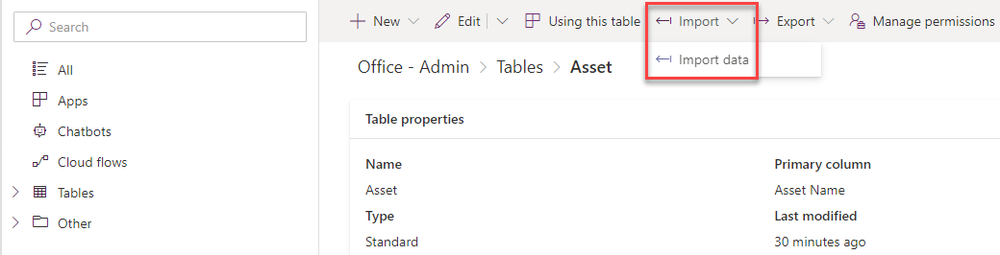](../media/import-data.png#lightbox)

1.  Select the **Excel workbook** option.

	> [!div class="mx-imgBorder"]
	> [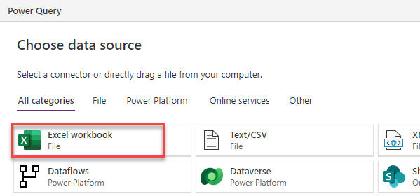](../media/excel-workbook.png#lightbox)

1.  Select the **Upload file** option. Select **Browse** and then go to the Microsoft Excel file named **Contoso Coffee Asset List.xlsx** from your lab documents. Check that **Authentication kind** is set to **Organizational account** and then select **Sign in**.

    *If you get an error when trying to upload the file, refresh the page and try again*.

	> [!div class="mx-imgBorder"]
	> [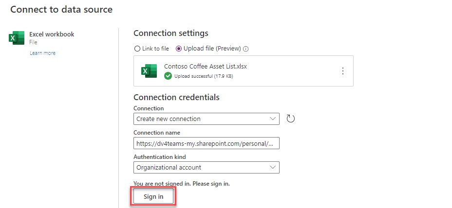](../media/sign-in.png#lightbox)

1.  In the pop-up window, confirm your account to sign in.

	> [!div class="mx-imgBorder"]
	> [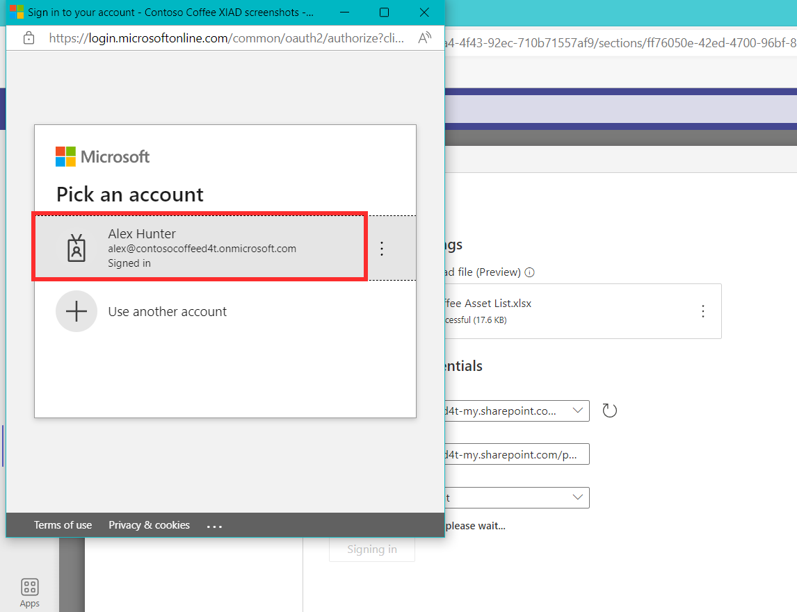](../media/account.png#lightbox)

1.  Select **Next**.

	> [!div class="mx-imgBorder"]
	> [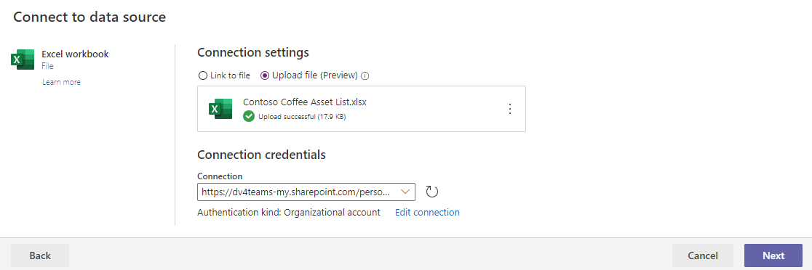](../media/connect-data-source.png#lightbox)

1.  Select the checkbox next to **Sheet1** and then select **Next**.

	> [!div class="mx-imgBorder"]
	> [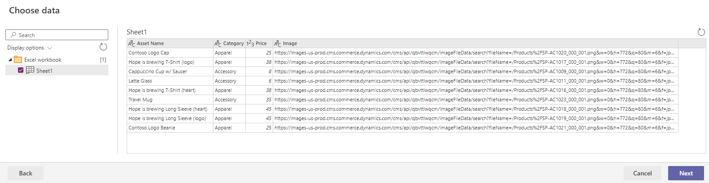](../media/power-query.png#lightbox)

1.  In the **Price** column header, select the 123 icon and then change it to **Currency**.

	> [!div class="mx-imgBorder"]
	> [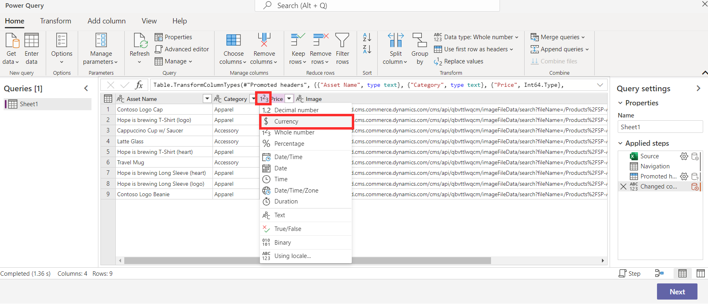](../media/currency.png#lightbox)

1.  When asked to confirm the change, select **Replace current**.

1. Select **Next**.

	> [!div class="mx-imgBorder"]
	> 

1. In the **Load settings** section, select **Load to existing table**. You'll need to select the Asset table as the destination table. Your table will appear similar to **crf7d_Asset**. However, it likely won't be exactly the same as the example shown in this lab; your prefix might be different.

	> [!div class="mx-imgBorder"]
	> [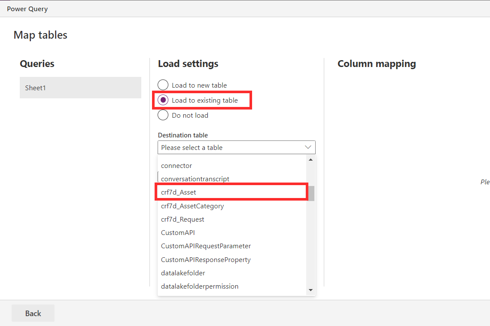](../media/load-existing-table.png#lightbox)

1. Map the **Source column** to the **Destination column**, as shown in the following image, and then select **Publish**.

	|     Source column    |     Destination column    |
	|----------------------|---------------------------|
	|     Image            |     Image                 |
	|     Asset Name       |     Name                  |
	|     Price            |     Price                 |

	> [!div class="mx-imgBorder"]
	> [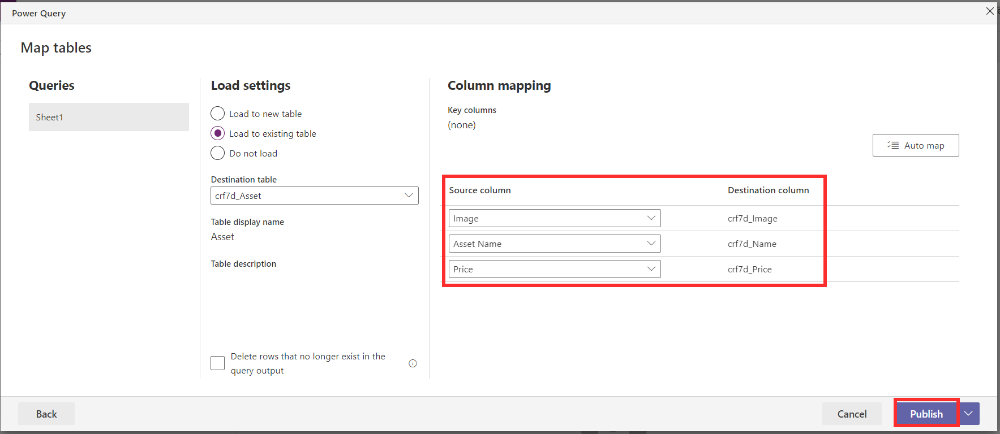](../media/publish.png#lightbox)

1. Wait approximately two minutes and then refresh your browser. Return to the Asset table in the **Build** tab. Your list of assets should be populated.

	> [!div class="mx-imgBorder"]
	> [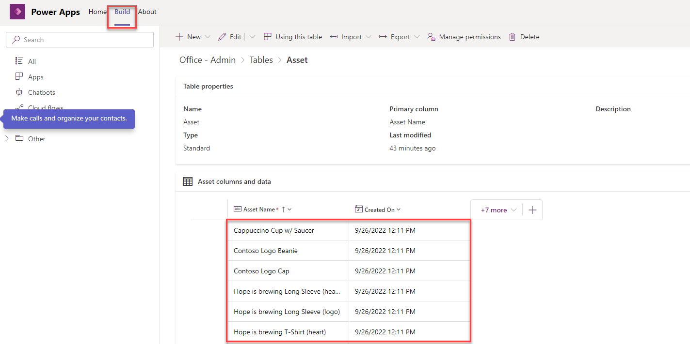](../media/build-asset-table.png#lightbox)

1. Select **Edit**.

	> [!div class="mx-imgBorder"]
	> [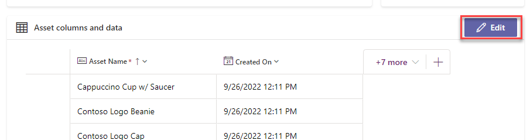](../media/edit.png#lightbox)

1. Select the **+more** button to show the other columns. In the **Show existing column** section, select **Category**, **Image**, and **Price**.

	> [!div class="mx-imgBorder"]
	> [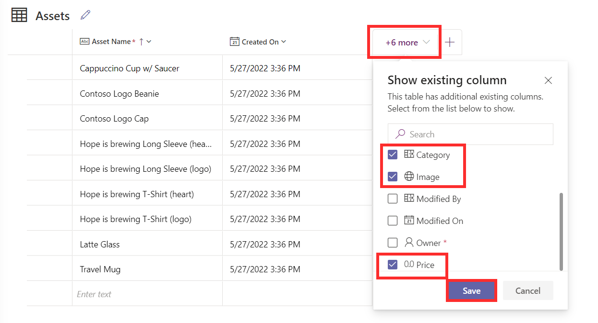](../media/existing-columns.png#lightbox)

1. Populate the **Category** column. Select the correct category for each asset.

	|     Asset Name                             |     Category     |
	|--------------------------------------------|------------------|
	|     Cappuccino Cup w/ Saucer               |     Accessory    |
	|     Contoso Logo Beanie                    |     Apparel      |
	|     Contoso Logo Cap                       |     Apparel      |
	|     Hope is brewing Long Sleeve (heart)    |     Apparel      |
	|     Hope is brewing Long Sleeve (logo)     |     Apparel      |
	|     Hope is brewing T-Shirt (heart)        |     Apparel      |
	|     Hope is brewing T-Shirt (logo)         |     Apparel      |
	|     Latte Glass                            |     Accessory    |
	|     Travel Mug                             |     Accessory    |

	> [!div class="mx-imgBorder"]
	> [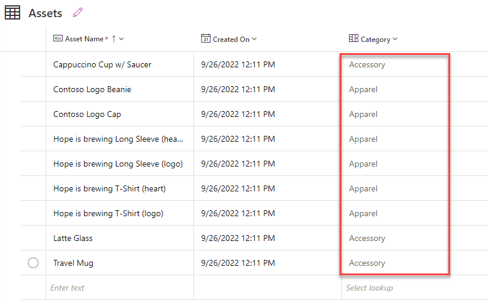](../media/category-list.png#lightbox)

1. Select the **Build** tab and then select **Swag Request App**.

	> [!div class="mx-imgBorder"]
	> [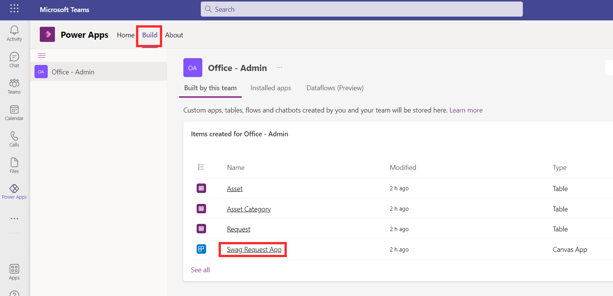](../media/swag-request-app-build.png#lightbox)

## Task: Set up the app form

Your next task will be to set up the app form. In your form, you'll want the **Asset** field to be filtered based on the selected Asset category.

1.   On your canvas, select the **Asset** field, and then select under the label again to select the **DataCardValue**.
    
    You'll know if you've selected correctly when the panel on the right displays a COMBO BOX for DataCardValueX. (You might have a different number if you added the columns to the form in a different order, which is acceptable.)

   > [!div class="mx-imgBorder"]
   > [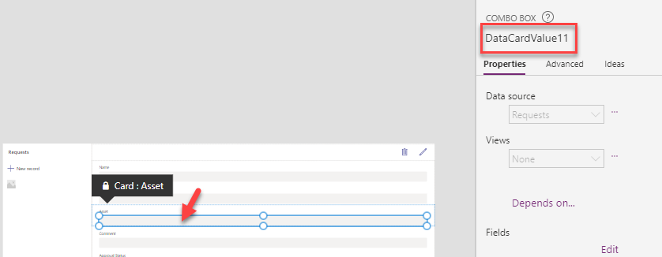](../media/data-card-value.png#lightbox)

1.  Select the **Advanced** tab and then select **Unlock to change properties**.

	> [!div class="mx-imgBorder"]
	> [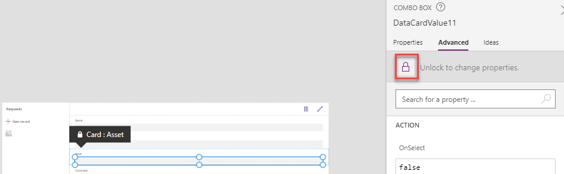](../media/unlock.png#lightbox)

1.  Select the **Properties** tab and then select **Depends on**. This selection will allow you to set a formula that will apply a filter to the Asset choices based on the Asset category that you've chosen.

	> [!div class="mx-imgBorder"]
	> [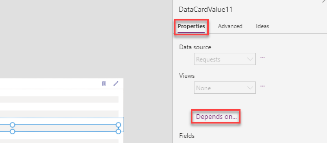](../media/properties-dependency.png#lightbox)

1.  Select the following options:
    
    Make your selections in the bottom half of the form first:

    **Matching field** - **Assets** and **Category**

    Then, select values in the top half of the form for **Parent control**:

    **Parent control** - **DataCardValue6** (see the following note) and **Name**

    > [!NOTE]
    > Make sure that you make the selections in this order. If you select the **Parent control** first, when you select the Asset table in the **Matching field** section, it will reset your selections in the top half of the form. If you've completed these actions in the wrong order, change the **Parent control** section back to what it should be so that it matches the following screenshot.
    >
    > You might have a different number for **DataCardValue6** if you added your columns in a different order. Only two options are available for you to choose from in the **Parent control** section: the first dropdown menu, which only has an option of **Value**, and the second dropdown menu, which allows you to select **Name**.

	> [!div class="mx-imgBorder"]
	> [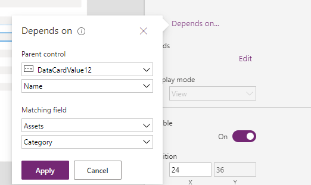](../media/modify-properties.png#lightbox)

1.  Select **Apply**.

    A formula will appear in the formula bar, and you'll get a warning icon on your canvas and an error flag on your app checker. You'll need to manually add one more component to the formula to correct this issue. This component isn't something that you can choose from the **Depends on** selections.

	> [!div class="mx-imgBorder"]
	> [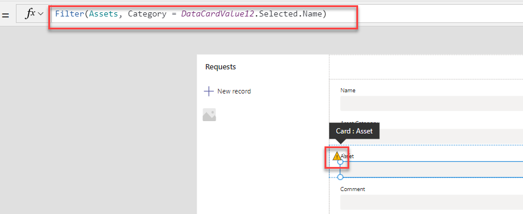](../media/warning.png#lightbox)

1.  Edit the formula. Select at the end of the word **Category**, type a dot (period/full stop) and then type the letter **N**. Select **Name** from the list of options that appears.

	> [!div class="mx-imgBorder"]
	> [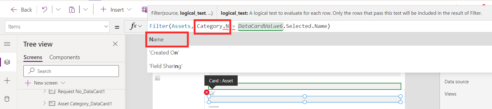](../media/name.png#lightbox)

Your final formula will resemble the following example, and the error and warning messages will be cleared.

	`Filter(Assets, Category.Name = DataCardValue6.Selected.Name)`

> [!div class="mx-imgBorder"]
> [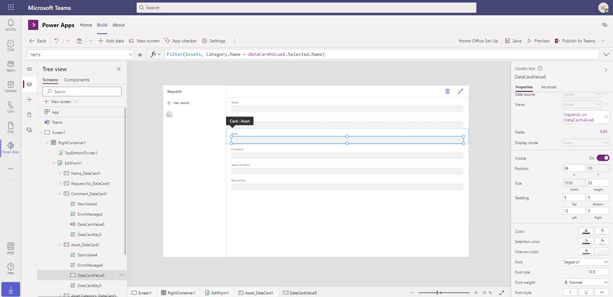](../media/final-formula.png#lightbox)

### Locale differences

If your computer has its regional settings set to use the comma ',' for its decimal separator (as is done in much of Europe), your formulas will use a semicolon ';' instead of a comma. Instead, your formula will appear as shown in the following example. If you're in the en-us locale, you can ignore this example.

`Filter(Assets; Category.Name = DataCardValue6.Selected.Name)`

1.  **Save** and then select to **preview** the app.

	> [!div class="mx-imgBorder"]
	> [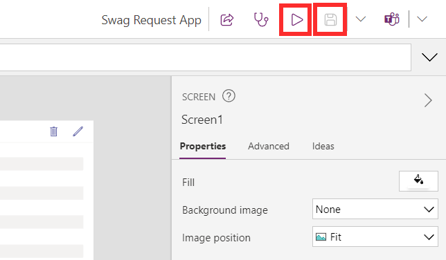](../media/save-preview.png#lightbox)

1.  When you preview the app for the first time, no data will show in the requests table, so you'll get a blank, "No item to display" message.

	> [!div class="mx-imgBorder"]
	> [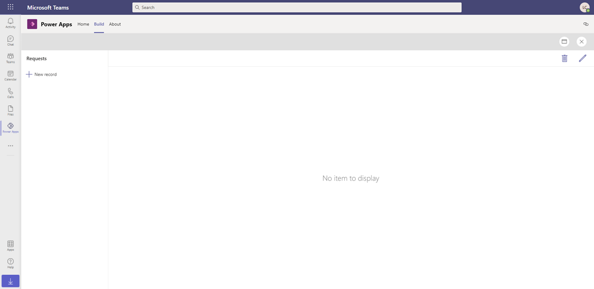](../media/preview.png#lightbox)

1.  While in preview mode, select the **+ New record** button, enter request details, and then select the checkmark to submit your request. Repeat this process so that you have three requests in your app. Your dependent dropdown menus are working (you'll get different Asset choices based on the Asset category that you've chosen), and the **Approval Status** and **Request Number** fields are read only.

	When submitting requests, try to use a variation of options because this data will be used to build a Microsoft Power BI report later in another lab in this learning path.

	> [!div class="mx-imgBorder"]
	> [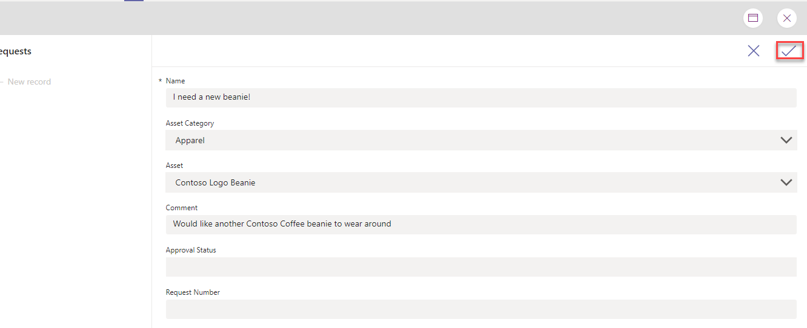](../media/submit-request.png#lightbox)

1.  After you've submitted at least three requests, close the preview.

	> [!div class="mx-imgBorder"]
	> [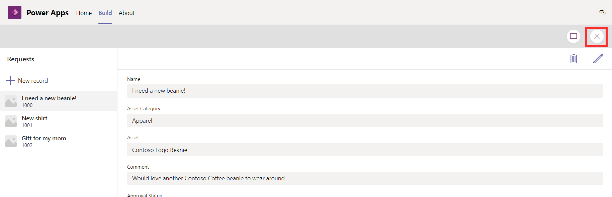](../media/close-preview.png#lightbox)

## Task: Add an image to the form

You can add an image to the form by following these steps:

1.  On the **Screens** tab, from the **EditForm1** dropdown menu, select **Asset_DataCard1**.

	> [!div class="mx-imgBorder"]
	> [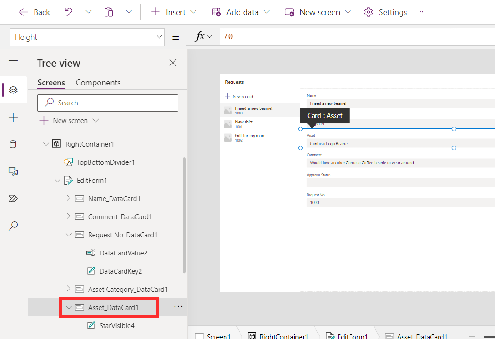](../media/asset-data-card.png#lightbox)

1. From the ribbon, select **Insert > Media > Image**, which will add a blank image inside **Asset_DataCard1**.

	> [!div class="mx-imgBorder"]
	> [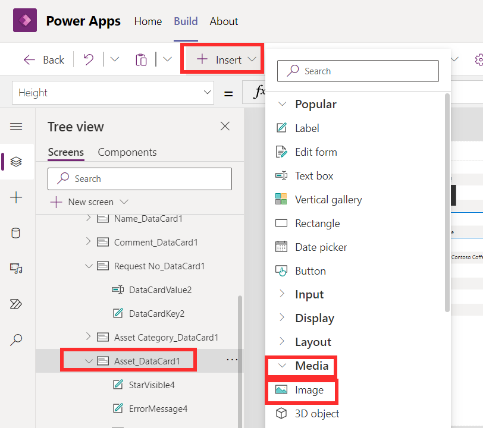](../media/insert-image.png#lightbox)

1. Select **Asset_DataCard1** and then drag the bottom border from the canvas to increase the size of the cell until it appears as shown in the following screenshot.

	> [!div class="mx-imgBorder"]
	> [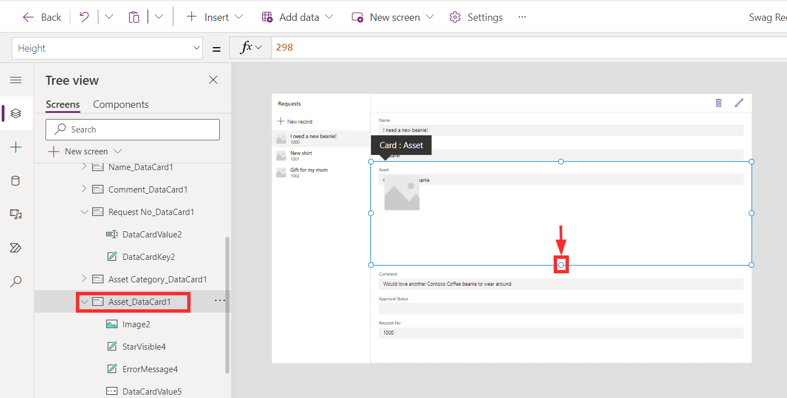](../media/border-size.png#lightbox)

1. Select the image that you previously added (**Image2**). Reposition and resize it so that it appears on your screen, as shown in the following image.

	> [!div class="mx-imgBorder"]
	> [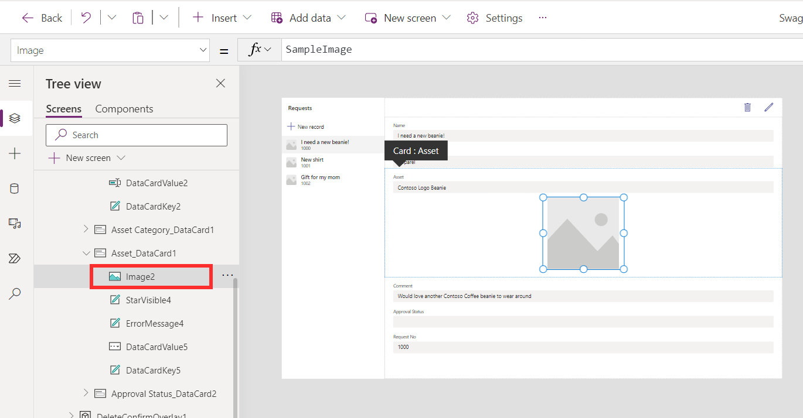](../media/position-size.png#lightbox)

1. With **Image2** selected, type the following formula into the formula bar. Ensure that the dropdown/property next to the formula bar is set to **Image**.

	`DataCardValue5.Selected.Image`

	> [!div class="mx-imgBorder"]
	> [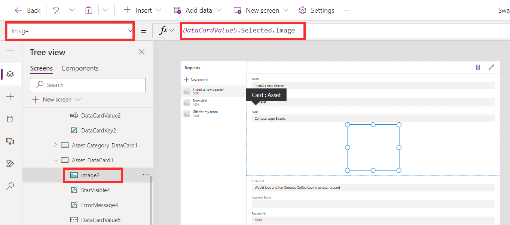](../media/enter-formula.png#lightbox)

	*In the formula, **DataCardValue5** refers to the **DataCardValue** for the **Asset** field. If your form is in a different order, your number might not be 5.*

1. Select **BrowseGallery1** from under **LeftContainer1**. When you select the gallery, a pen icon will appear. Select the pen icon.

	> [!div class="mx-imgBorder"]
	> [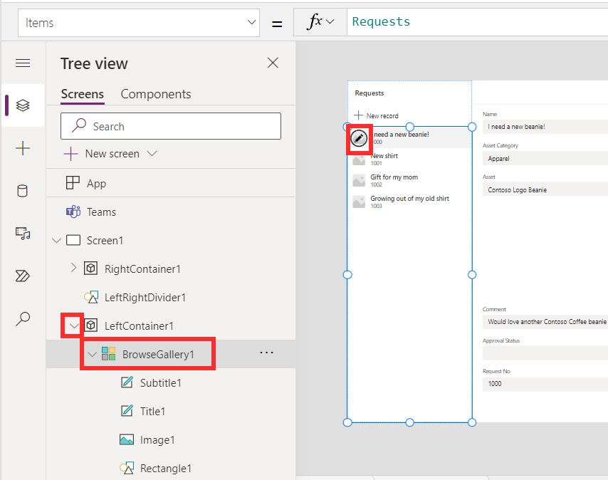](../media/pen.png#lightbox)

1. Selecting the pen icon will select the first cell of the gallery. Select the image (**Image1**) within the cell.

	> [!div class="mx-imgBorder"]
	> 

1. With **Image1** selected, type the following formula into the formula bar. Ensure that the dropdown/property next to the formula bar is set to **Image**.

	`ThisItem.Asset.Image`

	> [!div class="mx-imgBorder"]
	> [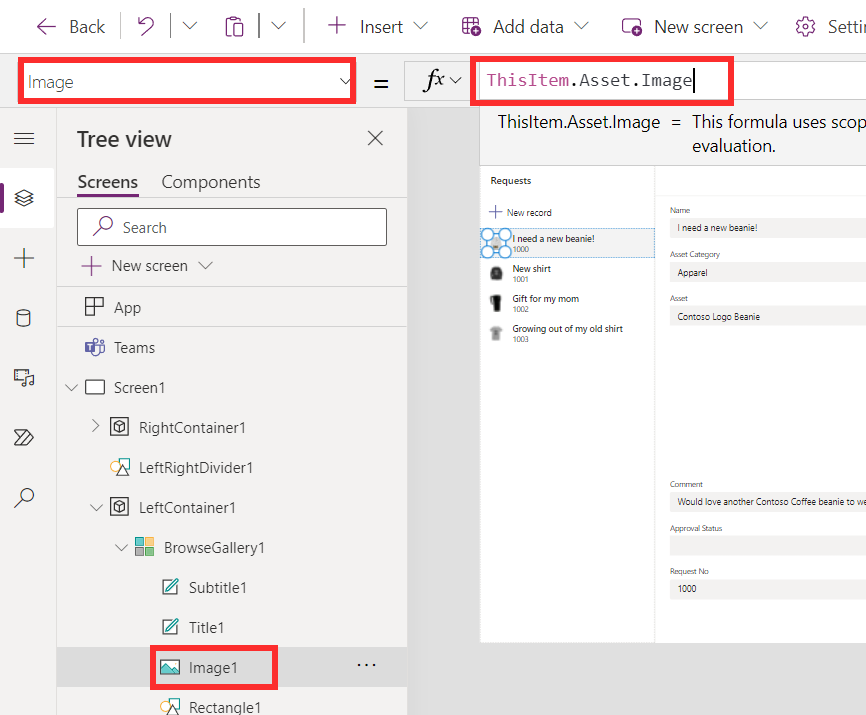](../media/modify-image.png#lightbox)

1. **Save** and **preview** the app. Test it out by creating a new request. As you select an asset in the form, the image will update. Close the preview when you're done.

	> [!div class="mx-imgBorder"]
	> [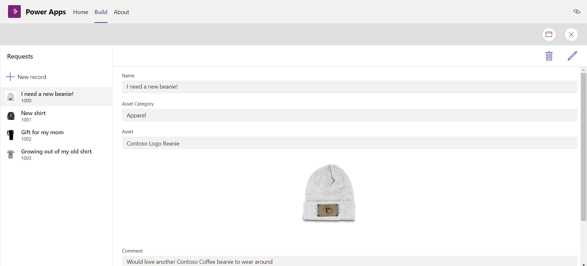](../media/preview-mode.png#lightbox)

## Task: Set up the app design 

When creating an app, you'll have full control of designing the screens. In this case, you'll be using colors to match with the overall theme of Microsoft Teams.

1.  From the **Tree view** (menu on the left of the app canvas), select **Screen1**. On the **Properties** pane for **Screen1**, change the **Fill** property to the custom value of **E1DFDD**, as shown in the following images.

	> [!div class="mx-imgBorder"]
	> [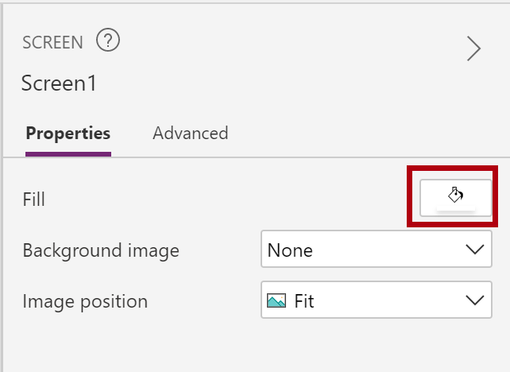](../media/change-color.png#lightbox)

	> [!div class="mx-imgBorder"]
	> [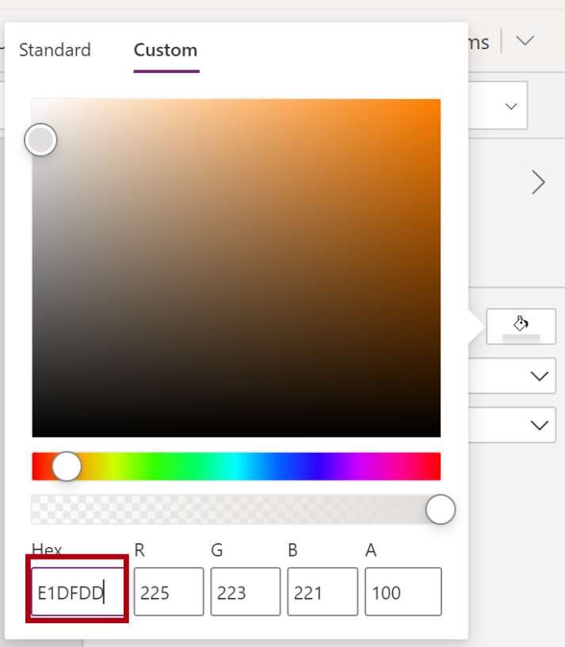](../media/color-selection.png#lightbox)

1.  From the **Tree view**, select **TopBar_RightContainer1** and then select its color property from the **Properties** pane.

	> [!div class="mx-imgBorder"]
	> [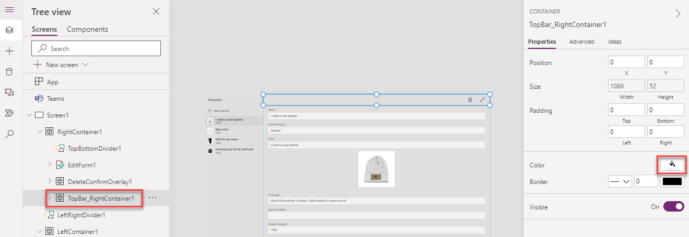](../media/color-property.png#lightbox)

1.  Change the color of **TopBar_RightContainer1** to the light purple color, as shown in the following image.

	> [!div class="mx-imgBorder"]
	> [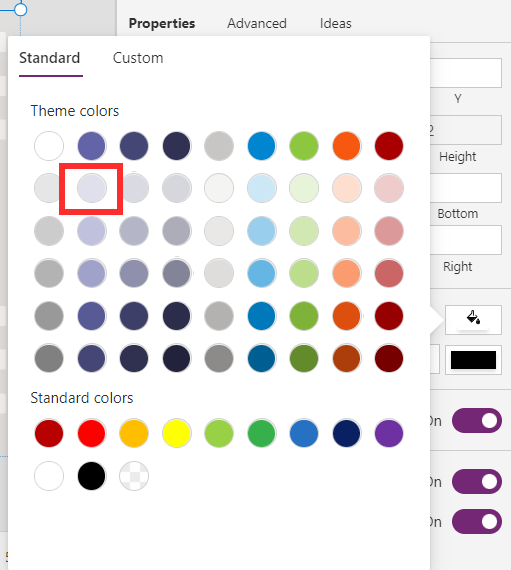](../media/purple.png#lightbox)

1.  From the **Tree view**, expand **LeftContainer1** and select **TopBar_LeftContainer1**. Change the color property to match the light purple color that you chose in the previous step. Your app should now appear as shown in the following screenshot.

	> [!div class="mx-imgBorder"]
	> [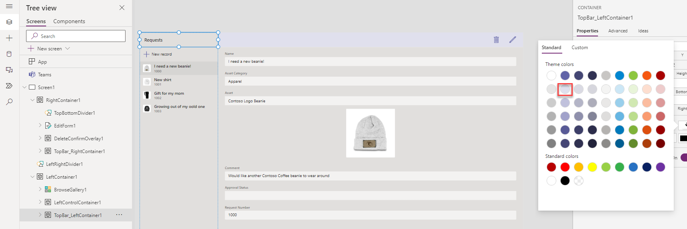](../media/match-color.png#lightbox)

1.  Expand **TopBar_LeftContainer1** and select **AppNameLabel1**. In the **Properties** pane, set the **Text** value to **Swag Requests** and then change the **Font size** value to **20**.

	> [!div class="mx-imgBorder"]
	> [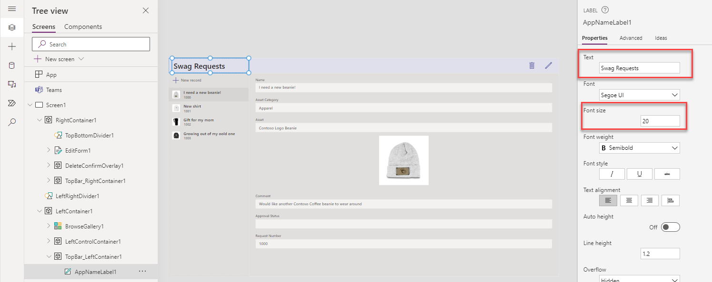](../media/swag-requests.png#lightbox)

1.  Select **LeftControlContainer1**. Change the color property to purple, as shown in the following screenshot.

	> [!div class="mx-imgBorder"]
	> 

1.  Expand **LeftControlContainer1** and then expand **IconButton_Add1**. Select **IconButton_Add_Label1** and change its **Text** property to **New request** and the **Font size** to **14**.

	> [!div class="mx-imgBorder"]
	> [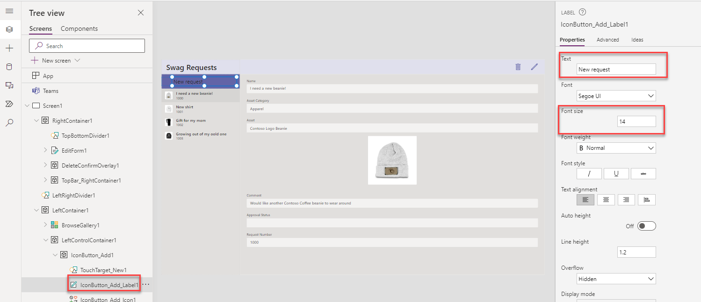](../media/icon-button-modify-properties.png#lightbox)

1.  Change the text color of **IconButton_Add_Label1** to white.

	> [!div class="mx-imgBorder"]
	> 

1.  Select **BrowseGallery1**. Within the gallery, select the first text box that appears with the title. Go to the formula bar and change the **FontSize** property to **12**. You can drag the text box to readjust the size so that the text is displayed in full.

	> [!div class="mx-imgBorder"]
	> [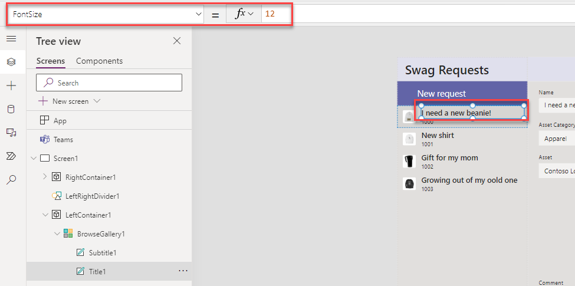](../media/text-font-size.png#lightbox)

1. Select the **Subtitle1** field, that is, the other text label, within the gallery. Change the **FontSize** property to **10**.

1. In the formula bar at the top of the screen, change the property dropdown menu to **Text**, and then enter the following formula.

	`ThisItem.'Created By'.'Full Name'& " - "& ThisItem.'Created On'`

	> [!div class="mx-imgBorder"]
	> [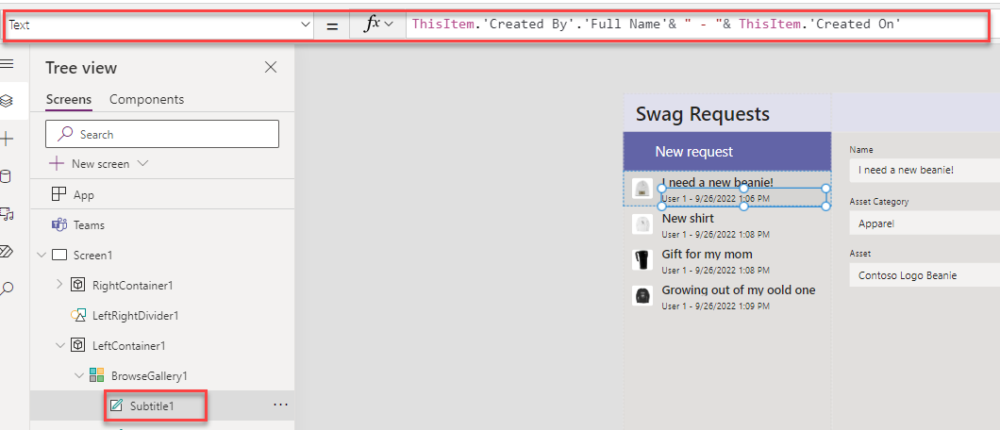](../media/formula-added.png#lightbox)

1.  From the **Tree view**, select **BrowseGallery1**, and then select the pen icon that appears in the upper-left corner of the gallery.

1.  Selecting the pen icon will allow you to readjust the cell of the gallery. Resize it to provide increased space between the cells.

	> [!div class="mx-imgBorder"]
	> [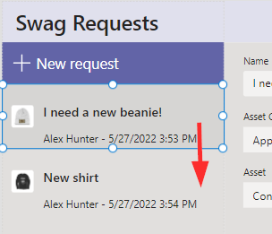](../media/increase-space.png#lightbox)

1. Increase the size of **Image1** and then move it slightly to the right, as shown in the following screenshot.

	> [!div class="mx-imgBorder"]
	> [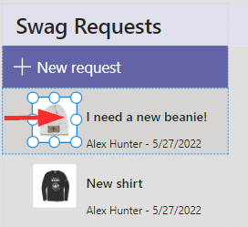](../media/move-image.png#lightbox)

1. Resize and reposition **Title1** and **Subtitle1** so that they appear as shown in the following image. Increase the space of both so that each takes up two line spaces. This approach is used so that text can overflow into the next line if necessary. You might need to reposition the image and increase the size of the cell so that it sits accurately.

	> [!div class="mx-imgBorder"]
	> [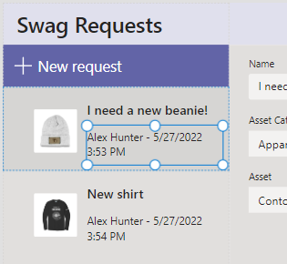](../media/size-position.png#lightbox)

1. **Save** your app.

1. Add a colored bar to each item to show the approval status. Select **BrowseGallery1** and then select the pen icon, as you did previously, so that the first cell of the gallery is selected. Select **Insert** from the ribbon and then select **rectangle**. A rectangle should now appear in each cell of the gallery.

	> [!div class="mx-imgBorder"]
	> [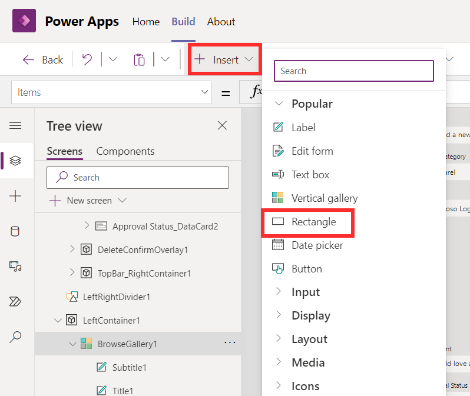](../media/rectangle.png#lightbox)

1. Resize and move the rectangle so that it appears as shown in the following image.

	> [!div class="mx-imgBorder"]
	> [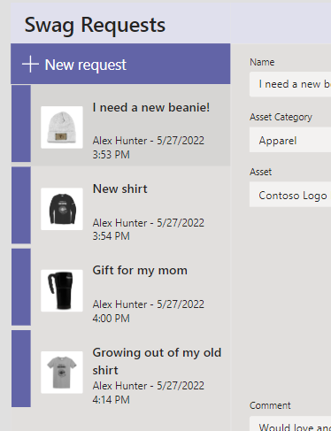](../media/move-rectangle.png#lightbox)

1. With the rectangle selected, change the property dropdown menu to **Fill**, and then enter the following formula into the formula bar. All rectangles will change to a gold color.

	`Switch(Text(ThisItem.'Approval Status'),"Approved", Green,"Rejected",OrangeRed,Gold)`

	> [!div class="mx-imgBorder"]
	> [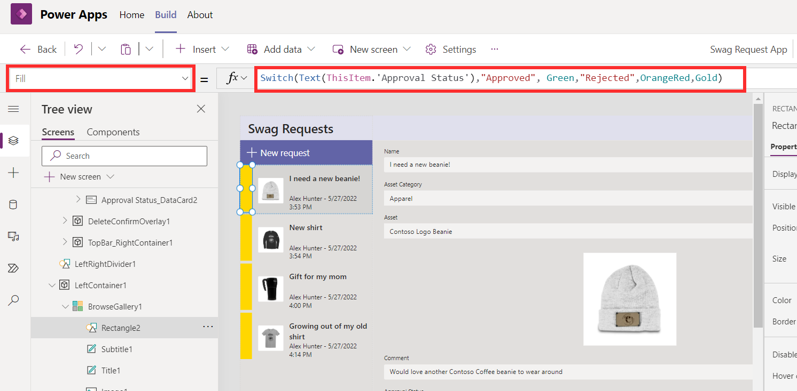](../media/rectangle-formula.png#lightbox)

### Locale differences

If your computer has its regional settings set to use the comma ',' for its decimal separator (as is done in much of Europe), your formulas will need to use a semicolon ';' instead of a comma. Instead, use the following formula. If you're in the en-us locale, you can ignore this directive.

`Switch(Text(ThisItem.'Approval Status');"Approved"; Green;"Rejected";OrangeRed;Gold)`

1. Go to view your data sources and then select **Edit data** on the Requests table.

	> [!div class="mx-imgBorder"]
	> [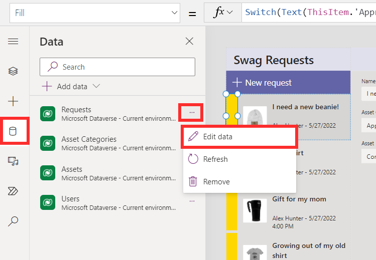](../media/edit-table-data.png#lightbox)

1.  In the Requests table, set the value of the **Approval Status** column for one row to **Approved**. For the next row, set it to **Rejected**. Leave the third row (and extra rows that you might have) blank. Close the table.

	> [!div class="mx-imgBorder"]
	> [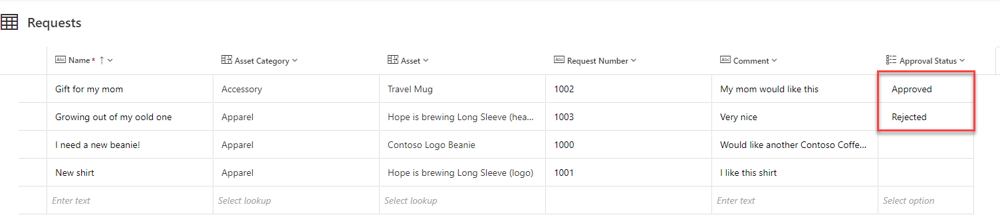](../media/approval-status.png#lightbox)

    The conditional formatting of the rectangle will appear based on the **Approval Status** field for each row.

	> [!div class="mx-imgBorder"]
	> [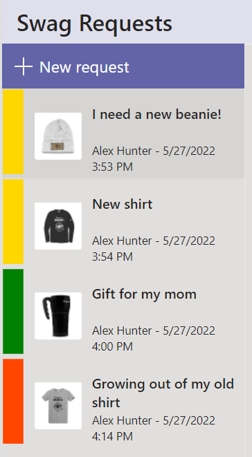](../media/conditional-formatting.png#lightbox)

1.  On the form, select the Data Card Key for the Name card (that is, **DataCardKeyX**). From the **Properties** pane, change the **FontSize** property to **12**.

	> [!div class="mx-imgBorder"]
	> [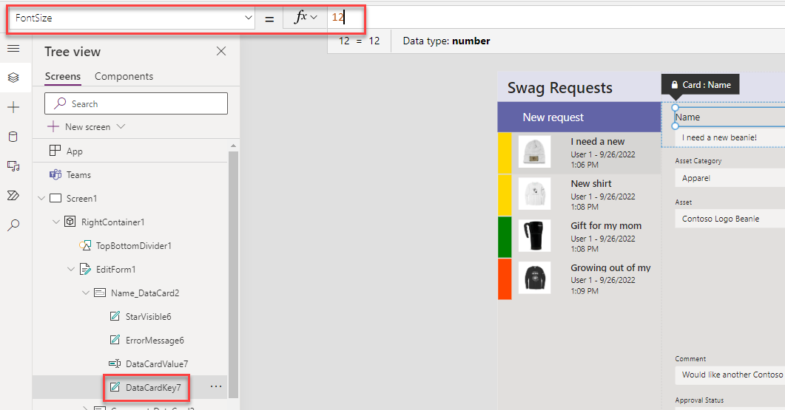](../media/font-size.png#lightbox)

1.  Set the color to **Purple**, as shown in the following screenshot. Set the **Font weight** property to **Bold**.

	> [!div class="mx-imgBorder"]
	> [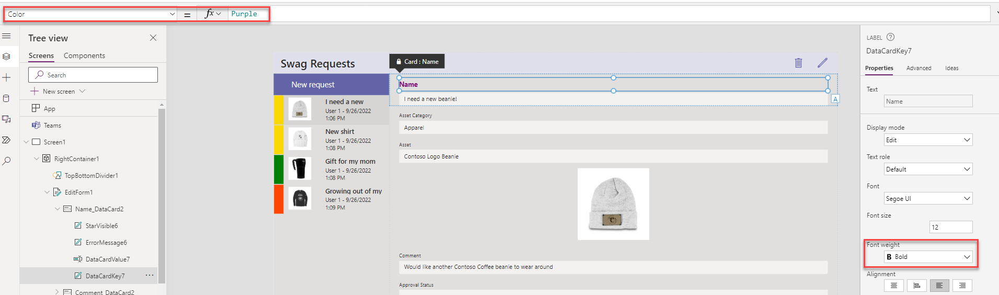](../media/purple-bold.png#lightbox)

1.  Repeat the formatting changes from the previous the step to the **DataCardKey** for the **Asset Category**, **Asset**, and **Comment** cards of the form.

1.  On the Data Card Key of the **Approval Status** and **Request Number** cards, set the **Font size** to **12** and the font **Color** to **dark gray**. Resize the cards to ensure that the text is fully visible.

	> [!div class="mx-imgBorder"]
	> [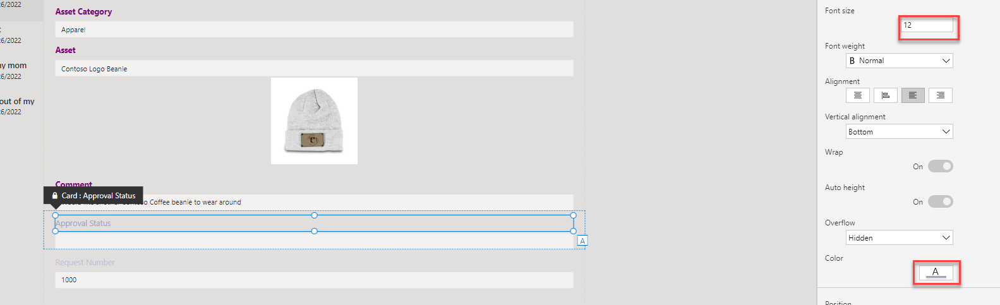](../media/font-size-color.png#lightbox)

1.  Select **Image2** from **Asset_DataCard1** (that is, the image of the asset within the form). Move it to the left, as shown in the following image.

	> [!div class="mx-imgBorder"]
	> [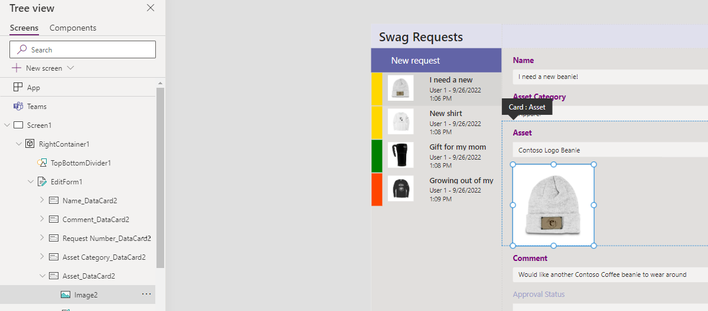](../media/image-moved.png#lightbox)

1.  **Save** and **preview** the app. From the app, you can also select a past request to view or edit it from the form.

 Your app should now resemble the following image.

> [!div class="mx-imgBorder"]
> [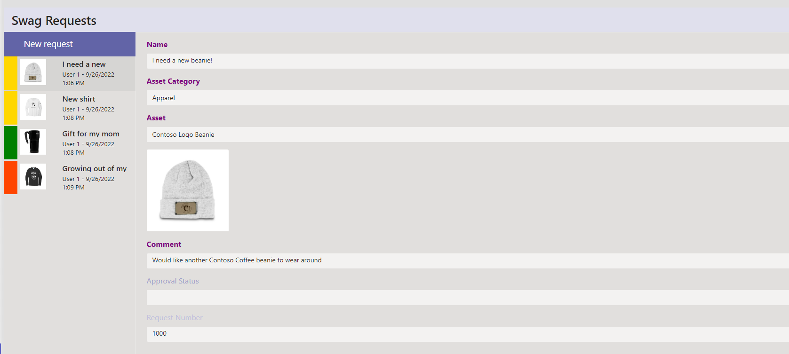](../media/finished-app.png#lightbox)
	
