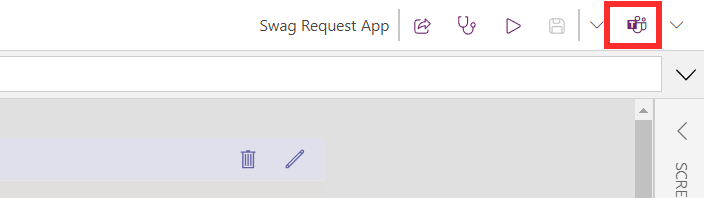
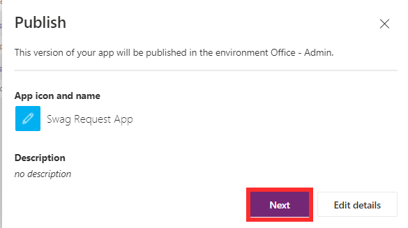
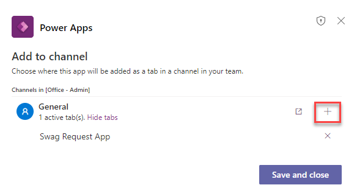
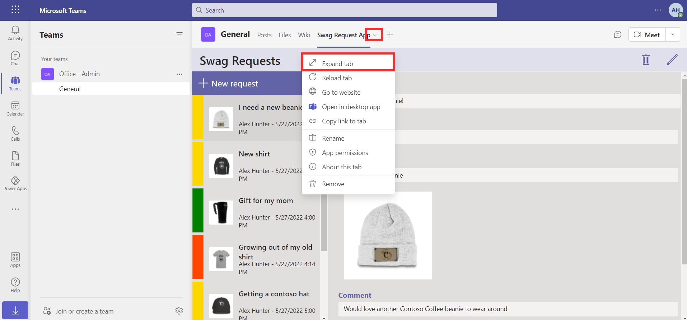
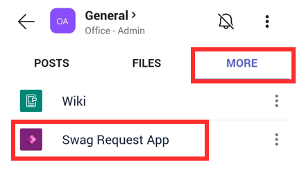
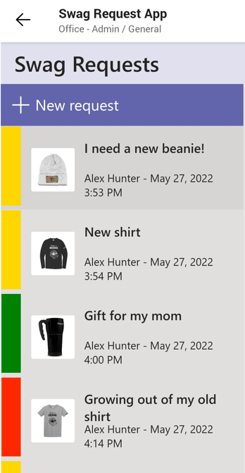

The app is now ready to be published out to Teams. Once published, it will be available for Team members to use within Microsoft Teams on desktop, web and mobile clients.

## Task: Publish the app

1.  Once you're finished previewing the app, select Publish to Teams.

	> [!div class="mx-imgBorder"]
	> 

1. Select **Next**.

	> [!div class="mx-imgBorder"]
	> 

1. You can then select the channel that you would like to add the app to. Select the **+** icon next to General, then select **Save and close**.

	> [!div class="mx-imgBorder"]
	> 

## Task: Interact with the app on Teams

1.  You can now go to the Team where your app is published and interact with your app. Test it out by submitting at least three more requests. If you would like to view the app full screen, you can select the down arrow button besides the app name then select **Expand Tab**.

	> [!div class="mx-imgBorder"]
	> 

## Task: Interact with the app on Teams mobile app (Optional)

The app you've published is also available to users via the Microsoft Teams mobile app.

1.  Install the Microsoft Teams app from the app store on your mobile device.

1.  Log into the app using your **lab credentials**, then navigate to the channel where your app has been published.

1.  Select **More**, then **Swag Request App** to launch the app.

	> [!div class="mx-imgBorder"]
	> 

1.  You can interact with the app from here. You'll notice that the interface has been optimized to the size of your device screen.

	> [!div class="mx-imgBorder"]
	> 