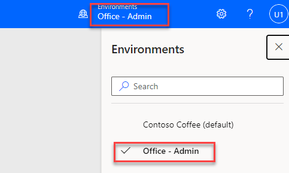
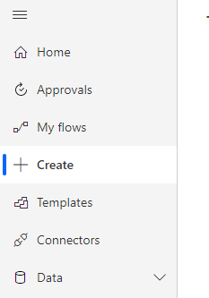
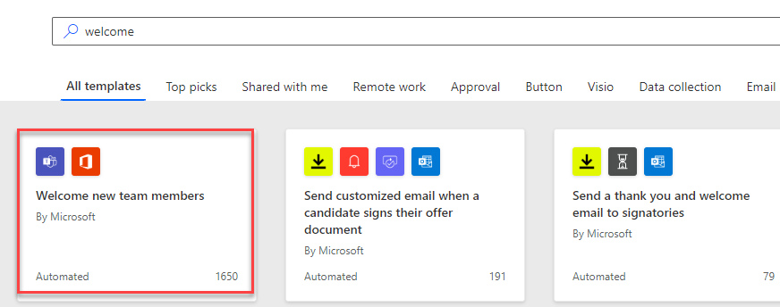
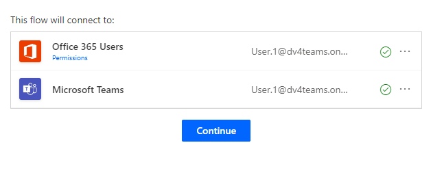
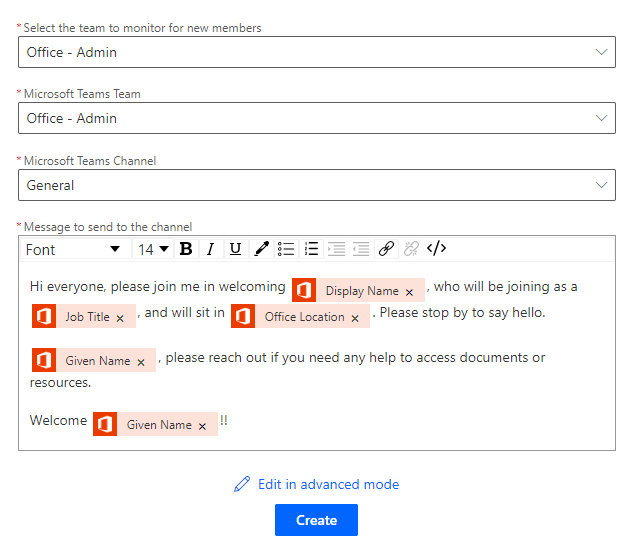
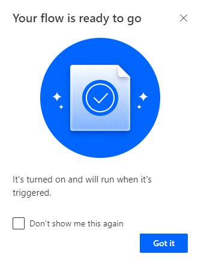
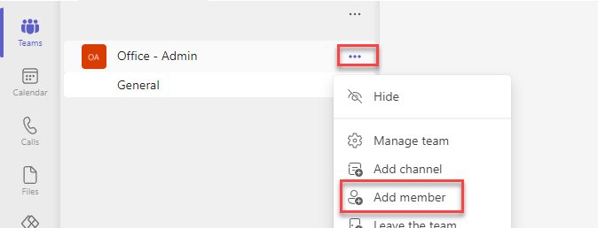
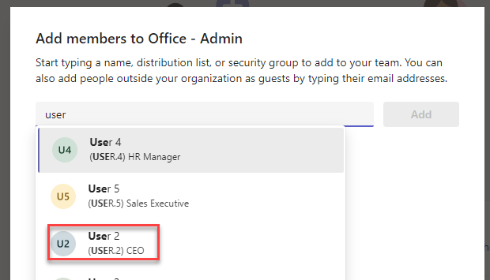
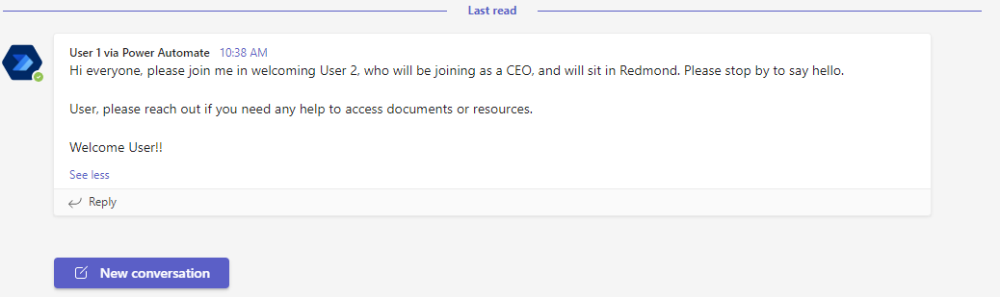

In this exercise, you'll learn how to create Power Automate flows outside of Teams.

You'll create a flow that will welcome new team members. In this flow, someone being added to your team is the trigger. You'll add other people from your lab group into your team during this exercise. You'll collaborate in these teams throughout the later labs, to get the experience of using Teams for collaboration with colleagues.

## Task - Welcome new team members

1. Navigate to [Power Automate](https://make.powerautomate.com/?azure-portal=true) and select the Teams environment you created.

    > [!div class="mx-imgBorder"]
    > 

1. Select **Create**.

    > [!div class="mx-imgBorder"]
    > 

1. Search for welcome and select the template called **Welcome new team members**.

    > [!div class="mx-imgBorder"]
    > 

1. This flow uses two connectors. You're already signed into both connectors, so now select **Continue**. If you aren't already signed to a connector, just select the Sign-in beside the connector. When you see the green check confirming sign-in, select **Continue**.

    > [!div class="mx-imgBorder"]
    > 

1. The next step in the template asks you to select some options.

    - In both boxes labeled **Team To Monitor** and **Teams Team**, choose the Team you've created for the lab. (In a real business scenario, you may have someone joining one team and want to make a welcome announcement in another team, which is why there are two options here.)

    - In the Microsoft Teams Channel, choose the **General** channel.

    - You may edit the message. When you're done, select **Create**.

    > [!div class="mx-imgBorder"]
    > 

1. You'll see a confirmation message that your workflow has been created. Select **Got it**.

    > [!div class="mx-imgBorder"]
    > 

## Task - Add a member to your team to trigger the flow

1. Go back to your Team on [Microsoft Teams](https://teams.microsoft.com/?azure-portal=true).

1. Select the **Teams** icon.

1. Select the **More options** button of **Office - Admin** name and select **Add member**.

    > [!div class="mx-imgBorder"]
    > 

1. Search for their name and select **Add**.

    > [!div class="mx-imgBorder"]
    > 

1. Close the dialog.

1. After the member you added joins the team, the flow will post the welcome message to the general channel. It can take few minutes.

    > [!div class="mx-imgBorder"]
    > 
