You can also create your own flows from blank and use them to connect with your Dataverse for Teams tables. To create flows, you need to work in the Power Apps app. In this exercise, we'll build a flow that will trigger an approval process when someone submits a new request for swag via the app you built in the previous lab.

## Task - Create a flow from blank

1. Navigate to the Power Apps app using the left-hand navigation bar, and go to the **Build** tab. Select your Team and then select **See all** at the bottom of the list of Items created.

    > [!div class="mx-imgBorder"]
    > [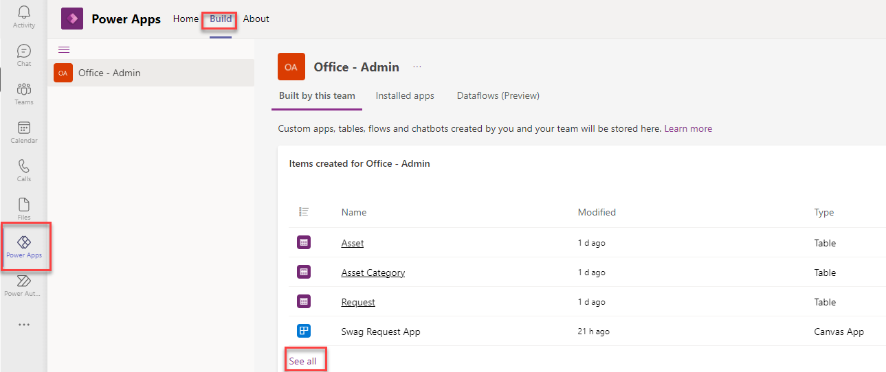](../media/see-all.png#lightbox)

1. Select **Cloud Flows** from the left-hand menu, then **New > Cloud Flow > Automated**.

    > [!div class="mx-imgBorder"]
    > 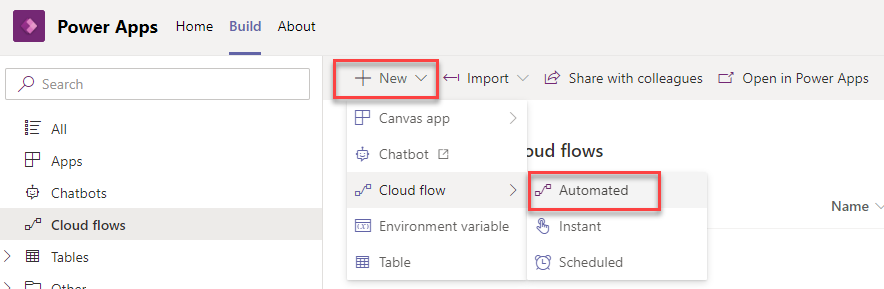

1. Give your flow a name: **Request approval**

1. Search for when a row is added and select **When a row is added, modified or deleted Microsoft Dataverse**. Then select **Create**.

    > [!div class="mx-imgBorder"]
    > [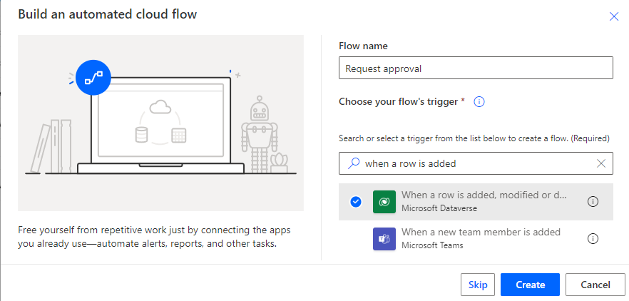](../media/request-approval.png#lightbox)

1. You're now in the full Power Automate editor that allows you to build your own flow. The flow starts with a trigger, which in this case is that a Request is created in your Dataverse for Teams table. In the trigger action, select the following options.

   - **Change type**: Create

   - **Table Name:** Requests

   - **Scope**: Organization

1. Then Select **New step**.

    > [!div class="mx-imgBorder"]
    > 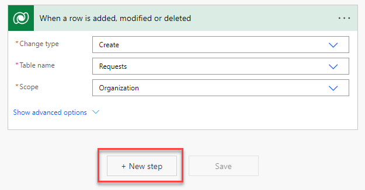

1. We're going to add a step to get the name of the asset that the person requested. The asset is in a related table, so we need to use a Get row by ID action to retrieve all the details of that asset. Search **get a row by id** and select the **Get a row by ID Microsoft Dataverse** action.

    > [!div class="mx-imgBorder"]
    > 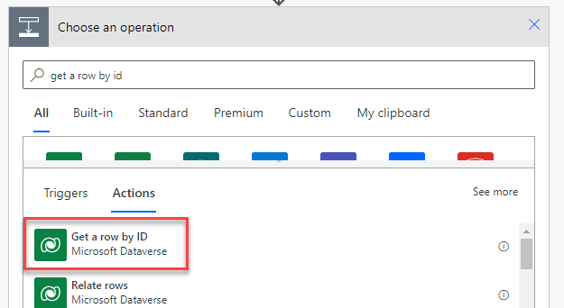

1. In the Table name dropdown, choose **Assets**. In the Row ID section, select **Asset (Value)** from the Dynamic content pop out box.

    > [!div class="mx-imgBorder"]
    > [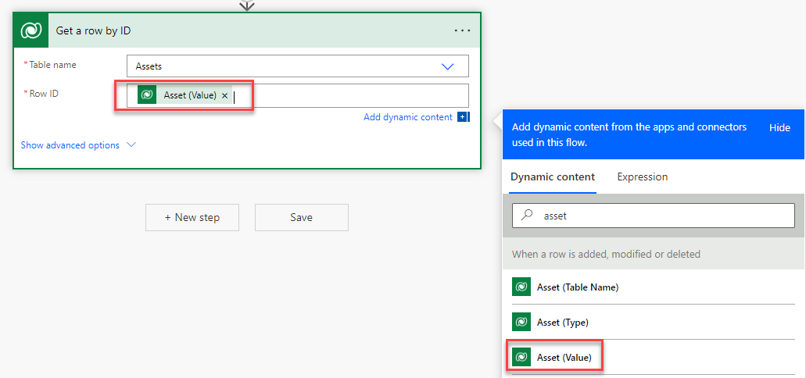](../media/asset-value.png#lightbox)

1. Select **New Step**.

1. Search for **approval** and select **Start and wait for an approval**.

    > [!div class="mx-imgBorder"]
    > 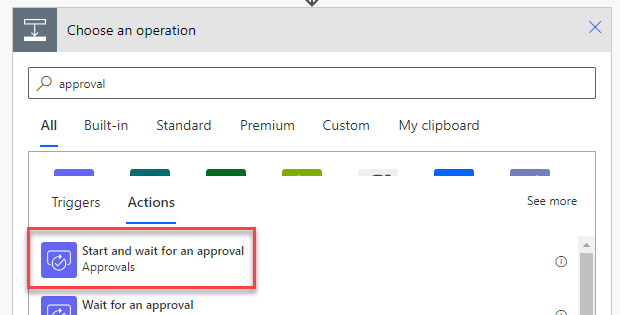

1. You'll see a brief message while the connection to the Approvals connector is established. When it's done, select **Approve/Reject - First to respond** in the Approval type dropdown.

    > [!div class="mx-imgBorder"]
    > 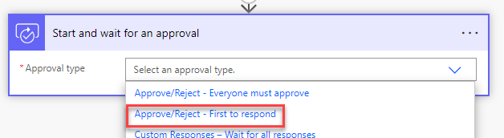

1. Fill in the rest of the **Start and wait for an approval** action as follows:

    > Title: Swag request
    >
    > In the **Assigned to** box, start typing the email address you used to log in for the lab, and then select the name of the user when it appears.

    > [!NOTE]
    > For training purposes here, you are approving or rejecting your own requests. In a real world scenario, you would either enter the name of the approving manager here, or you would use the Office 365 Connector to dynamically retrieve the name of the manager of the person making the request.

    > [!div class="mx-imgBorder"]
    > 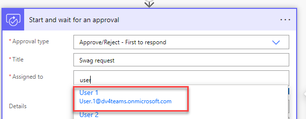

1. In the Details box, type: **Swag requested:**

    Then go into the dynamic content pane and select **Asset Name**.

    > [!NOTE]
    > The grey shaded label just above the list of columns is coming from the previous step, **Get a row by ID**.

    > [!div class="mx-imgBorder"]
    > [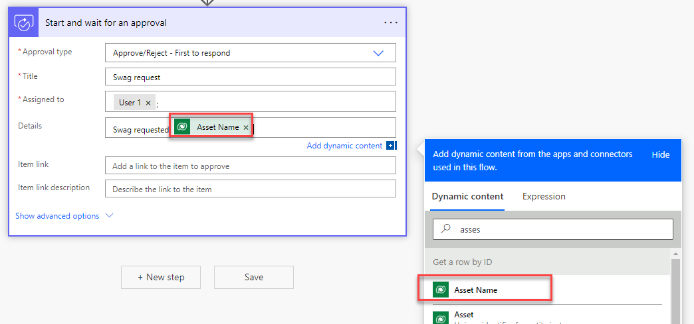](../media/asset-name.png#lightbox)

1. Press enter to add a new line and type:

    > Comments:

    Then go into the dynamic content pane and search: comment

    You'll see the Comment column in the list. Select it.

    > [!NOTE]
    > The grey shaded label just above the list of columns is coming from the first step, **When a row is added, modified or deleted** (because the comments are from the **Request** table).

    > [!div class="mx-imgBorder"]
    > [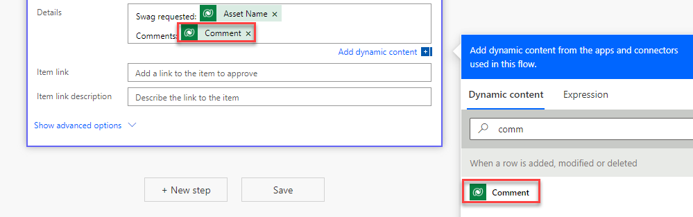](../media/comment.png#lightbox)

1. You'll set up a condition to check the outcome of the approval. Select **New** step.

1. Select the **Condition** Control.

    > [!div class="mx-imgBorder"]
    > 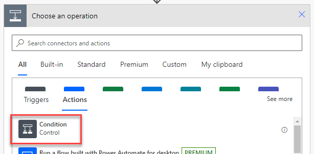

1. In the left box where you're asked to Choose a value, select **Outcome** from the dynamic content pane.

    > [!div class="mx-imgBorder"]
    > [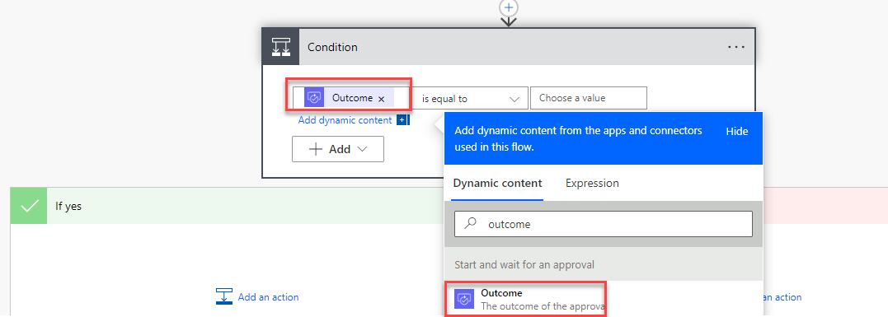](../media/outcome.png#lightbox)

1. In the right-hand box, type: **Approve**.

    > [!div class="mx-imgBorder"]
    > 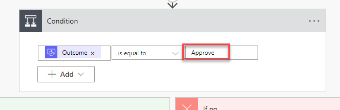

1. In the **If yes / If no** steps under the condition, you'll update the request in your Dataverse for Teams table as approved or rejected, depending on the outcome of the approval. In the **If yes** box, select **Add an action**.

    > [!div class="mx-imgBorder"]
    > [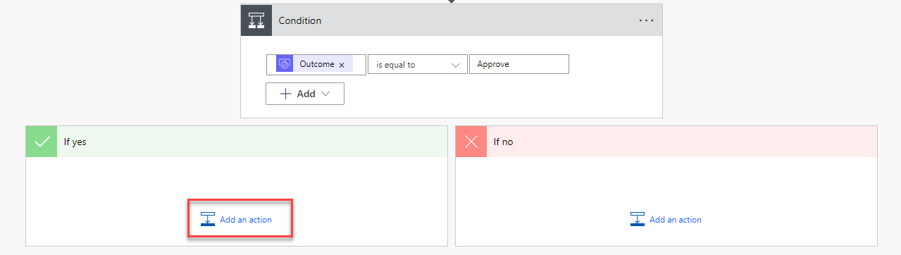](../media/add-action.png#lightbox)

1. Search for update a row and select **Update a row Microsoft Dataverse**.

    > [!div class="mx-imgBorder"]
    > 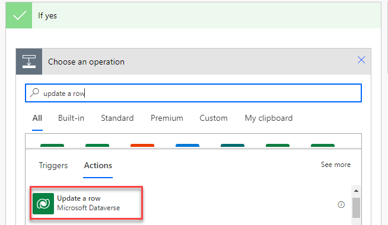

1. We're updating the request record from the first step (the one that triggered the approval process). In the Table name box, select **Requests**, and in the Row ID, go to the dynamic content pane and search for requests. Select **Request** which has come from the When a row is added, modified or deleted step.

    > [!div class="mx-imgBorder"]
    > [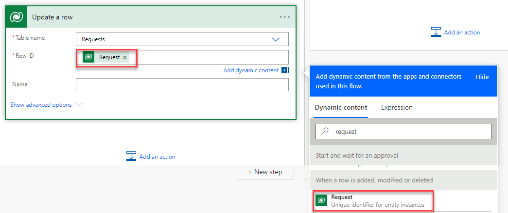](../media/request.png#lightbox)

1. Select **Show advanced options** to see the rest of what you can update in this record.

    > [!div class="mx-imgBorder"]
    > 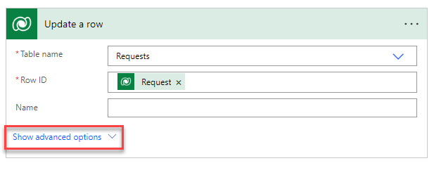

1. In the **Approval Status** box, select **Approved**.

    > [!div class="mx-imgBorder"]
    > 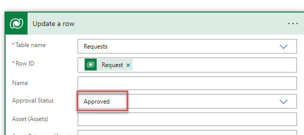

1. We'll repeat these steps for the **If no path**. In the **If no** box, select **Add an action**.

    > [!div class="mx-imgBorder"]
    > [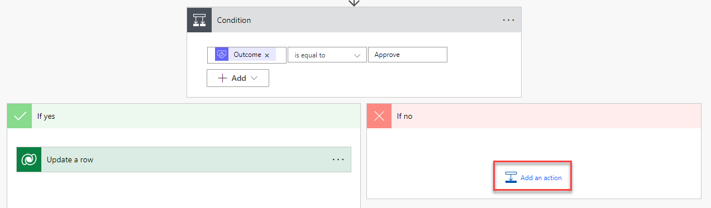](../media/if-no-action.png#lightbox)

1. Search for update a row and select **Update a row Microsoft Dataverse**.

    > [!div class="mx-imgBorder"]
    > 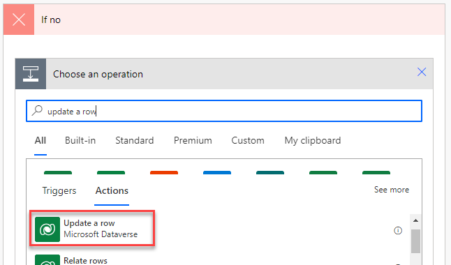

1. In the Table name box, select **Requests**, and in the Row ID, go to the dynamic content pane and search for requests. Select **Request** which has come from the When a row is added, modified or deleted step.

    > [!div class="mx-imgBorder"]
    > [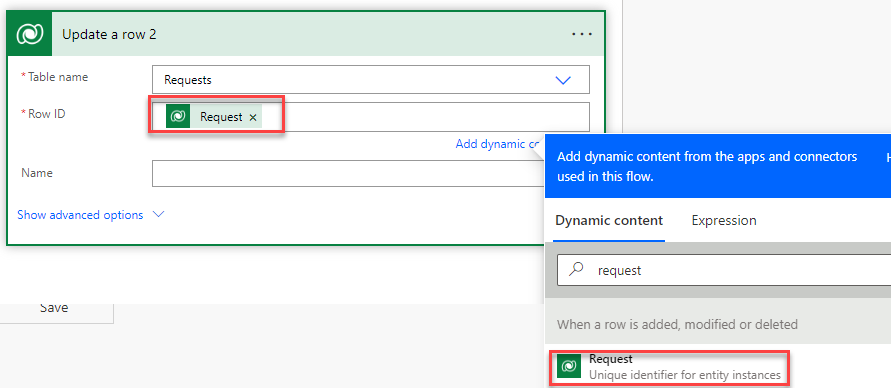](../media/update-request.png#lightbox)

1. Select **Show advanced options** to see the rest of what you can update in this record. In the **Approval Status** box, select **Rejected**.

    > [!div class="mx-imgBorder"]
    > 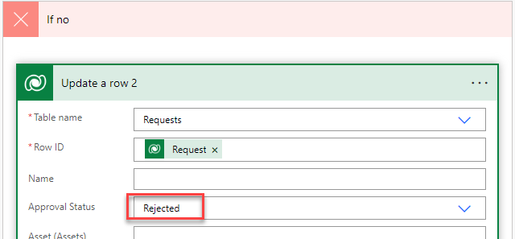

1. Save your flow by selecting the **Save** button.

    > [!div class="mx-imgBorder"]
    > 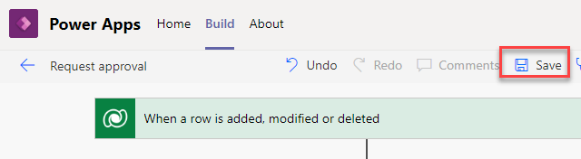

    > [!NOTE]
    > You may get the following warning message. This is just letting you know that the functionality for approvals needs to be provisioned--this will happen automatically in the background, and is a one-off process the first time you create an approval flow. You can ignore this and move on to the next step.
    >
    > [!div class="mx-imgBorder"]
    > 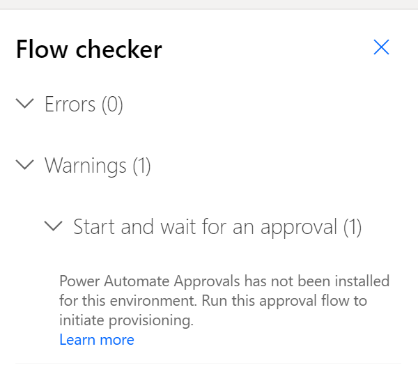

1. Congratulations! You have now finished building your first flow from scratch. Let's see it in action. You can see when your flow is saved by the confirmation message next to the name of the flow. Once it's done, navigate back to the team you've been working on by selecting the main Teams icon in the left hand navigation bar.

    > [!div class="mx-imgBorder"]
    > [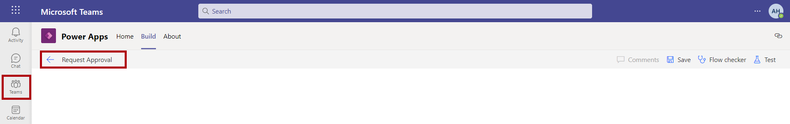](../media/teams-flow.png#lightbox)

1. Open your **Swag Request App** in the tab and submit a new request.

    > [!div class="mx-imgBorder"]
    > [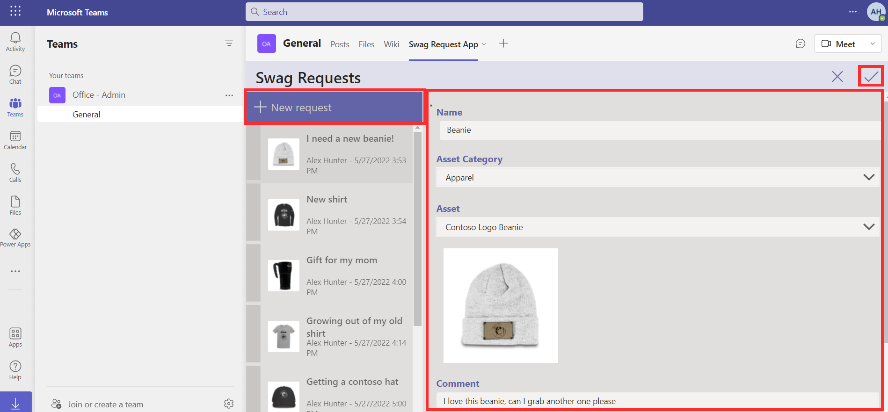](../media/swag-request.png#lightbox)

1. Open a new tab in your browser and navigate to [Outlook](https://outlook.office365.com/?azure-portal=true) to open Outlook for your lab user account. You'll see an email with the approval request. You'll also receive a Teams notification with the same request.

1. Select **Approve**, provide comment and select **Submit**.

    > [!NOTE]
    > The approval connector can take up to 15 minutes to work the first time, because it installs a solution behind the scenes. If you don't see the email right away, have a break for 15 minutes here and come back to it. Once this first installation is done, any other approvals will come through almost instantly.
    >
    > [!div class="mx-imgBorder"]
    > 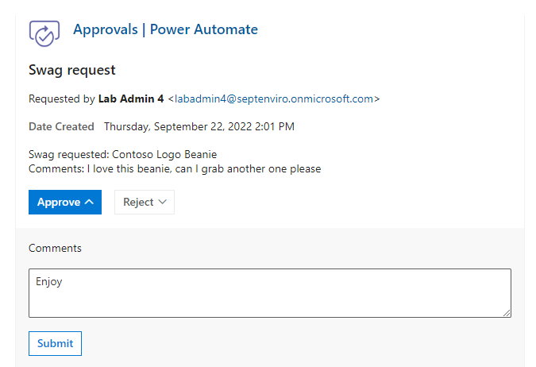

1. Go back to Teams in the other browser tab. Refresh the app by selecting the reload tab button. You'll see the request has been updated to show that the Approval Status is now Approved.

    > [!div class="mx-imgBorder"]
    > [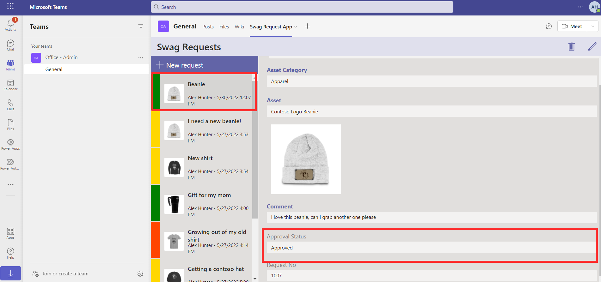](../media/approved-request.png#lightbox)
