In this exercise, you'll create a flow in Microsoft Teams.

## Task - Discover and add the Power Automate app to Teams

In this task, you'll add the Power Automate app to Teams.

1. Select the **Apps** icon on the left toolbar and then search for Power Automate.

    > [!div class="mx-imgBorder"]
    > [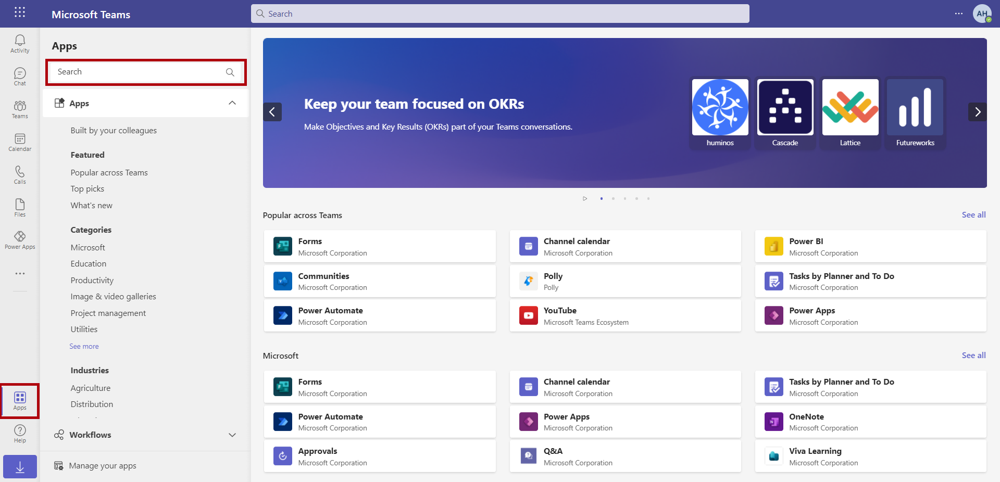](../media/apps-icon.png#lightbox)

1. Select the **Power Automate** app when you find it in the search results.

    > [!div class="mx-imgBorder"]
    > [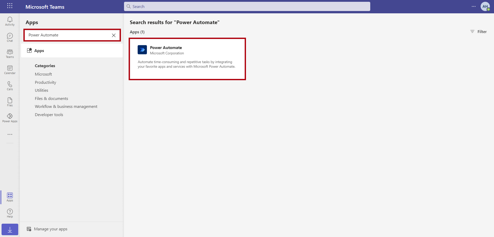](../media/power-automate-app.png#lightbox)

1. A pop-up window will appear, displaying information about the Power Automate app for Microsoft Teams. Select the **Add** button.

    > [!div class="mx-imgBorder"]
    > [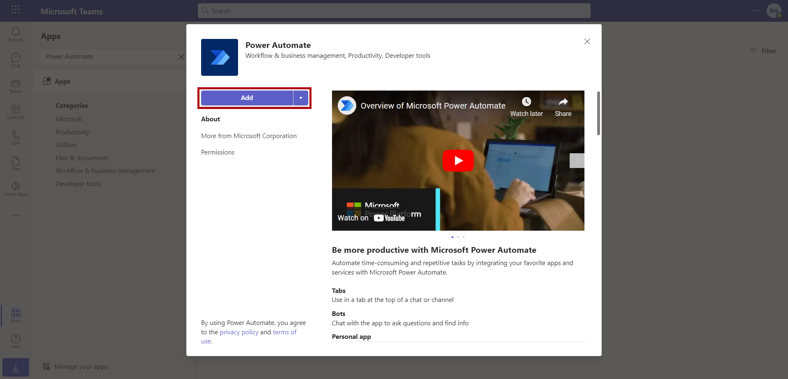](../media/add-power-automate.png#lightbox)

1. If prompted, select your country or region and then select **Get started**.

1. The Power Automate app will display in the left navigation bar. Right-click that icon and select **Pin**, which will pin the app to the navigation bar. Pinning the app will help make it easier for you to return to it when necessary.

    > [!div class="mx-imgBorder"]
    > [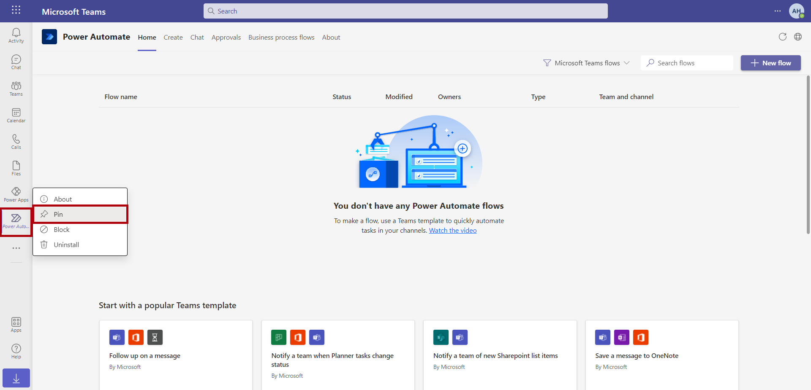](../media/pin-app.png#lightbox)

## Task - Navigate the Power Automate app for Teams

In this next task, you'll navigate the Power Automate apps for Teams.

1. On the home screen, a section for your flows will display. It's blank because you haven't created flows yet. However, as you work through this lab and create flows, this screen is where you'll go to edit them and to view your flow running to determine if it needs troubleshooting.

    > [!div class="mx-imgBorder"]
    > [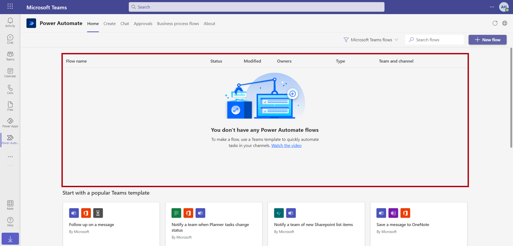](../media/no-flow.png#lightbox)

1. Select the **Create** tab at the top. A range of the most popular templates will display, and a menu of categories down the side will help you browse all available templates. Scroll through a few categories to get familiar with the range and types of Teams templates that are available for you to work with.

    > [!div class="mx-imgBorder"]
    > [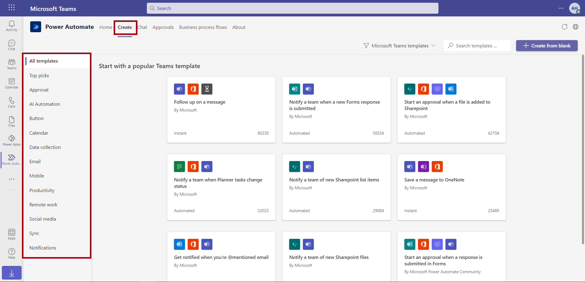](../media/create.png#lightbox)

## Task - Create a flow with the Follow up on a message template (Optional)

Follow these steps to create a flow by using the **Follow up on a message** template. This exercise is optional.

1. Go to the **Productivity** category and select the **Follow up on a message** template (you might need to select **See more templates**).

    > [!div class="mx-imgBorder"]
    > [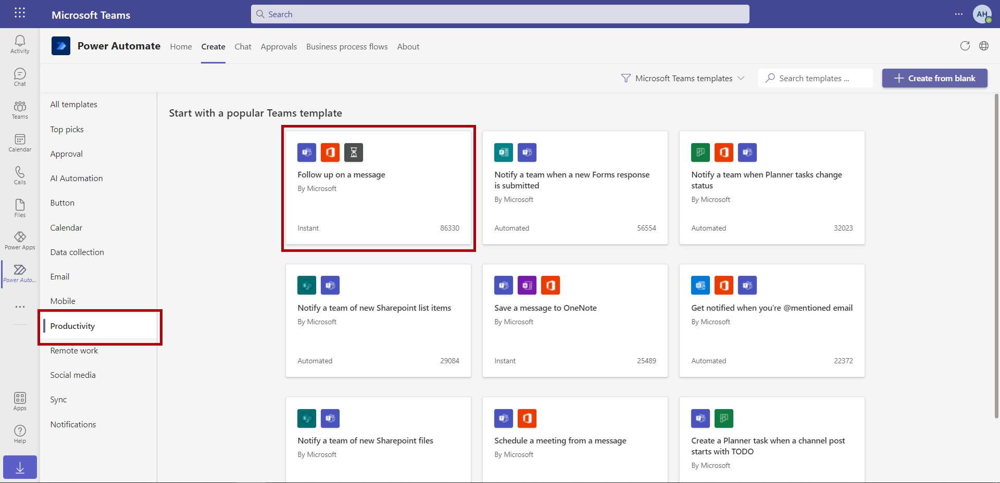](../media/productivity.png#lightbox)

1. A simple template to build this flow will appear. The name will already be filled in from the template (you can change it, but for now, leave it as it is). It will also prompt you to sign in to any connectors that the flow needs to use. In this case, because it's the first time that you're using a flow to connect to Microsoft Teams and Microsoft Office 365 users, you'll need to sign in. Select **Sign in** next to the **Microsoft Teams** connector and the **Office 365 Users** connector in the **Sign in** section.

    > [!div class="mx-imgBorder"]
    > [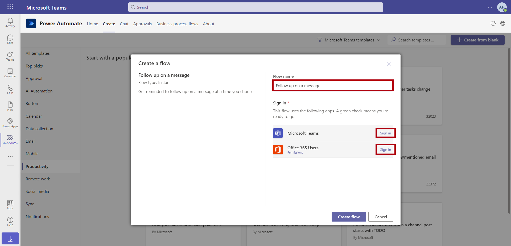](../media/create-flow.png#lightbox)

1. A spinning wheel will appear on the screen while the sign-in process is in progress. When the process is complete, a green check mark will appear, indicating that you're ready to go. Select **Create Flow**.

    > [!div class="mx-imgBorder"]
    > [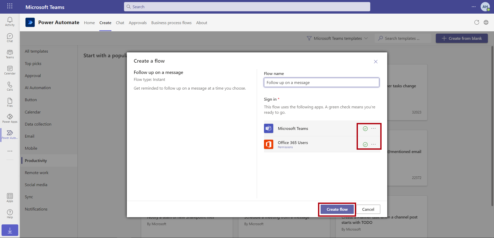](../media/green-check.png#lightbox)

1. A confirmation message will display, indicating that your workflow has been created and providing instructions on how to trigger the flow. Select **Done** to close the pop-up window.

    > [!div class="mx-imgBorder"]
    > [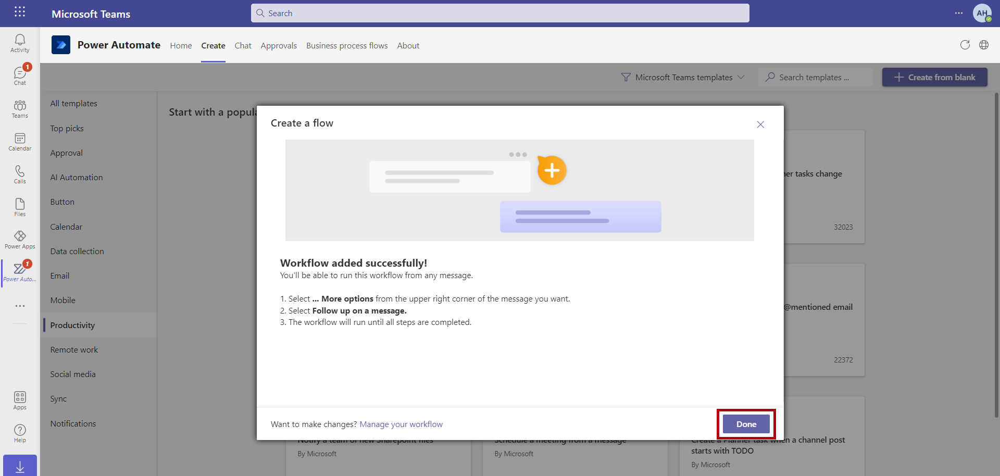](../media/confirmation.png#lightbox)

1. Select the **Home** tab of Power Automate for Teams and then select the Power Automate flow that you created.

    > [!div class="mx-imgBorder"]
    > [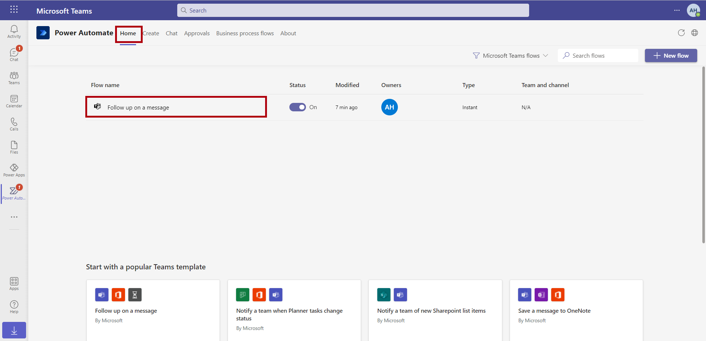](../media/home.png#lightbox)

Details of your flow will display: when it was created, what connectors are being used, who the owners are, and details of any run history. Nothing will show yet because the flow hasn't been run. You can return to this screen anytime through the **Home** tab of the Power Automate app in Teams.

   > [!div class="mx-imgBorder"]
   > [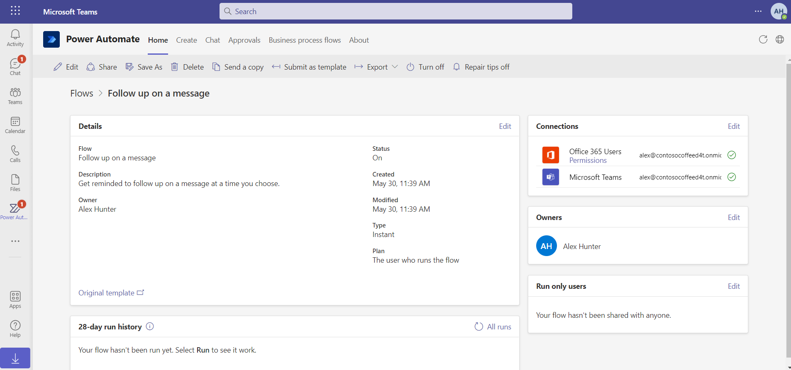](../media/details.png#lightbox)

## Task - Create a message in Teams and trigger your flow (Optional)

Next, you'll create a message in Teams and will trigger your flow. This exercise is optional.

1. Select the main Teams icon in the left navigation bar of Teams. Go to the general channel of the team that you've been working in. Start a new conversation and then type a message, such as:

    > **Get your swag orders in!**
    >
    > We have some new Contoso Coffee shirts - check them out and place your order via the Swag Request app.

    > [!div class="mx-imgBorder"]
    > [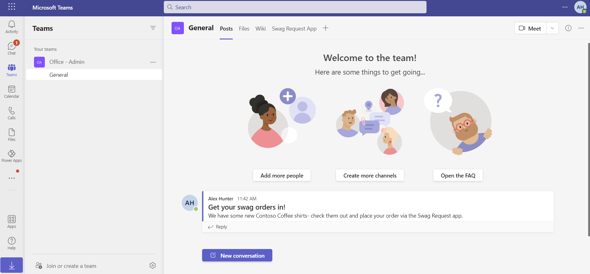](../media/new-message.png#lightbox)

1. Trigger the flow from this message to set a reminder to follow up later. Hover over the message, select the ellipsis (**...**), and then select **More actions**. In the list of actions, select **Follow up on a message**. If you can't find the action listed, select **See more**.

    > [!div class="mx-imgBorder"]
    > [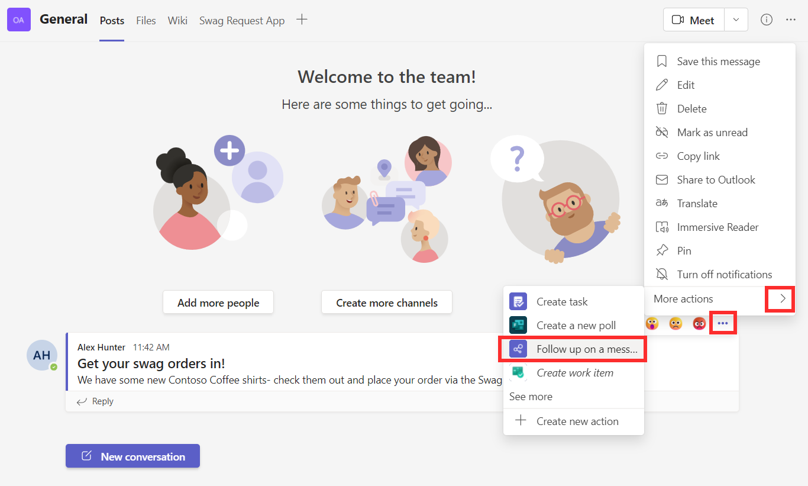](../media/follow-up.png#lightbox)

1. You'll be prompted with a question asking when you want to be reminded. Select the current date, and for the time, select 30 minutes from the current time. Select **Submit**.

    > [!div class="mx-imgBorder"]
    > 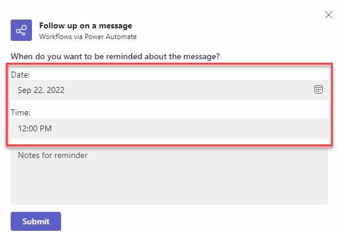

1. **You can move on to Exercise: Collaboration. Continue the rest of this lab while waiting for this flow to run.** In 30 minutes, a notification will appear in the activity. Select the activity to view the message that you've set as a trigger of your flow.

    > [!div class="mx-imgBorder"]
    > [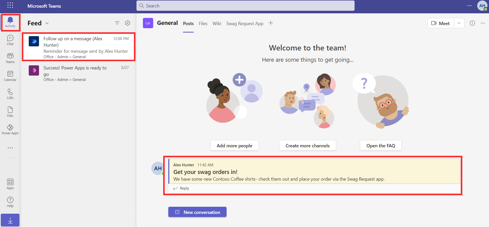](../media/feed.png#lightbox)

1. Return to the Power Automate app by using the icon on the left menu bar that you previously pinned. Open your flow by selecting its name.

    > [!div class="mx-imgBorder"]
    > [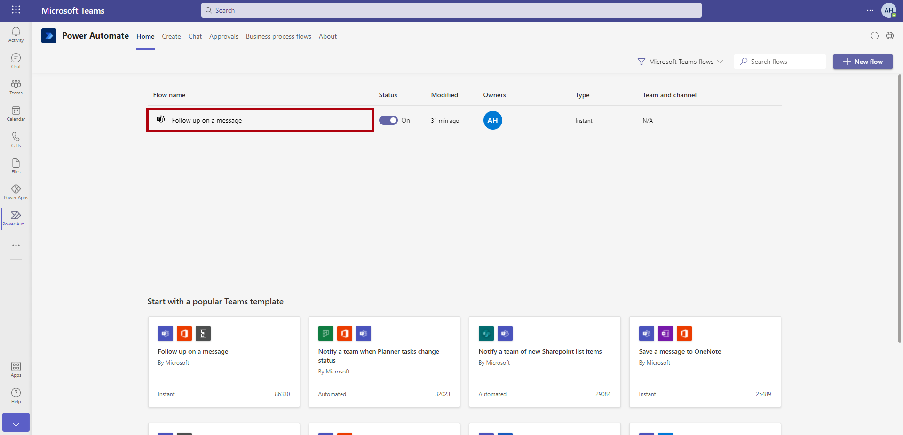](../media/follow-up-flow.png#lightbox)

The run history will show that your flow ran successfully.

   > [!div class="mx-imgBorder"]
   > [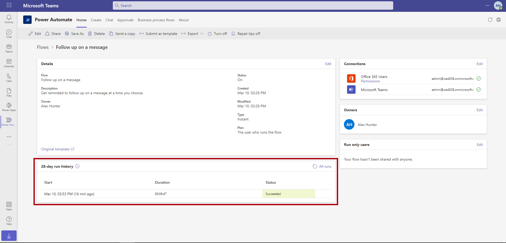](../media/run-history.png#lightbox)
