In this exercise, you'll extend the flow to send a Teams message to the user, informing them of whether their request has been approved or rejected.

## Task - Edit your flow

To edit your flow, follow these steps:

1. Return to Power Apps by using the icon on the left menu bar of Teams. Select the **Build** tab, select your team, and then select **See all**.

    > [!div class="mx-imgBorder"]
    > [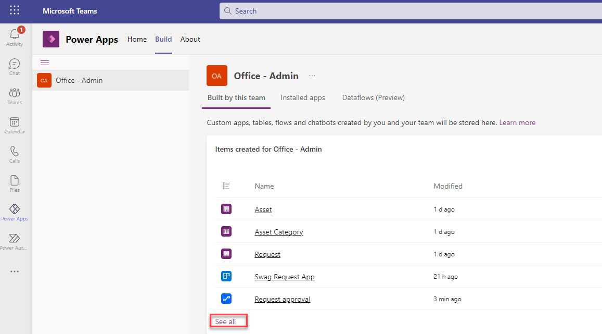](../media/built-team.png#lightbox)

1. Go to **Cloud flows** and select the **Request approval** flow in the list to open it for editing.

    > [!div class="mx-imgBorder"]
    > [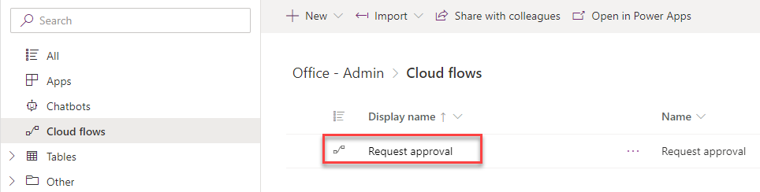](../media/cloud-flows.png#lightbox)

1. Select **Edit** to open your flow.

    > [!div class="mx-imgBorder"]
    > 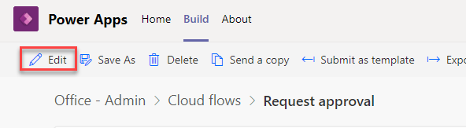

1. Select the **Condition** step to open it.

    > [!div class="mx-imgBorder"]
    > 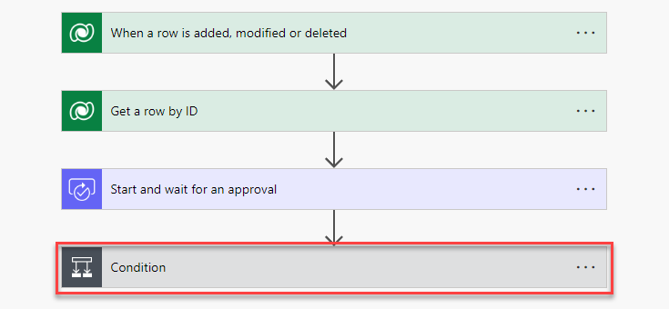

1. In the **If yes** path, under the **Update a row** action, select **Add an action**.

    > [!div class="mx-imgBorder"]
    > 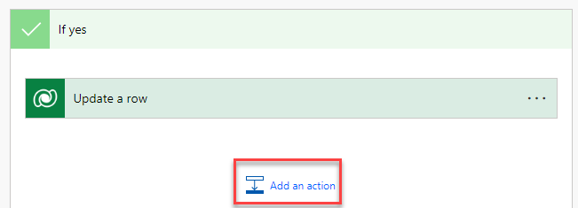

1. Search for the phrase **get a row by ID** and then select **Get a row by ID Microsoft Dataverse**.

1. In the **Table name** dropdown menu, select **Users**. In the **Row ID** field, add the dynamic content **Owner (Value)** from the **When a row is added, modified or deleted** action.

    > [!div class="mx-imgBorder"]
    > 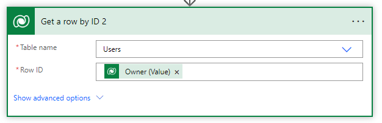

1. Add a new action underneath. Search for the phrase **post a message** and then select the **Post message in a chat or channel** action. You might need to wait a moment for the connection with the Microsoft Teams connector to be established and for the sign-in process to complete.

    > [!div class="mx-imgBorder"]
    > 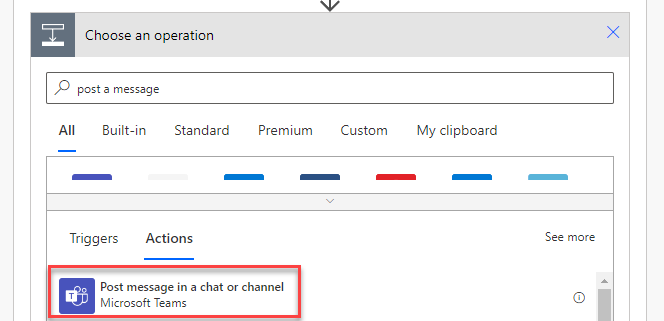

1. Fill in the details as follows:

    - **Post as** - Flow bot

    - **Post in** - Chat with Flow bot

    - **Recipient** - Select dynamic content Primary Email

    - **Message:** 

        > Approved!
        >
        > Your request has been approved by APPROVER NAME APPROVER EMAIL
        >
        > Details:
        > REQUEST NAME
        > ASSET NAME
        > Request No: REQUEST NUMBER
        >
        > Approver Comments: APPROVER COMMENTS

        > [!NOTE]
        > The capitalized items in the message are the parts that you'll replace with dynamic content. Follow the ensuing instructions for each section.
        >
        > [!div class="mx-imgBorder"]
        > 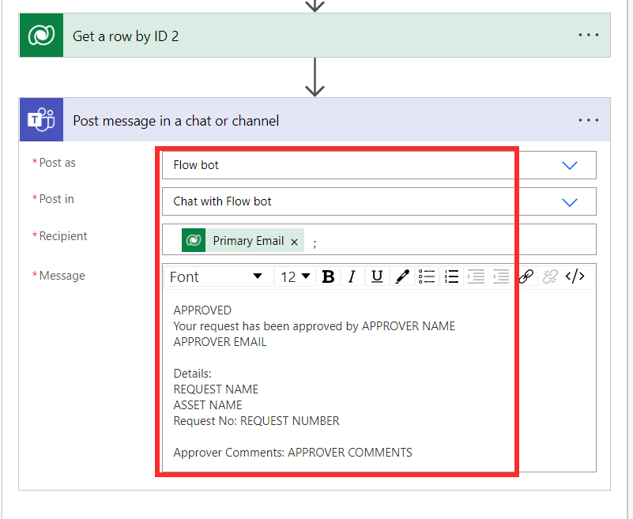

1. Replace the capitalized text with the following dynamic content.

    - **APPROVER NAME** - Search for **approver** and then select **Responses Approver name**, which is from the **Start and wait for approval** action. This step will place your Teams action in an **Apply to Each** control.

    > [!div class="mx-imgBorder"]
    > [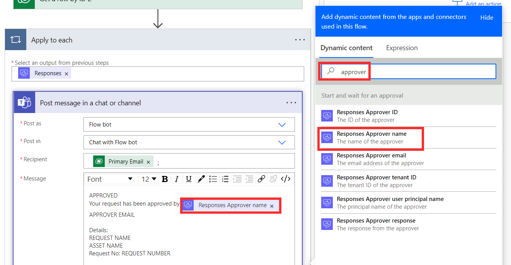](../media/approver-name.png#lightbox)

    - **APPROVER EMAIL** - Search for **approver** and then select **Responses Approver email**, which is from the **Start and wait for approval** action.

    > [!div class="mx-imgBorder"]
    > [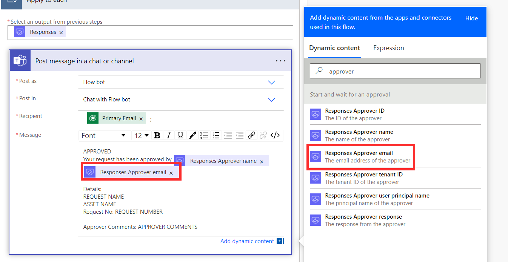](../media/approver-email.png#lightbox)

    - **REQUEST NAME** - Search for **name** and then scroll down until you find **Name** in the **When a row is added, modified or deleted** section. Multiple columns called **Name** are in your flow. You'll want to find the name of the request record that triggered the flow.

    > [!div class="mx-imgBorder"]
    > [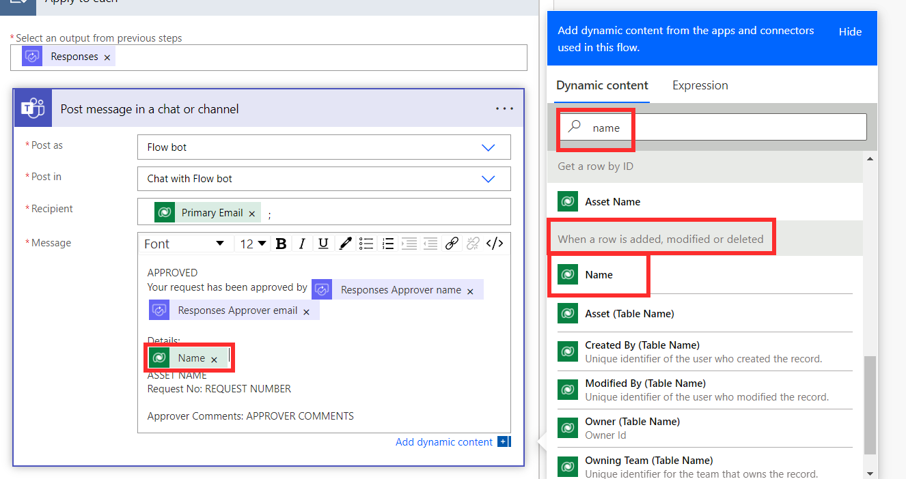](../media/request-name.png#lightbox)

    - **ASSET NAME** - Search for **name** and then scroll down until you find **Asset Name** in the **Get a row by ID** section. Multiple columns called **Name** are in your flow. You'll want to find the name of the asset.

    > [!div class="mx-imgBorder"]
    > [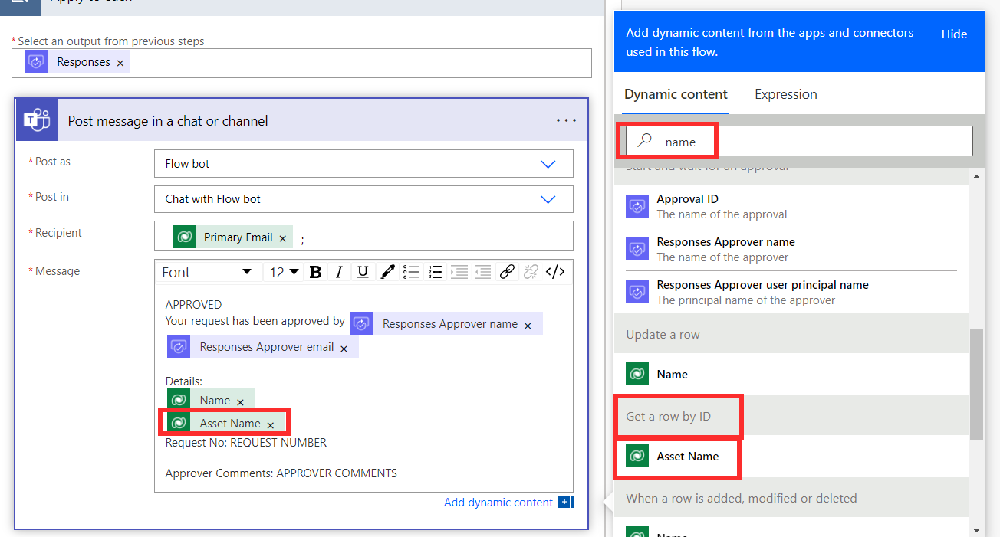](../media/asset-name-action.png#lightbox)

    - **REQUEST NUMBER** - Search for **request number** and then select **Request Number** in the **When a row is added, modified or deleted** section.

    > [!div class="mx-imgBorder"]
    > [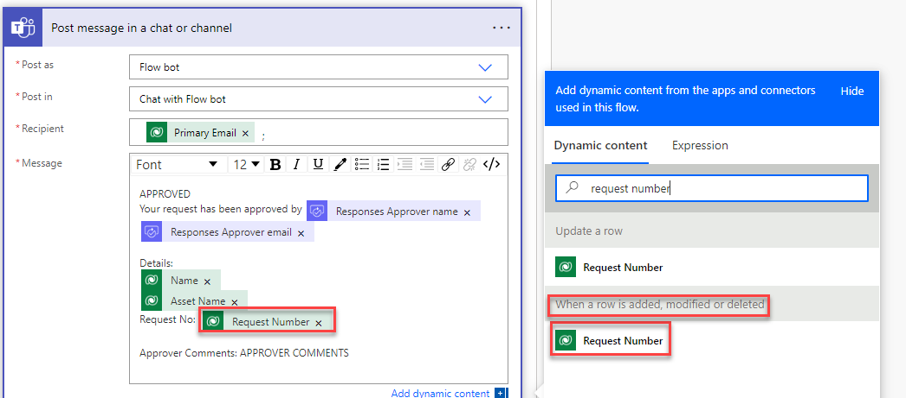](../media/request-number.png#lightbox)

    - **APPROVER COMMENTS** - Search for **comment** and then select **Responses Comments** in the **Start and wait for an approval** section. This action will bring in the comments that the approver adds when they approve the request.

    > [!div class="mx-imgBorder"]
    > [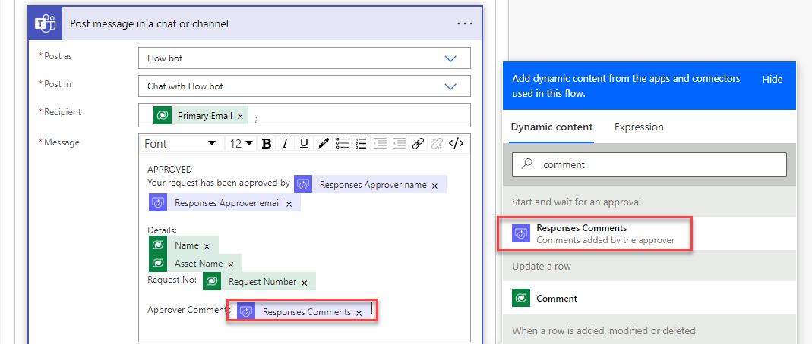](../media/responses-comments.png#lightbox)

1. You can make changes to the formatting of the message. Highlight the word **APPROVED**, as shown in the following screenshot. Change the font size to 16, apply bold formatting to the text, and then use the color picker to change the color to green.

    > [!div class="mx-imgBorder"]
    > 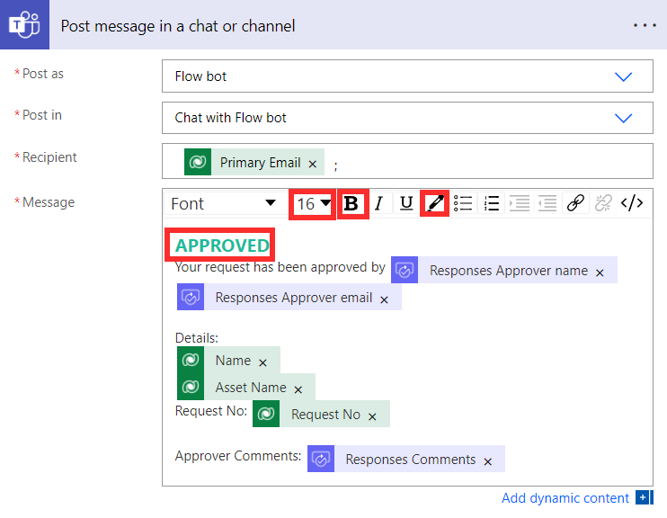

1. Highlight the word **Details**, as shown in the following image. Apply bold formatting and underline the text.

    > [!div class="mx-imgBorder"]
    > 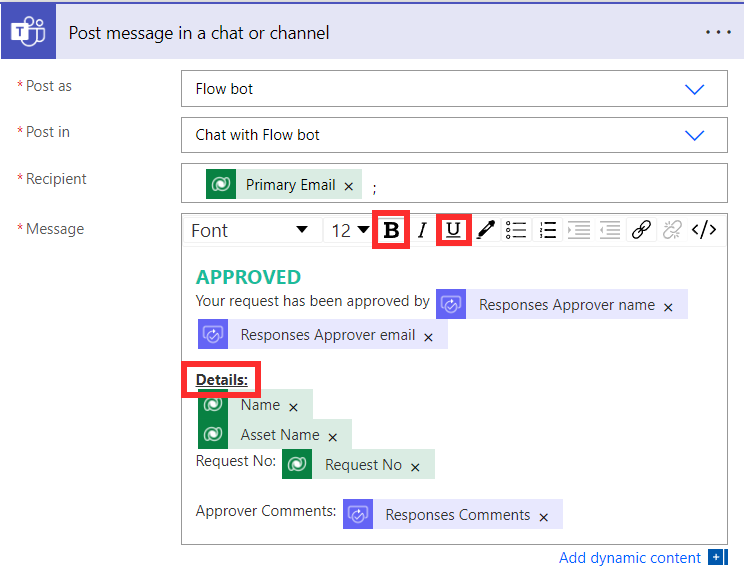

1. **Save** the flow.

## Task - Test your flow

To test your flow, follow these steps:

1. A confirmation message next to the name of the flow will indicate that your flow has saved. Return to the team that you've been working on by selecting the main Teams icon in the left navigation bar.

    > [!div class="mx-imgBorder"]
    > 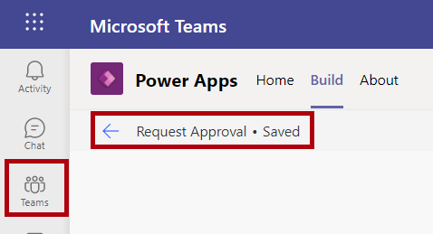

1. Open **Swag Request App** in the tab and submit a new request.

    > [!div class="mx-imgBorder"]
    > [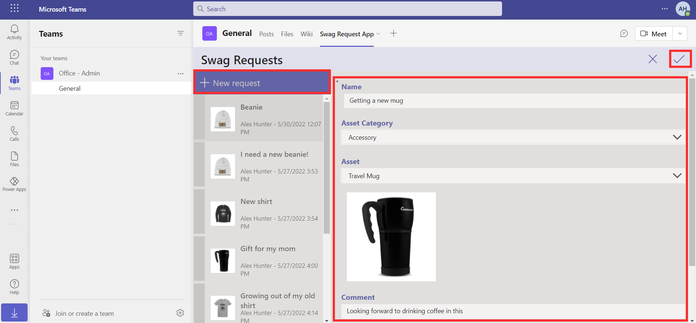](../media/new-request.png#lightbox)

1. In a moment, you'll receive a Teams notification. Approve the request and add a comment. You can approve it from the email or Teams.

    > [!div class="mx-imgBorder"]
    > 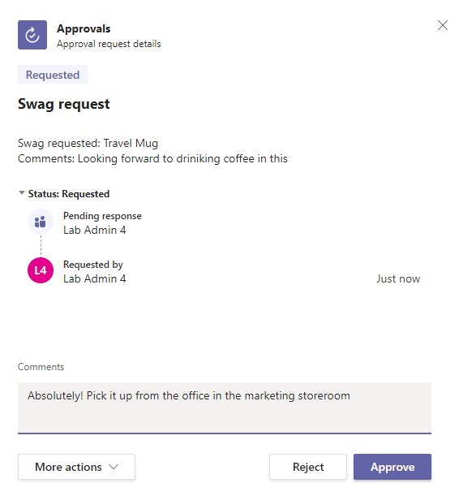

1. After the request has been approved, a notification should appear in Teams chat. Open the chat to view the notification that your request has been approved.

    > [!div class="mx-imgBorder"]
    > 
