You can build the rest of your Power BI report in Power BI Desktop or the Power BI app for Teams. The Power BI app for Teams is an embedded version of Power BI Service. Power BI Desktop contains the full range of report building capabilities. If you build the report in Teams, other users can collaborate with you. In this lab, you'll build out the rest of the report in Microsoft Teams.

## Task: Publish the report to Teams

Your first task is to publish the report to Teams by following these steps:

1.  In your Power BI Desktop file, select the **Home** tab in the ribbon and then select **Publish**. If prompted, select to save your changes.

	> [!div class="mx-imgBorder"]
	> 

1.  Select the workspace that you want to publish to. Select the name of the workspace that you created previously: **Office - \<your name\>**. Select the **Select** button.

	> [!NOTE]
	> Publishing to a team requires a Power BI Pro or Premium license, which you or your lab facilitator should have already set up in the prerequisites. If you're unable to access the Pro or Premium license, you can choose to publish your report to **My workspace**.

	> [!div class="mx-imgBorder"]
	> [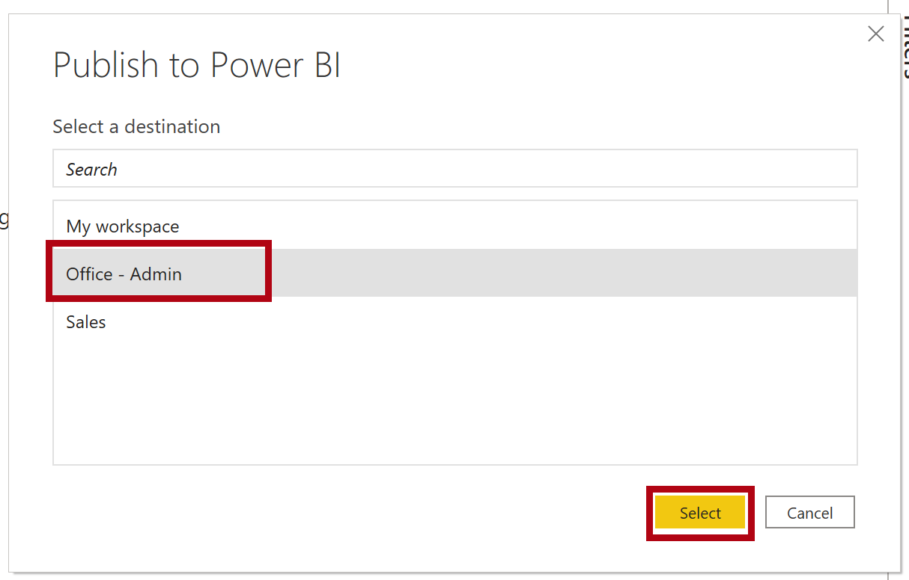](../media/destination.png#lightbox)

1.  The following confirmation message will display after the report has been published. Select **Got it**.

	> [!div class="mx-imgBorder"]
	> [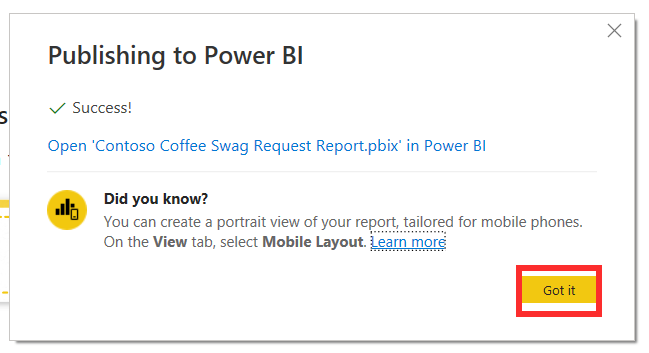](../media/success.png#lightbox)

1.  Return to Microsoft Teams. If you need to open it again, you can access it by going to [Teams](https://teams.microsoft.com/?azure-portal=true) in your web browser and then signing in with your lab credentials. In Teams, launch the Power BI app.

	> [!div class="mx-imgBorder"]
	> [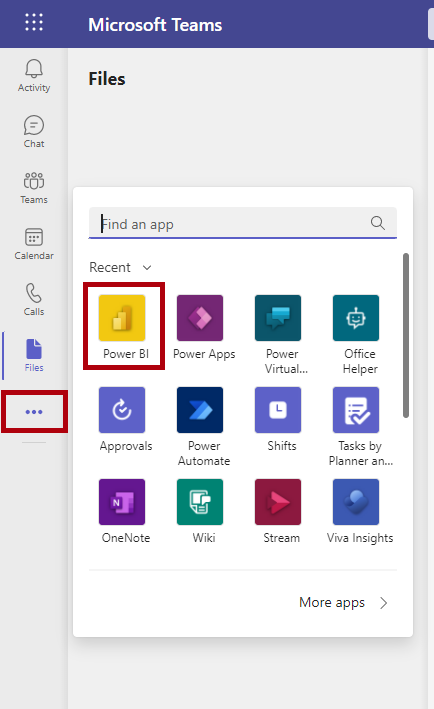](../media/power-bi-app.png#lightbox)

1.  Select **Workspaces**. If you haven't done so already, select the team that you've published the report to.

	> [!div class="mx-imgBorder"]
	> [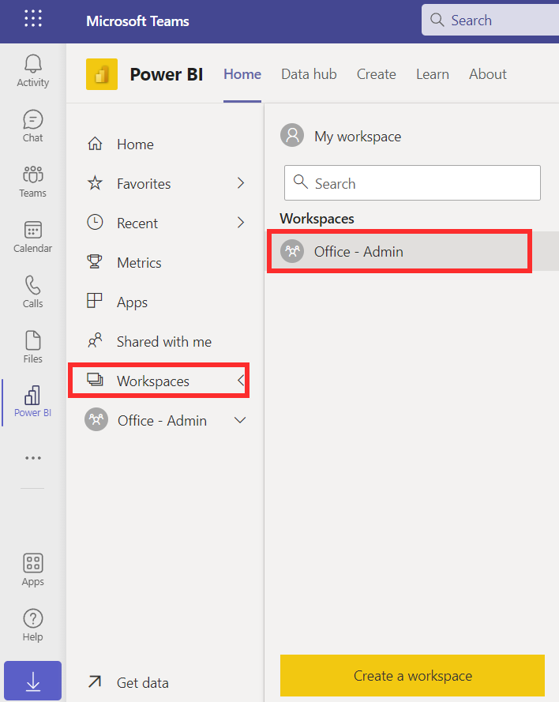](../media/select-workspaces.png#lightbox)

1.  Select **Contoso Coffee Swag Request Report** of the **Report** type (don't select the dataset).

	> [!div class="mx-imgBorder"]
	> [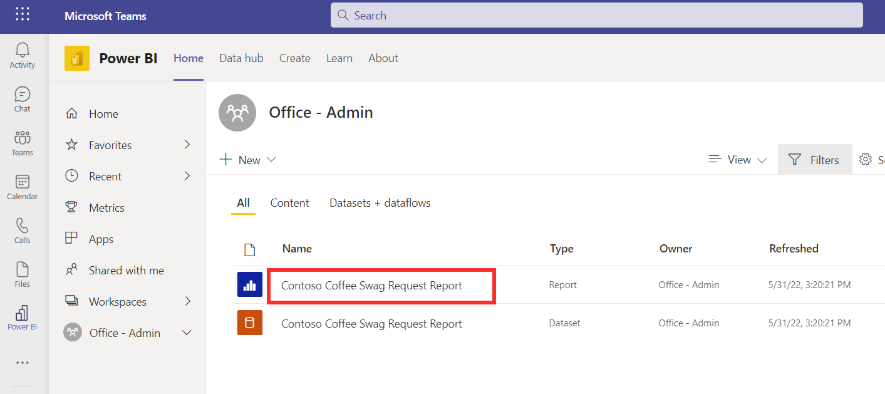](../media/report.png#lightbox)

1.  On the ribbon at the top of the report, select **Edit**.

	> [!div class="mx-imgBorder"]
	> [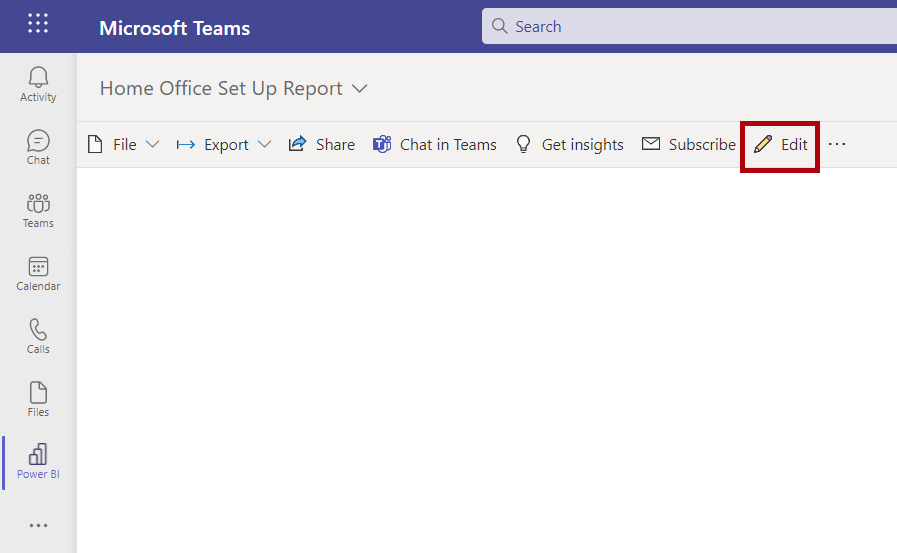](../media/edit.png#lightbox)

	> [!NOTE]
	> If you experience the same error shown in the following image, select the globe icon button to redirect to Power BI Service.

	> [!div class="mx-imgBorder"]
	> [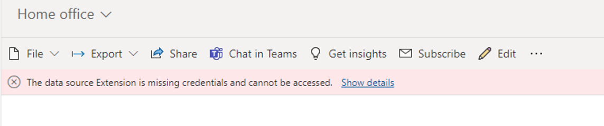](../media/error.png#lightbox)
 
	> [!div class="mx-imgBorder"]
	> [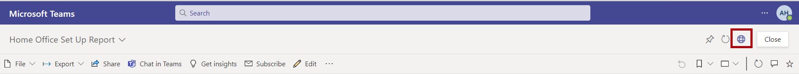](../media/globe.png#lightbox)

1.  In Power BI Service, select the ellipsis (**...**) button and then select **Settings > Settings**.

	> [!div class="mx-imgBorder"]
	> 

1.  Under **Datasets**, check that the **Data source credentials** are signed in correctly. Return to Teams and then refresh.

	> [!div class="mx-imgBorder"]
	> [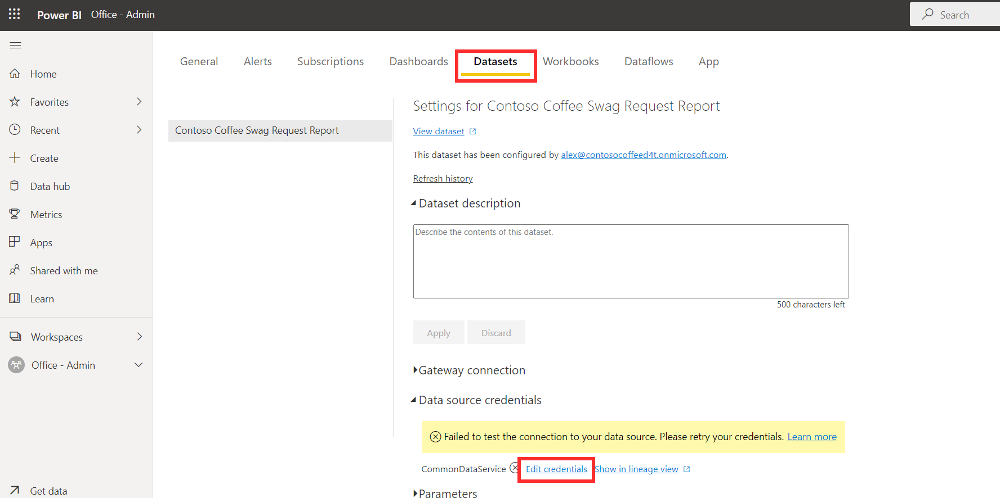](../media/datasets.png#lightbox)

	> [!div class="mx-imgBorder"]
	> [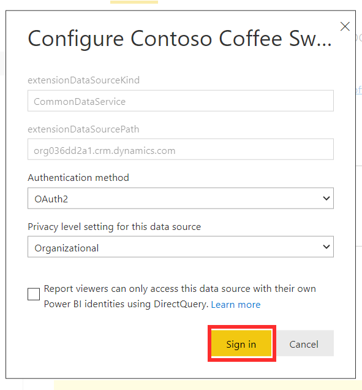](../media/sign-in.png#lightbox)

    The following screenshot shows an example of the report canvas, where you'll build your report. The three panes on the left side of the screen are **Filters**, **Visualizations**, and **Fields**. You can collapse these panes if you want to zoom in on the canvas. Depending on the size of your screen, some buttons in the top ribbon might be hidden behind the ellipsis (**...**) on the right side of the screen.

	> [!div class="mx-imgBorder"]
	> [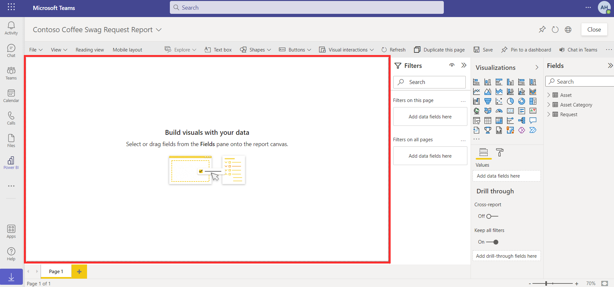](../media/report-canvas.png#lightbox)

1. Select the **View** button and then set the **Snap to grid** toggle to **On**, which will make formatting your report easier.

	> [!div class="mx-imgBorder"]
	> [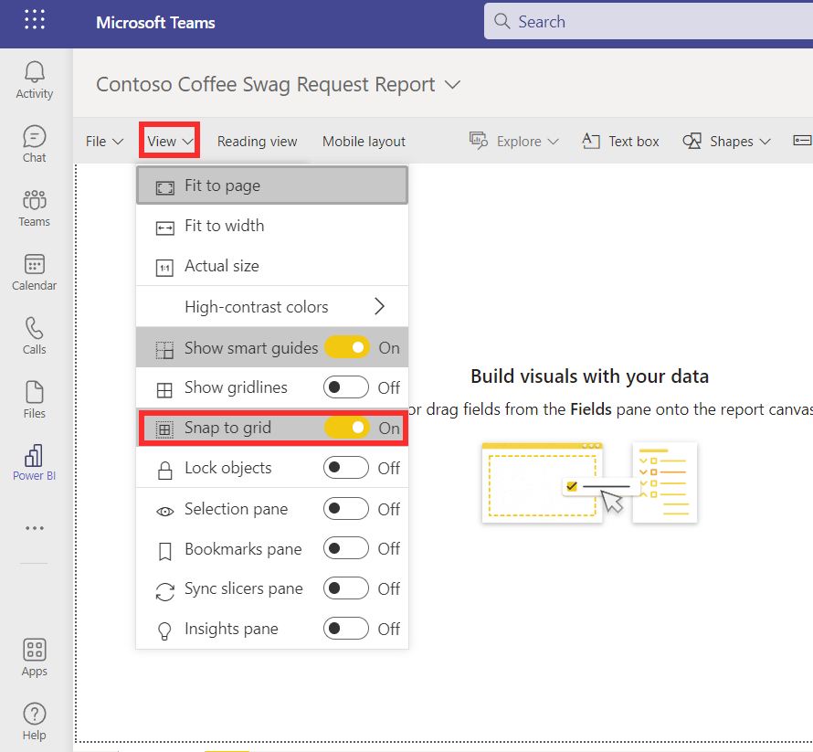](../media/grid-snap.png#lightbox)

## Task: Create report title

In this task, you'll create the report title by following these steps:

1.  In your report page, select **Text box**.

	> [!div class="mx-imgBorder"]
	> [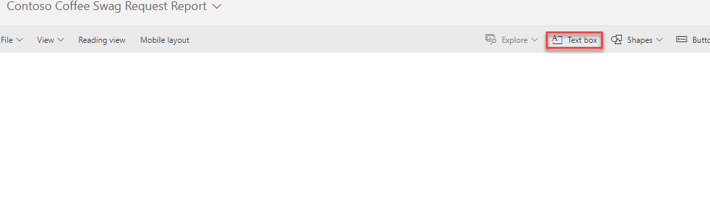](../media/text-box.png#lightbox)

1.  Type the following text into the text box: **Contoso Coffee Swag Request Report**.

1.  Highlight the text and then change the text size to **24**. Format the text to bold font and then center it.

	> [!div class="mx-imgBorder"]
	> 

1.  With the text box selected, go to the **Format** pane, expand the **Effects** section, and turn on **Background**.

	> [!div class="mx-imgBorder"]
	> [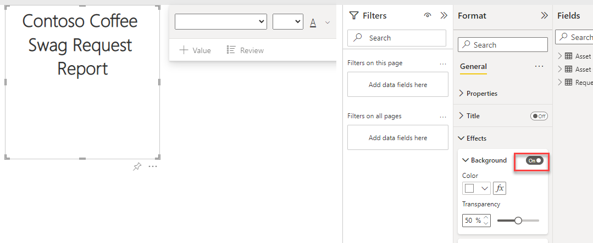](../media/background.png#lightbox)

1.  Change the background color to **#015c55**.

	> [!div class="mx-imgBorder"]
	> [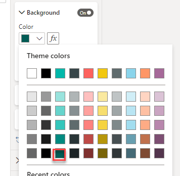](../media/background-color.png#lightbox)

1.  Change the text box font color to **White**.

	> [!div class="mx-imgBorder"]
	> [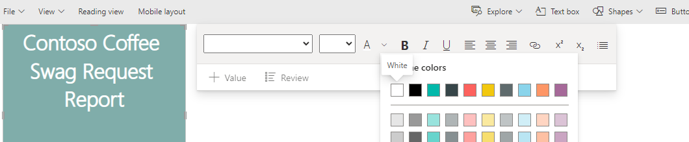](../media/white.png#lightbox)

1.  Go the **Properties** section and change the **Height** of the text box to **70** and the **Width** to **1270**.

	> [!div class="mx-imgBorder"]
	> [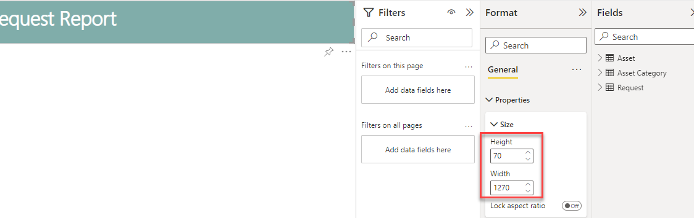](../media/size.png#lightbox)

## Task: Add a donut chart

In this task, you'll add a donut chart to the report. This chart will show the approval status of the requests.

1. Select to the middle of the report and away from the text box. Go to the **Visualizations** pane and select **Donut chart**.

	> [!div class="mx-imgBorder"]
	> [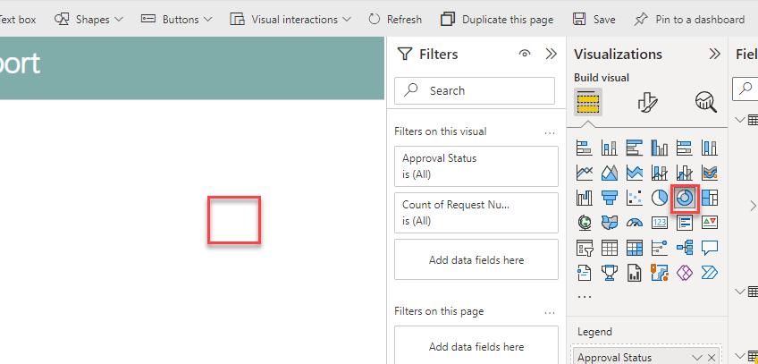](../media/donut-chart.png#lightbox)

1. Expand the **Request** table, drag **Approval Status** to the **Legend** field, and then drag the **Request Number** to the **Values** field.

	> [!div class="mx-imgBorder"]
	> [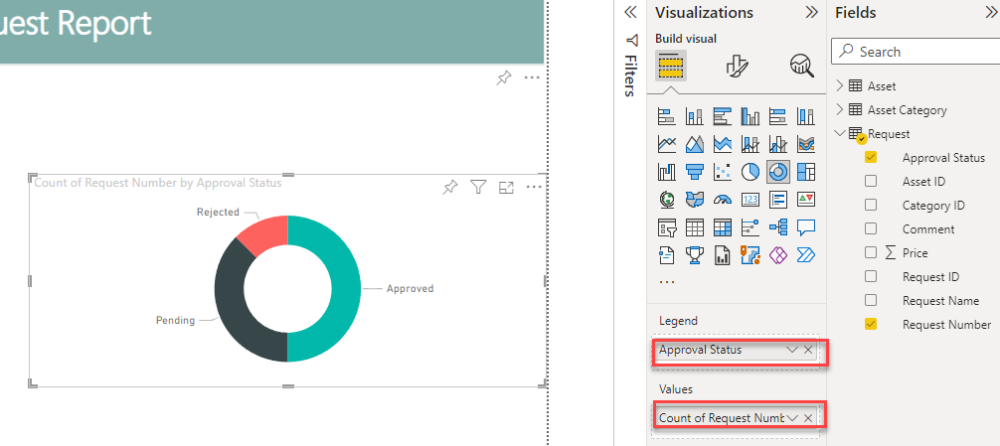](../media/chart-values.png#lightbox)

1. Move the donut chart to the upper left of the report.

1. Save the report.

You should save your report regularly throughout the lab.

## Task: Create a pie chart visual for requested assets

In this task, you'll create a pie chart visual to display the number of assets that have been requested based on asset category, where you can drill down to see the asset name. You'll use the **Asset Category** hierarchy that you previously created to enable this action.

1.  From the **Visualizations** pane, select the **pie chart** visual to insert it into the report canvas. Before you insert the pie chart, make sure that no other visual on the screen is selected.

	> [!div class="mx-imgBorder"]
	> [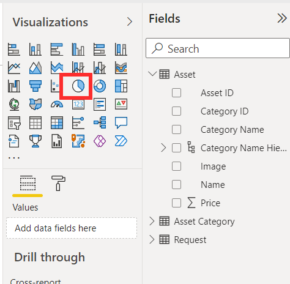](../media/pie-chart.png#lightbox)

1.  Expand the Asset table and drag **Category Name Hierarchy** to the **Legend** field.

	> [!div class="mx-imgBorder"]
	> [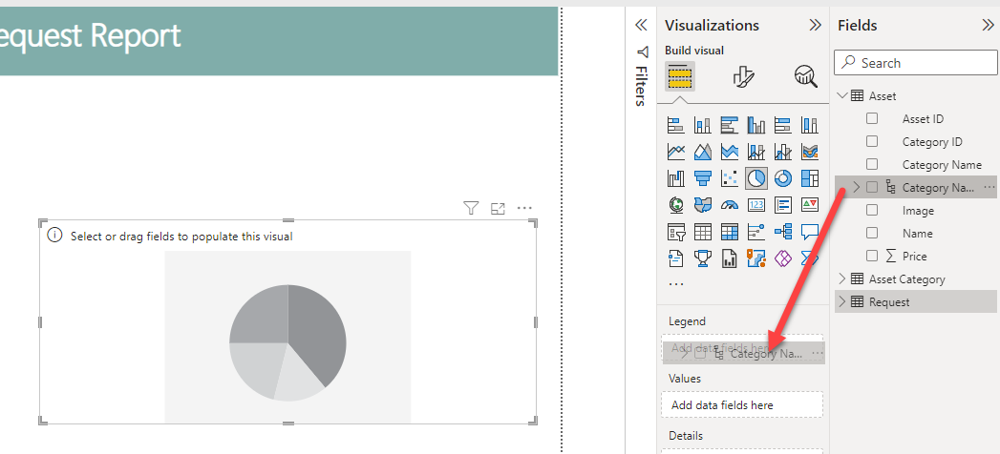](../media/legend.png#lightbox)

1.  Drag **Request ID** from the Asset table and drop it in the **Values** field.

	> [!div class="mx-imgBorder"]
	> [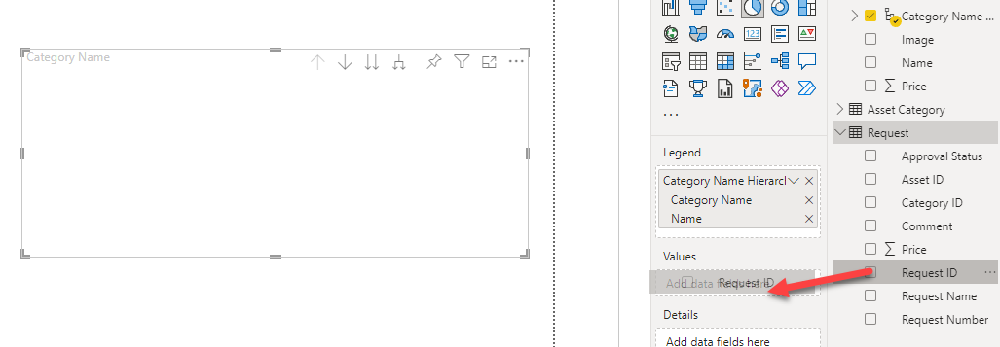](../media/values-field.png#lightbox)

1.  Go to the format icon in the **Visualizations** pane, select the **General** tab, expand the **Title** section, and then change the **Text** to **Requested Assets**.

	> [!div class="mx-imgBorder"]
	> [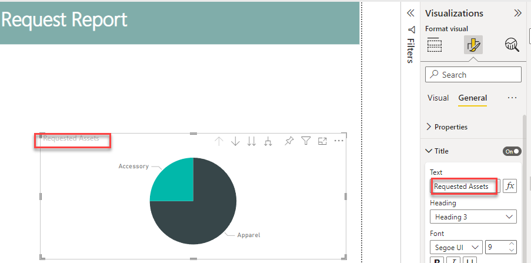](../media/requested-assets.png#lightbox)

1.  Move the pie chart next to the donut chart.

1.  Test interaction with the pie chart visual. On the pie chart visual, select the arrow icon to turn on the drill-down function.

1.  Select a segment within the pie chart visual. The visual will allow you to drill down into the asset names of the selected asset category. To return to the top level of the hierarchy, select the up arrow.

	> [!div class="mx-imgBorder"]
	> [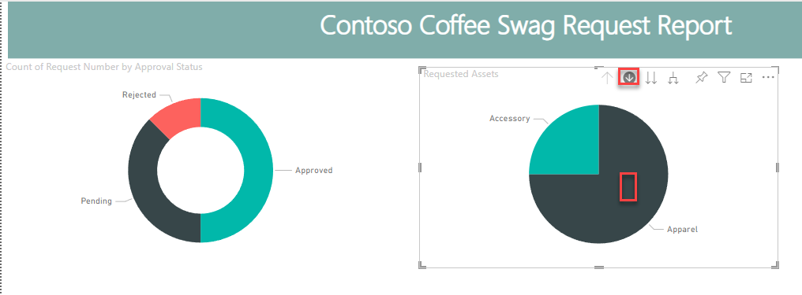](../media/drill-down.png#lightbox)

	> [!div class="mx-imgBorder"]
	> [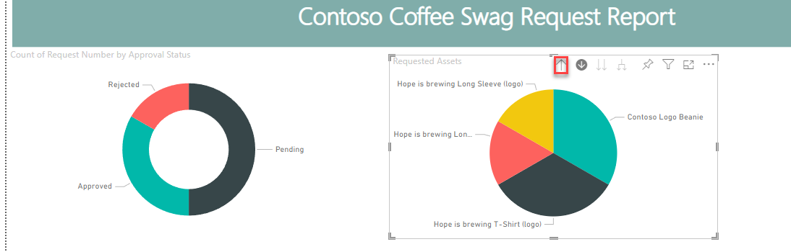](../media/drill-up.png#lightbox)

1.  Save the report.

## Task: Create a multi-row card to display top requested assets 

Follow these steps to create a multi-row card visual to display the top three assets that are requested and the number of requests.

1.  Make sure that nothing on the report is currently selected. From the **Visualizations** pane, select the multi-row card visual to insert it into the report canvas. Before you insert the visual, make sure that no other visual on the screen is selected.

	> [!div class="mx-imgBorder"]
	> [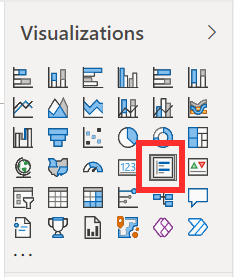](../media/multi-row.png#lightbox)

1.  From the **Fields** pane, drag the **Name** field of the Asset table and the **Request Number** field of the Request table into the **Fields** well of the **Visualizations** pane.

	> [!div class="mx-imgBorder"]
	> 

1.  From the **Fields** well, select the arrow next to **Request Number** and set it to **Count**.

	> [!div class="mx-imgBorder"]
	> [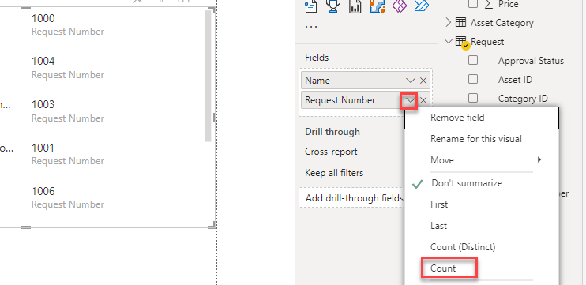](../media/count.png#lightbox)

1.  Rename the **Request Number** field to **Requested**.

	> [!div class="mx-imgBorder"]
	> [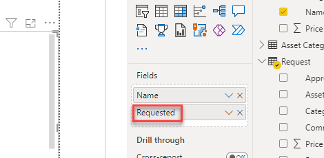](../media/requested.png#lightbox)

1.  In the **Filters** pane, expand the **Name filter** and then set the **Filter type** to **Top N**. Set the filter to show the Top **3** items. From the Request table, drag the **Request No.** field into the **By value** well.

	> [!div class="mx-imgBorder"]
	> [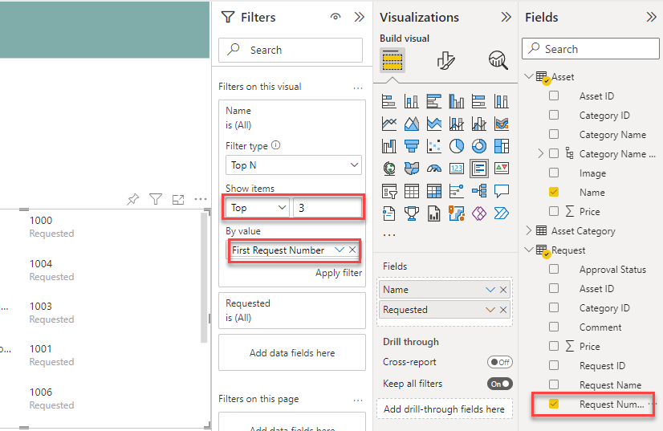](../media/top-items.png#lightbox)

1.  Where the field says **First Request No.**, select the arrow next to it and change it to **Count**. Then, select **Apply filter**. Your visual should now display the top three requested assets. *Your visual might display more than three assets if the same amount has been requested*.

	> [!div class="mx-imgBorder"]
	> 

1.  Select **Apply filter**.

	> [!div class="mx-imgBorder"]
	> [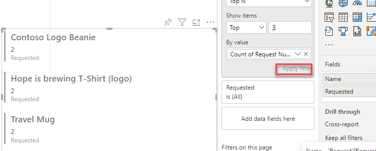](../media/apply-filter.png#lightbox)

1.  Select the ellipsis (**...**) menu of the multi-row card visual. Select **Sort by > Requested > Sort Descending**.

	> [!div class="mx-imgBorder"]
	> [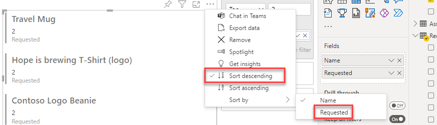](../media/sort.png#lightbox)

1.  Go to the format tab, select the **General** tab, expand the **Title** section, and then enter **Top 3 Assets Requested** in the **Text** field.

	> [!div class="mx-imgBorder"]
	> [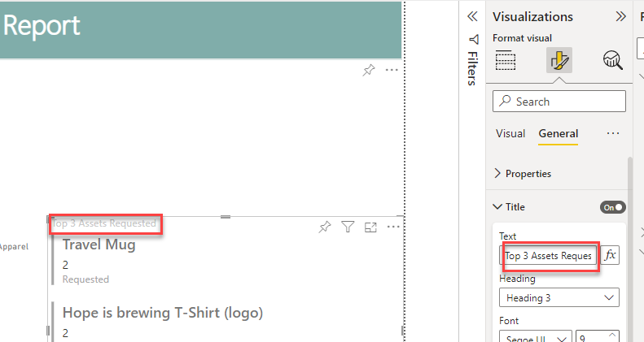](../media/title.png#lightbox)

1.  Move and resize the multi-row card so that it's positioned on your report as shown in the following screenshot.

	> [!div class="mx-imgBorder"]
	> [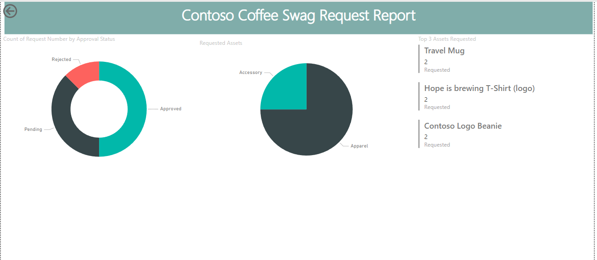](../media/current-report.png#lightbox)

1. Save your report.

## Task: Create a column chart to display total amount spent based on asset categories

Create a clustered column chart visual to display the total cost of all asset requests that have been approved based on the asset category.

1.  From the **Visualizations** pane, select the **clustered column chart** visual to insert it into the report canvas. Before you insert the visual, make sure that no other visual on the screen is selected.

	> [!div class="mx-imgBorder"]
	> [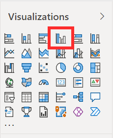](../media/clustered-column-chart.png#lightbox)

1.  From the Asset table, drag the **Category Name** field into the **Axis** well. From the Request table, drag the **Price** field into the **Values** well.

	> [!div class="mx-imgBorder"]
	> 

1.  Rename the field in the **Axis** well to **Asset Category**. Rename the field in the **Values** well to **Total Spent**.

	> [!div class="mx-imgBorder"]
	> [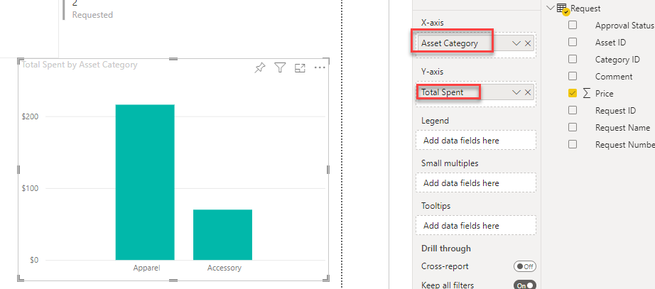](../media/rename-fields.png#lightbox)

1.  Go to the format tab and turn on the **Data labels** toggle.

	> [!div class="mx-imgBorder"]
	> [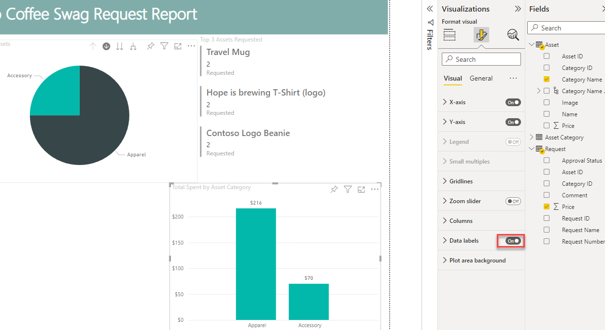](../media/data-labels.png#lightbox)

1.  Add a filter to the visual so that it only displays the price based on the assets that have been approved. From the Request table, drag the **Approval Status** field and place it in the **Filter** pane for **Filters on this visual**.

	> [!div class="mx-imgBorder"]
	> [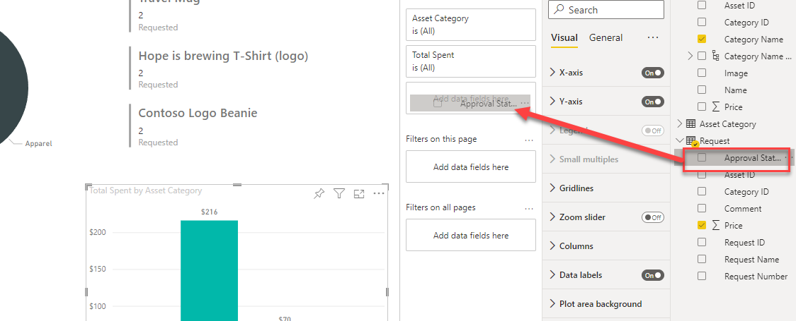](../media/approval-status-field.png#lightbox)

1.  In the filter, select the **Approved** checkbox.

	> [!div class="mx-imgBorder"]
	> [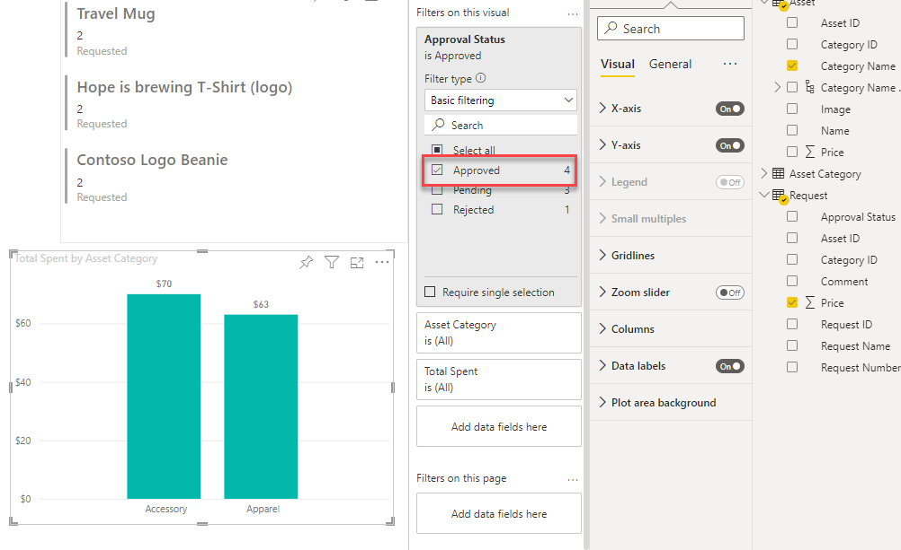](../media/approved.png#lightbox)

1.  Move and resize the column chart visual so that it's positioned on your report as shown in the following screenshot.

	> [!div class="mx-imgBorder"]
	> [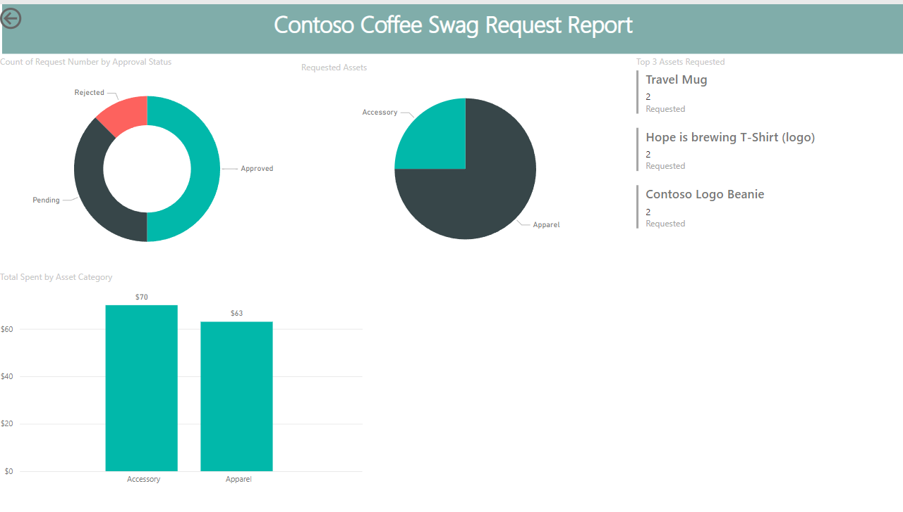](../media/visual-position.png#lightbox)

1.  Save your report.

## Task: Add a table to the report

Your next task is to add a table to the report. This table will show all requests.

1.  From the **Visualizations** pane, select the **Table** visual to insert it into the report canvas. Before you insert the visual, make sure that no other visual on the screen is selected.

	> [!div class="mx-imgBorder"]
	> [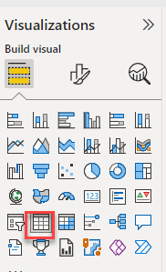](../media/select-table.png#lightbox)

1.  Select **Request Name**, **Price Approval Status**, and **Comment** from the Request table.

	> [!div class="mx-imgBorder"]
	> [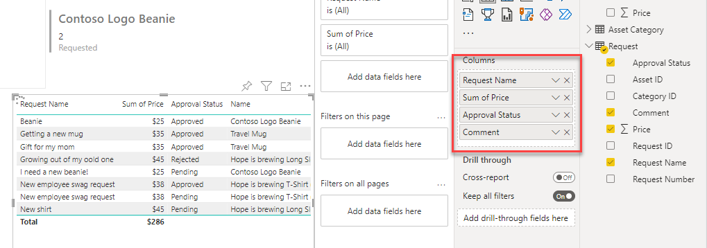](../media/columns.png#lightbox)

1.  Select **Name** from the **Asset** table.

	> [!div class="mx-imgBorder"]
	> [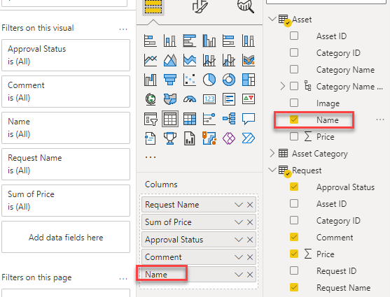](../media/name.png#lightbox)

1.  Rename the **Name** field to **Category**.

	> [!div class="mx-imgBorder"]
	> [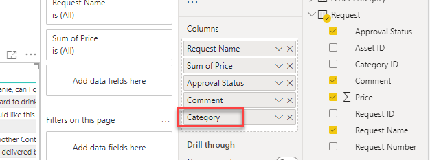](../media/category.png#lightbox)

1.  Resize and reposition all visuals until you're satisfied with the layout. The report should resemble the following image.

	> [!div class="mx-imgBorder"]
	> [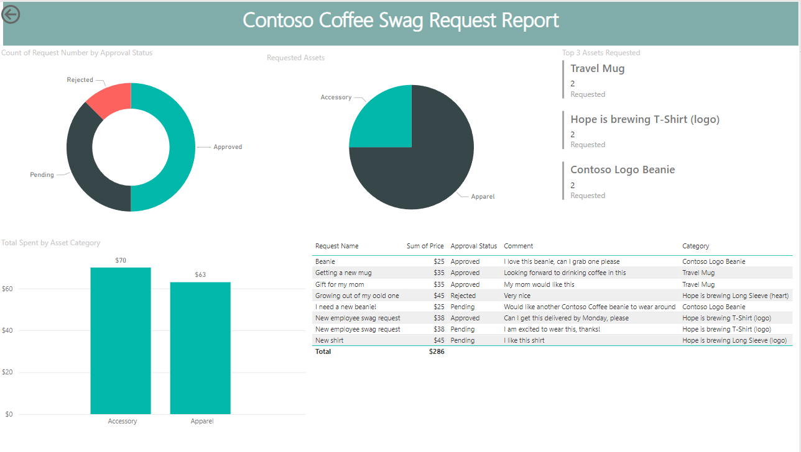](../media/completed-report.png#lightbox)
