## Task: Discover and add the Power BI app to Teams

1.  In Microsoft Teams, select the **Apps** icon on the left toolbar, and then search for Power BI.

	> [!div class="mx-imgBorder"]
	> [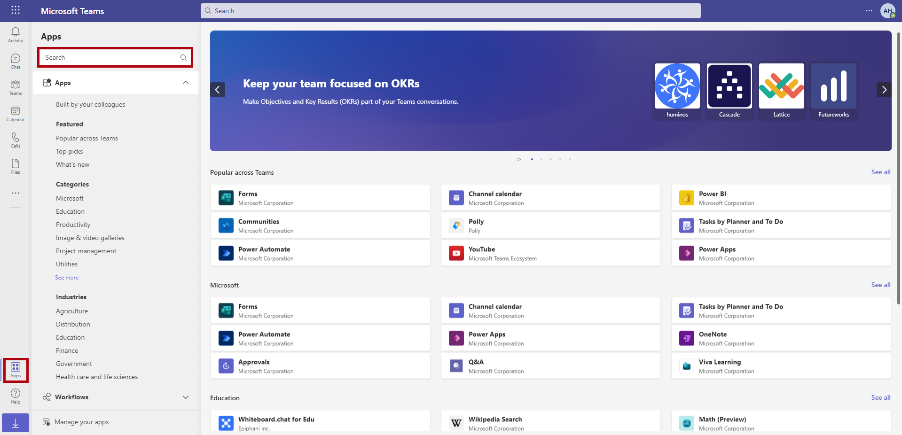](../media/power-bi-teams-app.png#lightbox)

1.  Select the Power BI app when you find it in the search results.

	> [!div class="mx-imgBorder"]
	> [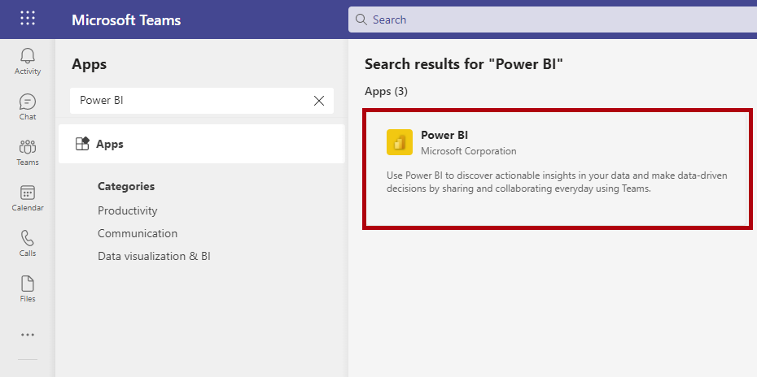](../media/power-bi.png#lightbox)

1.  You'll see a pop-up with information about the Power Apps app for Microsoft Teams. Select the **Add** button.

	> [!div class="mx-imgBorder"]
	> 

1.  You'll now see the Power BI app in the left-hand navigation bar. Right select that icon and select **Pin**. This pins the app to the navigation bar, making it easier to return to it when you need to.

	> [!div class="mx-imgBorder"]
	> [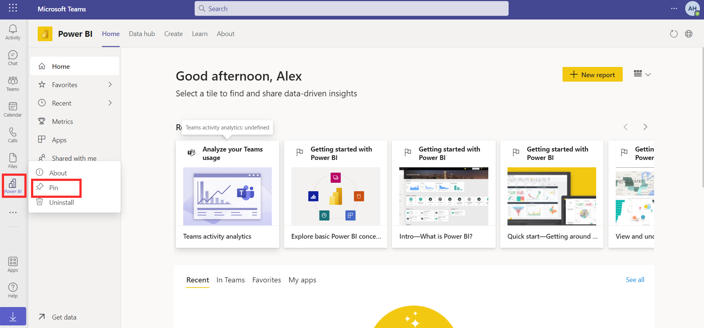](../media/pin.png#lightbox)

## Task: Create a workspace

1.  In the left navigation menu within the Power BI app, select the Workspaces icon shown below then select **Create a workspace**.

	> [!div class="mx-imgBorder"]
	> [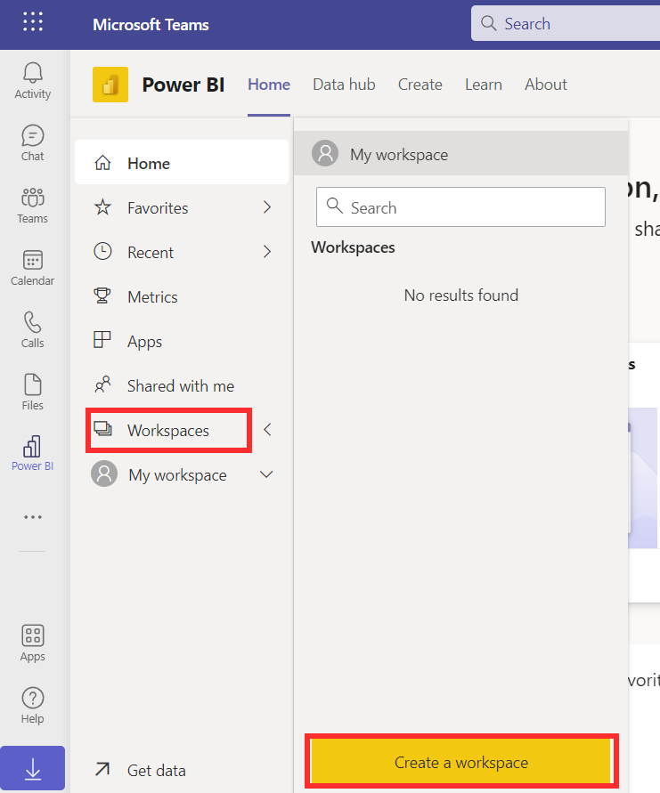](../media/workspaces.png#lightbox)

1.  For the Workspace name, enter the name of the Team you have been using, for example, **Office -\<your name\>** then select **Save**.

	> [!div class="mx-imgBorder"]
	> [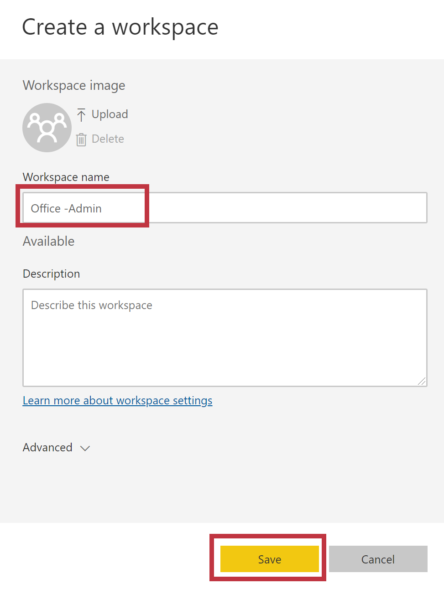](../media/workspace-name.png#lightbox)

1.  In your new workspace, select **Access**.

	> [!div class="mx-imgBorder"]
	> [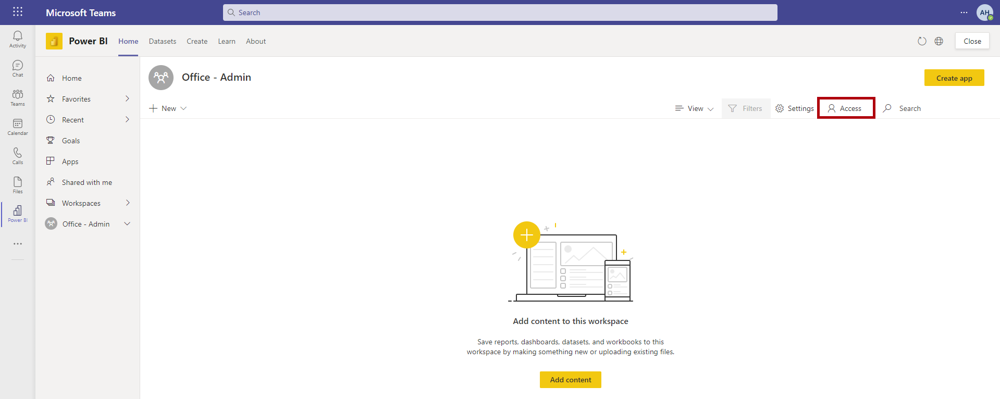](../media/access.png#lightbox)

1.  In the Enter email address field, start typing in the name of your Team, for example, Office-\<your name\>. You should see an email address appears using your Team name. Select that email. This will give all members of your Team access to the workspace, which will contain the Power BI report you'll be creating.

	> [!div class="mx-imgBorder"]
	> [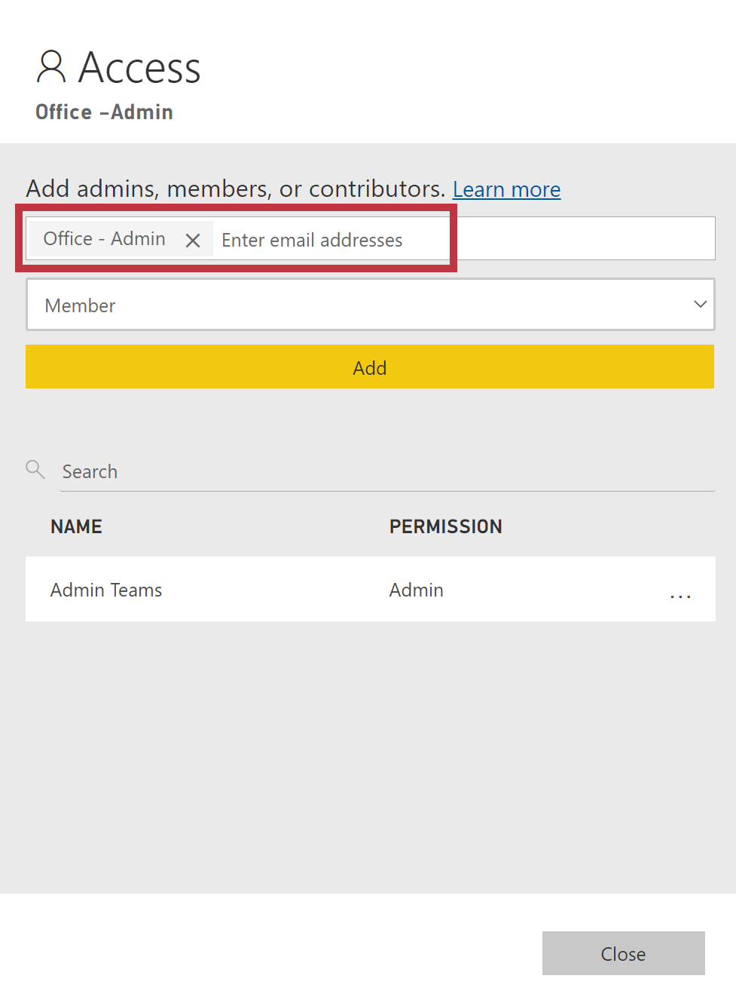](../media/access-settings.png#lightbox)

1.  Set the access level to **Viewer** then select **Add**. Select **Close**.

	> [!div class="mx-imgBorder"]
	> [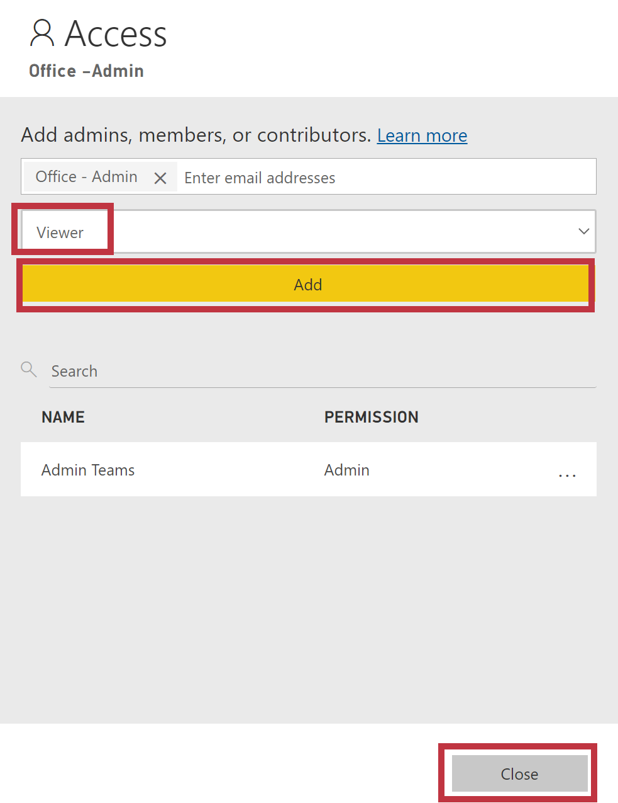](../media/viewer-level.png#lightbox)

## Task: Connect to Dataverse

In this task, you'll be connecting to your Dataverse tables created in a prior lab in this learning path.

1.  Launch Power BI Desktop on your computer. Sign in with the account you're using for the labs. If you're automatically signed in with your work account, select your username in the top right of the screen and select **Sign Out**.

	> [!div class="mx-imgBorder"]
	> [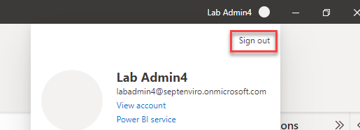](../media/sign-out.png#lightbox)

1.  Once signed in with your lab account, select **Dataverse** from the ribbon.

	> [!div class="mx-imgBorder"]
	> [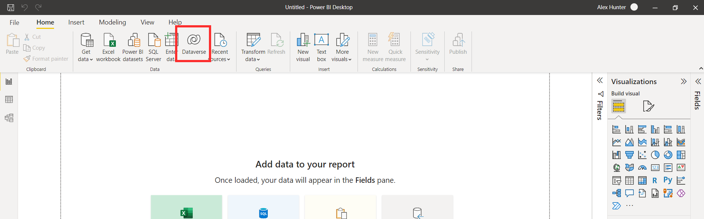](../media/dataverse.png#lightbox)

1.  Select **Sign in**, and sign in with your lab account. Select **Connect**.

	> [!div class="mx-imgBorder"]
	> [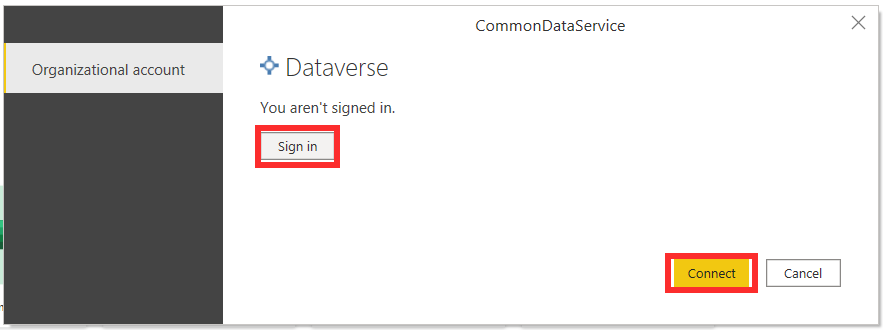](../media/connect.png#lightbox)

1.  You should see your Team name in the list. Select the arrow to expand it.

	> [!div class="mx-imgBorder"]
	> [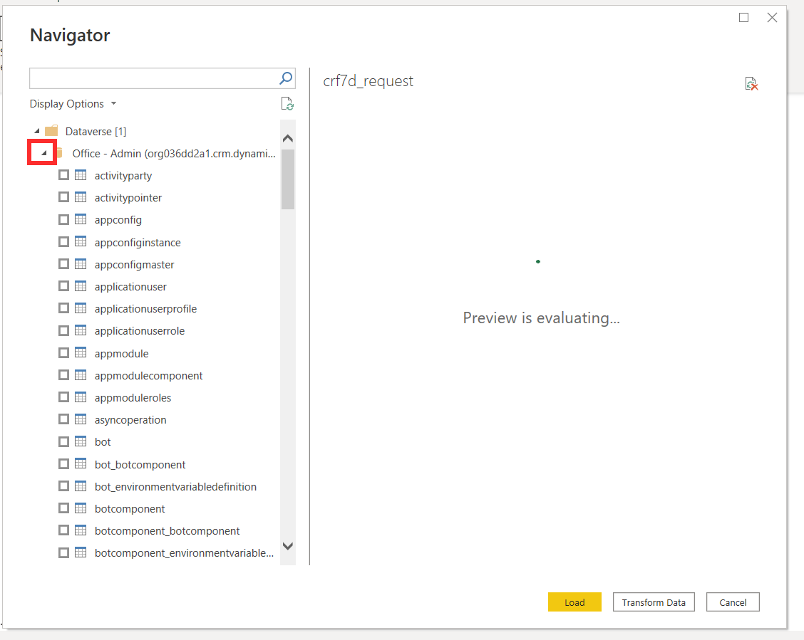](../media/expand-list.png#lightbox)

1.  You'll be loading the three tables that you created earlier in Lab 1. Scroll down the list until you find the **Request**, **Asset** and **Asset Category** tables. Your table name will be in a format such as crf7d_asset. *Your tables will begin with a unique prefix (which you identified in the previous lab), which is likely not the same as this example. Mark the checkbox next to your 3 tables, then select **Transform Data**.* This will launch Power Query Editor in another window.

	> [!div class="mx-imgBorder"]
	> [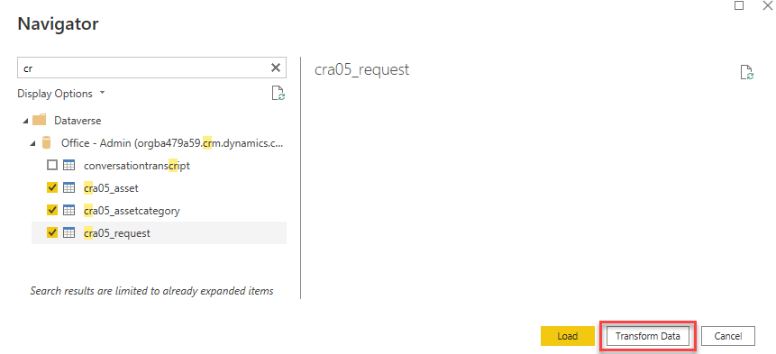](../media/transform-data.png#lightbox)

1.  In a moment, you'll get the following message. Select **DirectQuery** then select OK.

	> [!div class="mx-imgBorder"]
	> [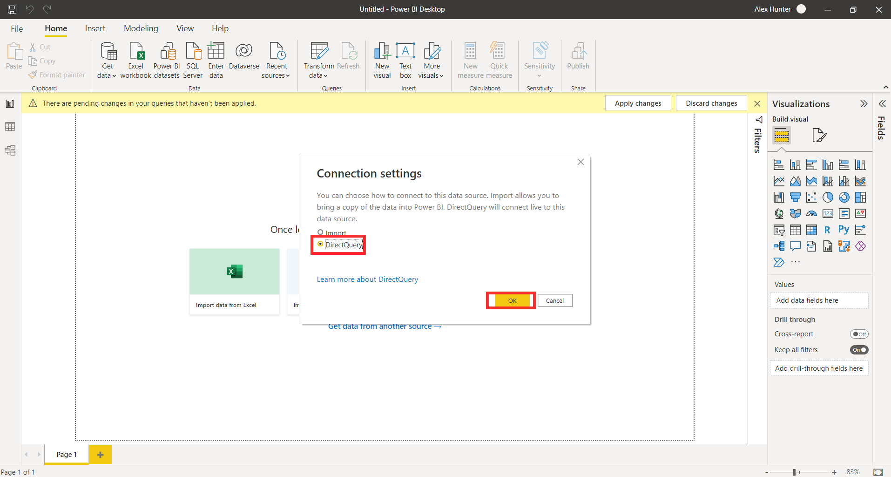](../media/direct-query.png#lightbox)

## Task: Transform data

Now that you've connected to your Dataverse tables, the next step involves cleaning or "transforming" your data so that it's optimized for reporting. Transformations are done in Power BI using the Power Query Editor tool.

1.  You should have Power Query Editor open in another window. From the Queries menu on the left side of the screen, double click on the x\_asset query. Rename the query to **Asset**.

	> [!div class="mx-imgBorder"]
	> [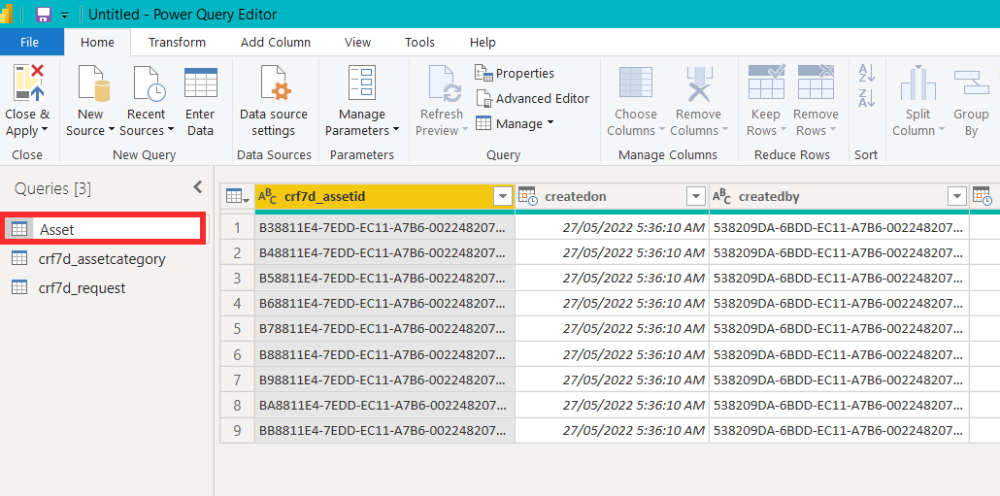](../media/asset-query.png#lightbox)

1.  Rename x\_assetcategory query to **Asset Category**.

1.  Rename x\_request query to **Request**. Your queries should now appear as the following.

	> [!div class="mx-imgBorder"]
	> [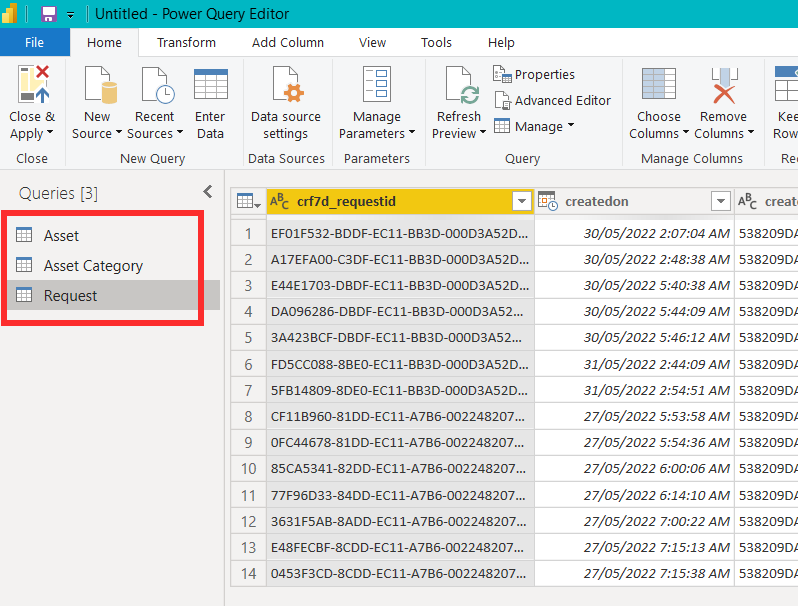](../media/query-list.png#lightbox)

1.  Select the Asset query, then select **Choose Columns** from the ribbon.

	> [!div class="mx-imgBorder"]
	> [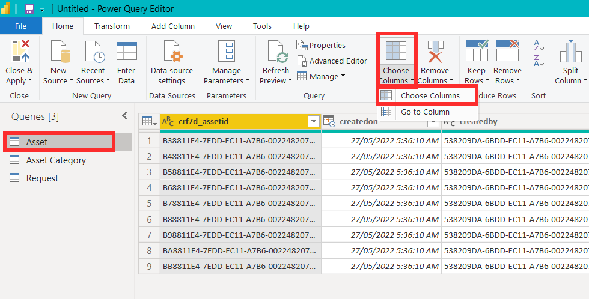](../media/choose-columns.png#lightbox)

1.  Untick **(Select All Columns)** to clear all columns from selection. Select the following six columns to bring in:

	x\_assetid *(this will be at the top of the list)*
	
	x\_name
	
	x\_category
	
	x\_categoryname
	
	x\_price
	
	x\_image

	Select **OK**.

	> [!div class="mx-imgBorder"]
	> [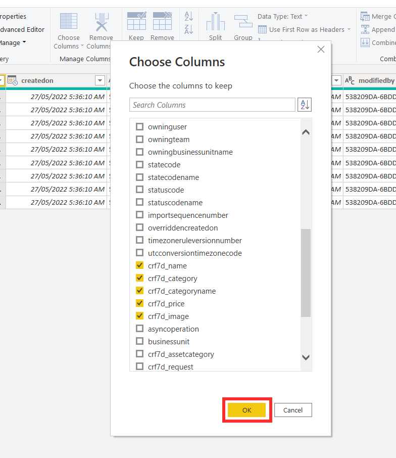](../media/columns-selected.png#lightbox)

1.  You'll rename the columns in the Asset query. To rename a column, double click on the column header. Alternatively, you can right click on the column header and select Rename. You'll rename each column to the following new name.

	|     x_assetid              |     Asset ID         |
	|----------------------------|----------------------|
	|     x_name                 |     Name             |
	|     x_category             |     Category ID      |
	|     x_assetcategoryname    |     Category Name    |
	|     x_price                |     Price            |
	|     x_image                |     Image            |

	> [!div class="mx-imgBorder"]
	> 

	> [!div class="mx-imgBorder"]
	> [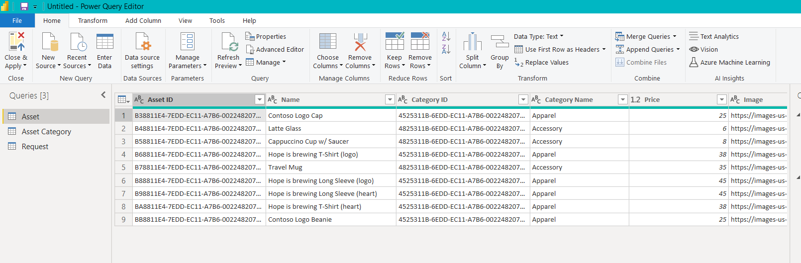](../media/renamed-columns.png#lightbox)

1.  Select the **Asset Category**, then select **Choose Columns** from the ribbon. You'll pick the columns you want displayed in the Asset Category query, as done previously in the Asset query. Untick **(Select All Columns)** to clear all columns from selection. Select the following two columns to bring in:

	x\_assetcategoryid *(this will be at the top of the list)*
	
	x\_name
	
	Select **OK**.

	> [!div class="mx-imgBorder"]
	> [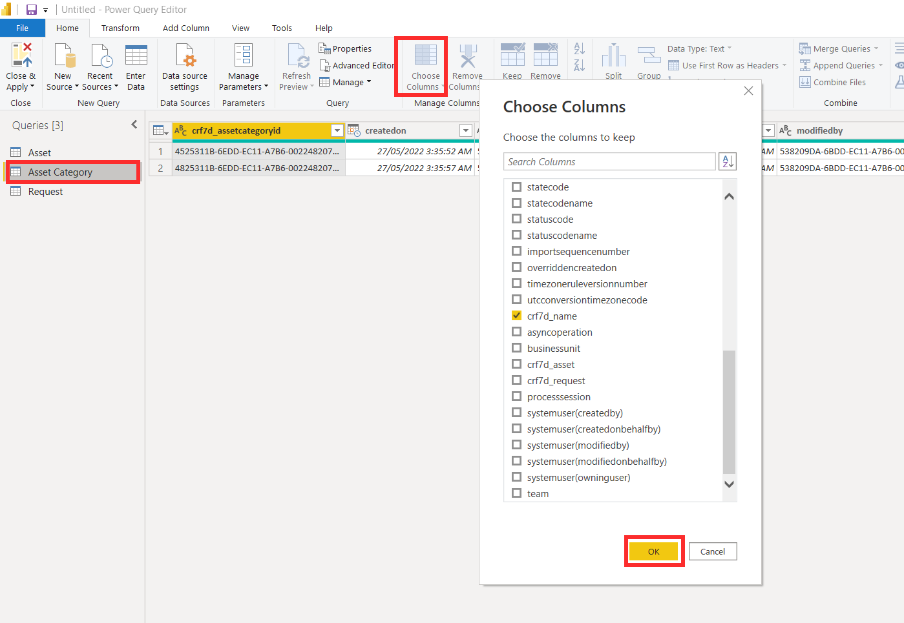](../media/columns-ok.png#lightbox)

1.  Rename the columns in the **Asset Category** query. To rename a column, double click on the column header. Alternatively, you can right click on the column header and select Rename. You'll rename each column to the following new name.

	|     x_assetcategoryid    |     Category ID      |
	|--------------------------|----------------------|
	|     x_name               |     Category Name    |

	> [!div class="mx-imgBorder"]
	> [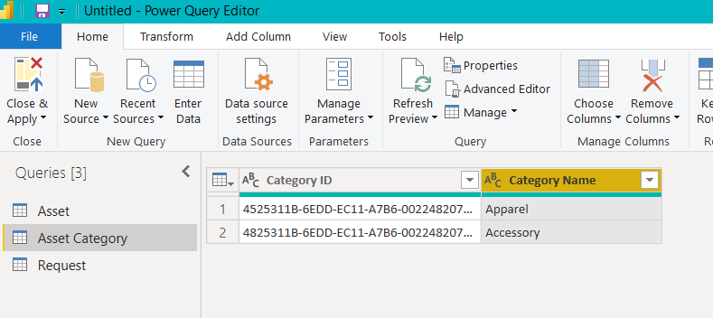](../media/columns-renamed.png#lightbox)

1.  Select the **Request query**, then select on **Choose Columns** from the ribbon. You'll pick the columns you want displayed in the Request query. Untick **(Select All Columns)** to clear all columns from selection. Select the following eight columns to bring in:

	x\_requestid *(this will be at the top of the list)*
	
	x\_name
	
	x\_requestnumber
	
	x\_comment
	
	x\_approvalstatusname
	
	x\_assetcategory
	
	x\_asset
	
	x\_asset(x\_asset)
	
	Select **OK**.

	> [!div class="mx-imgBorder"]
	> [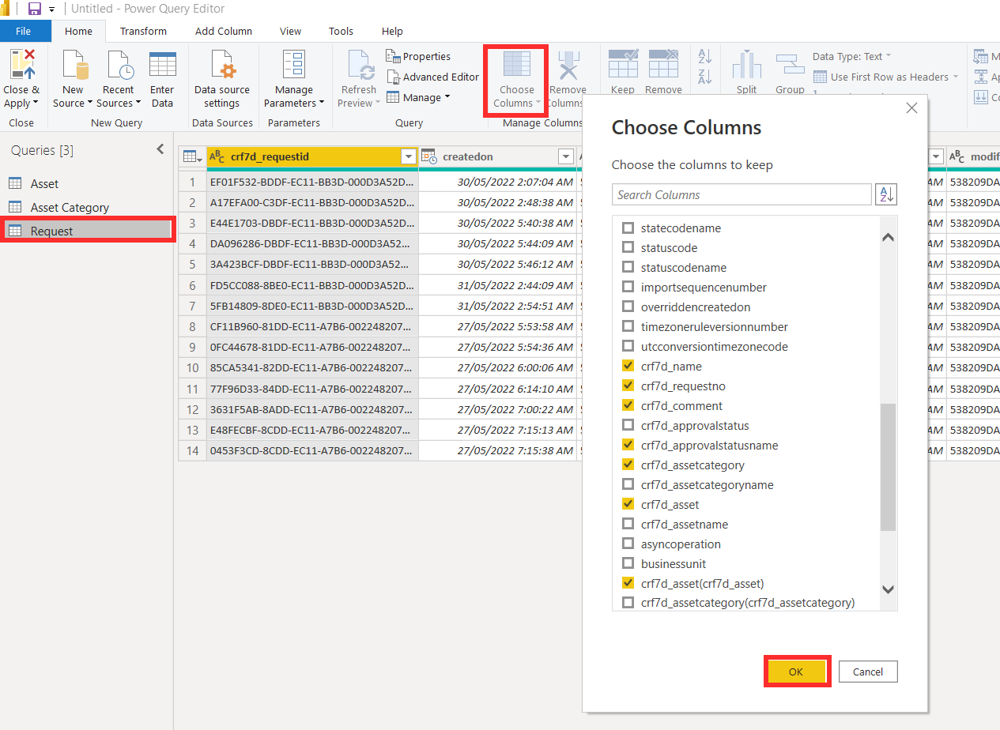](../media/columns-checked.png#lightbox)

1. You'll need to bring the Price column from the Asset query into the Request query. In the Request query, go to the last column **x_asset(x_asset)** and select the **expand** button. Deselect all the columns by unticking **(Select All Columns)**. Find **x\_price** column to select it then select **OK**.

	> [!div class="mx-imgBorder"]
	> [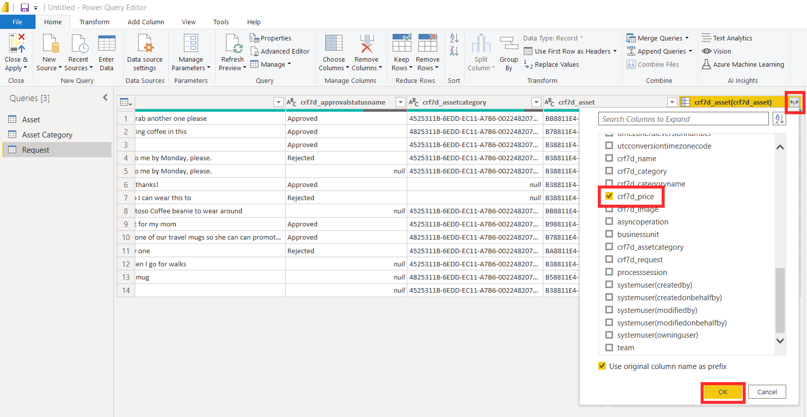](../media/price.png#lightbox)

1. In the Requests query, rename each column to the following new name.

	|     x_requestid             |     Request ID         |
	|-----------------------------|------------------------|
	|     x_name                  |     Request Name       |
	|     x_requestnumber         |     Request Number     |
	|     x_comment               |     Comment            |
	|     x_approvalstatusname    |     Approval Status    |
	|     x_assetcategory         |     Category ID        |
	|     x_asset                 |     Asset ID           |
	|     x_asset(x_asset)        |     Price              |

1. You'll notice that the Approval Status column contains blank values if the request hasn't been approved or rejected. Select the Approval Status column to select it, then select Replace Values from the ribbon.

	> [!div class="mx-imgBorder"]
	> [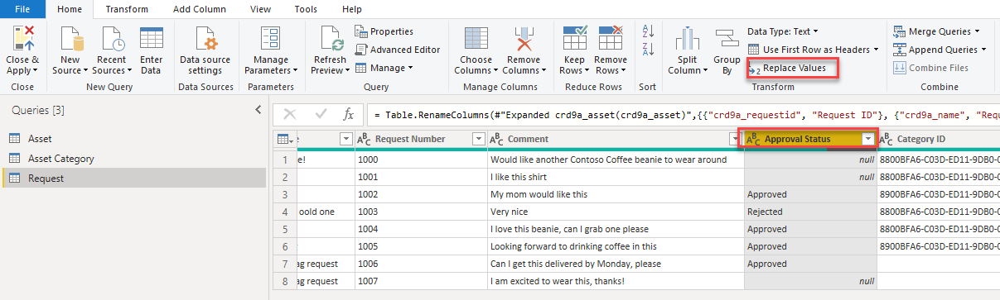](../media/approval-status.png#lightbox)

1. Enter the following details then select **OK**:

	Value to find: null

	Replace with: Pending

	> [!div class="mx-imgBorder"]
	> [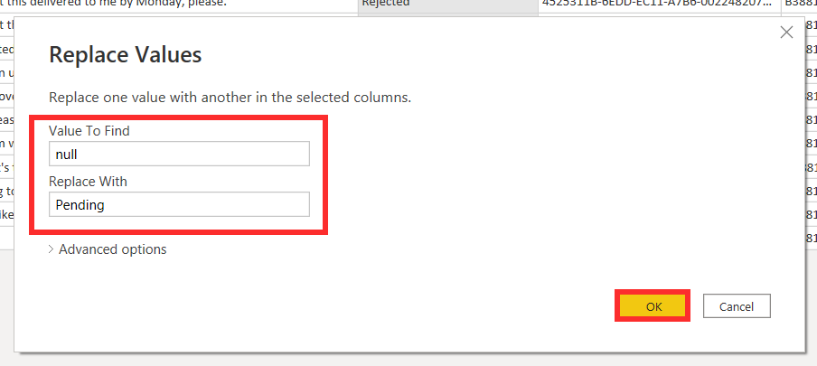](../media/find-replace.png#lightbox)

1. Now that you've finished with the transformation steps, you can apply your changes. In the ribbon, select the **Home** tab, then select **Close and Apply**.

	> [!div class="mx-imgBorder"]
	> [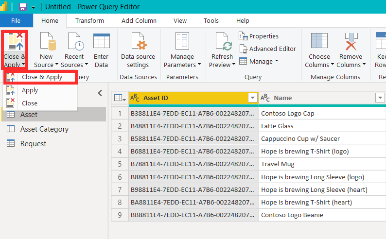](../media/close-apply.png#lightbox)

1. Once it has finished applying, you'll be taken back to your Power BI Desktop window, and you can see your three tables in the fields pane on the right side of your screen.

	> [!div class="mx-imgBorder"]
	> [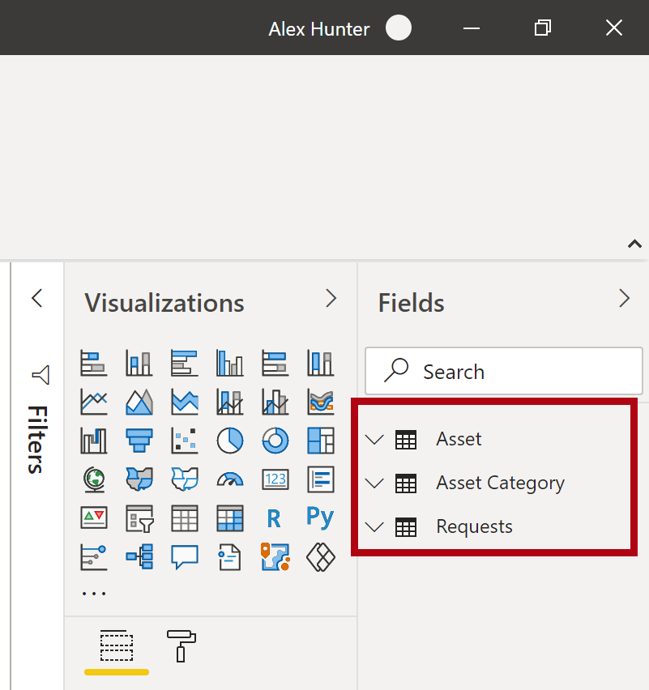](../media/tables.png#lightbox)

1. You can save your Power BI File. Select the **Save** icon in the top left of the screen. Name your file **Contoso Coffee Swag Request Report**, then save it in a location of your choice.

	> [!div class="mx-imgBorder"]
	> [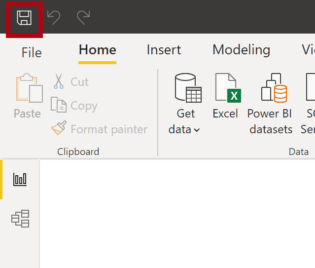](../media/save.png#lightbox)

## Task: Change report theme

You can customize the theme of your report to make designing easier. We'll customize the theme so that there's consistency across the colors used in the report.

1.  In your Power BI Desktop file, select the **View** tab of the ribbon. Select the **Themes** dropdown and select **Classic**.

	> [!div class="mx-imgBorder"]
	> [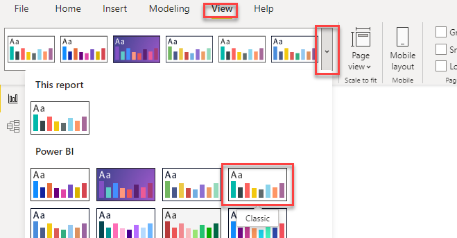](../media/theme.png#lightbox)

1.  **Save** your file.

## Task: Create an asset category hierarchy

A hierarchy allows you to drill down into data in your report. We'll create a hierarchy in the Asset table, which will allow us to drill into asset names based on the asset category. This will be used for a visual later in the lab.

1.  From the Fields pane, expand the Asset table so that you can see the fields. Select More options **...** on **Category Name** field then select **Create hierarchy**.

	> [!div class="mx-imgBorder"]
	> [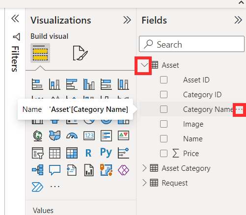](../media/create-hierarchy.png#lightbox)

	*You can expand the size of the pane to better see the field names, if they're getting cut off. Just select the border of the pane to resize it.*

	> [!div class="mx-imgBorder"]
	> [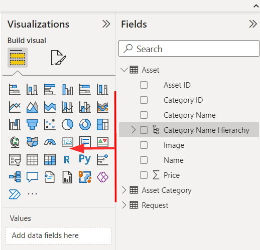](../media/expand-menu.png#lightbox)

1.  Select More options on **Name** field then select **Add to hierarchy**. Select the **Category Name hierarchy**.

	> [!div class="mx-imgBorder"]
	> [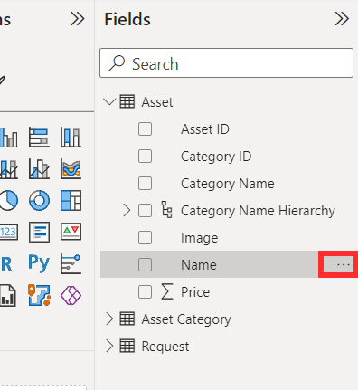](../media/hierarchy.png#lightbox)

1.  Your Category Hierarchy is now created.

	> [!div class="mx-imgBorder"]
	> [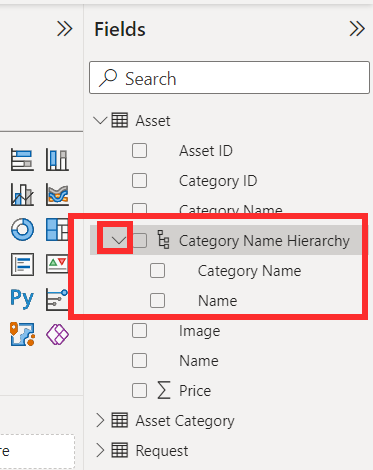](../media/hierarchy-created.png#lightbox)

1.  **Save** your file.
