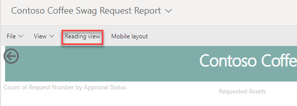
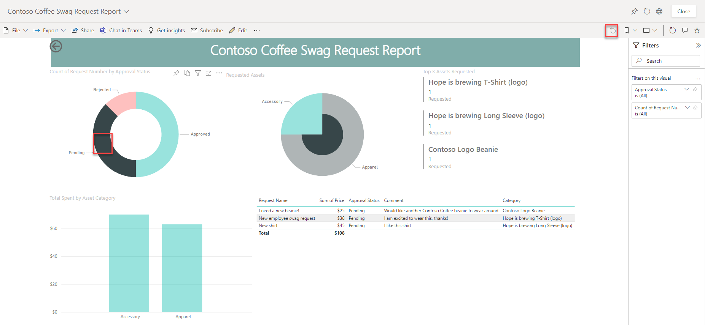
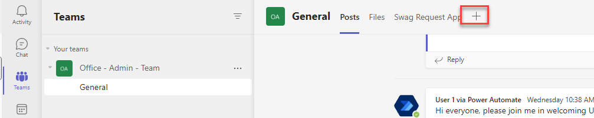
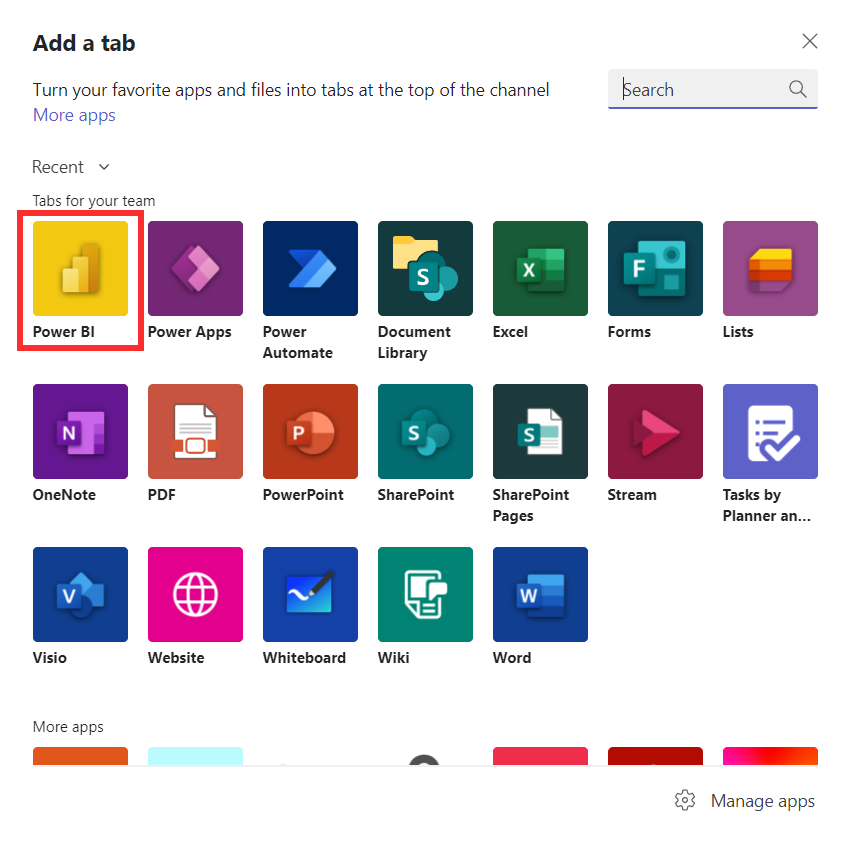
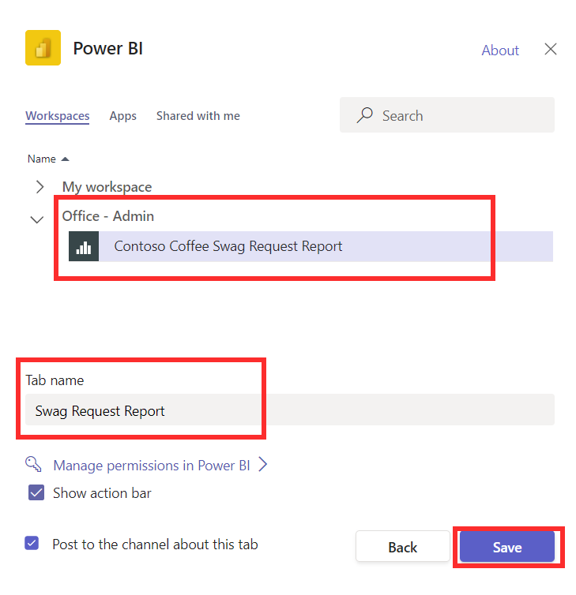
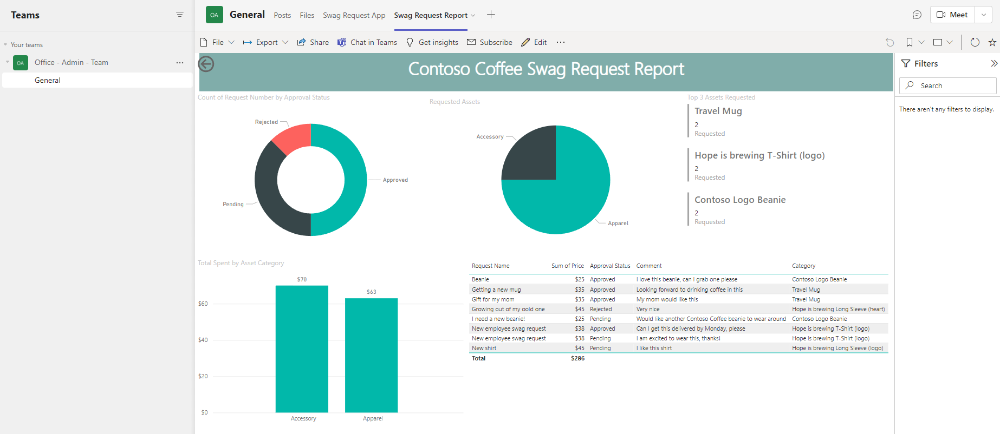

The report is now ready to be used and embedded within Teams. In Teams, you can access Power BI reports and dashboards via the Power BI app, that is, the tool you've used to build the report. The Power BI app is a Teams-embedded version of Power BI Service. For easier access to the reports, you can embed the report in a channel for members to view and interact with.

## Task: Test out the report

1.  Now that you have finished editing the report, you can switch back to Reading view. Select the **Reading view** button.

	> [!div class="mx-imgBorder"]
	> 

1.  Test out interacting with the report. Notice that if you select a data area of the pie chart or column chart, the other visuals are filtered to the selection. Select the arrow indicated to reset the filters.

	> [!div class="mx-imgBorder"]
	> 

## Task: Embed the report in a Teams channel

1.  Navigate to the **Office -\<your name\>** team where you have been building out your solution. Select the **+** button shown to add a new tab to the channel.

	> [!div class="mx-imgBorder"]
	> 

1.  Select **Power BI**.

	> [!div class="mx-imgBorder"]
	> 

1.  Change the **Tab name** to **Swag Request Report.** From the list of workspaces, expand the team where you've created your Power BI report, and select the **Contoso Coffee Swag Request Report**. Then, select **Save**.

	> [!div class="mx-imgBorder"]
	> 

1.  You should now see your report embedded into the team.

	> [!div class="mx-imgBorder"]
	> 
