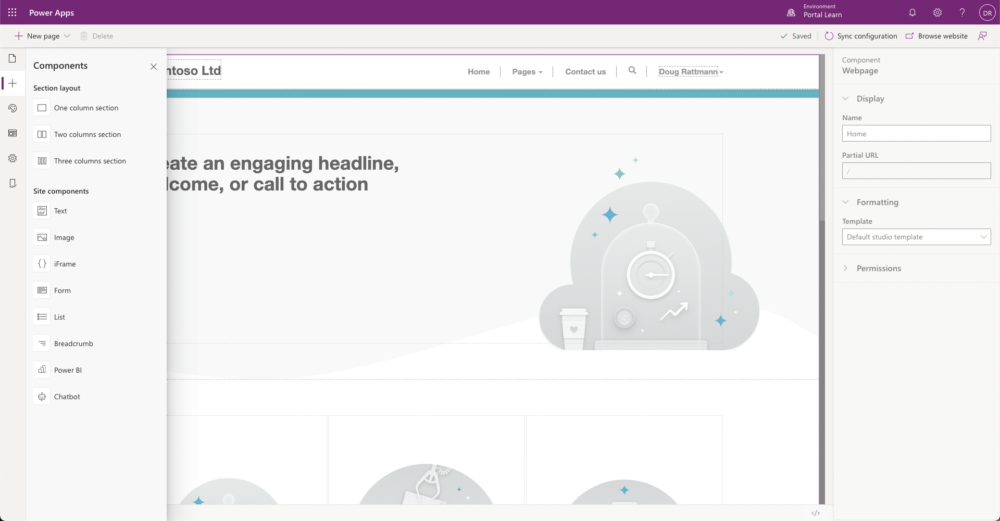

Microsoft Power Platform provides many tools to help you administer, configure, and fine-tune a Power Pages site to meet specific business requirements.

## Power Pages design studio

Power Pages design studio is a portal editing tool that allows makers to create and organize webpages, configure page layouts, add portal components, modify CSS, and edit web templates and page source code. Updates and additions that are made in the design studio will directly update the portal metadata. The design studio is positioned as the main workspace for portal makers.

To access the studio:

1. Sign in to [Power Apps](https://make.powerapps.com/?azure-portal=true).
1. Select the target environment by using the environment selector in the upper-right corner.
1. Select the application of type Portal from the **Apps** list.
1. Select the **Edit** menu.

The studio is used for quickly defining a site structure with webpage management, creating page layouts, embedding forms and lists, applying themes, and editing page templates.

> [!div class="mx-imgBorder"]
> 

## Portal Management app

Not all portal configuration features are available in the Power Apps design studio. Portal Management is a Power Apps model-driven app that allows makers to add, modify, or delete any of the portal metadata rows that define the portal functionality and appearance. The Portal Management app can be used for creating and editing content snippets, managing advanced options for basic forms, advanced forms, and lists, and other advanced configuration tasks.

> [!WARNING]
> Incorrectly modifying the portal metadata might have undesirable effects on the operation and appearance of your portal.

To access the Portal Management app:

1. Sign in to [Power Apps](https://make.powerapps.com/?azure-portal=true).
1. Select the target environment by using the environment selector in the upper-right corner.
1. In the **Apps** list, select the **Portal Management** model-driven app.

> [!NOTE]
> The Portal Management app might be named Dynamics 365 Portals in existing Dynamics 365 environments.

> [!div class="mx-imgBorder"]
> 

## Portals admin center

The Power Apps Portals admin center provides a series of functions for administration of a Power Apps portal such as configuring custom URLs, enabling diagnostic logging, or to enable or install specific features such as SharePoint or Power BI.

To access the Power Apps Portals admin center:

1. Sign in to [Power Apps](https://make.powerapps.com/?azure-portal=true).

1. Select the target environment by using the environment selector in the upper-right corner.

1. From the **Apps** list, select the application of type **Portal**.

1. Select **Settings** on the command bar.

1. Select the **Administration** link under **Advanced options** in the **Portal settings** flyout panel.

   
   
1. Power Apps Portals admin center will open.

   > [!div class="mx-imgBorder"]
   > 