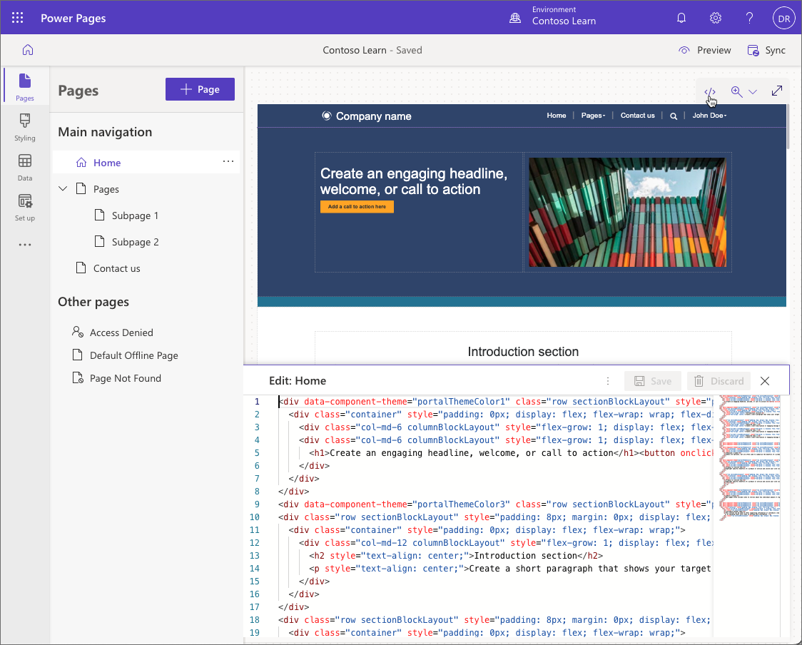

Power Pages is a low-code solution for building business web sites. For complex requirements, advanced makers and pro developers can integrate and extend Power Pages in several ways.

## Integration with other Microsoft Power Platform components

Because Power Pages is part of Power Platform, it provides deep integration with other [Microsoft Power Platform](/power-platform) components.

* **Dataverse** enables secure storage and management of metadata and data used by Power Pages sites.
* **Power Apps** can be used to create custom apps to handle the information accessed and generated by external Power Pages users.
* **Power Automate** extends business logic and handles the data and events when users are interacting with Power Pages.
* **Power BI** integrates with Power Pages directly to provide secure access to reports, dashboards, and tiles on the website. 
* **Power Virtual Agents** adds chatbots to your external-facing websites to enhance user experience.

## Power Pages Extensibility

### Liquid

Liquid is an open-source markup language that can be embedded into content (webpages content, content snippets) and web templates.  Liquid is used to add dynamic content to webpages and can also be used to surface Microsoft Dataverse rows dynamically.

For more information, see [Work with Liquid templates](/power-apps/maker/portals/liquid/liquid-overview/?azure-portal=true).

### Web templates

Power Pages sites are provisioned with a predefined set of web templates that define how a webpage is structured. Makers can modify or create new web templates to address specific requirements. For example, a web template can be created to display static and dynamic content in a specific layout.

For more information, see [Create a custom page template](/power-apps/maker/portals/liquid/create-custom-template/?azure-portal=true).

### Code editor

Makers and pro developers can use [the code editor](/power-pages/getting-started/code-editor) in Power Pages design studio to create and edit complex layouts by editing HTML source code. To view the source code of the page on the canvas, select the code editor icon </> in the command bar.

### JavaScript

Custom JavaScript code can be embedded in different Power Pages assets such as webpages, web templates, forms, and lists.  JavaScript can be used to enhance the client interface, add complex user input validation, call external web services, or access Dataverse functionality directly using Power Apps portals Web API.

> [!NOTE]
> Scripting on website pages is specific to Power Pages and does not use scripts from model-driven apps in forms or views.

For more information, see [Add custom JavaScript](/power-apps/maker/portals/configure/add-custom-javascript/?azure-portal=true).

### CSS

Makers can use Power Pages design studio **Styling** workspace to configure the basic elements of the website style. Pro developers can add custom Cascading Style Sheets (CSS) files to the site. CSS can be used to control the appearance and the behavior of individual site elements. CSS can also implement specific portal features instead of JavaScript code, for example, to hide certain page elements.

To access custom CSS files, select **Styling** workspace, select a theme, select **...** option and then select **Manage CSS**.   

For more information, see [Edit CSS for themes in Power Pages](/power-apps/maker/portals/edit-css/?azure-portal=true).

### Component framework

Power Apps component framework empowers professional developers and app makers to create code components for model-driven and canvas apps. These components can now be used in Power Pages to provide advanced user interfaces and features. 

For more information, see [Use code components in portals](/power-apps/maker/portals/component-framework).

### Developer tools

Power Pages development can now be included as part of application lifecycle management (ALM). Makers and pro developers can use the Microsoft Power Platform Command Line Interface (CLI) to download, change, and upload Power Pages site configuration, and then use Azure Pipelines to commit the configuration data to source control and deploy from development to other environments.

For detailed information on using the Microsoft Power Platform CLI see [Tutorial on how to use Power Platform CLI with portals](/power-apps/maker/portals/power-apps-cli-tutorial).
