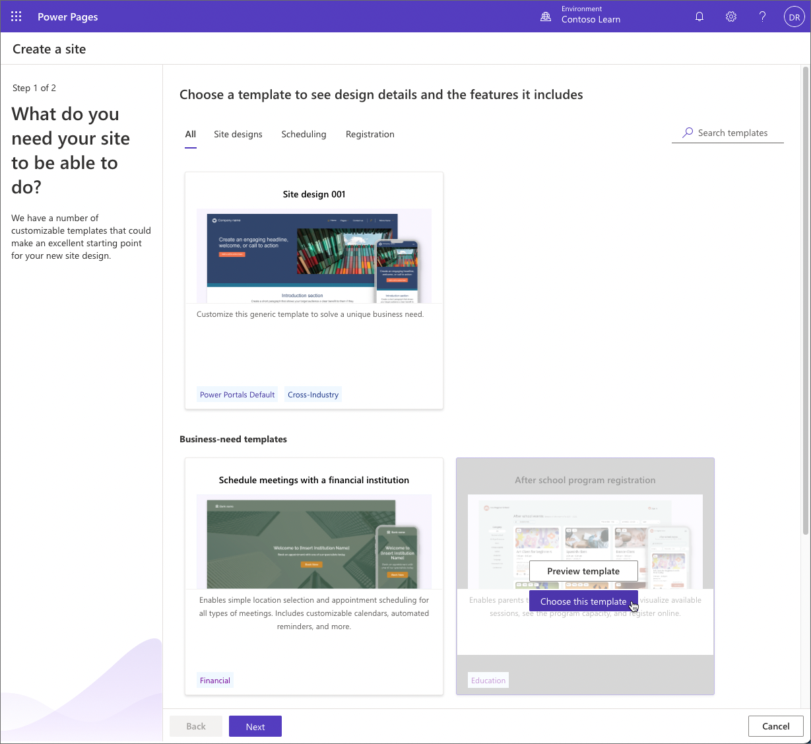
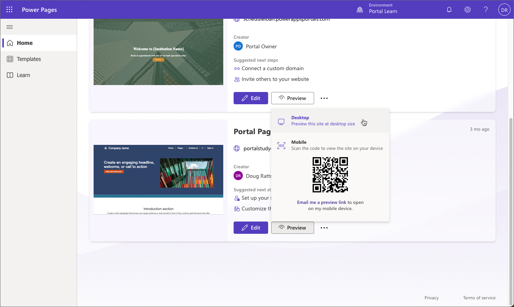
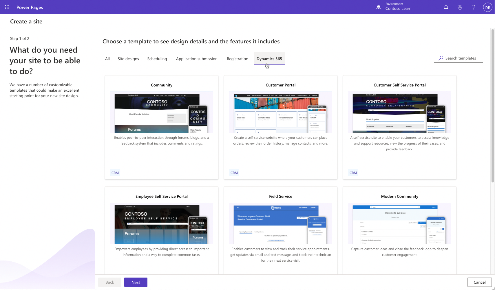
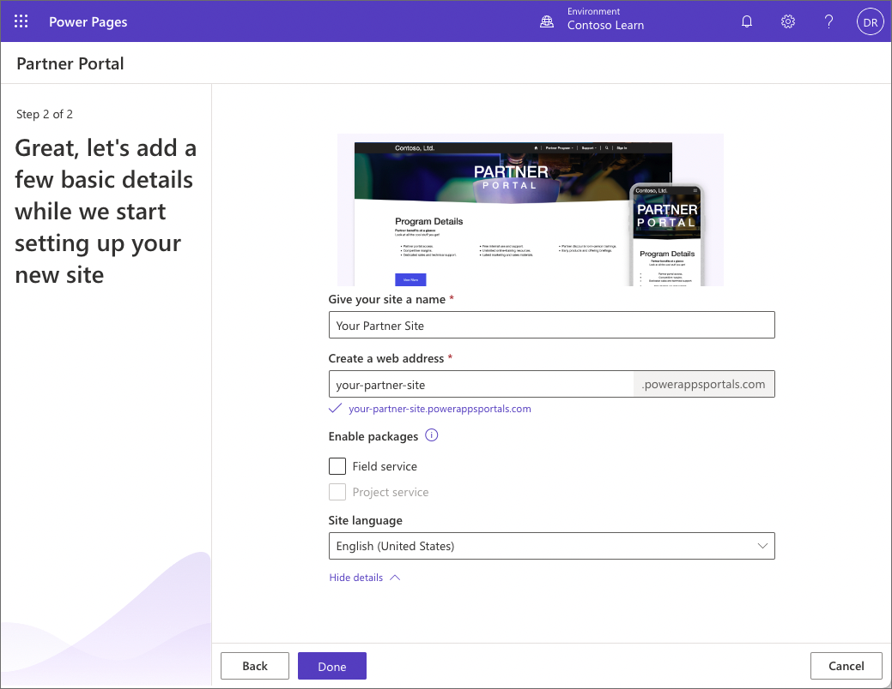

A Power Pages website can be provisioned in a Power Platform environment with Dataverse database. Power Pages comes with a variety of rich, customizable templates targeting specific business scenarios. You can select the template, and specify the name, default address, and language for the website.

> [!IMPORTANT]
> To provision a site, you must be assigned to the System Administrator role in the Dataverse environment selected for the site.

## Provision a website

> [!NOTE]
> A Power Pages site is always created as a trial that can later be converted to a production site.

To provision a Power Pages website:

1. Sign in to [Power Pages](https://make.powerpages.microsoft.com/?azure-portal=true).

1. Select a target environment by using the environment selector in the upper-right corner.

1. Select **Create a site**.

1. Select a template then select **Choose this template**.
   

1. Provide a site name and a unique web address.

1. If your Dataverse environment has more than one language provisioned, expand **Show more details** section and select a site language.

   

1. Select **Done**.

   > [!NOTE]
   > It might take a few moments for your new site to be provisioned.You'll be able to modify the name and web address later.

8. Once provisioning is complete, select **Preview** then select **Desktop** to preview your new website.
   

## Portal templates

Power Pages is evolution of [Power Apps portals](/power-apps/maker/portals/). It's built on the Power Apps portals platform used by thousands of customers today, providing the same robust capabilities and pro developer experiences. 

> [!VIDEO https://www.microsoft.com/videoplayer/embed/74205e30-2d82-4128-ae84-87d2fc7c9167]

In an environment that contains customer engagement apps (Dynamics 365 Sales, Dynamics 365 Customer Service, Dynamics 365 Field Service, Dynamics 365 Marketing, or Dynamics 365 Project Service Automation) you can continue to use [portal templates](/power-apps/maker/portals/portal-templates) to accelerate development and deployment. These templates  target diverse audiences such as communities, customers, partners, and employees and can provide a preconfigured environment that is immediately suitable for a number of scenarios:

- Community and Modern Community 
- Customer, Employee, and Partner self-service 
- Field Service 
- Supply Chain Management Customer and Intelligent Order Management 

> [!IMPORTANT]
> Available starter templates depend on the Dynamics 365 solutions provisioned in the environment. For example, Intelligent Order Management portal requires [Dynamics 365 Intelligent Order Management](/dynamics365/intelligent-order-management/?azure-portal=true) solution provisioned.

## Provision a portal

To provision a portal in an environment with Dynamics 365 customer engagement apps: 

1. Sign in to [Power Pages](https://make.powerpages.microsoft.com/?azure-portal=true).

1. Select a target environment by using the environment selector in the upper-right corner.

1. Select **Create a site**.

1. Select **Dynamics 365** tab.
   

1. Select a template then select **Choose this template**.

1. Provide a site name and a unique web address.

1. If your Dataverse environment has more than one language provisioned, expand **Show more details** section and select a site language.

   > [!TIP]
   > To create a portal in a different language, you must first [enable the language in the environment](/power-platform/admin/enable-languages#enable-the-language) so that it becomes available in the language drop-down list.

1. If Partner portal template is selected, you can additionally include Field Service or Project Service add-ons. These options are enabled if you have Dynamics 365 Field Service or Dynamics 365 Project Service Automation installed, respectively.
   

1. Select **Done** to start the portal provisioning process. After portal provisioning has completed, the portal will appear in the list of Power Pages sites.

> [!VIDEO https://www.microsoft.com/videoplayer/embed/RE4yoJw]
