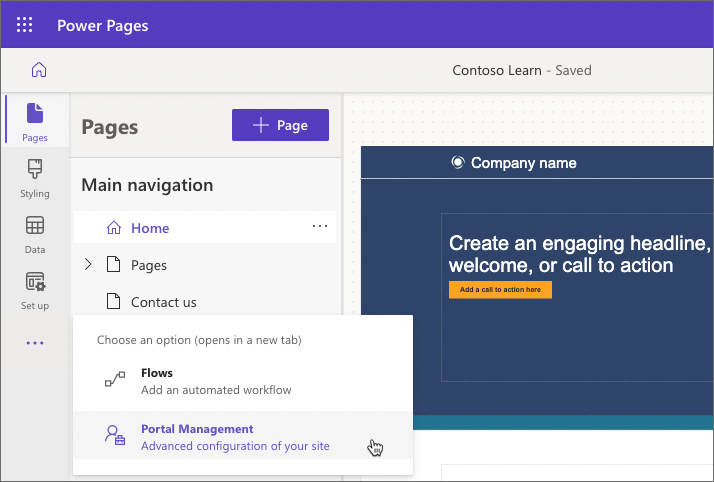
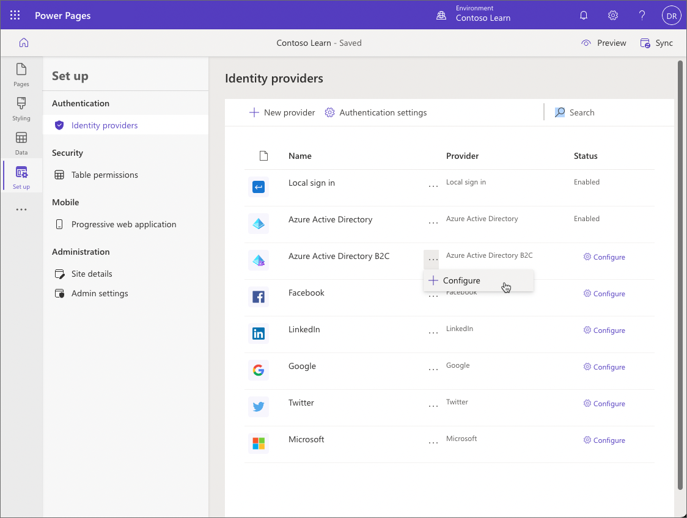

Power Pages has a robust security model to ensure that business information is properly protected and is only accessible by the correct stakeholders. This model fully supports authentication - who can access the website, and authorization - what information are they allowed to access. Authentication and authorization are implemented in Power Pages by the following main components:

- **Authenticated users** in Power Pages are represented in Microsoft Dataverse database by contacts.
- **Table permissions** define access to rows in Dataverse tables regardless of how and where they are accessed in Power Pages.  
- **Page permissions** are used to grant or deny access to the individual pages on the website. 
- **Web roles** link together users and permissions to define user access to Dataverse data and website content.

> [!IMPORTANT]
> Power Pages is built on the foundation of Power Apps portals. Many of the tools and methods used to configure Power Pages use the functionality of Power Apps portals. This functionality is accessible in Portal Management model-driven app that is used side-by-side with Power Pages design studio to configure and extend Power Pages sites. 

Portal Management app can be accessed either from the maker portal at https://make.powerapps.com or from the  overflow menu (...) in Power Pages design studio:

The Portal Management app provides access to the security components and has views and forms to manage security, view portal-specific contact information, and provide user registration and invitation functionality for the Power Pages website.

## Authentication

Power Pages users can authenticate by using the following methods:

- **Local sign in** - Common forms-based authentication with usernames and password hashes stored in the Dataverse contact row.

- **External authentication** - Credentials and password management are handled by other identity providers such as Azure Active Directory B2C, Microsoft, Twitter, Facebook, and more.

Site administrators can configure any combination of authentication options using **Identity providers** option in **Set up** workspace in Power Pages design studio.

> [!IMPORTANT]
> Azure Active Directory B2C is a recommended identity provider for authentication. If another provider support is required, then it can be configured in Azure Active Directory B2C.

## Authorization

After the user is authenticated and associated with a contact, Power Pages uses a number of tables to define authorization, that is, what a user is allowed to do. 

A **Web role** allows administrators to control user access to website content and Dataverse data. A web role can be associated with the following tables:

- **Web Page Access Control Rules** - Define page permissions, i.e. what pages are visible to the web role and what actions can be taken.
- **Table Permissions** - Define what access a web role has to rows in the individual Dataverse tables.
- **Column Permission Profiles** - Define what access a web role has to individual columns when a Dataverse table is accessed using Portals Web API.

A Power Pages user might be assigned to one or more web roles at a time. Access rules and permissions of individual roles are combined to calculate the resulting permissions set.

One of the web roles on the site can be marked as **Authenticated** and the other as **Anonymous**. These roles allow you to apply permissions and access rules to all users based on whether they're signed in or if they access the site anonymously.
