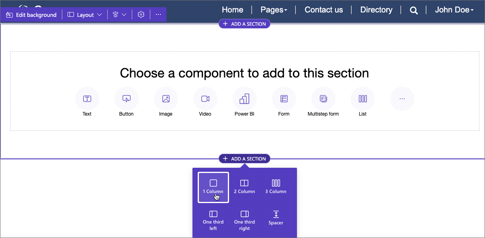
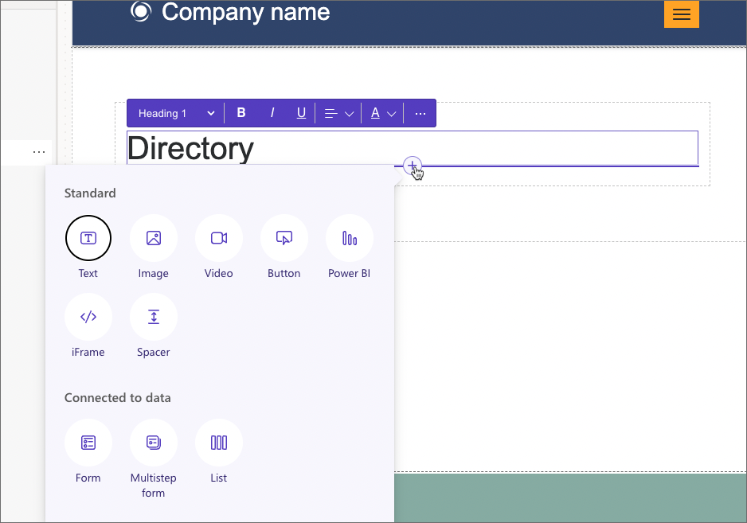
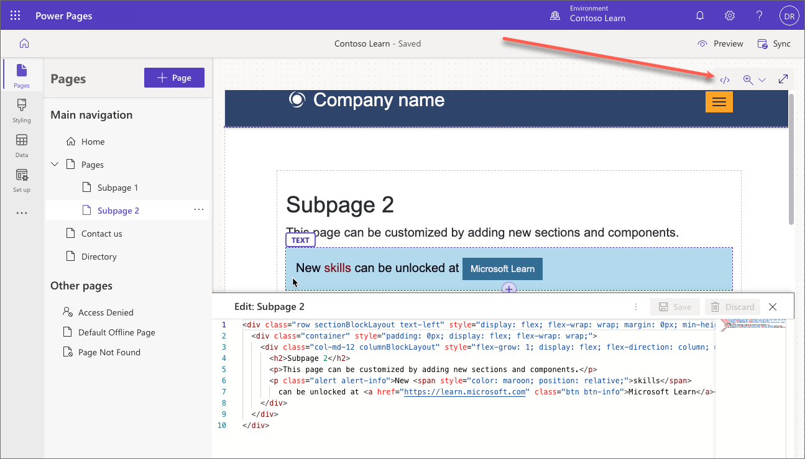

After a page has been created, you can add a set of predefined components to create the layout and add static and dynamic content. This simple design approach will add corresponding HTML, CSS, or code to the page without the need to know the structure or syntax of these languages. 

To add a section, select any existing section on the page, select the plus sign (**+**) or **Add a section**, and then select from one of the available section layouts.

> [!TIP]
> Section layout can be changed later, after the section has already been created.

To add a component, select either an empty section or an existing element where you'd like to place the component. Use the plus sign (**+**) or the overflow button (**...**) to display all available components, and then select a component to insert.

There are two types of the components.

* **Standard** components are used to create page layout and static content.
* **Connected to data** components are used to display dynamic and interactive content based on Dataverse data.    

All sections and components allow for in-context editing and you can edit any section or component directly from the canvas. When a section or a component is selected, context menu appears where you can adjust properties of the selected element such as alignment, style, color, size, etc. See [Customize webpages](/power-pages/getting-started/customize-pages#see-also) for more details about available components and their properties.

## Source code

Often there are requirements for additional elements that are not available as design studio components, or for more complex layouts and formatting, or the need for small snippets of CSS or JavaScript. These can be created in the code editor that allows makers and pro developers to view and modify the source code of the page. 

To view the source code of the page on the canvas, select the code editor icon </> in the command bar.

The source code is displayed in the code editor pane at the bottom of the screen. To make changes, update the source code and then select **Save**. The changes will be reflected on the canvas.

> [!WARNING]
> You can potentially damage the layout of your page by entering incorrect syntax in the source code. Create a copy of the original code before making any significant changes.
