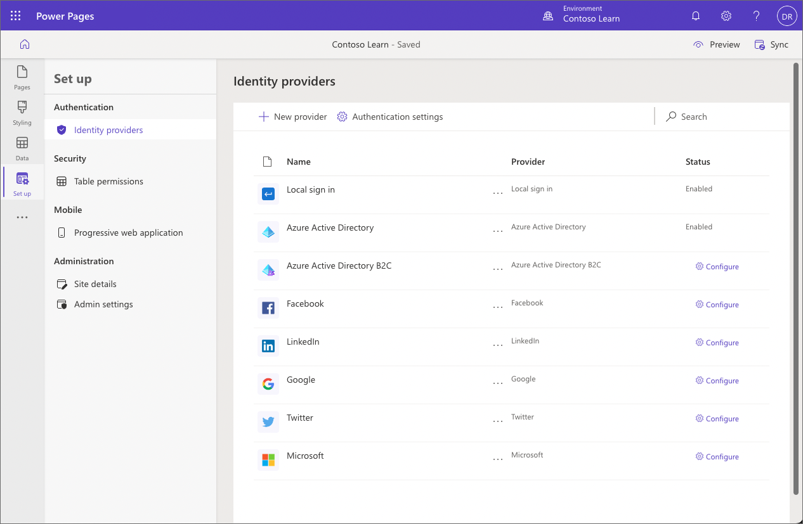
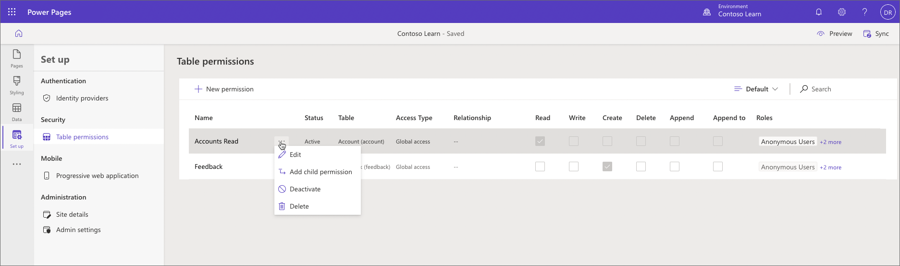
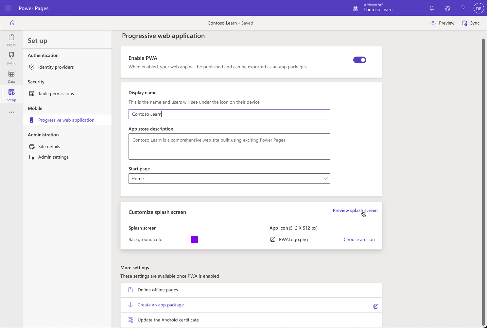
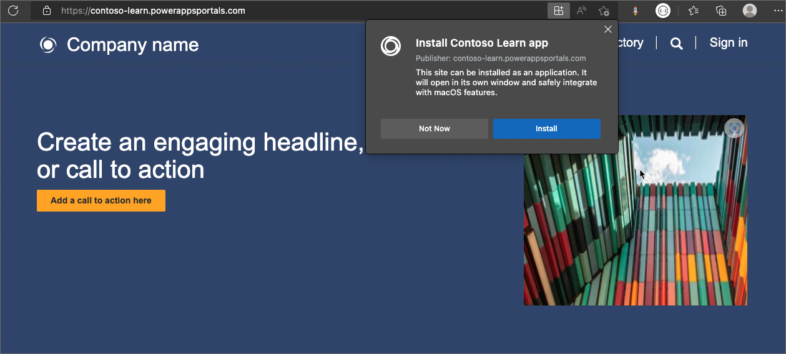

The **Set up** workspace allows you to configure key aspects of your Power Pages site: authentication, table permissions, progressive web application, and access to Power Pages admin center.

## Authentication

Setting up authentication is a core customization in any business web site. Simplified identity provider configuration in Power Pages **Set up** workspace provides in-app guidance for identity provider setup and removes setup complexities. 

Makers and administrators can configure the portal for supported identity providers by following steps that are documented at [Simplified authentication and identity provider configuration](/power-apps/maker/portals/configure/use-simplified-authentication-configuration/?azure-portal=true).

## Table permissions

Site administrators can control access to specific pages using page permissions. However, they'll also want to secure custom web applications built with forms, lists, and portals Web API. To secure these features, table permissions allow granular rights to be granted.

To access the table permissions page in Power Pages design studio, select **Set up** workspace and then select **Table permissions**.

Selecting individual table permissions row will open a new panel where table permissions can be managed, and have the web roles assigned to them.

For more information about Table permissions, see [Screenshot of Configuring table permissions in Power Pages.](/power-pages/security/table-permissions).

## Progressive web application

Power Pages supports progressive web app (PWA) technology that enables creating an app that will work on all platforms (Android, iOS, Windows, and Chromebooks) and form factors (mobile, desktop, and tablet).

PWAs are built to provide users a native app–like experience. These apps can be installed from the browser or through app stores. This capability enables external and internal customers to use a portal as an app.

To configure the portal as a PWA select **Progressive web application** in **Set up** workspace and then select **Enable PWA** toggle.

Once PWA properties are configured, the site will become an app installable from the browser and mobile app stores. 

For more information about building a Power Pages site as a PWA, see [Power Pages sites as progressive web apps (PWAs) overview](/power-pages/configure/progressive-web-apps).
