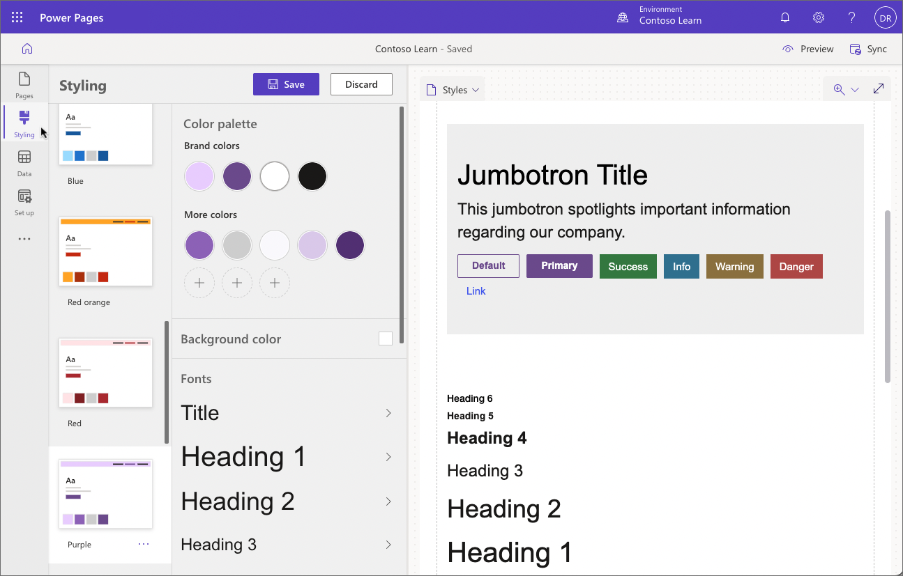
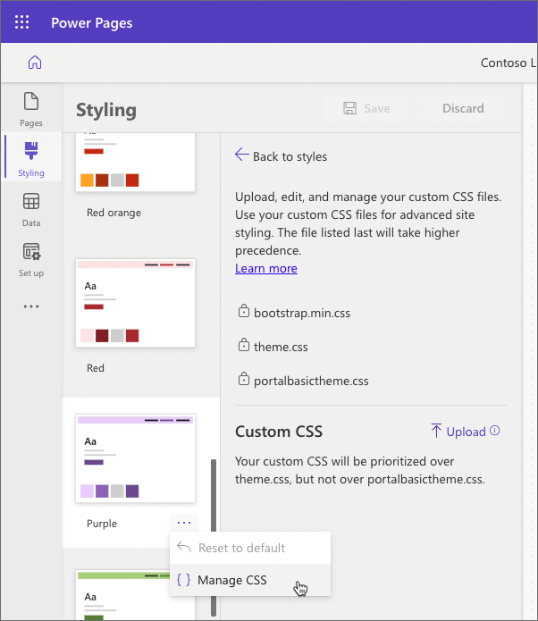
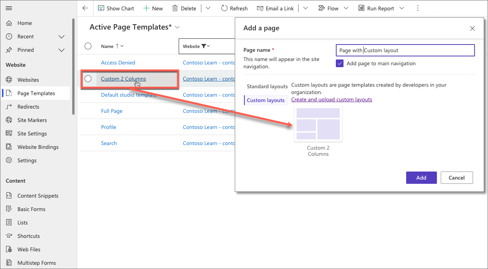

A pages theme describes the colors, fonts, section margins, and other design elements of a site. Pages site is provisioned with a default theme. However, you might want to align your site with your specific corporate branding. 

## Styling 

You can choose a theme from several available presets and then apply customizations in **Styling** workspace. Any customization is applied immediately to the page on canvas making it easy to work with the basic styling.

## Custom CSS

For more complex styling requirements Power Pages design studio allows makers to upload custom CSS files.

Once the custom CSS file is uploaded it will apply to all themes and the page canvas will reflect the applicable styles. You can upload multiple CSS files and set their order as required. For more information about custom CSS, see [Manage CSS files in Power Pages](/power-pages/configure/manage-css) in product documentation.

## Templates

For complex sites, standard layouts available in Power Pages design studio may not be sufficient. For these scenarios Power Pages supports creating pages using custom layouts. 

Because Power Pages is built on the foundation of Power Apps portals, it can use page templates created by makers and pro developers in Portal Management app. When a new Page Template is defined, it becomes available in the design studio as a custom layout.

For detailed information on how to create custom page templates, go to [Create and manage page templates](/power-apps/maker/portals/configure/page-templates) and [Store source content by using web templates](/power-apps/maker/portals/liquid/store-content-web-templates) in the Power Apps documentation.

