In this part of the scenario, we'll set up the chatbot to interact with the Dataverse for Teams tables we created in a prior lab in this learning path so that the user can submit a request for swag using the chatbot. To do this, we'll be using the embedded flow experience inside the Power Virtual Agents app in Teams.

## Task 1: Get the schema name for your Dataverse for Teams table

1. When you created your Dataverse for Teams tables and columns, each component is given a technical or schema name behind the scenes. we'll need to find that in order to use it in our flow. Navigate back to Power Apps using the icon on the Teams left hand navigation bar. Select the **Build** tab, and select the Team you have been working in. Then select the **Asset table** in the list of items created.

    > [!div class="mx-imgBorder"]
    > [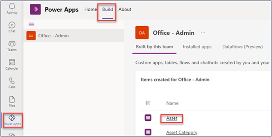](../media/build.png#lightbox)

2. Select **Columns**.
 
    > [!div class="mx-imgBorder"]
    > 

3. You'll now see a behind the scenes view of your table and columns. Under the heading Name you'll see schema names, in a format like **crao5_AssetId**. Your schema names may be slightly different – you'll have your own unique prefix which isn't the same as this example.

    > [!div class="mx-imgBorder"]
    > [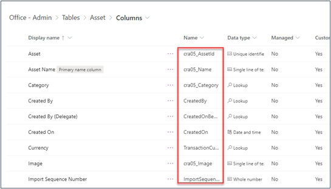](../media/column-names.png#lightbox)

4. Make a note of your schema names for the following columns. you'll need these in this and the following tasks.
    
    *Asset*

    *Asset Name*

    > [!div class="mx-imgBorder"]
    > [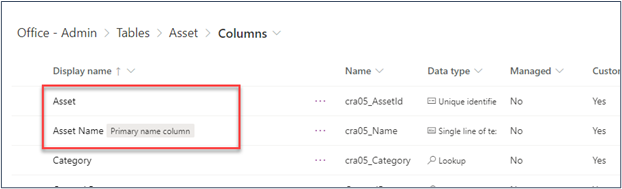](../media/schema-names.png#lightbox)

5. Navigate back to Power Virtual Agents using the icon on the Teams left hand navigation bar. Select the Chatbots tab, and select the chatbot you have been working on to open it. 
 
    > [!div class="mx-imgBorder"]
    > [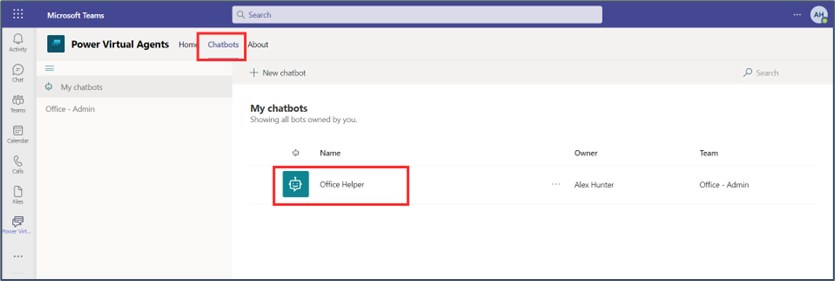](../media/chatbot.png#lightbox)

## Task 2: Create a new Topic

1. Navigate to Topics and select **+ New Topic**.
 
    > [!div class="mx-imgBorder"]
    > [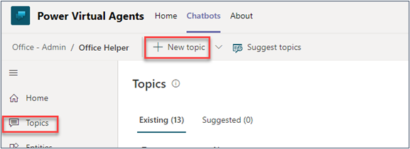](../media/new-topic-flow.png#lightbox)

2. Add the following trigger phrases by typing them in and selecting the   button after each one, until they all appear in the list

    *Want to order swag*
    *I need to make a request for merch*
    *Can I put in a request?*
    *Place an order for swag.*
    *How do I put in an order?*

3. Select **Details** and give the topic a name by typing: **Request swag** in the Name box. Then close details pane.
 
    > [!div class="mx-imgBorder"]
    > [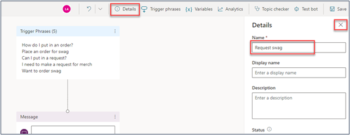](../media/details-name-box.png#lightbox)

4. In the Message box, add the following text:

    *I can help you request Contoso Coffee swag*. 
 
    > [!div class="mx-imgBorder"]
    > [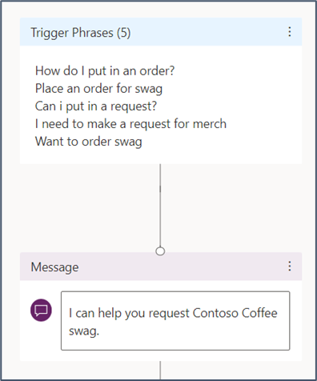](../media/trigger-message.png#lightbox)

5. Save your bot before continuing to the next task, by selecting on the **Save** icon in the top right corner.

## Task 3: Create a flow to get a row from a Dataverse for Teams table

Power Virtual Agents in Teams comes with a built-in experience for Power Automate, with templates to make it easy for you to get your chatbot to call an action. In this task, we'll use Power Automate to look up the first item in our Assets table in Dataverse for Teams, and return that as a suggestion for the user to request that item. 

1. Add a node and select **Call an action**. Select **Create a flow**. This will launch Power Automate inside Microsoft Teams.
 
    > [!div class="mx-imgBorder"]
    > [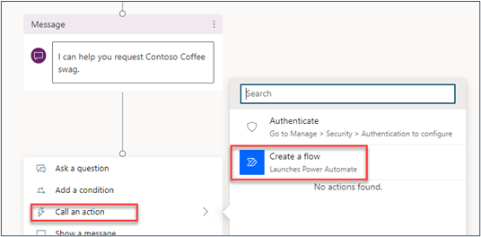](../media/create-flow.png#lightbox)

2. Select the **Power Virtual Agents Flow Template**. This template is designed to pass inputs from the chat to a flow, and then to provide outputs from the flow back to Power Virtual Agents.
 
    > [!div class="mx-imgBorder"]
    > [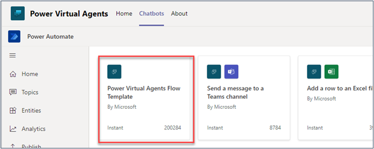](../media/virtual-agent-flow.png#lightbox)

3. You may see a screen here confirming your flow connections. Select **Continue**.

4. You'll now see the flow template, with the Power Virtual Agents input and output steps. We aren't bringing any inputs from the chat into this flow, so we don’t need to do anything here in that first stage. **Add an action** between the input and output steps.
 
    > [!div class="mx-imgBorder"]
    > [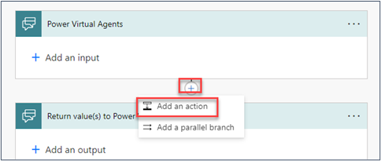](../media/add-action.png#lightbox)

5. Search for list rows and select the List Rows Microsoft Dataverse action. 

    *This connector allows your chatbot to connect to your Dataverse for Teams tables, with various actions, including creating, updating, deleting or retrieving records*.
 
    > [!div class="mx-imgBorder"]
    > [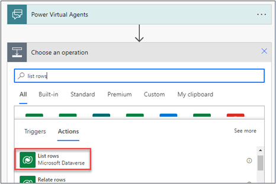](../media/choose-operations.png#lightbox)

6. Choose the **Assets** Table name from the dropdown list. You can type the word **Assets** in to the box to make it easy to find your table.

7. Select **Show advanced options** to see the rest of this action step.
 
    > [!div class="mx-imgBorder"]
    > [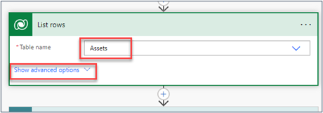](../media/advance-options.png#lightbox)

8. We just want to retrieve the first row from the table, so enter the number **1** in the **Row count** box.

    > [!div class="mx-imgBorder"]
    > [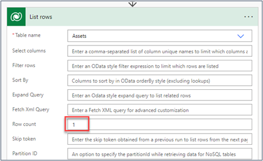](../media/row-count.png#lightbox)

9. We're going to compose a variable to store the information from the item we retrieved in the previous step, to make it easier to pass it back to the chatbot. Add an action underneath this one, search for **compose** and choose the **Compose (Data Operation)**.
 
    > [!div class="mx-imgBorder"]
    > [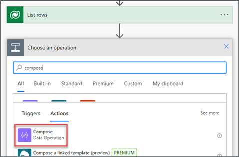](../media/compose.png#lightbox)

10.	Select the **Inputs** box, in the action step and then select the **Expression** tab in the Dynamic content box that pops up. Type the following expression into the function box and select **OK**. This expression gets the value of the item: 

    `first(body('List_rows')?['value'])`

    > [!div class="mx-imgBorder"]
    > [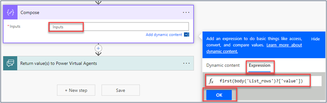](../media/expression.png#lightbox)

11.	You'll see a formula in the Inputs box.
 
    > [!div class="mx-imgBorder"]
    > [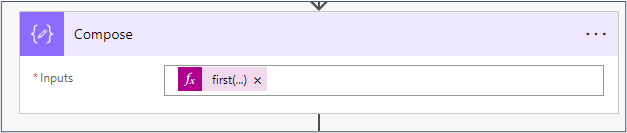](../media/compose-inputs.png#lightbox)

12.	We'll return the asset name and ID to the chatbot. Select the **Return value(s) to Power Virtual Agents** step and select **+Add an output**.

    > [!div class="mx-imgBorder"]
    > [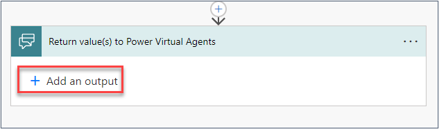](../media/add-output.png#lightbox)

13.	Choose **Text** and enter the title: **Name**. In the **Enter a value to respond** box go to the Expression tab on the Dynamic content box, and enter the following formula – substitute schema name here for your own schema name (this is the word name below) for the **Asset Name** column in your table that you noted earlier. Yours will have a different prefix. Then select **OK**.

    `outputs('Compose')?['cra05_Name']`
 
    > [!div class="mx-imgBorder"]
    > [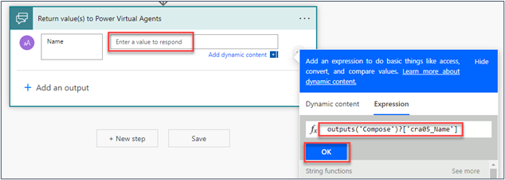](../media/return-value.png#lightbox)

14.	Repeat the step above to add the ID to the outputs. Select **+Add an output** and choose **Text**. Enter the Title: ID. In the **Enter a value to respond** box go to the Expression tab on the Dynamic content box, and enter the following formula – substitute the highlighted schema name here for your own schema name for the **Asset** column in your table that you noted earlier. Yours will have a different prefix. Then select **OK**.

    `outputs('Compose')?['cra05_AssetId']`

15. You'll see formulas in both output boxes.
 
    > [!div class="mx-imgBorder"]
    > [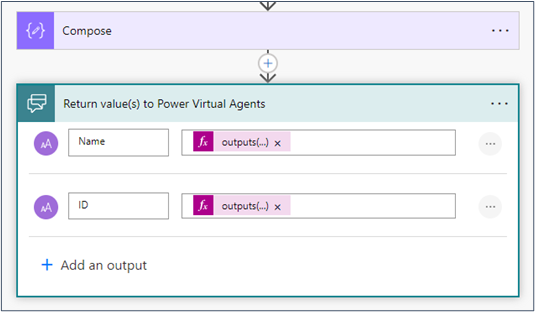](../media/compose-return-value.png#lightbox)

16.	Change the name of your flow at the top left of the screen to: **Get first asset** and then and save by selecting on the **save** button.

    > [!div class="mx-imgBorder"]
    > [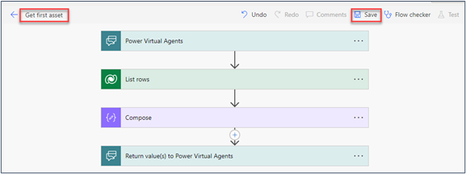](../media/save-asset.png#lightbox)

17.	Once your flow is saved, select the blue arrow next to the name of your flow to return to Power Virtual Agents. In the next task, you'll connect this flow to your chatbot.
 
    > [!div class="mx-imgBorder"]
    > [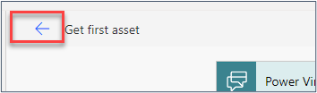](../media/return-flow.png#lightbox)

## Task 4: Connect your flow with outputs to your chatbot

1. Under your message node select **Call an action**, and select the flow you just created in the previous task. Make sure you select the Name of the flow, not the blue hyperlink to show flow details (that will take you back to editing the flow).

    > [!div class="mx-imgBorder"]
    > [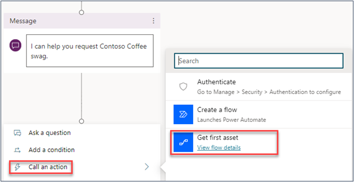](../media/get-first-asset.png#lightbox)

2. Your flow is now connected to your chatbot.
 
    > [!div class="mx-imgBorder"]
    > [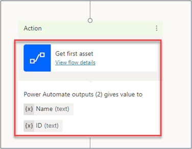](../media/flow-connected.png#lightbox)

## Task 5: Create a flow to submit a request for an asset

1. Add a new show **message node** underneath the flow action node, and enter the following:

    *The first thing we always provide for new employees is*:

2. Then select the variable button and select the **Name** variable. This brings in the name of the first item from your Asset table that the flow retrieved in the previous step.
 
    > [!div class="mx-imgBorder"]
    > [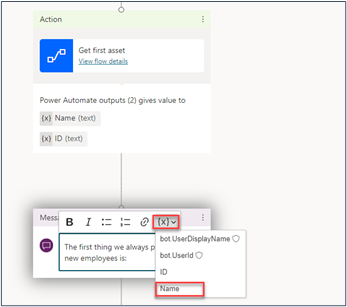](../media/name-variable.png#lightbox)

3. Add a node for **Ask a question**. Enter this text into the question box:

    *Would you like me to request this for you?*

4. In the Identify box, open the options and select **Boolean**.
 
    > [!div class="mx-imgBorder"]
    > [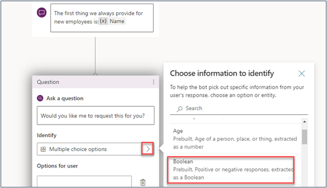](../media/boolean.png#lightbox)

5. Edit the name of the variable to **FirstRequest**. Close the Variable Properties pane by selecting on the X in the top right corner.
 
    > [!div class="mx-imgBorder"]
    > [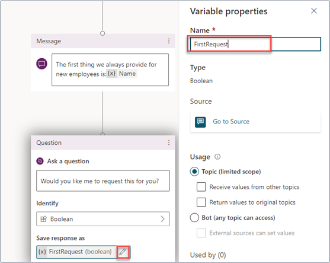](../media/variable-properties.png#lightbox)

6. Add a new node and select **Add a Condition**. In the left branch of the Condition, select the **FirstRequest** variable from the dropdown list, and select **True** from the second dropdown list.
    
    > [!div class="mx-imgBorder"]
    > [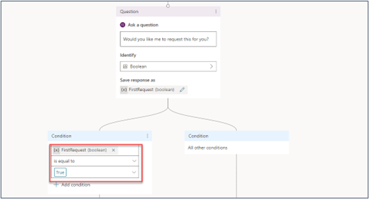](../media/node-condition.png#lightbox)

7. Add another node underneath and select **Ask a question**. Enter the question:

    *Please add your comments to submit with this request*

8. From the Identify options, select **User’s Entire Response**.
 
    > [!div class="mx-imgBorder"]
    > [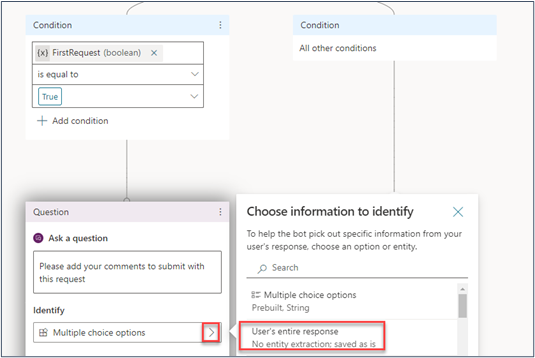](../media/user-response.png#lightbox)

9. Change the name of the variable to **Comments** and close the **Variable Properties** pane.
 
    > [!div class="mx-imgBorder"]
    > [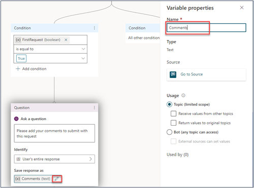](../media/variable-properties-name.png#lightbox)

10. **Save** your bot using the save button in the top right corner.
    
11.	Create another flow, this time to request the asset on behalf of the user. Add a new node, select **Call an Action**, and then **Create a Flow**. 
 
    > [!div class="mx-imgBorder"]
    > [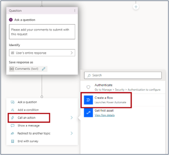](../media/action-create-flow.png#lightbox)

12.	Select the **Power Virtual Agents Flow Template**.
 
    > [!div class="mx-imgBorder"]
    > [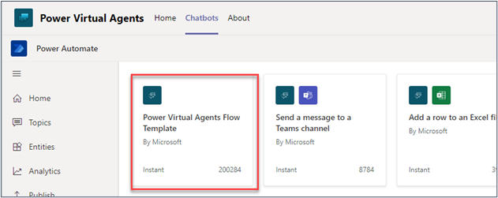](../media/power-agent-template.png#lightbox)

13.	In the previous flow, we got the ID of the asset the person is now requesting. We need to pass that into this flow as an input from the chatbot. Open the first Power Virtual Agents step in the flow by selecting on it, and select **+ Add an input**.
 
    > [!div class="mx-imgBorder"]
    > [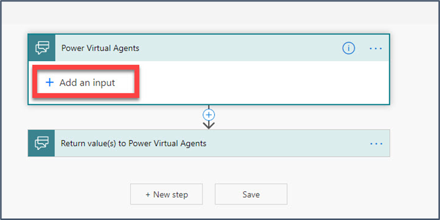](../media/add-input-agent.png#lightbox)

14.	Select Text and then in the Input name, enter **AssetID**.
 
    > [!div class="mx-imgBorder"]
    > [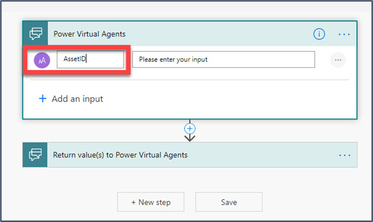](../media/input-name.png#lightbox)

15.	Repeat this step to add another input for the comments provided by the user. Select **+Add an input**, select Text and in the Input name enter: **Comments**.
 
    > [!div class="mx-imgBorder"]
    > [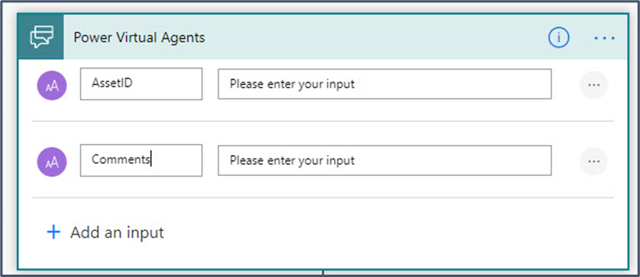](../media/input-name.png#lightbox)

16.	Add an action under this input step.
17.	Search for add a new row and select the **Add a new row Microsoft Dataverse** action.
 
    > [!div class="mx-imgBorder"]
    > [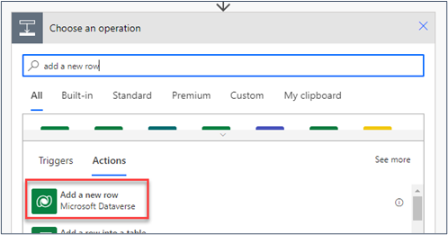](../media/add-new-row.png#lightbox)

18.	This flow is going to submit a request for the user. Select **Requests** as the Table name from the dropdown list and select **Show advanced options**.
 
    > [!div class="mx-imgBorder"]
    > [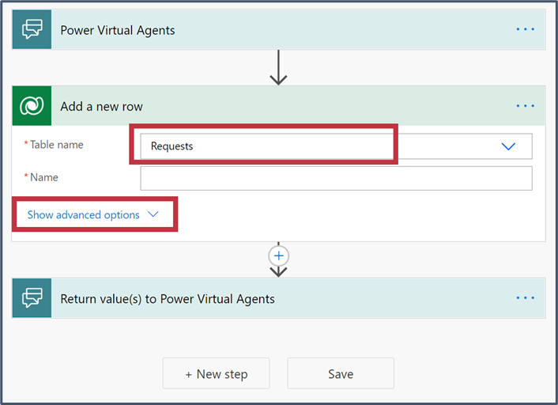](../media/row-advance-option.png#lightbox)

19.	In the **Name** box, enter **New employee swag request**. Select in the Comment box, and select **Comments** from the Dynamic content box.

    > [!div class="mx-imgBorder"]
    > [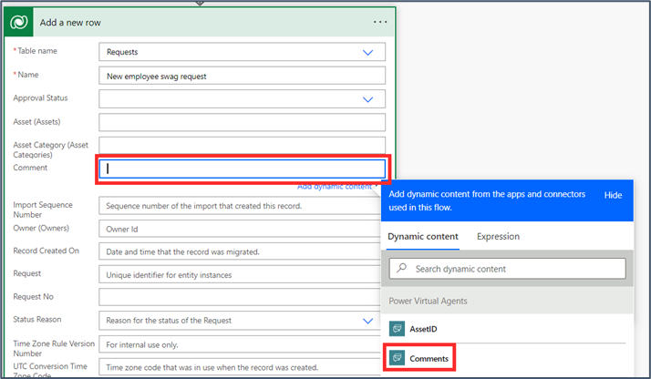](../media/row-comment.png#lightbox)

20.	Select in the Asset (Asset) box, and enter the following expression (replace the prefix with the same prefix you found in your own schema names earlier). When we create the request and fill in the asset, we're connecting to the asset table as well, with the lookup column. The flow needs us to define the name of that connected table when creating this record.

    `cra05_assets()`

    > [!div class="mx-imgBorder"]
    > [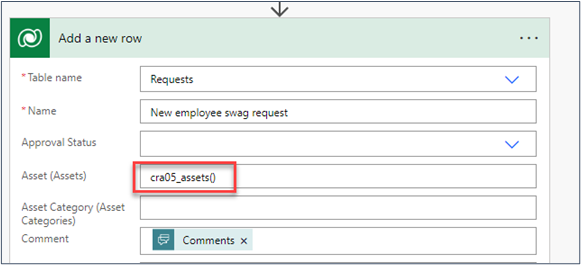](../media/row-asset.png#lightbox)

21.	Select in between the brackets in this formula and then select the **AssetID** from the Dynamic content box. Make sure the AssetID Dynamic content is between the brackets in your expression.
 
    > [!div class="mx-imgBorder"]
    > [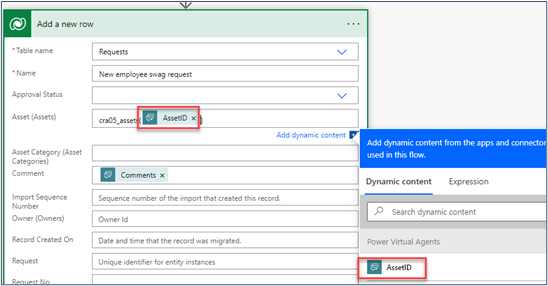](../media/asset-identification.png#lightbox)

22.	Change the name of your flow to: **Create a request**. Save your flow and then use the back arrow next to the name to return to Power Virtual Agents.
 
    > [!div class="mx-imgBorder"]
    > [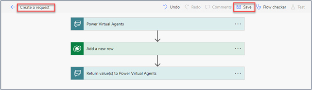](../media/save-request.png#lightbox)

## Task 6: Connect your flow with inputs to your chatbot

1. Scroll down to the question where you asked the user to add comments. Add a new node, select **Call an Action**, and select the flow you just created.
 
    > [!div class="mx-imgBorder"]
    > [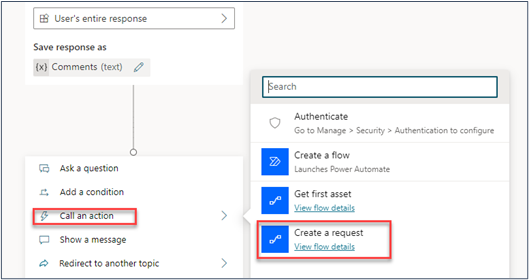](../media/create-request.png#lightbox)

2. Now you need to map the variables you created in Power Virtual Agents to the inputs from the flow. Select your variables from the dropdowns as follows.

    *AssetID (text) gets value from*: **ID**
    
    *Comments (text) get value from*: **Comments**
 
    > [!div class="mx-imgBorder"]
    > [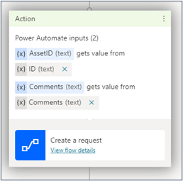](../media/comment-text.png#lightbox)

3. Add a confirmation message so that the user can see that their request has been sent. Add a node underneath and select **Show a message**. Type the following in the message box.

    *Thank you, your request has been submitted*.

4. Select after the word “for” and select the Name variable.
 
    > [!div class="mx-imgBorder"]
    > [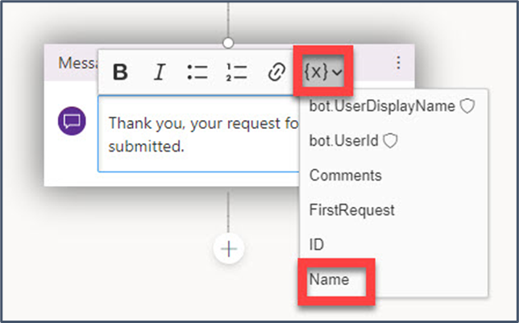](../media/name-variable-word.png#lightbox)

5. Add another node underneath to end the conversation with a survey.

    > [!div class="mx-imgBorder"]
    > [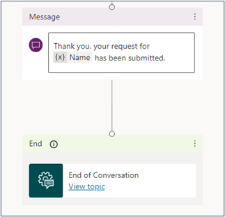](../media/end-message.png#lightbox)

6. Scroll up to the question node for **Would you like me to request this for you?**. Under the condition branch for All other conditions, add an **End with survey node**.
 
    > [!div class="mx-imgBorder"]
    > [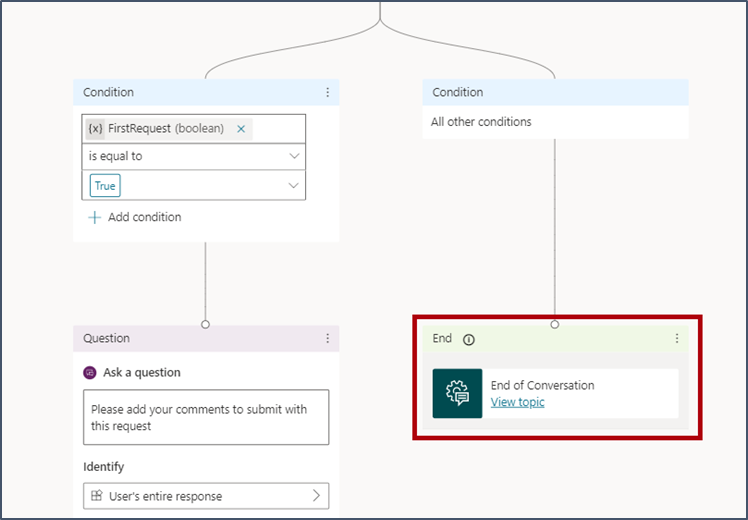](../media/end-flow-survey.png#lightbox)

7. Save your bot by selecting on the **Save** icon.

## Task 7: Test your bot

1. Switch on the **Track between topics** toggles at the top of the Test bot pane. Type one of your trigger phrases (for example, I want to order swag) in the test bot pane. The bot should return a suggested item, which is the first item in your asset table.

    > [!div class="mx-imgBorder"]
    > [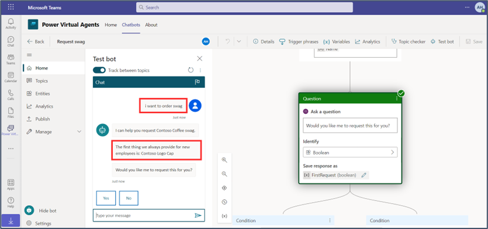](../media/track-topic-toggle.png#lightbox)

2. Continue the conversation with the chatbot by selecting **Yes** and then entering your comments: 

    *Can I get this delivered to me by Monday, please*.

3. You should then see a confirmation message with the name of the asset, and the End of Conversation topic.
 
    > [!div class="mx-imgBorder"]
    > [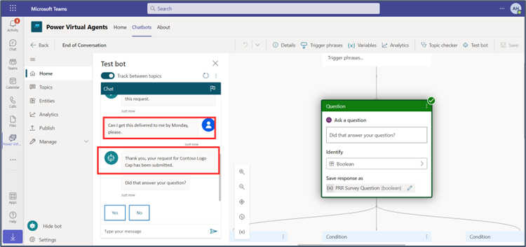](../media/confirmation-name-asset.png#lightbox)

4. Let’s check that the request has been submitted. Select the Teams icon in the left-hand navigation bar and go to the team and channel where you created your app in a prior lab in this learning path. You should see the request you just submitted in the app. 
 
    > [!div class="mx-imgBorder"]
    > [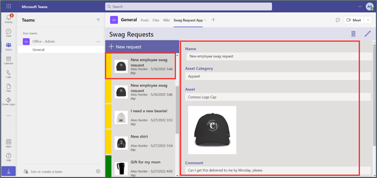](../media/submitted.png#lightbox)

    Congratulations! You have just built a bot, which can answer questions, retrieve an asset from your Dataverse for Teams database, and submit a request on behalf of the user. 

In the next exercise, we'll publish and share it and use it in Teams chat.
