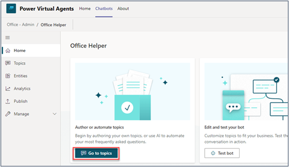
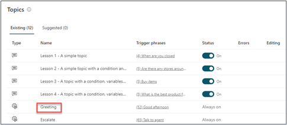
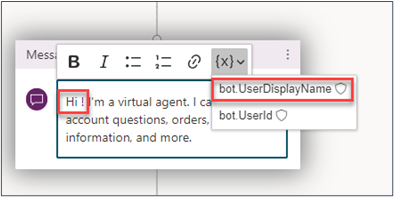
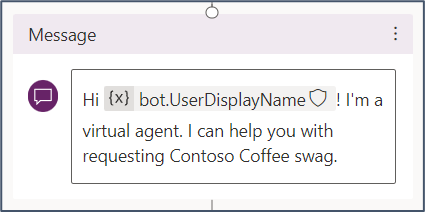
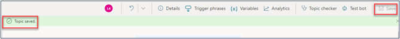
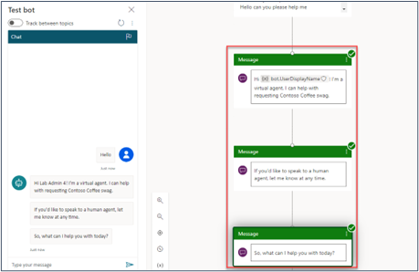
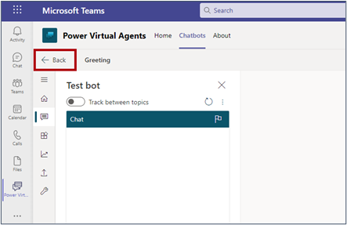

Two special user-related variables are available to help you personalize your chatbot conversations, known as claim variables. These variables allow you to show the display name and user ID of the signed-in user in your chatbot. 

## Task: Edit and personalize the greeting topic

In this task, you'll edit the greeting topic so that the chatbot greets the user in Teams by their name. You'll also edit the standard greeting topic so that it explains to the user what it's designed to help with.

1. Select **Go to topics**.

    > [!div class="mx-imgBorder"]
    > 

1. Find the **Greeting** topic and select it to open the authoring canvas.

    > [!div class="mx-imgBorder"]
    > 

1. Personalize the greeting by adding a variable that will display the name of the user. Put your cursor between the word “Hi” and the exclamation point (**!**) and then add a space. Select the variable icon and then select **bot.UserDisplayName**.
 
    > [!div class="mx-imgBorder"]
    > 

1. Edit the rest of the message with the following text:

    *I’m a virtual agent. I can help you with requesting Contoso Coffee swag*.
    
    > [!div class="mx-imgBorder"]
    > 

1. Select **Save** and then wait until the confirmation message appears.
 
    > [!div class="mx-imgBorder"]
    > 

1. Test your bot by typing **hello** in the test bot pane. 

1. Your chatbot should show as using your new greeting, including your name, in the test pane. Green check marks will display in the authoring canvas, showing the successful path that the chatbot has followed during your test.
 
    > [!div class="mx-imgBorder"]
    > 

1. Select **Back** to return to your list of topics. 

    > [!div class="mx-imgBorder"]
    > 
