Now that you've finished editing and testing your bot, you're ready to publish it and test or use it in Teams.

## Task: Publish your bot and add it to the team

Your first task is to publish your bot and add it to the team.

1. Return to your Power Virtual Agents app through the left navigation bar and then open your chatbot for editing. Select the **Publish** icon in the left Power Virtual Agents navigation menu.
 
    > [!div class="mx-imgBorder"]
    > [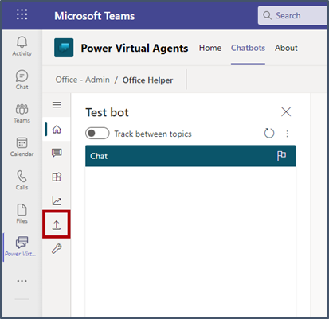](../media/publish-icon.png#lightbox)

1. Select the **Publish** button and then confirm by selecting the **Publish** button in the pop-up prompt that asks if you want to publish the latest content.

    > [!div class="mx-imgBorder"]
    > [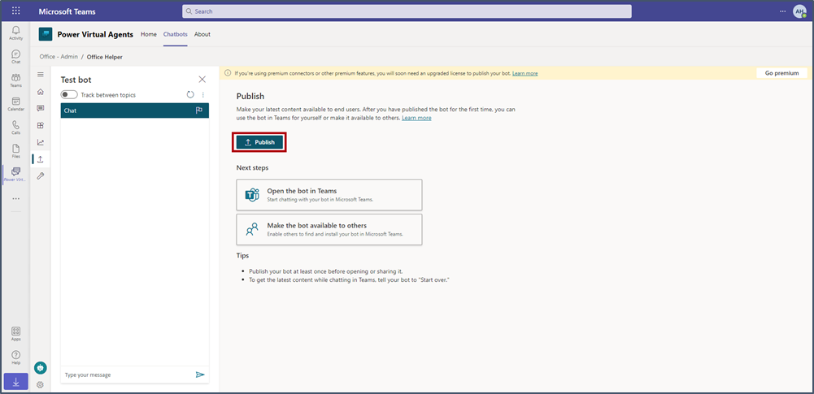](../media/publish-button.png#lightbox)

   When your bot is published, a confirmation message will appear.
 
    > [!div class="mx-imgBorder"]
    > [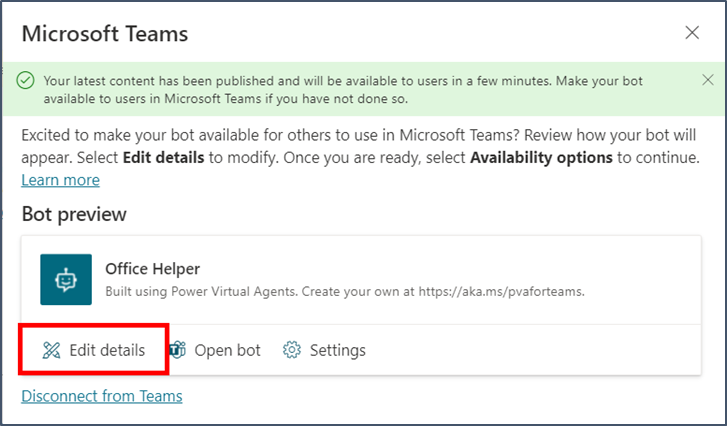](../media/edit-details.png#lightbox)

1. In the **Edit details** screen, fill in the **Short description** and **Long description** fields to describe what your chatbot does. Select the **Allow your users to add this bot to a team** checkbox, select **Yes** on the confirmation message, and then select **Save**. Note the options to change the color and icon. 
 
    > [!div class="mx-imgBorder"]
    > [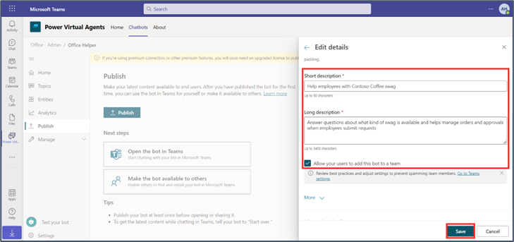](../media/description.png#lightbox)
 
1. Select **Availability options**.
 
    > [!div class="mx-imgBorder"]
    > [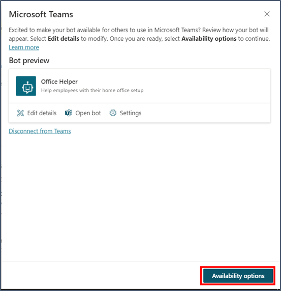](../media/avaibility-option.png#lightbox)

1. Under the **Add to a team** section, select the **Add to Office - Admin** option.
 
    > [!div class="mx-imgBorder"]
    > [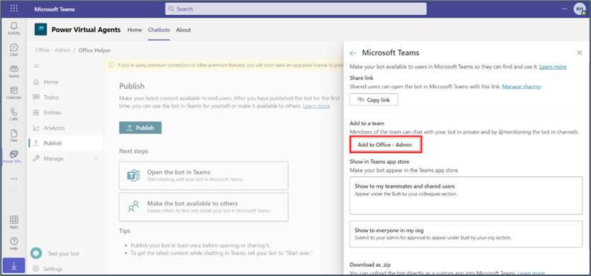](../media/add-admin.png#lightbox)

7. Select **Add** to confirm.
 
    > [!div class="mx-imgBorder"]
    > [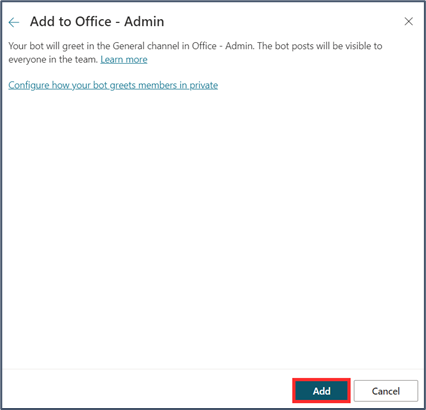](../media/add-confirm.png#lightbox)

1. In a moment, you'll receive a chat notification from the bot in Teams. Select the ellipsis (**...**) from the left menu of Teams. Your Office Helper bot should now show.  

1. By default, the bot will be available as such to all members of your team. Enter the trigger phrase **request swag** in the chat with the bot, and then place the request.
 
    > [!div class="mx-imgBorder"]
    > [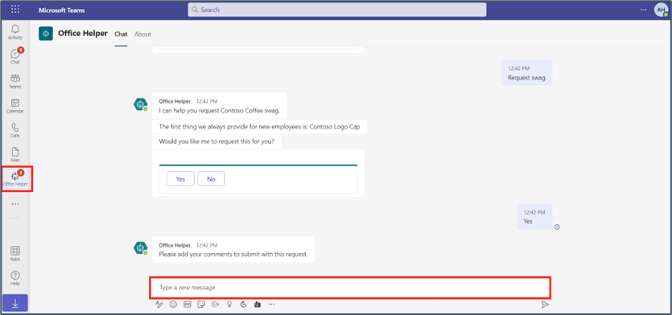](../media/office-helper.png#lightbox)

1.	Select **Chat** to view the bot conversation.
 
    > [!div class="mx-imgBorder"]
    > [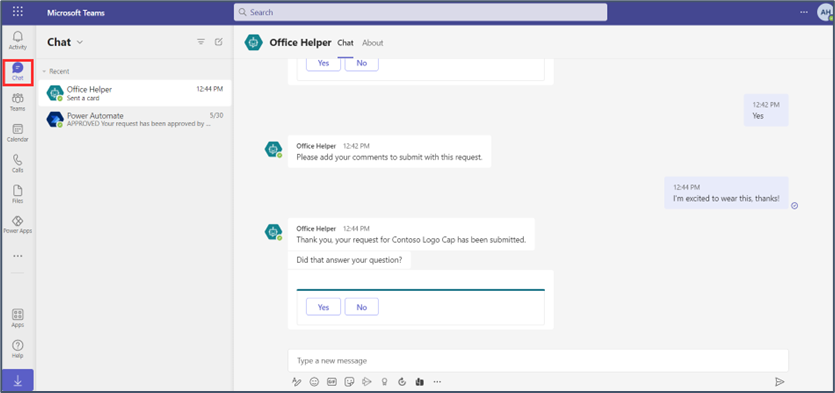](../media/chat.png#lightbox)

1. Select **Teams** and then go to the team that you've been working in for the labs. A message will display, indicating that the bot has been added to the team. Now, users can @mention the bot to talk to it directly in channel. You can begin the conversation with a bot in a new conversation or in the comments of an existing conversation. Whenever you want to respond to the bot, you should @mention the bot’s name.
 
    > [!div class="mx-imgBorder"]
    > [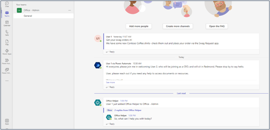](../media/mention-user.png#lightbox)

## Task: Share the chatbot with your organization 

In this task, you'll submit the chatbot for admin approval to share with the whole organization. 

1. Return to the Power Virtual Agents app in Teams. Select **Chatbots** and then open your bot.
 
    > [!div class="mx-imgBorder"]
    > [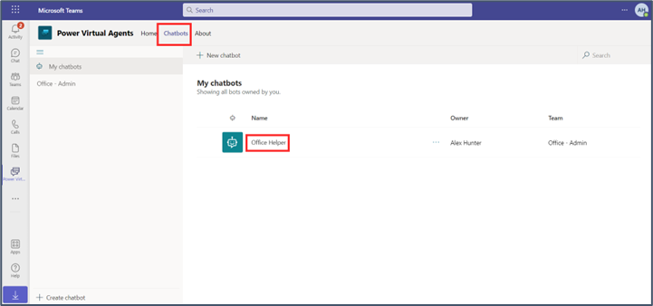](../media/open-bot.png#lightbox)

1. Select **Publish** from the navigation menu, select the **Make the bot available to others** option, and then select **Availability options**.
 
    > [!div class="mx-imgBorder"]
    > [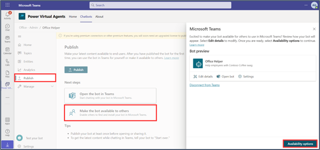](../media/avaibility-option-others.png#lightbox)

1. Select **Show to everyone in my org**. 
 
    > [!div class="mx-imgBorder"]
    > [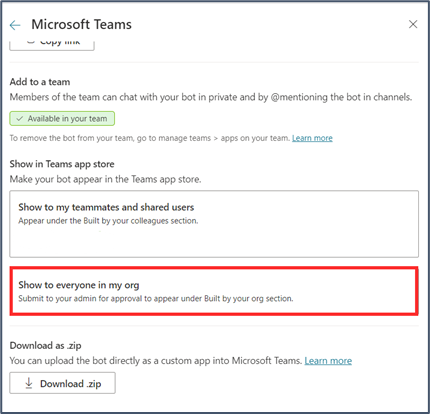](../media/show-everyone.png#lightbox)

1. Read the message to understand how the process works (in a real-world situation, this process is what you should have done before you submit for approval). Select **Submit for admin approval**.

    > [!div class="mx-imgBorder"]
    > [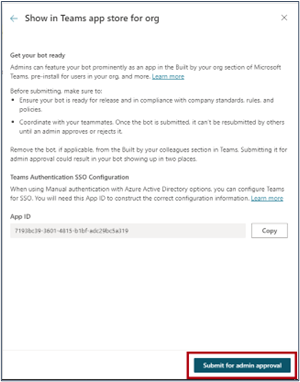](../media/submit-admin-approval.png#lightbox)

1. Confirm that you want to give everyone in your organization access to the bot by selecting **Yes**.
 
    > [!div class="mx-imgBorder"]
    > [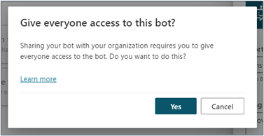](../media/everyone-access.png#lightbox)

1. When your bot has been submitted, a submission status message will display. 
 
    > [!div class="mx-imgBorder"]
    > [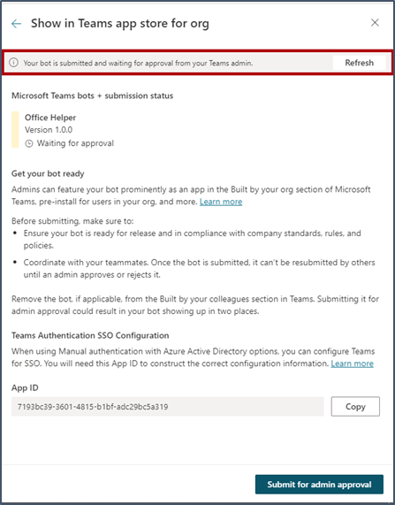](../media/status-message.png#lightbox)

## Task: Approve the chatbot as admin 

If you have the admin sign-in info for your tenant, you can play the role of the admin and approve your app. If you're working in a shared tenant, read along but don't perform the steps.

1. Open a new browser tab and then go to the [Microsoft Teams admin center dashboard](https://admin.teams.microsoft.com/?azure-portal=true).

1. Go to **Teams apps > Manage apps** in the left navigation menu. One submitted custom app will show as pending approval.
 
    > [!div class="mx-imgBorder"]
    > [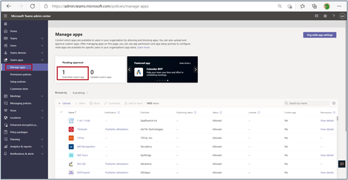](../media/pending-approval.png#lightbox)

1. Search for the name of the chatbot that you submitted and then open it.

    > [!div class="mx-imgBorder"]
    > [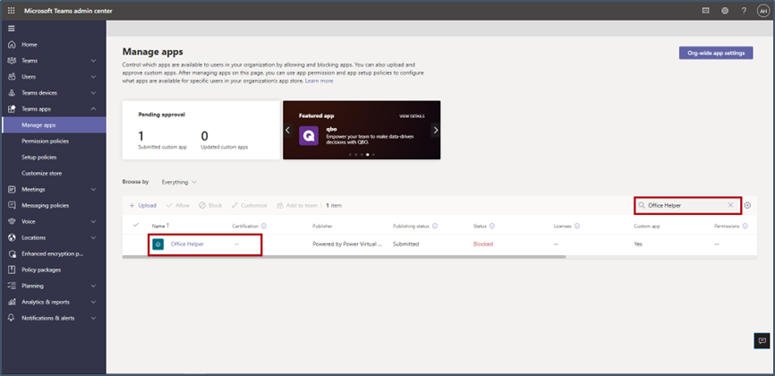](../media/open-chatbot.png#lightbox)

1. Select **Publish** and then confirm in the pop-up message that appears.
 
    > [!div class="mx-imgBorder"]
    > [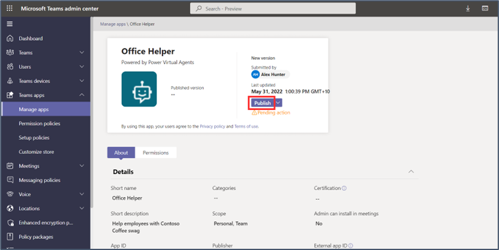](../media/publish-final.png#lightbox)

The chatbot will now show as published.
 
   > [!div class="mx-imgBorder"]
   > [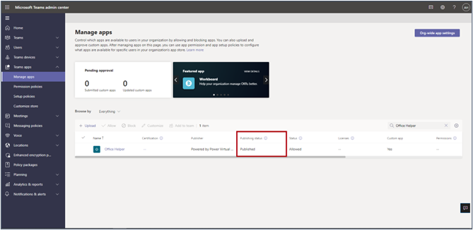](../media/chatbot-published.png#lightbox)
