In this exercise, you'll customize the **Manage issues** sample app.

### Task - Customize the Manage issues app

To customize the Manage issues app, follow these steps:

1. In Teams, select the ellipsis (**...**) to launch Power Apps (if it's not already visible on the navigation menu).

    > [!div class="mx-imgBorder"]
    > 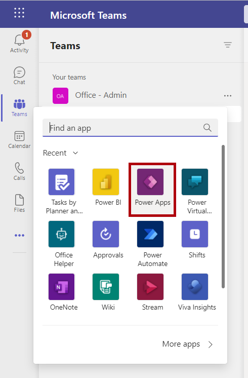

1. Select the **Build** tab and then select the team where you previously installed the **Issue reporting** app. Select the **Installed apps** tab, and then select **Manage issues** to launch the editing canvas for the **Manage issues** sample app.

    > [!div class="mx-imgBorder"]
    > [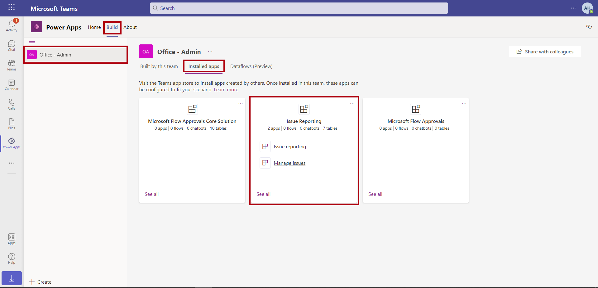](../media/installed-apps.png#lightbox)

1. After the editing canvas has launched, select the stacked sheets icon from the menu on the left side of the screen to open the **Tree view**.

    > [!div class="mx-imgBorder"]
    > 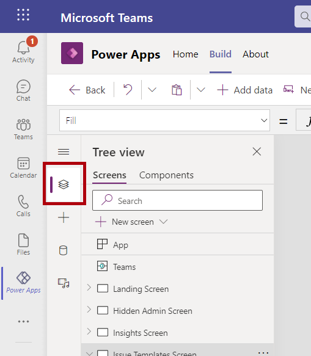

1. From the **Tree view**, select the **Components tab** and then expand **comHeader**.

    > [!div class="mx-imgBorder"]
    > 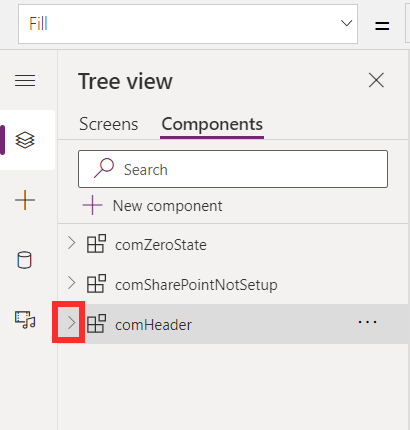

1. From the **Tree view**, under **comHeader**, select the **btnHeaderExternalLink** component.

    > [!div class="mx-imgBorder"]
    > [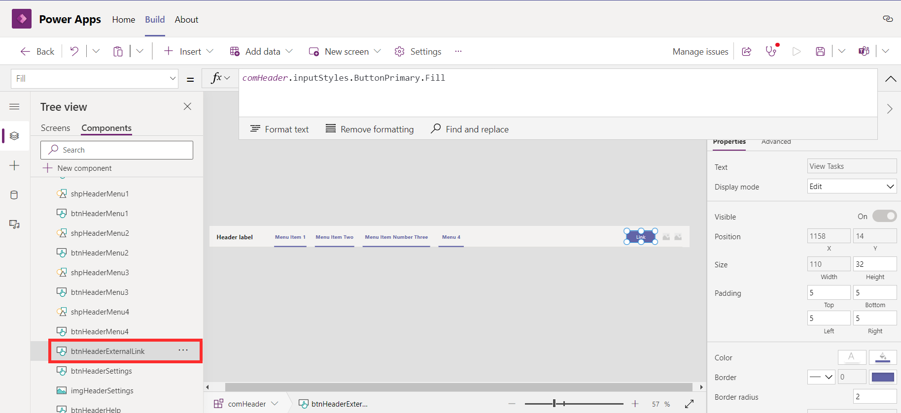](../media/button.png#lightbox)

1. With **btnHeaderExternalLink** selected, change the property dropdown menu of the formula bar to **Fill**. Backspace to remove the existing formula in the formula bar and then enter **Red**. The selected button on the screen should become the color red.

    > [!div class="mx-imgBorder"]
    > [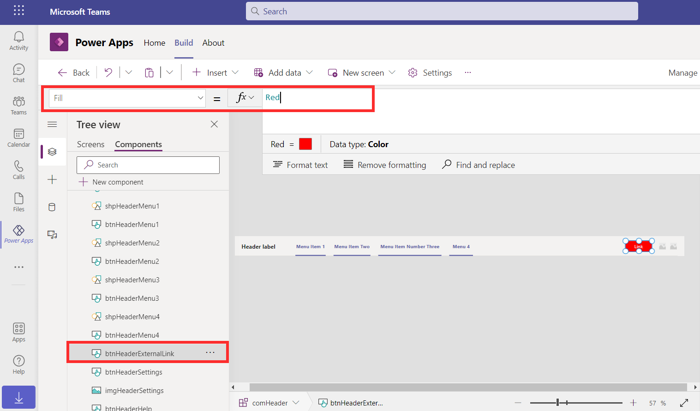](../media/red.png#lightbox)

1. From the **Tree view**, select the **Screens** tab and then select another screen, such as **Issue Templates Screen**. The button has now been changed to match the component that you edited.

    > [!div class="mx-imgBorder"]
    > [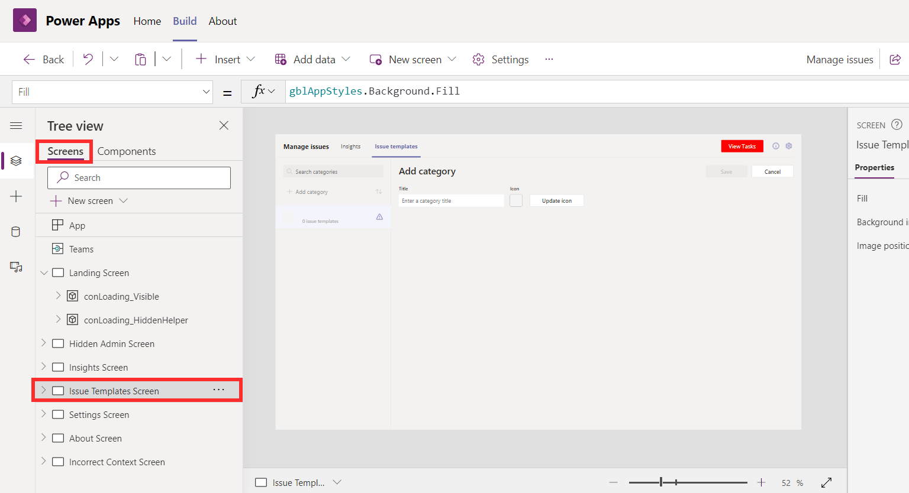](../media/screens.png#lightbox)

1. Select **Save** and then **Publish to Teams**.

    > [!div class="mx-imgBorder"]
    > 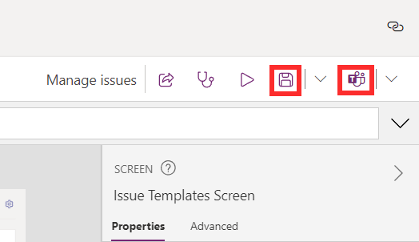

1. Select **Next** and then **Save and close**.

    > [!div class="mx-imgBorder"]
    > 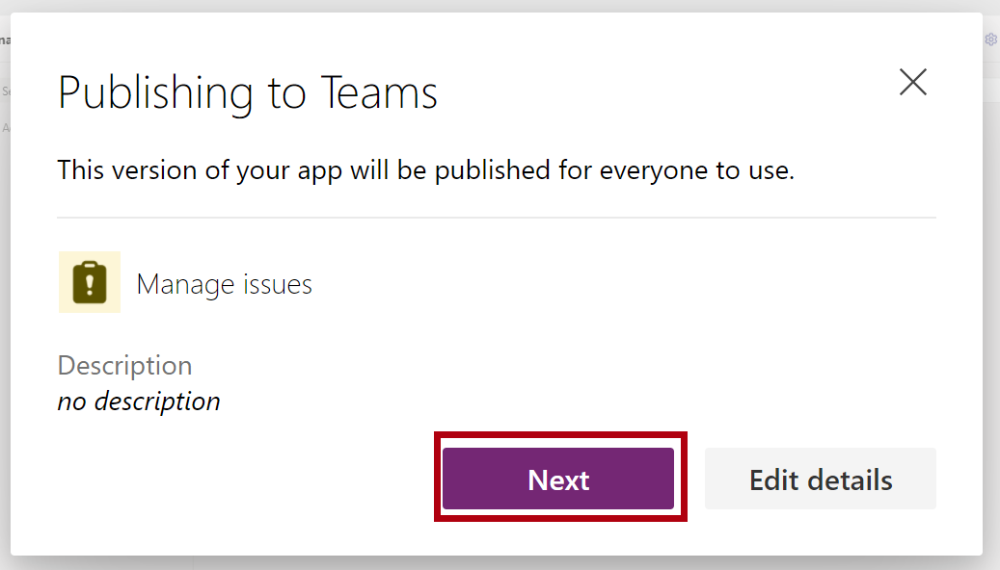

    > [!div class="mx-imgBorder"]
    > 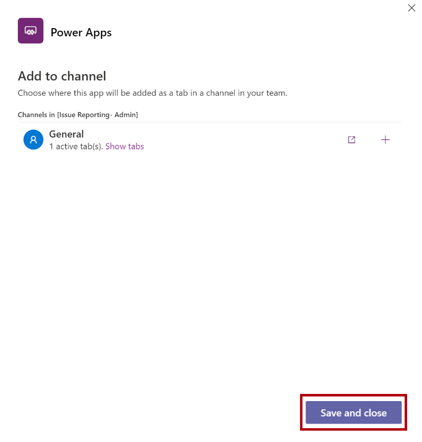

1. When you return to your team and launch the **Manage issues** app, the button color will be updated.

    > [!div class="mx-imgBorder"]
    > [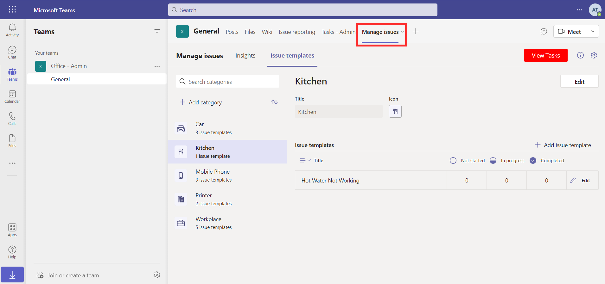](../media/color.png#lightbox)
