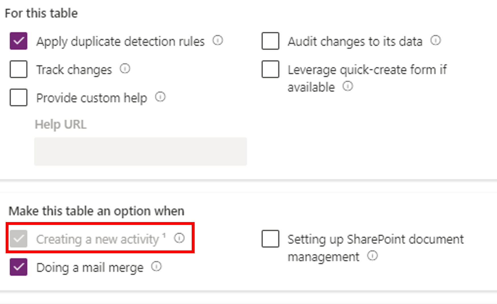
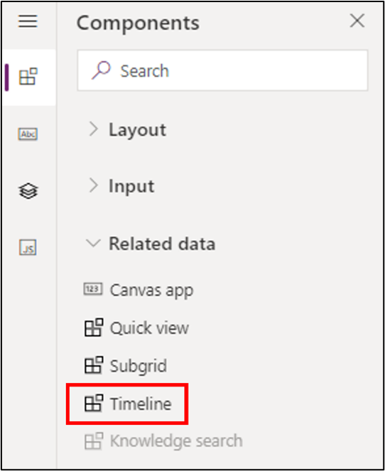
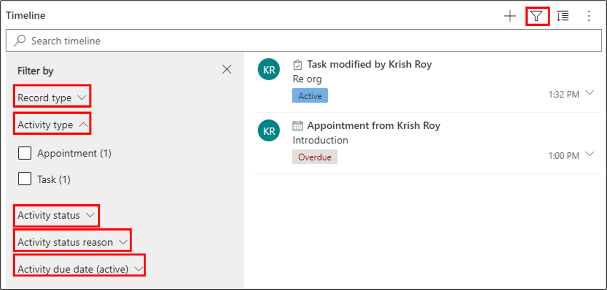
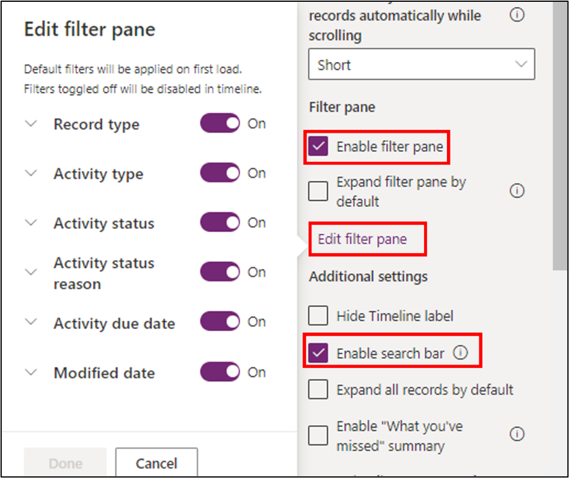
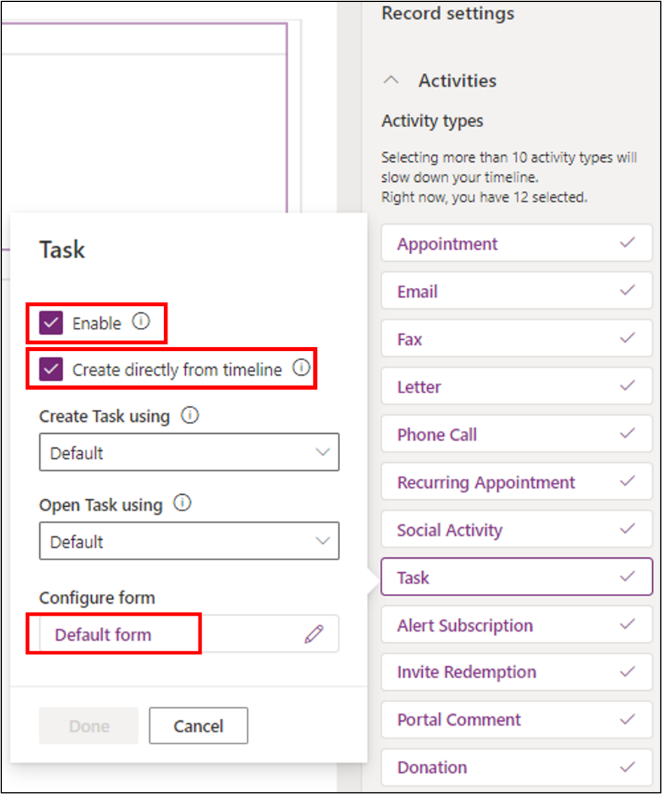
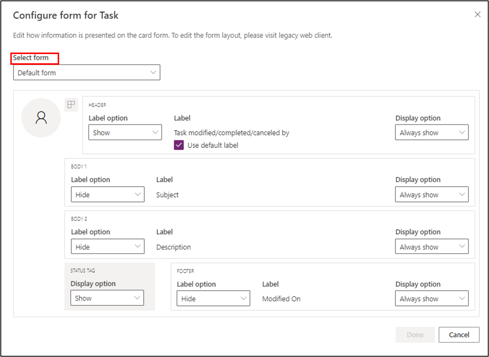

The timeline helps app users view all activity history. You can use the timeline control to capture activities, such as notes, appointments, emails, phone calls, and tasks, to ensure that all interactions with the related table are tracked and visible over time. Use the timeline to quickly catch up on the latest activity details.

The timeline control provides a common framework to view activity information that's related to any table, which gives users a better understanding and helps them deliver more personalized service in an efficient manner. If you want to add a custom activity, you'll need to create an *activity type table*. An activity type table is based on the time dimensions that help track the occurrence of an action. The **Enable attachments** setting in the table will allow users to add attachments and notes to the custom activity table.

For more information about activity tables, see Module 3, Unit 2, "Create a table."

To use the timeline control, you should have activity type tables in Dataverse. The timeline control can establish a relationship between the activity table and the standard table.

## Add the timeline control

You need to add the timeline control on a standard table to track the activity. An example might be if you have a department table in Dataverse and you want to track all activities that are related to the department, such as appointments, meetings, phone calls, emails, or tasks.

To activate the timeline control, open the **Advanced options** section of the table properties and then select the **Creating a new activity** property under **Make this table an option when** property group.

> [!div class="mx-imgBorder"]
> 

Go to the model-driven form of type **Main** under the standard table. Select the area of the form editor where you want to place the timeline control and then select **Components** followed by **Timeline** under the **Related data** group.

> [!div class="mx-imgBorder"]
> 

After you've selected the timeline control once, it will be disabled from the control list to prevent further selection on the same form. However, if a table has multiple main forms, you can add a timeline in all forms.

## Set up the timeline control

The timeline component has several features and functionality that you can set up and tailor to support specific business needs.

Three **record types** will show in the timeline, all of which are enabled by default:

- **Activities** - Can have many customizable sub activities to support business needs. Depending on what you have installed, the administrator can create, add, and display several different customized sub activities under the **Activity** section of the menu on the timeline.

- **Notes** - Allow you to capture details that are related to the table record. For example, you can use notes to capture thoughts, summarize information, provide feedback on a case, and then update the case details later.

- **Posts** - Two types of posts are auto and user. Auto posts are system-generated posts that notify that the activity has occurred. User posts allow you to leave a message for another user on a record.

The **Quick entry record** type provides you with quick access to create a **Note** or a **Post**. 

In the **Sort default** property, you can define the default sort order of the activities within the timeline control.

The **Records shown on page** property can display the defined number of records during a specific time in the timeline control.

The **Enable filter pane** checkbox allows you to enable or disable filter functionality on a timeline. It's enabled by default.

> [!div class="mx-imgBorder"]
> 

In the preceding diagram, you can review the different filter categories and decide which to use:

- Record type

- Activity type

- Activity status

- Activity status reason

- Activity due date (active)

- Posted by

- Modified by

You can enable the **Search timeline** option, as shown in the preceding diagram, by selecting the **Enable search bar** property.

The **Expand all records by default** option will display all activities in an expanded view in the timeline.

You can set up the default filters that are applied when a form loads or is refreshed by using **Edit filter pane**. Remove filter groups by turning off the setting. Users can remove the default filters to view all records, unless **Enable filter pane** is disabled.

> [!div class="mx-imgBorder"]
> 

The **Enable "What you've missed" summary** option will help you keep current on updates and changes that have been made to records by displaying updates at the top of the timeline when you access a record.

Based on the selection that you've made in the **Record types to show** property, in the **Record settings**, you'll find the list of **Activity types**.

> [!div class="mx-imgBorder"]
> 

If you select each activity type, a dialog will appear. You can enable the activity types according to your business' needs by selecting the **Enable** checkbox.

To allow users the ability to create activity types directly from the timeline, select the **Create directly from timeline** property.

If you need to create a new activity or open an existing activity, you can do so in various types of forms. **Create Task using** and **Open Task using** are the two properties that control the type of form that's used for individual activities.

For each activity, the default form is likely to be different. It often shows the most relevant items in context of the selected activity. You can choose which item to show on the activity card or whether the titles are shown, among other configurations. To do so, select the default form under **Configure form**.

> [!div class="mx-imgBorder"]
> 

You can set up the **Label** and **Display** options in the preceding dialog based on the activity type. For some activity types, the **Status** tag might not be necessary. You can set up the property values accordingly. Instead of using a default form, you can create an activity-specific custom form by selecting **Select form** at the top.

The **Sort activity by** property allows you to control how data is sorted in the timeline. It displays the list of the date fields in the activity table. You can select a date based on your requirement. Some dates can only exist on specific types of activities. If you select a date that doesn't exist for a specific activity type, the sort order of that activity type will be impacted.

The **Create activities using** option lets you choose which type of form that people will use to create a new activity. It has three possible values: quick create form, main form, and main form dialog. You can select according to your business needs.

The **Open activities using** option lets you choose which type of form that people will use to open an existing activity. It has two possible values that you can choose from, depending on your business needs: main form and main form dialog.

The following unit elaborates on how to create a report in a model-driven app.
