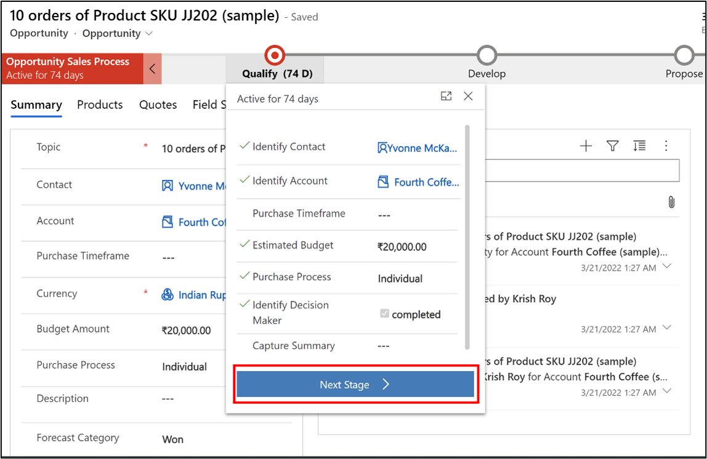

A business process flow is a component of Microsoft Power Platform model-driven apps. These flows can guide users in implementing sequential work. A business process flow can streamline the processes of the organization. The streamlined process provides a seamless user experience that leads to a conclusive interaction that aligns with the organizational goal. Organizations can tailor this user experience so that people with different security roles can have access that fits their needs.

Business process flows ensure that data entry consistently follows the same steps whenever users work in the same business process. Business process flows can define a set of steps that users follow to get the desired outcome. These steps can visually indicate the stage of the business process in which the user is presently working. Business process flows reduce the training need because the process can guide users. For example, you can set up business process flows to support common sales methodologies that can help your sales groups achieve better results.

## User interface of a business process flow

In a business process flow, you can define a set of stages and steps. Each stage contains a group of steps. Each step represents a field where you can enter data. Users can advance to the next stage by selecting the **Next Stage** button. You can also add steps that require users to enter data for the corresponding field before they can proceed to the next stage. This approach is commonly called stage-gating.

You can apply business process flows on the form fields. Business rules or form scripts are automatically applied to the fields that are used in the business process flows. You can add steps that set values for fields that aren't present in the form by using form scripts. Workflows that are initiated by changes to fields that are included in a business process flow will be applied when the data in the form is saved.

> [!div class="mx-imgBorder"]
> 

In the next unit, you'll learn how to create a business process flow.
