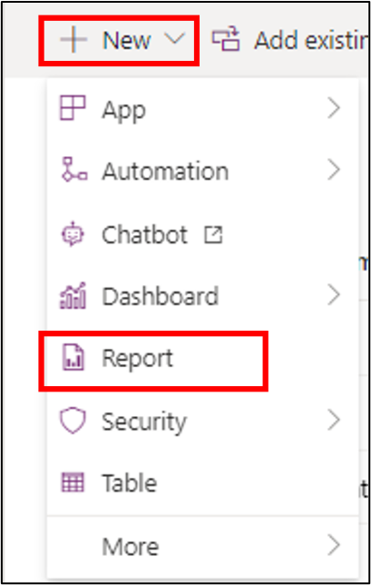
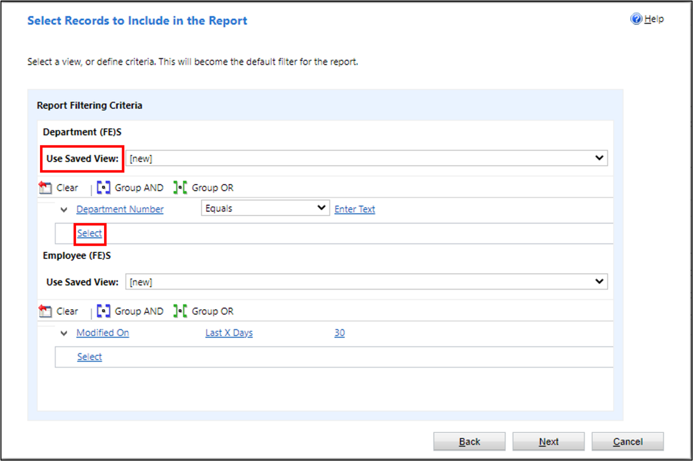
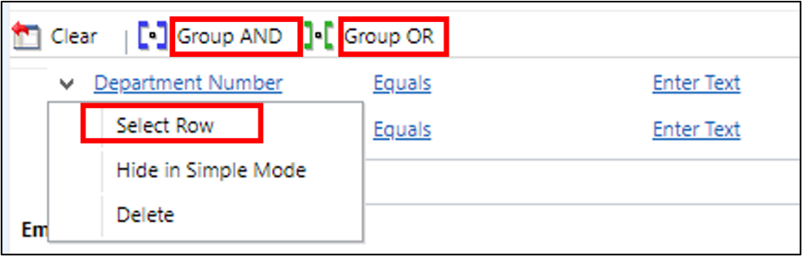
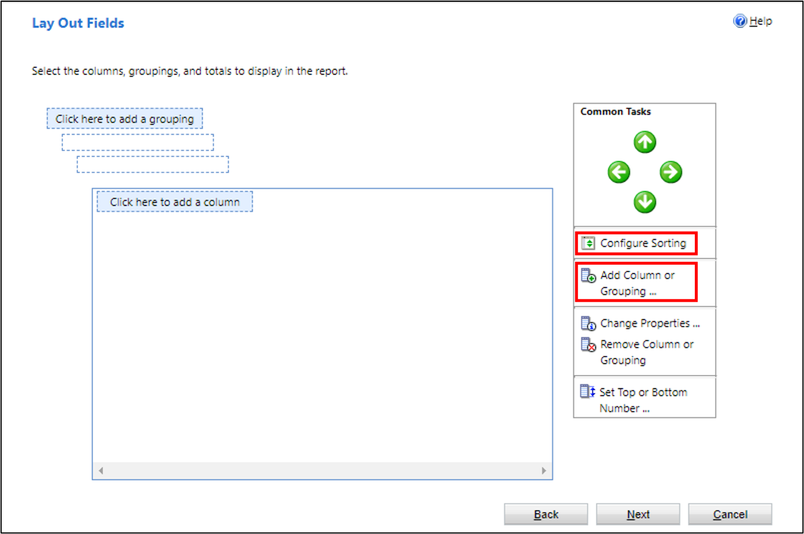
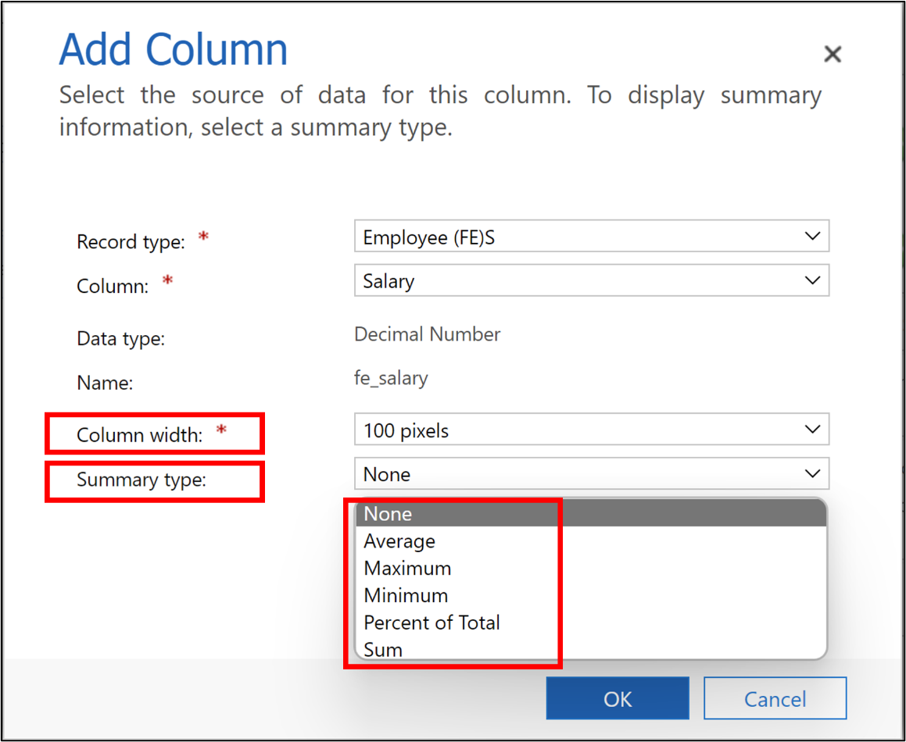
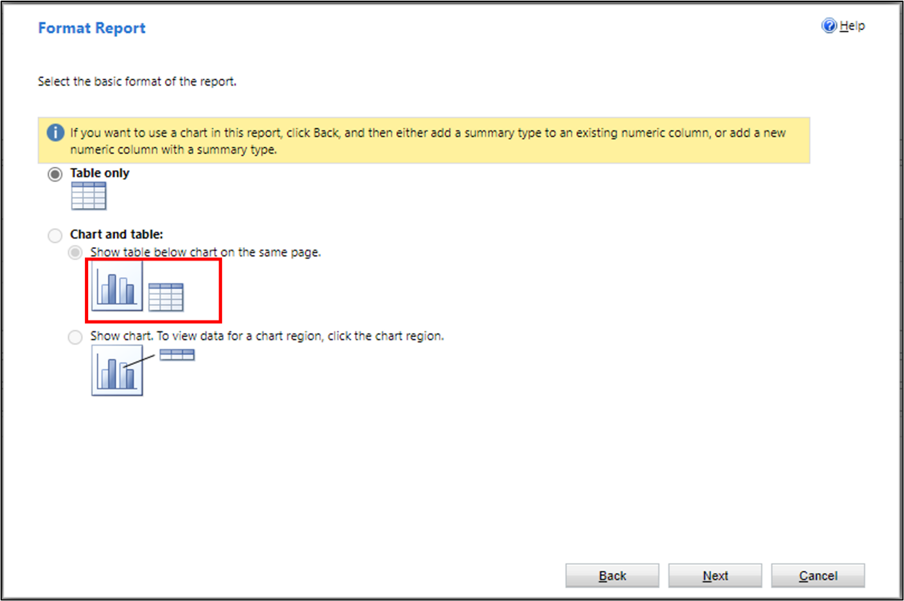
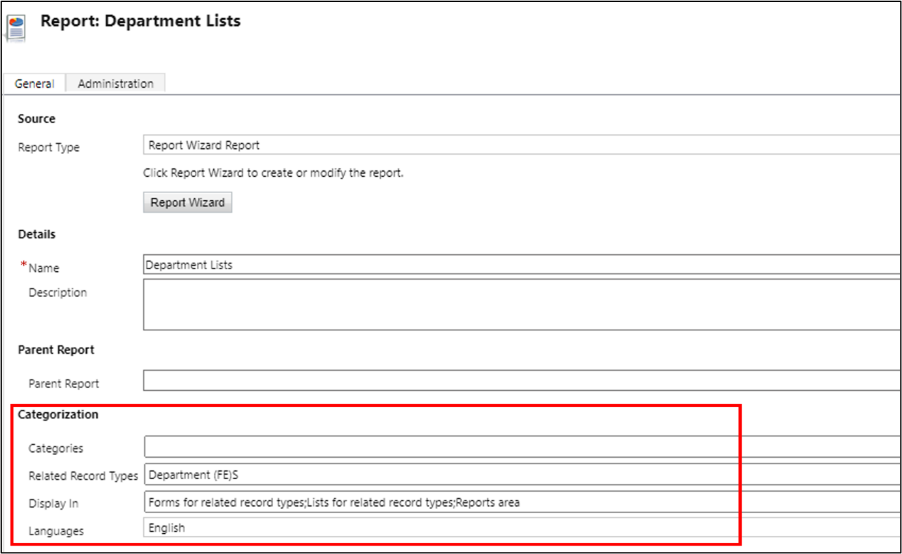

Model-driven apps provide several reporting options to give users the ability to analyze the data that's associated with their business area. As the volume of data increases, it's important that you choose the reporting capability that has a larger scope of optimization.

The reporting infrastructure in a model-driven app is shared and separate from the database. In this architecture, each report runs against the customers' individual database instance. Users can run it multiple times without restrictions.

## Create a report by using the report wizard

To create a report by using a wizard, you'll need to open a solution from the maker portal. Select **Report** under **New** in the action pane.

> [!div class="mx-imgBorder"]
> 

A **New Report** screen will appear in the classic development interface with a **Report Wizard** button. The wizard will provide you with three options:

- Start a new report

- Start from an existing report without overwriting the existing

- Start from an existing report overwriting the existing

If you want to create a new report by copying from an existing report, you need to select the second option. If you want to overwrite an existing report, you'll need to select the third option.

If you start a new report, select the first option. After defining the report name, you'll need to specify the primary table name for the report in the **Primary record type** menu. If the report shows data from child tables also, you can select the child table from the **Related record type** menu. In this menu, you can view the lists of tables that have a many-to-one relationship with the primary table.

The following screen of the wizard provides options for you to select the data filter criteria of the report.

> [!div class="mx-imgBorder"]
> 

You can create views in the table, which you can assign in the **Use Saved View** list. It will filter data based on the filter conditions that are applied in the view. The view will also decide the sort order for presenting the data in the report. In the view, you can select the columns, which will be displayed in the report as well.

Alternatively, you can select **[new]** in the **Use Saved View** list and customize the report in this screen. After you've selected the **Select** link, you can select the required column from the table to be displayed in the report. You can select comparison operators to filter data based on given criteria. The following operators are available:

- Equals

- Does not equal

- Contains

- Does not contain

- Begins with

- Does not begin with

- End with

- Does not end with

- Contains data

- Does not contain data

You can select multiple columns together by selecting the **Select Row** option and then group the conditions together by using the **Group AND** or **Group OR** buttons.

> [!div class="mx-imgBorder"]
> 

By selecting the **Select** link, you can also include a table that is related to the primary table of the report. Any table that has a relationship with the primary table will be available for selection. You can select columns from the related table and apply filter conditions on the related table columns.

Additionally, you can apply these conditions and filters on the Related table, which is already selected at the beginning.

The next screen in the wizard helps to design the layout of the report.

> [!div class="mx-imgBorder"]
> 

To define the sort order of the report, select **Configure Sorting**. You can select **Add a column** to select the columns to be displayed in sequence. You can also select **Add a grouping** to display the report grouping data based on criteria.

While adding the column, you can define column width. You can also define the **Summary** type by aggregating the numeric fields, as shown in the following screenshot.

> [!div class="mx-imgBorder"]
> 

The next screen in the wizard helps you design the format of the report. On this screen, you can select if the report will be tabular or graphical.

> [!div class="mx-imgBorder"]
> 

To have a graphical report, make sure that you include numeric columns in your report.

The four supported graphical reports are:

- Vertical bar chart

- Horizontal bar chart

- Line chart

- Pie chart

You can also define which table forms and views that you can launch the report from in a model-driven app.

> [!div class="mx-imgBorder"]
> 

To run the report, you can open the form that's selected under **Categorization**. Under **Run Report**, you'll be able to view the report that you've developed.

## Performance tips for reports

Consider the following performance tips for reports:

- When you create custom reports or dashboards, design them to query smaller datasets over shorter periods of time by adding a time-based filter in the report, such as the current month or quarter, to limit the results.

- Limit the number of tables that are needed to return the result. This approach helps reduce the time that's required to run the query and return the result set.

- Reduce the rows in detailed reports. You can use suitable filtering to reduce the number of rows that are returned by the query to reduce timeouts.

- For aggregated or summarized reports, make sure that you use queries to push the aggregation to the database and not fetch detailed rows and perform aggregation in the SQL Server Reporting Services report.

- When appropriate for your business, users should run the default (out-of-the-box) reports and dashboards. These reports and dashboards are typically designed to query for each user dataset, so in most cases, it won't exceed the dataset limit.
