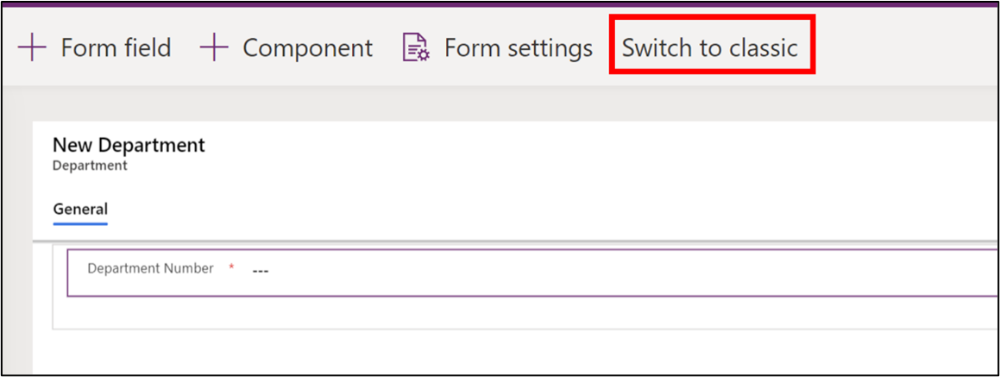
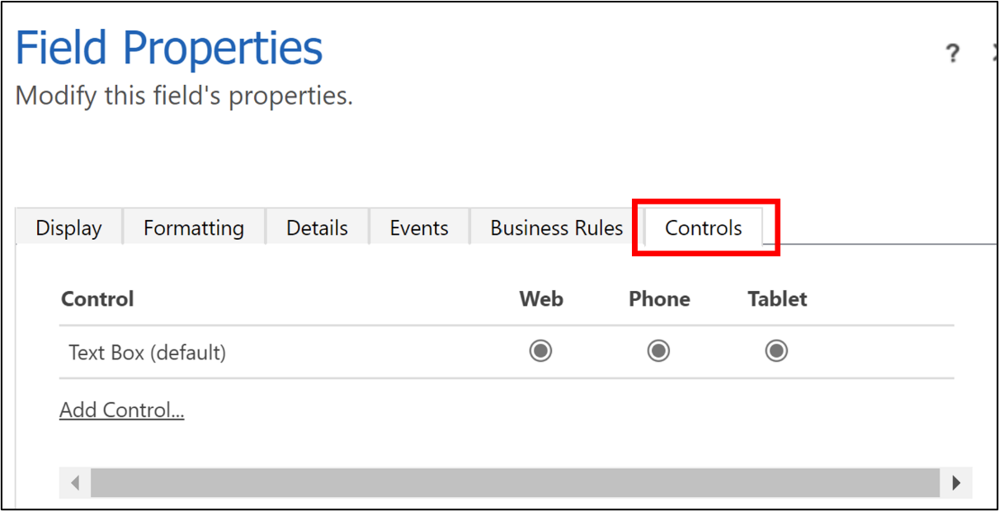
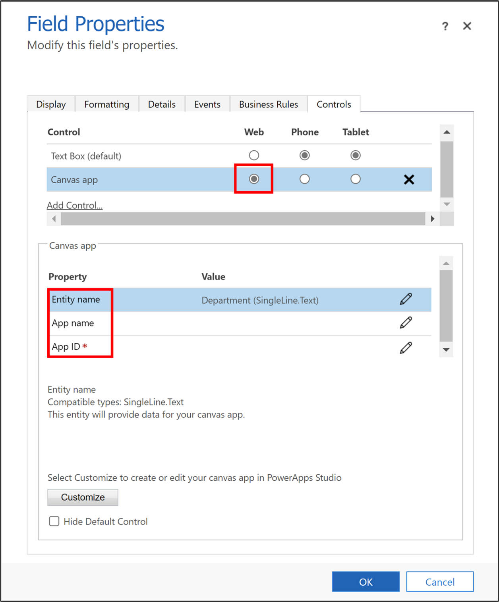
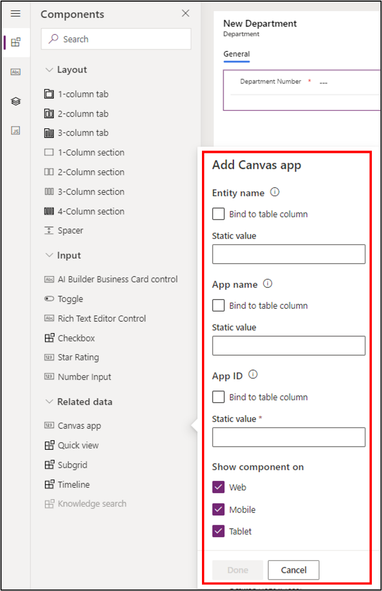
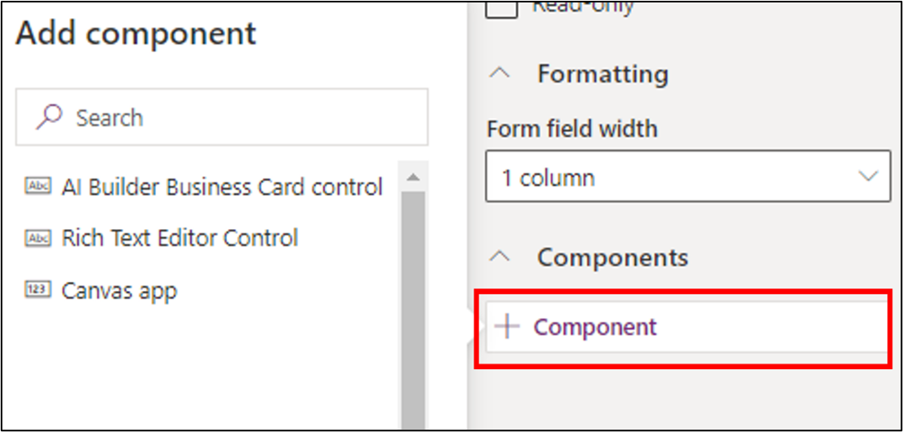
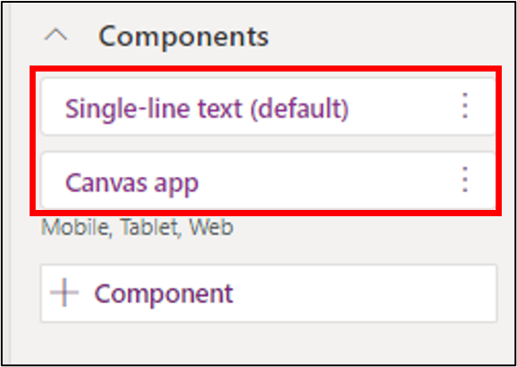

Microsoft Power Apps is made up of two major tools: canvas apps and model-driven apps. While model-driven apps can only have Microsoft Dataverse as the database, canvas apps support over 400 data sources through the built-in or custom connectors.

You can use canvas apps for mobile or tablet devices, where you'll need task-based applications. The development process is straightforward, where you're provided with a blank canvas. You can drag components on the blank canvas to form the user interface. Additionally, you can develop formulas in the property pane of each component to add validation and other business logic.

To bring the power of canvas apps into a model-driven app, you can embed a canvas app. Embedding a canvas app will enable you to create rich visual areas on a form and display data from various sources, along with the data from Dataverse.

## Embed a canvas app by using the classic experience

To embed a canvas app to a model-driven form by using the classic experience, you'll first need to open the main form and switch to the classic view. In the classic development platform, which is the original development platform for Dynamics CRM applications, you can automatically generate the canvas app to be embedded into the model-driven app.

> [!div class="mx-imgBorder"]
> 

In the classic view, you need to select the column that will bind to the canvas app. Select **Change Properties** from the **Edit** group on the **Home** tab. Select the **Controls** tab in the **Field Properties** dialog.

> [!div class="mx-imgBorder"]
> 

To add a canvas app control, select **Add Control**. Select **Web** to allow the canvas app to be displayed in a web interface.

Use the following properties to set up the application properties of the embedded canvas app into the model-driven app:

- **Table (Entity) name** - Specifies the table that will provide data to the embedded canvas app. This property will be prefilled based on the form data source. However, you can change the value by selecting the **Configure property** icon.

- **App name** - Specifies the name of the canvas app to embed. The model-driven form looks for the canvas app with the specified name in the current environment. If a canvas app with that name can't be found in the environment, the canvas app control will use the app ID to load the canvas app. Enter the app name for an existing canvas app.

- **App ID** - Specifies the app ID of the embedded canvas app. You can enter an app ID for an existing canvas app.

> [!div class="mx-imgBorder"]
> 

If you don't have an existing canvas app, you can leave the **App name** and **App ID** properties blank and select the **Customize** button in the **Field Properties** dialog to create a new canvas app. This action will open the Power Apps canvas app studio.

A new canvas app is created with the primary key field of the selected table on the host model-driven app in the user interface. The primary key is placed on the **Form1** form control, which is automatically created. The **Item** property of the form control references a special **ModelDrivenFormIntegration** control.

A special **ModelDrivenFormIntegration** control will show in the left pane of the canvas app studio. This control is responsible for bringing contextual data from the host model-driven form to the embedded canvas app.

You can design the canvas app by adding more fields and controls. Remember to save and publish the canvas app after you've completed your design. The app name and app ID property of the host model-driven app are automatically updated with the corresponding details of the newly created canvas app.

## Embed a canvas app by using the modern experience

To embed a canvas app to a model-driven form by using the modern experience, you'll first need to open the main form, which is the host model-driven form. Select the column from the main form editor that will bind to the canvas app, and then select the **Canvas app** control under the **Related data** group from the **Components** list in the model-driven app.

> [!div class="mx-imgBorder"]
> 

The **Add Canvas** dialog will open. This dialog has three properties: **Entity name**, **App name**, and **App ID**. These properties are similar to the properties in the classic experience. You can create a blank canvas app and then enter the app ID in the dialog.

Alternatively, you can select the column that will bind to the canvas app and then select the **Component** property in the column property pane to the right of the form editor. From the **Add component** dialog, select **Canvas app**.

> [!div class="mx-imgBorder"]
> 

You'll be prompted by a dialog, where you'll need to enter the three properties: **Entity name**, **App name**, and **App ID**. You can create a blank canvas app and then enter the app ID in the dialog.

The canvas app component will be embedded in the model-driven app, and then the component property will resemble the following screenshot.

> [!div class="mx-imgBorder"]
> 

## ModelDrivenFormIntegration control properties and actions

When a canvas app is embedded in a model-driven app, a special control named **ModelDrivenFormIntegration** is added in the canvas app. This control is responsible for bringing contextual data from the host model-driven app to the canvas app. This control has important properties and actions:

- **DataSource** - By default, the **DataSource** property value should be set to the data source that's connected to the parent table of the host model-driven form. When you embed an existing canvas app, you can set up the **ModelDrivenFormIntegration** data source from the canvas app tree view.

- **OnDataRefresh** - The formula in this property is evaluated when the host model-driven form saves data. Use this property to refresh the data source that's connected to the parent table of the host model-driven form and to perform other actions such as setting or updating variables.

- **Item** - A read-only property that allows the embedded canvas app to access the columns of the host model-driven app. For example, to get the value of a column with the name of **departmentnumber** and display name of **Department Number**, you can use **ModelDrivenFormIntegration.Item. departmentnumber** or **ModelDrivenFormIntegration.Item.'Department Number'**.

- **SaveForm** - A predefined action that saves the data on the host model-driven form.

- **RefreshForm** - A predefined action that refreshes the data on the host model-driven form. This property comes with a single parameter:

    **showPrompt** - A required Boolean parameter that indicates if a confirmation prompt should be displayed to the user before they save any unsaved data on the host model-driven form. Values should be **true** or **false**.

- **NavigateToMainForm** - A predefined action that navigates the host model-driven form to a main form and displays the specified row. This property comes with three parameters:

    - **entityName** - A required string parameter that specifies the parent table of the main form.

    - **formName** - A required string parameter that specifies the name of the main form to navigate to.

    - **recordId** - A required string parameter that specifies the ID of the row to display in the main form.

- **NavigateToView** - A predefined action that navigates the host model-driven form to a view. This property comes with two parameters:

    - **entityName** - A required string parameter that specifies the parent table of the view.

    - **viewName** - A required string parameter that specifies the name of the main form to navigate to.

- **OpenQuickCreateForm** - A predefined action that can open the default quick create form for a table. This property comes with a single parameter:

    **entityName** - A required string parameter that specifies the parent table of the quick create form.

In the next unit, you'll learn how to add a timeline component in a model-driven form.
