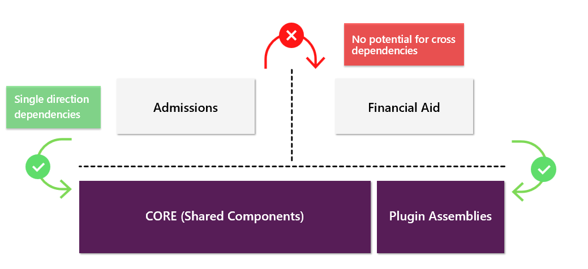
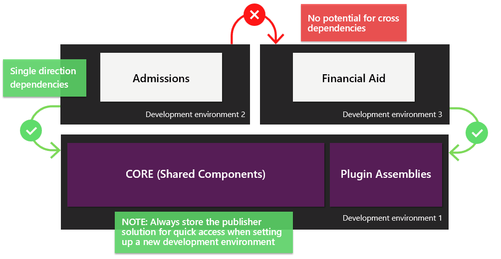
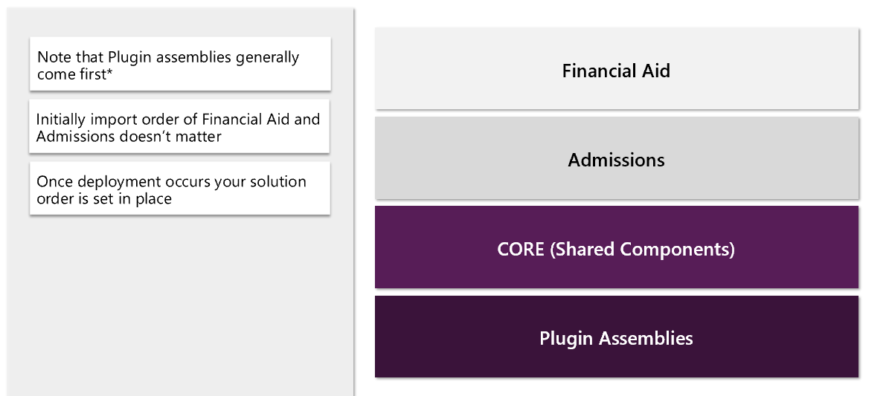
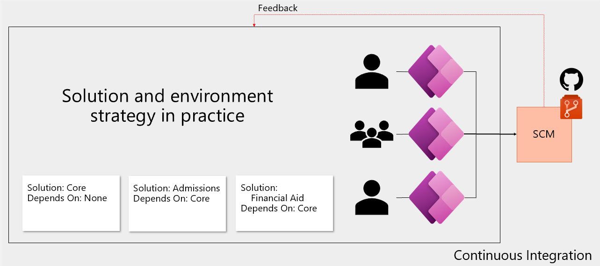
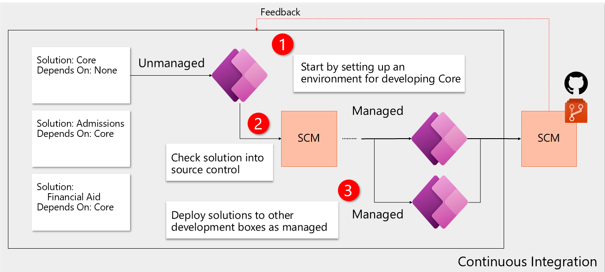
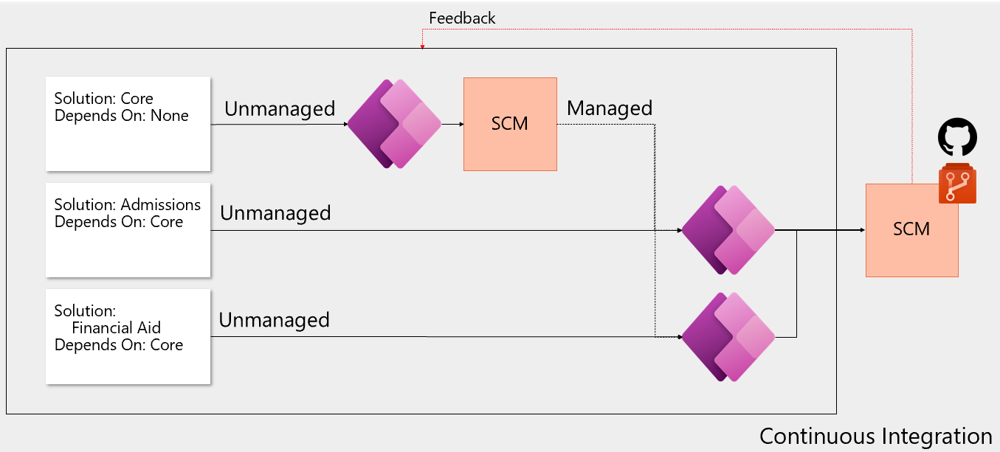

Let's move on to an example from start to finish. We begin with a view of our solutions. Outlining what we want our solution segmentation to look like. Using vertical solution segmentation in this example.

> [!div class="mx-imgBorder"]
> 

We'll apply an environment strategy to align with solution architecture. It's important to always store the publisher solution for quick access when setting up a new development environment.

-   Storing the publisher solution in source will allow us to share the publisher to new development environments as an unmanaged solution to ensure no mistakes are made when setting up a publisher.

-   It's recommended to use a single publisher for all work.

> [!div class="mx-imgBorder"]
> 

## Solution layering

Layering as seen post deployment when using managed solutions:

> [!div class="mx-imgBorder"]
> 

For plugins it's the SDK Message processing that creates dependencies, which will in turn enforce some import order of solutions. Therefore, plugin assemblies generally get imported first. Layering as seen post deployment when using managed solutions.

## Solution and environment strategy in practice

> [!div class="mx-imgBorder"]
> 

In this example we have three solutions segmented by App with shared components residing in a separate solution. This isn't the definitive answer to solution architecture but is a good starting point to build an understanding of proper solution segmentation.

-   CORE - this is our solution containing shared components

-   Admissions - this solution contains all the functionality developed specifically for the Admissions department. This solution depends on the components in the core solution.

-   Financial Aid - this solution contains all the functionality developed specifically for the Financial Aid department. This solution depends on components in the core solution

## Development process setup

With an understanding of what our solutions are let's look at how we should set up our development environments. Let's start by establishing a workflow for our CORE solution.

> [!div class="mx-imgBorder"]
> 

1. Let's assume the top environment will be dedicated to developing CORE, which contains shared components. To get started, we'll create the core solution in the target development environment. When creating solutions, they're created as unmanaged and can only be changed to managed during the export process.

	Following the pattern of including our dependencies as managed solutions we'll need to do some work before the CORE solution can be utilized downstream. Assuming we're starting completely from scratch.
	
	Before we can introduce the CORE solution into our development environments for Admissions and Financial Aid, we need to have a viable base of code to enable the development of the layered apps.
	
	This doesn't necessarily prevent starting development on the layered apps as they may have unique components that have no dependencies. To keep things simple, we'll start building CORE first.

1. Let's assume we've finished our development sprint on the CORE solution and have checked our changes into our repository.

1. We'll then deploy the CORE solution as a MANAGED in the Admissions and Financial Aid development environments.

### Why do we do this?

By introducing only one unmanaged solution per environment, we effectively eliminate the potential for injecting unwanted dependencies

This approach also allows us to effectively utilize segmentation and solution layering.

### How do we get the managed solution?

With the dependencies in place, we can now introduce our other solutions.

> [!div class="mx-imgBorder"]
> 

We'll create or import our Admissions and Financial Aid solutions in their respective environments.

An environment may have more than one unmanaged solution installed if it can be guaranteed that the other solutions won't introduce dependencies. There are some cases where this may make sense.

